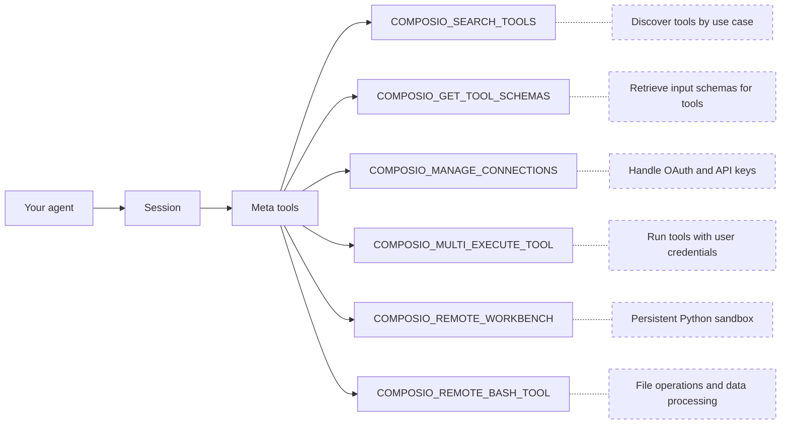
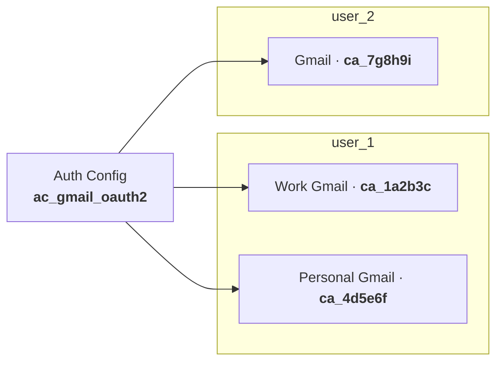
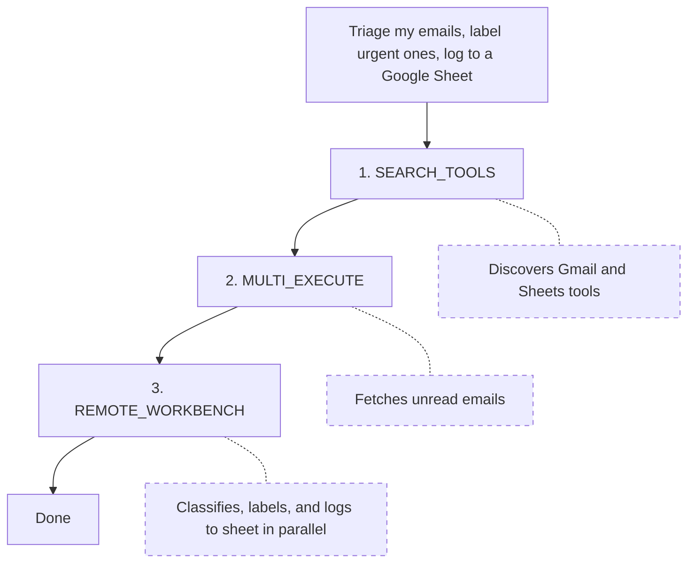
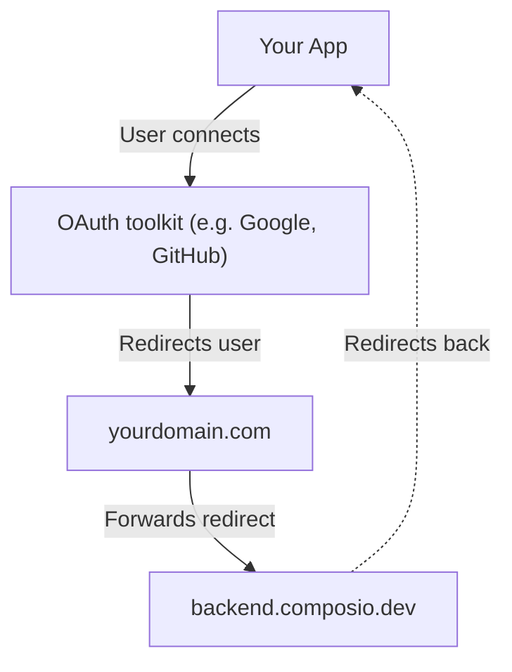
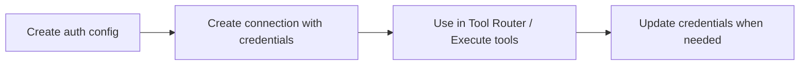
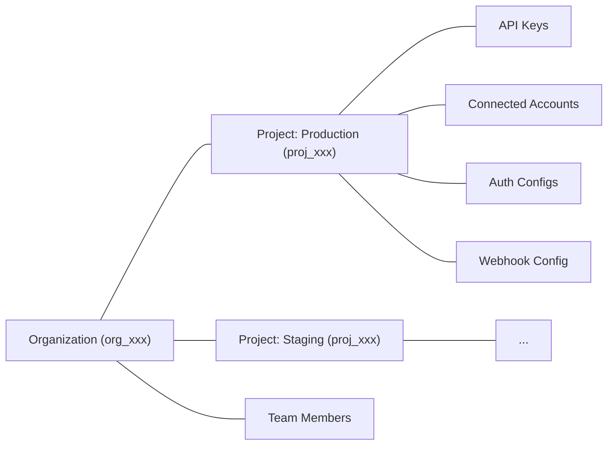

# Composio Documentation

> Composio powers 1000+ toolkits, tool search, context management, authentication, and a sandboxed workbench to help you build AI agents that turn intent into action.

---

# Composio SDK — Instructions for AI Code Generators

**Purpose:** Enforce only the **current** and **correct** patterns for integrating [Composio](https://composio.dev/) tools into AI agents.
**Scope:** All AI-generated code using Composio must follow these guardrails.

---

## 1. Correct Composio Integration

Composio supports two integration modes: **Native Tools** (with a provider package) and **MCP** (no provider package needed).

### Native Tools

```python
# ✅ CORRECT — Python (defaults to OpenAI)
from composio import Composio

composio = Composio()
session = composio.create(user_id="user_123")
tools = session.tools()
# Pass tools to your agent/LLM framework
```

```typescript
// ✅ CORRECT — TypeScript (defaults to OpenAI)
import { Composio } from "@composio/core";

const composio = new Composio();
const session = await composio.create("user_123");
const tools = await session.tools();
// Pass tools to your agent/LLM framework
```

For other providers, pass the provider explicitly. Provider packages follow the naming convention: `composio_<provider>` for Python, `@composio/<provider>` for TypeScript.

### MCP

Use `session.mcp.url` and `session.mcp.headers` with any MCP-compatible client (Claude Desktop, Cursor, OpenAI Agents, etc.). No provider package needed.

---

## 2. CRITICAL INSTRUCTIONS FOR AI MODELS

### 2.1 — ALWAYS DO THE FOLLOWING

1. **Use `composio.create(user_id)`** to create a session — this is the entry point for all Composio integrations.
2. **Use `session.tools()`** for native tool integration or **`session.mcp.url`** for MCP integration.
3. **Import** from the correct provider package (`composio_<provider>` for Python, `@composio/<provider>` for TypeScript).
4. **Pass `user_id` to `composio.create()`**, not to individual tool calls.

### 2.2 — NEVER DO THE FOLLOWING

1. **Do not** instruct users to manually create auth configs or connected accounts before running.
2. **Do not** import from `composio_openai` / `@composio/openai` when using OpenAI Agents SDK — use `composio_openai_agents` / `@composio/openai-agents` instead.

### 2.3 — DISCOURAGED (do not use unless user explicitly asks)

Do **not** generate `composio.tools.get()`, `composio.tools.execute()`, or `composio.provider.handle_tool_calls()` unless the user explicitly requests direct tool execution. These are a supported but **not recommended** low-level interface.


---

## Terminology Migration (old → current)

If you encounter these terms in error messages, old documentation, or user prompts, translate them to the current equivalents. **Do not use the old terms in generated code or explanations.**

| Old term (v1/v2) | Current term (v3) | In code |
|---|---|---|
| entity ID | user ID | `user_id` parameter |
| actions | tools | e.g., `GITHUB_CREATE_ISSUE` is a *tool* |
| apps / appType | toolkits | e.g., `github` is a *toolkit* |
| integration / integration ID | auth config / auth config ID | `auth_config_id` parameter |
| connection | connected account | `connected_accounts` namespace |
| ComposioToolSet / OpenAIToolSet | `Composio` class with a provider | `Composio(provider=...)` |
| toolset | provider | e.g., `OpenAIProvider` |

If a user says "entity ID", they mean `user_id`. If they say "integration", they mean "auth config". Always respond using the current terminology.


# Documentation


---

# Welcome (/docs)

Composio powers 1000+ toolkits, tool search, context management, authentication, and a sandboxed workbench to help you build AI agents that turn intent into action.

- [Tutorial: Build a chat app](/cookbooks/chat-app): Build a Next.js chat app where your agent can discover and use tools across 1000+ apps.

- [How Composio works](/docs/how-composio-works): See what happens under the hood when your agent searches, authenticates, and executes a tool.

# Get Started

### For AI tools

**Skills:**
```bash
npx skills add composiohq/skills
```
[Skills.sh](https://skills.sh/composiohq/skills/composio) · [GitHub](https://github.com/composiohq/skills)

**CLI:**
```bash
curl -fsSL https://composio.dev/install | bash
```
[CLI Reference](/docs/cli)

**Context:**
- [llms.txt](/llms.txt) — Documentation index with links
- [llms-full.txt](/llms-full.txt) — Complete documentation in one file

- [Quickstart](/docs/quickstart): Install the SDK, connect an app, and run your first tool call in 5 minutes.

# Explore

- [Toolkits](/toolkits): Browse 1000+ toolkits across GitHub, Gmail, Slack, Notion, and more.

- [Playground](https://platform.composio.dev/auth?next_page=%2Ftool-router): Try Composio in your browser without writing any code.

# Providers

Composio works with any AI framework. Pick your preferred SDK:

- [Claude Agent SDK](/docs/providers/claude-agent-sdk) (Python, TypeScript)

- [Anthropic](/docs/providers/anthropic) (Python, TypeScript)

- [OpenAI Agents](/docs/providers/openai-agents) (Python, TypeScript)

- [OpenAI](/docs/providers/openai) (Python, TypeScript)

- [Google Gemini](/docs/providers/google) (Python, TypeScript)

- [Vercel AI SDK](/docs/providers/vercel) (TypeScript)

- [LangChain](/docs/providers/langchain) (Python, TypeScript)

- [LangGraph](/docs/providers/langgraph) (Python)

- [CrewAI](/docs/providers/crewai) (Python)

- [LlamaIndex](/docs/providers/llamaindex) (Python, TypeScript)

- [Mastra](/docs/providers/mastra) (TypeScript)

- [Build your own](/docs/providers/custom-providers) (Python, TypeScript)

# Features

- [Authentication](/docs/authentication): OAuth, API keys, and custom auth flows

- [Triggers](/docs/triggers): Subscribe to external events and trigger workflows

- [CLI](/docs/cli): Manage toolkits, execute tools, and generate type-safe code from the terminal

- [White Labeling](/docs/white-labeling-authentication): Customize auth screens with your branding

# Community

Join our [Discord](https://discord.gg/composio) community!

---

# Quickstart (/docs/quickstart)

Build your first AI agent with Composio Tools. You'll create a [session](/docs/users-and-sessions) for a user, give your agent access to [tools](/docs/tools-and-toolkits), and let it take action across 1000+ apps.

## OpenAI Agents

> Choose your integration type · [Use this guide to decide](/docs/native-tools-vs-mcp)

### Native Tools

#### Install

**Python:**

```bash
pip install python-dotenv composio composio-openai-agents openai-agents
```

**TypeScript:**

```bash
npm install @composio/core @composio/openai-agents @openai/agents
```

#### Configure API Keys

> Get your `COMPOSIO_API_KEY` from [Settings](https://platform.composio.dev/settings) and `OPENAI_API_KEY` from [OpenAI](https://platform.openai.com/api-keys).

```bash title=".env"
COMPOSIO_API_KEY=your_composio_api_key
OPENAI_API_KEY=your_openai_api_key
```
#### Create session and run agent

**Python:**

```python
from dotenv import load_dotenv
from composio import Composio
from agents import Agent, Runner, SQLiteSession
from composio_openai_agents import OpenAIAgentsProvider

load_dotenv()

# Initialize Composio with OpenAI Agents provider
composio = Composio(provider=OpenAIAgentsProvider())

# Create a session for your user
user_id = "user_123"
session = composio.create(user_id=user_id)
tools = session.tools()

agent = Agent(
    name="Personal Assistant",
    instructions="You are a helpful personal assistant. Use Composio tools to take action.",
    model="gpt-5.2",
    tools=tools,
)

# Memory for multi-turn conversation
memory = SQLiteSession("conversation")

print("""
What task would you like me to help you with?
I can use tools like Gmail, GitHub, Linear, Notion, and more.
(Type 'exit' to exit)
Example tasks:
  - 'Summarize my emails from today'
  - 'List all open issues on the composio github repository'
""")

while True:
    user_input = input("You: ").strip()
    if user_input.lower() == "exit":
        break

    print("Assistant: ", end="", flush=True)
    result = Runner.run_sync(starting_agent=agent, input=user_input, session=memory)
    print(f"{result.final_output}\n")
```
**TypeScript:**

```typescript
import "dotenv/config";
import { Composio } from "@composio/core";
import { Agent, run, MemorySession } from "@openai/agents";
import { OpenAIAgentsProvider } from "@composio/openai-agents";
import { createInterface } from "readline/promises";

// Initialize Composio with OpenAI Agents provider
const composio = new Composio({ provider: new OpenAIAgentsProvider() });

// Create a session for your user
const userId = "user_123";
const session = await composio.create(userId);
const tools = await session.tools();

const agent = new Agent({
  name: "Personal Assistant",
  instructions: "You are a helpful personal assistant. Use Composio tools to take action.",
  model: "gpt-5.2",
  tools,
});

const memory = new MemorySession();
const readline = createInterface({ input: process.stdin, output: process.stdout });

console.log(`
What task would you like me to help you with?
I can use tools like Gmail, GitHub, Linear, Notion, and more.
(Type 'exit' to exit)
Example tasks:
  - 'Summarize my emails from today'
  - 'List all open issues on the composio github repository'
`);

while (true) {
  const input = (await readline.question("You: ")).trim();
  if (input.toLowerCase() === "exit") break;

  process.stdout.write("Assistant: ");
  const result = await run(agent, input, { session: memory });
  process.stdout.write(`${result.finalOutput}\n`);
}
readline.close();
```
### MCP

#### Install

**Python:**

```bash
pip install python-dotenv composio openai-agents
```
**TypeScript:**

```bash
npm install dotenv @composio/core @openai/agents zod@3
```
#### Configure API Keys

> Get your `COMPOSIO_API_KEY` from [Settings](https://platform.composio.dev/settings) and `OPENAI_API_KEY` from [OpenAI](https://platform.openai.com/api-keys).

```bash title=".env"
COMPOSIO_API_KEY=your_composio_api_key
OPENAI_API_KEY=your_openai_api_key
```
#### Create session and run agent

**Python:**

```python
from dotenv import load_dotenv
from composio import Composio
from agents import Agent, Runner, HostedMCPTool, SQLiteSession

load_dotenv()

# Initialize Composio
composio = Composio()

# Create a session for your user
user_id = "user_123"
session = composio.create(user_id=user_id)

agent = Agent(
    name="Personal Assistant",
    instructions="You are a helpful personal assistant. Use Composio tools to take action.",
    model="gpt-5.2",
    tools=[
        HostedMCPTool(
            tool_config={
                "type": "mcp",
                "server_label": "composio",
                "server_url": session.mcp.url,
                "require_approval": "never",
                "headers": session.mcp.headers,
            }
        )
    ],
)

memory = SQLiteSession(user_id)

print("""
What task would you like me to help you with?
I can use tools like Gmail, GitHub, Linear, Notion, and more.
(Type 'exit' to exit)
Example tasks:
  - 'Summarize my emails from today'
  - 'List all open issues on the composio github repository'
""")

while True:
    user_input = input("You: ").strip()
    if user_input.lower() == "exit":
        break

    print("Assistant: ", end="", flush=True)
    result = Runner.run_sync(starting_agent=agent, input=user_input, session=memory)
    print(f"{result.final_output}\n")
```
**TypeScript:**

```typescript
import "dotenv/config";
import { Composio } from "@composio/core";
import { Agent, run, hostedMcpTool, MemorySession } from "@openai/agents";
import { createInterface } from "readline/promises";

// Initialize Composio
const composio = new Composio();

// Create a session for your user
const userId = "user_123";
const session = await composio.create(userId);

const agent = new Agent({
  name: "Personal Assistant",
  instructions: "You are a helpful personal assistant. Use Composio tools to take action.",
  model: "gpt-5.2",
  tools: [
    hostedMcpTool({
      serverLabel: "composio",
      serverUrl: session.mcp.url,
      headers: session.mcp.headers,
    }),
  ],
});

const memory = new MemorySession();
const readline = createInterface({ input: process.stdin, output: process.stdout });

console.log(`
What task would you like me to help you with?
I can use tools like Gmail, GitHub, Linear, Notion, and more.
(Type 'exit' to exit)
Example tasks:
  - 'Summarize my emails from today'
  - 'List all open issues on the composio github repository'
`);

while (true) {
  const input = (await readline.question("You: ")).trim();
  if (input.toLowerCase() === "exit") break;

  process.stdout.write("Assistant: ");
  const result = await run(agent, input, { session: memory });
  process.stdout.write(`${result.finalOutput}\n`);
}
readline.close();
```
## Claude Agent SDK

> Choose your integration type · [Use this guide to decide](/docs/native-tools-vs-mcp)

### Native Tools

#### Install

**Python:**

```bash
pip install python-dotenv composio composio-claude-agent-sdk claude-agent-sdk
```
**TypeScript:**

```bash
npm install dotenv @composio/core @composio/claude-agent-sdk @anthropic-ai/claude-agent-sdk
```
#### Configure API Keys

> Get your `COMPOSIO_API_KEY` from [Settings](https://platform.composio.dev/settings) and `ANTHROPIC_API_KEY` from [Anthropic](https://console.anthropic.com/settings/keys).

```bash title=".env"
COMPOSIO_API_KEY=your_composio_api_key
ANTHROPIC_API_KEY=your_anthropic_api_key
```
#### Create session and run agent

**Python:**

```python
import asyncio
from dotenv import load_dotenv
from composio import Composio
from composio_claude_agent_sdk import ClaudeAgentSDKProvider
from claude_agent_sdk import ClaudeSDKClient, ClaudeAgentOptions, create_sdk_mcp_server, AssistantMessage, TextBlock

load_dotenv()

# Initialize Composio with Claude Agent SDK provider
composio = Composio(provider=ClaudeAgentSDKProvider())

# Create a session for your user
user_id = "user_123"
session = composio.create(user_id=user_id)
tools = session.tools()

custom_server = create_sdk_mcp_server(name="composio", version="1.0.0", tools=tools)

async def main():
    options = ClaudeAgentOptions(
        system_prompt="You are a helpful assistant. Use tools to complete tasks.",
        permission_mode="bypassPermissions",
        mcp_servers={"composio": custom_server},
    )

    async with ClaudeSDKClient(options=options) as client:
        print("""
What task would you like me to help you with?
I can use tools like Gmail, GitHub, Linear, Notion, and more.
(Type 'exit' to exit)
Example tasks:
  - 'Summarize my emails from today'
  - 'List all open issues on the composio github repository'
""")

        while True:
            user_input = input("You: ").strip()
            if user_input.lower() == "exit":
                break

            await client.query(user_input)
            print("Claude: ", end="", flush=True)
            async for message in client.receive_response():
                if isinstance(message, AssistantMessage):
                    for block in message.content:
                        if isinstance(block, TextBlock):
                            print(block.text, end="", flush=True)
            print()

asyncio.run(main())
```
**TypeScript:**

```typescript
import "dotenv/config";
import { Composio } from "@composio/core";
import { ClaudeAgentSDKProvider } from "@composio/claude-agent-sdk";
import { createSdkMcpServer, query } from "@anthropic-ai/claude-agent-sdk";
import { createInterface } from "readline/promises";

// Initialize Composio with Claude Agent SDK provider
const composio = new Composio({ provider: new ClaudeAgentSDKProvider() });

// Create a session for your user
const userId = "user_123";
const session = await composio.create(userId);
const tools = await session.tools();

const customServer = createSdkMcpServer({
  name: "composio",
  version: "1.0.0",
  tools: tools,
});

const readline = createInterface({ input: process.stdin, output: process.stdout });

console.log(`
What task would you like me to help you with?
I can use tools like Gmail, GitHub, Linear, Notion, and more.
(Type 'exit' to exit)
Example tasks:
  - 'Summarize my emails from today'
  - 'List all open issues on the composio github repository and create a Google Sheet with the issues'
`);

let isFirstQuery = true;
const options = {
  mcpServers: { composio: customServer },
  permissionMode: "bypassPermissions" as const,
};

while (true) {
  const input = (await readline.question("You: ")).trim();
  if (input.toLowerCase() === "exit") break;

  const queryOptions = isFirstQuery ? options : { ...options, continue: true };
  isFirstQuery = false;

  process.stdout.write("Claude: ");
  for await (const stream of query({ prompt: input, options: queryOptions })) {
    if (stream.type === "assistant") {
      for (const block of stream.message.content) {
        if (block.type === "text") {
          process.stdout.write(block.text);
        }
      }
    }
  }
  console.log();
}

readline.close();
```
### MCP

#### Install

**Python:**

```bash
pip install python-dotenv composio claude-agent-sdk
```
**TypeScript:**

```bash
npm install dotenv @composio/core @anthropic-ai/claude-agent-sdk
```
#### Configure API Keys

> Get your `COMPOSIO_API_KEY` from [Settings](https://platform.composio.dev/settings) and `ANTHROPIC_API_KEY` from [Anthropic](https://console.anthropic.com/settings/keys).

```bash title=".env"
COMPOSIO_API_KEY=your_composio_api_key
ANTHROPIC_API_KEY=your_anthropic_api_key
```
#### Create session and run agent

**Python:**

```python
import asyncio
from dotenv import load_dotenv
from claude_agent_sdk import ClaudeSDKClient, ClaudeAgentOptions, AssistantMessage, TextBlock, ToolUseBlock
from composio import Composio

load_dotenv()

# Initialize Composio
composio = Composio()

# Create a session for your user
user_id = "user_123"
session = composio.create(user_id=user_id)

options = ClaudeAgentOptions(
    system_prompt=(
        "You are a helpful assistant with access to external tools. "
        "Always use the available tools to complete user requests."
    ),
    mcp_servers={
        "composio": {
            "type": "http",
            "url": session.mcp.url,
            "headers": session.mcp.headers,
        }
    },
    permission_mode="bypassPermissions",
)

async def main():
    print("""
What task would you like me to help you with?
I can use tools like Gmail, GitHub, Linear, Notion, and more.
(Type 'exit' to exit)
Example tasks:
  - 'Summarize my emails from today'
  - 'List all open issues on the composio github repository and create a notion page with the issues'
""")

    async with ClaudeSDKClient(options) as client:
        while True:
            user_input = input("You: ").strip()
            if user_input.lower() == "exit":
                break

            await client.query(user_input)
            print("Claude: ", end="", flush=True)
            async for msg in client.receive_response():
                if isinstance(msg, AssistantMessage):
                    for block in msg.content:
                        if isinstance(block, ToolUseBlock):
                            print(f"\n  [Using tool: {block.name}]")
                        elif isinstance(block, TextBlock):
                            print(block.text, end="", flush=True)
            print()

asyncio.run(main())
```
**TypeScript:**

```typescript
import "dotenv/config";
import { query, type Options } from "@anthropic-ai/claude-agent-sdk";
import { Composio } from "@composio/core";
import { createInterface } from "readline/promises";

// Initialize Composio
const composio = new Composio();

// Create a session for your user
const userId = "user_123";
const session = await composio.create(userId);

const options: Options = {
  systemPrompt: `You are a helpful assistant with access to external tools. ` +
    `Always use the available tools to complete user requests.`,
  mcpServers: {
    composio: {
      type: "http",
      url: session.mcp.url,
      headers: session.mcp.headers,
    },
  },
  permissionMode: "bypassPermissions",
};

const readline = createInterface({ input: process.stdin, output: process.stdout });

console.log(`
What task would you like me to help you with?
I can use tools like Gmail, GitHub, Linear, Notion, and more.
(Type 'exit' to exit)
Example tasks:
  - 'Summarize my emails from today'
  - 'List all open issues on the composio github repository and create a Google Sheet with the issues'
`);

let isFirstQuery = true;

while (true) {
  const input = (await readline.question("You: ")).trim();
  if (input.toLowerCase() === "exit") break;

  const queryOptions = isFirstQuery ? options : { ...options, continue: true };
  isFirstQuery = false;

  process.stdout.write("Claude: ");
  for await (const stream of query({ prompt: input, options: queryOptions })) {
    if (stream.type === "assistant") {
      for (const block of stream.message.content) {
        if (block.type === "tool_use") {
          process.stdout.write(`\n  [Using tool: ${block.name}]\n`);
        } else if (block.type === "text") {
          process.stdout.write(block.text);
        }
      }
    }
  }
  console.log();
}

readline.close();
```
## Vercel AI SDK

> Choose your integration type · [Use this guide to decide](/docs/native-tools-vs-mcp)

### Native Tools

#### Install

```bash
npm install @composio/core @composio/vercel ai @ai-sdk/anthropic
```
#### Configure API Keys

> Get your `COMPOSIO_API_KEY` from [Settings](https://platform.composio.dev/settings) and `ANTHROPIC_API_KEY` from [Anthropic](https://console.anthropic.com/settings/keys).

```bash title=".env"
COMPOSIO_API_KEY=your_composio_api_key
ANTHROPIC_API_KEY=your_anthropic_api_key
```
#### Create session and run agent

```typescript
import "dotenv/config";
import { anthropic } from "@ai-sdk/anthropic";
import { Composio } from "@composio/core";
import { VercelProvider } from "@composio/vercel";
import { streamText, stepCountIs, type ModelMessage } from "ai";
import { createInterface } from "readline/promises";

// Initialize Composio with Vercel provider
const composio = new Composio({ provider: new VercelProvider() });

// Create a session for your user
const userId = "user_123";
const session = await composio.create(userId);
const tools = await session.tools();

const readline = createInterface({ input: process.stdin, output: process.stdout });

console.log(`
What task would you like me to help you with?
I can use tools like Gmail, GitHub, Linear, Notion, and more.
(Type 'exit' to exit)
Example tasks:
  - 'Summarize my emails from today'
  - 'List all open issues on the composio github repository'
`);

const messages: ModelMessage[] = [];

while (true) {
  const input = (await readline.question("You: ")).trim();
  if (input.toLowerCase() === "exit") break;

  messages.push({ role: "user", content: input });
  process.stdout.write("Assistant: ");

  const result = await streamText({
    system: "You are a helpful personal assistant. Use Composio tools to take action.",
    model: anthropic("claude-sonnet-4-6"),
    messages,
    stopWhen: stepCountIs(10),
    onStepFinish: (step) => {
      for (const toolCall of step.toolCalls) {
        process.stdout.write(`\n[Using tool: ${toolCall.toolName}]`);
      }
    },
    tools,
  });

  for await (const textPart of result.textStream) {
    process.stdout.write(textPart);
  }
  console.log();

  messages.push(...(await result.response).messages);
}

readline.close();
```
### MCP

#### Install

```bash
npm install dotenv @composio/core ai @ai-sdk/anthropic @ai-sdk/mcp
```
#### Configure API Keys

> Get your `COMPOSIO_API_KEY` from [Settings](https://platform.composio.dev/settings) and `ANTHROPIC_API_KEY` from [Anthropic](https://console.anthropic.com/settings/keys).

```bash title=".env"
COMPOSIO_API_KEY=your_composio_api_key
ANTHROPIC_API_KEY=your_anthropic_api_key
```
#### Create session and run agent

```typescript
import "dotenv/config";
import { anthropic } from "@ai-sdk/anthropic";
import { createMCPClient } from "@ai-sdk/mcp";
import { Composio } from "@composio/core";
import { streamText, stepCountIs, type ModelMessage } from "ai";
import { createInterface } from "readline/promises";

// Initialize Composio
const composio = new Composio();

// Create a session for your user
const userId = "user_123";
const { mcp } = await composio.create(userId);

// Create an MCP client to connect to Composio
const client = await createMCPClient({
  transport: {
    type: "http",
    url: mcp.url,
    headers: mcp.headers,
  },
});
const tools = await client.tools();

const readline = createInterface({ input: process.stdin, output: process.stdout });

console.log(`
What task would you like me to help you with?
I can use tools like Gmail, GitHub, Linear, Notion, and more.
(Type 'exit' to exit)
Example tasks:
  - 'Summarize my emails from today'
  - 'List all open issues on the composio github repository'
`);

const messages: ModelMessage[] = [];

while (true) {
  const input = (await readline.question("You: ")).trim();
  if (input.toLowerCase() === "exit") break;

  messages.push({ role: "user", content: input });
  process.stdout.write("Assistant: ");

  const result = await streamText({
    system: "You are a helpful personal assistant. Use Composio tools to take action.",
    model: anthropic("claude-sonnet-4-6"),
    messages,
    stopWhen: stepCountIs(10),
    onStepFinish: (step) => {
      for (const toolCall of step.toolCalls) {
        process.stdout.write(`\n[Using tool: ${toolCall.toolName}]`);
      }
    },
    tools,
  });

  for await (const textPart of result.textStream) {
    process.stdout.write(textPart);
  }
  console.log();

  messages.push(...(await result.response).messages);
}

await client.close();
readline.close();
```

> By default, sessions have access to **all available toolkits** in the Composio catalog. Your agent can discover and use any of them through `COMPOSIO_SEARCH_TOOLS`. To restrict which toolkits are available, see [Enable and disable toolkits](/docs/toolkits/enable-and-disable-toolkits).

# Next steps

- [Configuring Sessions](/docs/configuring-sessions): Restrict toolkits, set custom auth configs, and select connected accounts

- [Authenticating Users](/docs/authentication): Learn how users connect their accounts via Connect Links, OAuth, and API keys

- [How Composio works](/docs/how-composio-works): Understand what happens under the hood: sessions, meta tools, and the tool execution lifecycle

- [Build a chat app](/cookbooks/chat-app): Full Next.js tutorial: tool discovery, auth, and multi-turn conversations

---

# Providers (/docs/providers)

Composio works with any AI framework. Each provider transforms Composio tools into the native format your framework expects — no glue code needed.

# Agent Frameworks

- [LangChain](/docs/providers/langchain) (Python, TypeScript)

- [LangGraph](/docs/providers/langgraph) (Python)

- [CrewAI](/docs/providers/crewai) (Python)

- [LlamaIndex](/docs/providers/llamaindex) (Python, TypeScript)

- [Mastra](/docs/providers/mastra) (TypeScript)

- [AutoGen](/docs/providers/autogen) (Python)

- [Google ADK](/docs/providers/google-adk) (Python)

# AI SDKs

- [Claude Agent SDK](/docs/providers/claude-agent-sdk) (Python, TypeScript)

- [Anthropic](/docs/providers/anthropic) (Python, TypeScript)

- [OpenAI Agents](/docs/providers/openai-agents) (Python, TypeScript)

- [OpenAI](/docs/providers/openai) (Python, TypeScript)

- [Google Gemini](/docs/providers/google) (Python, TypeScript)

- [Vercel AI SDK](/docs/providers/vercel) (TypeScript)

# Custom

- [Build your own](/docs/providers/custom-providers) (Python, TypeScript)

---

# Claude Agent SDK (/docs/providers/claude-agent-sdk)

The Claude Agent SDK provider transforms Composio tools into tools compatible with the [Claude Agent SDK](https://docs.anthropic.com/en/docs/agents-and-tools/claude-agent-sdk).

> Looking for the Claude Messages API? See the [Anthropic](/docs/providers/anthropic) provider page.

**Install**

**Python:**

```bash
pip install composio composio_claude_agent_sdk claude-agent-sdk
```

**TypeScript:**

```bash
npm install @composio/core @composio/claude-agent-sdk @anthropic-ai/claude-agent-sdk
```

**Configure API Keys**

> Set `COMPOSIO_API_KEY` with your API key from [Settings](https://platform.composio.dev/?next_page=/settings) and `ANTHROPIC_API_KEY` with your [Anthropic API key](https://console.anthropic.com/settings/keys).

```txt title=".env"
COMPOSIO_API_KEY=xxxxxxxxx
ANTHROPIC_API_KEY=xxxxxxxxx
```
**Create session and run**

**Python:**

```python
import asyncio
from composio import Composio
from composio_claude_agent_sdk import ClaudeAgentSDKProvider
from claude_agent_sdk import ClaudeSDKClient, ClaudeAgentOptions, create_sdk_mcp_server

composio = Composio(provider=ClaudeAgentSDKProvider())

# Create a session for your user
session = composio.create(user_id="user_123")
tools = session.tools()
tool_server = create_sdk_mcp_server(name="composio", version="1.0.0", tools=tools)

async def main():
    options = ClaudeAgentOptions(
        system_prompt="You are a helpful assistant",
        permission_mode="bypassPermissions",
        mcp_servers={"composio": tool_server},
    )

    async with ClaudeSDKClient(options=options) as client:
        await client.query("Send an email to john@example.com with the subject 'Hello' and body 'Hello from Composio!'")
        async for msg in client.receive_response():
            print(msg)

asyncio.run(main())
```
**TypeScript:**

```js
import { Composio } from '@composio/core';
import { ClaudeAgentSDKProvider } from '@composio/claude-agent-sdk';
import { createSdkMcpServer, query } from '@anthropic-ai/claude-agent-sdk';

const composio = new Composio({
    provider: new ClaudeAgentSDKProvider(),
});

// Create a session for your user
const session = await composio.create("user_123");
const tools = await session.tools();
const toolServer = createSdkMcpServer({
    name: "composio",
    version: "1.0.0",
    tools: tools,
});

for await (const content of query({
    prompt: "Send an email to john@example.com with the subject 'Hello' and body 'Hello from Composio!'",
    options: {
        mcpServers: { composio: toolServer },
        permissionMode: "bypassPermissions",
    },
})) {
    if (content.type === "assistant") {
        console.log("Claude:", content.message);
    }
}
```

---

# Anthropic (/docs/providers/anthropic)

The Anthropic Provider transforms Composio tools into a format compatible with the [Claude Messages API](https://docs.anthropic.com/en/api/messages).

> Looking for the Claude Agent SDK? See the [Claude Agent SDK](/docs/providers/claude-agent-sdk) provider page.

**Install**

**Python:**

```bash
pip install composio composio_anthropic anthropic
```

**TypeScript:**

```bash
npm install @composio/core @composio/anthropic @anthropic-ai/sdk
```

**Configure API Keys**

> Set `COMPOSIO_API_KEY` with your API key from [Settings](https://platform.composio.dev/?next_page=/settings) and `ANTHROPIC_API_KEY` with your [Anthropic API key](https://console.anthropic.com/settings/keys).

```txt title=".env"
COMPOSIO_API_KEY=xxxxxxxxx
ANTHROPIC_API_KEY=xxxxxxxxx
```
**Create session and run**

**Python:**

```python
import json
import anthropic
from composio import Composio
from composio_anthropic import AnthropicProvider

composio = Composio(provider=AnthropicProvider())
client = anthropic.Anthropic()

# Create a session for your user
session = composio.create(user_id="user_123")
tools = session.tools()

messages = [
    {"role": "user", "content": "Send an email to john@example.com with the subject 'Hello' and body 'Hello from Composio!'"}
]

response = client.messages.create(
    model="claude-opus-4-6",
    max_tokens=4096,
    tools=tools,
    messages=messages,
)

# Agentic loop — keep executing tool calls until the model responds with text
while response.stop_reason == "tool_use":
    tool_use_blocks = [block for block in response.content if block.type == "tool_use"]
    results = composio.provider.handle_tool_calls(user_id="user_123", response=response)
    messages.append({"role": "assistant", "content": response.content})
    messages.append({
        "role": "user",
        "content": [
            {"type": "tool_result", "tool_use_id": tool_use_blocks[i].id, "content": json.dumps(result)}
            for i, result in enumerate(results)
        ]
    })
    response = client.messages.create(
        model="claude-opus-4-6",
        max_tokens=4096,
        tools=tools,
        messages=messages,
    )

# Print final response
for block in response.content:
    if block.type == "text":
        print(block.text)
```
**TypeScript:**

```typescript
import Anthropic from '@anthropic-ai/sdk';
import { Composio } from '@composio/core';
import { AnthropicProvider } from '@composio/anthropic';

const composio = new Composio({
    provider: new AnthropicProvider(),
});
const client = new Anthropic();

// Create a session for your user
const session = await composio.create("user_123");
const tools = await session.tools();

const messages: Anthropic.MessageParam[] = [
    {
        role: "user",
        content: "Send an email to john@example.com with the subject 'Hello' and body 'Hello from Composio!'"
    },
];

let response = await client.messages.create({
    model: "claude-opus-4-6",
    max_tokens: 4096,
    tools: tools,
    messages: messages,
});

// Agentic loop — keep executing tool calls until the model responds with text
while (response.stop_reason === "tool_use") {
    const toolResults = await composio.provider.handleToolCalls("user_123", response);
    messages.push({ role: "assistant", content: response.content });
    messages.push(...toolResults);
    response = await client.messages.create({
        model: "claude-opus-4-6",
        max_tokens: 4096,
        tools: tools,
        messages: messages,
    });
}

// Print final response
for (const block of response.content) {
    if (block.type === "text") {
        console.log(block.text);
    }
}
```

---

# OpenAI Agents SDK (/docs/providers/openai-agents)

The OpenAI Agents SDK provider transforms Composio tools into the [Agents SDK tool format](https://openai.github.io/openai-agents-python/) with built-in execution.

**Install**

**Python:**

```bash
pip install composio composio-openai-agents openai-agents
```

**TypeScript:**

```bash
npm install @composio/core @composio/openai-agents @openai/agents
```

**Configure API Keys**

> Set `COMPOSIO_API_KEY` with your API key from [Settings](https://platform.composio.dev/?next_page=/settings) and `OPENAI_API_KEY` with your [OpenAI API key](https://platform.openai.com/api-keys).

```txt title=".env"
COMPOSIO_API_KEY=xxxxxxxxx
OPENAI_API_KEY=xxxxxxxxx
```
**Create session and run**

**Python:**

```python
import asyncio
from composio import Composio
from composio_openai_agents import OpenAIAgentsProvider
from agents import Agent, Runner

composio = Composio(provider=OpenAIAgentsProvider())

# Create a session for your user
session = composio.create(user_id="user_123")
tools = session.tools()

agent = Agent(
    name="Email Agent",
    instructions="You are a helpful assistant.",
    tools=tools,
)

async def main():
    result = await Runner.run(
        starting_agent=agent,
        input="Send an email to john@example.com with the subject 'Hello' and body 'Hello from Composio!'",
    )
    print(result.final_output)

asyncio.run(main())
```
**TypeScript:**

```typescript
import { Composio } from "@composio/core";
import { OpenAIAgentsProvider } from "@composio/openai-agents";
import { Agent, run } from "@openai/agents";

const composio = new Composio({
  provider: new OpenAIAgentsProvider(),
});

// Create a session for your user
const session = await composio.create("user_123");
const tools = await session.tools();

const agent = new Agent({
  name: "Email Agent",
  instructions: "You are a helpful assistant.",
  tools,
});

const result = await run(
  agent,
  "Send an email to john@example.com with the subject 'Hello' and body 'Hello from Composio!'"
);

console.log(result.finalOutput);
```

---

# OpenAI (/docs/providers/openai)

The OpenAI Provider is the default provider for the Composio SDK. It transforms Composio tools into a format compatible with OpenAI's function calling capabilities through both the Responses and Chat Completion APIs.

> Looking for the OpenAI Agents SDK? See the [OpenAI Agents SDK](/docs/providers/openai-agents) provider page.

> Choose your integration type · [Use this guide to decide](/docs/native-tools-vs-mcp)

### Responses API

**Install**

**Python:**

```bash
pip install composio composio_openai openai
```

**TypeScript:**

```bash
npm install @composio/core @composio/openai openai
```

**Configure API Keys**

> Set `COMPOSIO_API_KEY` with your API key from [Settings](https://platform.composio.dev/?next_page=/settings) and `OPENAI_API_KEY` with your [OpenAI API key](https://platform.openai.com/api-keys).

```txt title=".env"
COMPOSIO_API_KEY=xxxxxxxxx
OPENAI_API_KEY=xxxxxxxxx
```
**Create session and run**

The [Responses API](https://platform.openai.com/docs/api-reference/responses) is the recommended way to build agentic flows with OpenAI.

**Python:**

```python
import json
from openai import OpenAI
from composio import Composio
from composio_openai import OpenAIResponsesProvider

composio = Composio(provider=OpenAIResponsesProvider())
client = OpenAI()

# Create a session for your user
session = composio.create(user_id="user_123")
tools = session.tools()

response = client.responses.create(
    model="gpt-5.2",
    tools=tools,
    input=[
        {
            "role": "user",
            "content": "Send an email to john@example.com with the subject 'Hello' and body 'Hello from Composio!'"
        }
    ]
)

# Agentic loop — keep executing tool calls until the model responds with text
while True:
    tool_calls = [o for o in response.output if o.type == "function_call"]
    if not tool_calls:
        break
    results = composio.provider.handle_tool_calls(response=response, user_id="user_123")
    response = client.responses.create(
        model="gpt-5.2",
        tools=tools,
        previous_response_id=response.id,
        input=[
            {"type": "function_call_output", "call_id": tool_calls[i].call_id, "output": json.dumps(result)}
            for i, result in enumerate(results)
        ]
    )

# Print final response
for item in response.output:
    if item.type == "message":
        print(item.content[0].text)
```
**TypeScript:**

```typescript
import OpenAI from 'openai';
import { Composio } from '@composio/core';
import { OpenAIResponsesProvider } from '@composio/openai';

const composio = new Composio({
    provider: new OpenAIResponsesProvider(),
});
const client = new OpenAI();

// Create a session for your user
const session = await composio.create("user_123");
const tools = await session.tools();

let response = await client.responses.create({
    model: "gpt-5.2",
    tools: tools,
    input: [
        {
            role: "user",
            content: "Send an email to john@example.com with the subject 'Hello' and body 'Hello from Composio!'"
        },
    ],
});

// Agentic loop — keep executing tool calls until the model responds with text
while (true) {
    const toolCalls = response.output.filter((o) => o.type === "function_call");
    if (toolCalls.length === 0) break;

    const results = await composio.provider.handleToolCalls("user_123", response.output);
    response = await client.responses.create({
        model: "gpt-5.2",
        tools: tools,
        previous_response_id: response.id,
        input: results.map((result, i) => ({
            type: "function_call_output" as const,
            call_id: toolCalls[i].call_id,
            output: JSON.stringify(result),
        })),
    });
}

// Print final response
for (const item of response.output) {
    if (item.type === "message") {
        const block = item.content[0];
        if (block.type === "output_text") {
            console.log(block.text);
        }
    }
}
```
### Chat Completions

**Install**

**Python:**

```bash
pip install composio composio_openai openai
```
**TypeScript:**

```bash
npm install @composio/core @composio/openai openai
```
**Configure API Keys**

> Set `COMPOSIO_API_KEY` with your API key from [Settings](https://platform.composio.dev/?next_page=/settings) and `OPENAI_API_KEY` with your [OpenAI API key](https://platform.openai.com/api-keys).

```txt title=".env"
COMPOSIO_API_KEY=xxxxxxxxx
OPENAI_API_KEY=xxxxxxxxx
```
**Create session and run**

The [Chat Completions API](https://platform.openai.com/docs/api-reference/chat) generates a model response from a list of messages.
The `OpenAIProvider` (Chat Completions) is the default provider used by Composio SDK.

**Python:**

```python
import json
from openai import OpenAI
from composio import Composio
from composio_openai import OpenAIProvider

composio = Composio(provider=OpenAIProvider())
client = OpenAI()

# Create a session for your user
session = composio.create(user_id="user_123")
tools = session.tools()

messages = [
    {"role": "user", "content": "Send an email to john@example.com with the subject 'Hello' and body 'Hello from Composio!'"}
]

response = client.chat.completions.create(
    model="gpt-5.2",
    tools=tools,
    messages=messages,
)

# Agentic loop — keep executing tool calls until the model responds with text
while response.choices[0].message.tool_calls:
    results = composio.provider.handle_tool_calls(response=response, user_id="user_123")
    messages.append(response.choices[0].message)
    for i, tc in enumerate(response.choices[0].message.tool_calls):
        messages.append({
            "role": "tool",
            "tool_call_id": tc.id,
            "content": json.dumps(results[i]),
        })
    response = client.chat.completions.create(
        model="gpt-5.2",
        tools=tools,
        messages=messages,
    )

print(response.choices[0].message.content)
```
**TypeScript:**

```typescript
import OpenAI from 'openai';
import { Composio } from '@composio/core';
import { OpenAIProvider } from '@composio/openai';

const composio = new Composio({
    provider: new OpenAIProvider(),
});
const client = new OpenAI();

// Create a session for your user
const session = await composio.create("user_123");
const tools = await session.tools();

const messages: OpenAI.Chat.ChatCompletionMessageParam[] = [
    {
        role: "user",
        content: "Send an email to john@example.com with the subject 'Hello' and body 'Hello from Composio!'"
    },
];

let response = await client.chat.completions.create({
    model: "gpt-5.2",
    tools: tools,
    messages: messages,
});

// Agentic loop — keep executing tool calls until the model responds with text
while (response.choices[0].message.tool_calls) {
    const results = await composio.provider.handleToolCalls("user_123", response);
    messages.push(response.choices[0].message);
    for (const [i, tc] of response.choices[0].message.tool_calls.entries()) {
        messages.push({
            role: "tool",
            tool_call_id: tc.id,
            content: JSON.stringify(results[i]),
        });
    }
    response = await client.chat.completions.create({
        model: "gpt-5.2",
        tools: tools,
        messages: messages,
    });
}

console.log(response.choices[0].message.content);
```

---

# AutoGen (/docs/providers/autogen)

The AutoGen provider transforms Composio tools into AutoGen's [FunctionTool](https://microsoft.github.io/autogen/) format for use with AutoGen agents.

**Install**

```bash
pip install composio composio_autogen autogen-agentchat
```

**Configure API Keys**

> Set `COMPOSIO_API_KEY` with your API key from [Settings](https://platform.composio.dev/?next_page=/settings) and `OPENAI_API_KEY` with your [OpenAI API key](https://platform.openai.com/api-keys).

```txt title=".env"
COMPOSIO_API_KEY=xxxxxxxxx
OPENAI_API_KEY=xxxxxxxxx
```
**Create session and run**

```python
from autogen import AssistantAgent, UserProxyAgent
from composio import Composio
from composio_autogen import AutogenProvider

composio = Composio(provider=AutogenProvider())

# Create a session for your user
session = composio.create(user_id="user_123")
tools = session.tools()

chatbot = AssistantAgent(
    "chatbot",
    system_message="Reply TERMINATE when the task is done or when user's content is empty",
    llm_config={"config_list": [{"model": "gpt-5.2"}]},
)

user_proxy = UserProxyAgent(
    "user_proxy",
    is_termination_msg=lambda msg: "TERMINATE" in (msg.get("content", "") or ""),
    human_input_mode="NEVER",
    code_execution_config={"use_docker": False},
)

# Register tools with both agents
composio.provider.register_tools(caller=chatbot, executor=user_proxy, tools=tools)

response = user_proxy.initiate_chat(
    chatbot,
    message="Send an email to john@example.com with the subject 'Hello' and body 'Hello from Composio!'",
)

print(response.chat_history)
```

---

# CrewAI (/docs/providers/crewai)

The CrewAI provider transforms Composio tools into CrewAI's [BaseTool](https://docs.crewai.com/concepts/tools) format with built-in execution.

**Install**

```bash
pip install composio composio_crewai crewai
```

**Configure API Keys**

> Set `COMPOSIO_API_KEY` with your API key from [Settings](https://platform.composio.dev/?next_page=/settings) and `OPENAI_API_KEY` with your [OpenAI API key](https://platform.openai.com/api-keys).

```txt title=".env"
COMPOSIO_API_KEY=xxxxxxxxx
OPENAI_API_KEY=xxxxxxxxx
```
**Create session and run**

```python
from crewai import Agent, Crew, Task
from composio import Composio
from composio_crewai import CrewAIProvider

composio = Composio(provider=CrewAIProvider())

# Create a session for your user
session = composio.create(user_id="user_123")
tools = session.tools()

agent = Agent(
    role="Email Agent",
    goal="Send emails on behalf of the user",
    backstory="You are an AI agent that sends emails using Gmail.",
    tools=tools,
    llm="gpt-5.2",
)

task = Task(
    description="Send an email to john@example.com with the subject 'Hello' and body 'Hello from Composio!'",
    agent=agent,
    expected_output="Confirmation that the email was sent",
)

crew = Crew(agents=[agent], tasks=[task])
result = crew.kickoff()
print(result)
```

---

# Google Generative AI (/docs/providers/google)

The Google Generative AI provider transforms Composio tools into a format compatible with [Gemini's function calling](https://ai.google.dev/) capabilities.

**Install**

**Python:**

```bash
pip install composio composio_google google-genai
```

**TypeScript:**

```bash
npm install @composio/core @composio/google @google/genai
```

**Configure API Keys**

> Set `COMPOSIO_API_KEY` with your API key from [Settings](https://platform.composio.dev/?next_page=/settings) and `GOOGLE_API_KEY` with your [Google API key](https://aistudio.google.com/apikey).

```txt title=".env"
COMPOSIO_API_KEY=xxxxxxxxx
GOOGLE_API_KEY=xxxxxxxxx
```
**Create session and run**

**Python:**

```python
from composio import Composio
from composio_google import GoogleProvider
from google import genai
from google.genai import types

composio = Composio(provider=GoogleProvider())
client = genai.Client()

# Create a session for your user
session = composio.create(user_id="user_123")
tools = session.tools()

config = types.GenerateContentConfig(tools=tools)
chat = client.chats.create(model="gemini-3-pro-preview", config=config)
response = chat.send_message("Send an email to john@example.com with the subject 'Hello' and body 'Hello from Composio!'")

# Agentic loop — keep executing tool calls until the model responds with text
while response.function_calls:
    parts = []
    for fc in response.function_calls:
        result = composio.provider.execute_tool_call(user_id="user_123", function_call=fc)
        parts.append(types.Part.from_function_response(name=fc.name, response=result))
    response = chat.send_message(parts)

print(response.text)
```
**TypeScript:**

```typescript
import { Composio } from '@composio/core';
import { GoogleProvider } from '@composio/google';
import { GoogleGenAI, type Part } from '@google/genai';

const composio = new Composio({
    provider: new GoogleProvider(),
});
const ai = new GoogleGenAI({ apiKey: process.env.GOOGLE_API_KEY! });

// Create a session for your user
const session = await composio.create("user_123");
const tools = await session.tools();

const chat = ai.chats.create({
    model: 'gemini-3-pro-preview',
    config: {
        tools: [{ functionDeclarations: tools }],
    },
});

let response = await chat.sendMessage({
    message: "Send an email to john@example.com with the subject 'Hello' and body 'Hello from Composio!'",
});

// Agentic loop — keep executing tool calls until the model responds with text
while (response.functionCalls && response.functionCalls.length > 0) {
    const parts: Part[] = [];
    for (const fc of response.functionCalls) {
        const result = await composio.provider.executeToolCall("user_123", {
            name: fc.name || '',
            args: (fc.args || {}) as Record<string, unknown>,
        });
        parts.push({
            functionResponse: {
                id: fc.id,
                name: fc.name,
                response: JSON.parse(result),
            },
        });
    }
    response = await chat.sendMessage({ message: parts });
}

console.log(response.text);
```

---

# Google ADK (/docs/providers/google-adk)

The Google ADK provider transforms Composio tools into Google ADK's [FunctionTool](https://google.github.io/adk-docs/) format for use with Google ADK agents.

> Looking for Gemini without ADK? See the [Google Generative AI](/docs/providers/google) provider page.

**Install**

```bash
pip install composio composio_google_adk google-adk
```

**Configure API Keys**

> Set `COMPOSIO_API_KEY` with your API key from [Settings](https://platform.composio.dev/?next_page=/settings) and `GOOGLE_API_KEY` with your [Google API key](https://aistudio.google.com/apikey).

```txt title=".env"
COMPOSIO_API_KEY=xxxxxxxxx
GOOGLE_API_KEY=xxxxxxxxx
```
**Create session and run**

```python
from composio import Composio
from composio_google_adk import GoogleAdkProvider
from google.adk.agents import Agent
from google.adk.runners import Runner
from google.adk.sessions import InMemorySessionService
from google.genai import types

composio = Composio(provider=GoogleAdkProvider())

# Create a session for your user
session = composio.create(user_id="user_123")
tools = session.tools()

agent = Agent(
    name="email_agent",
    model="gemini-3-pro-preview",
    instruction="You are an AI agent that sends emails using Gmail.",
    tools=tools,
)

session_service = InMemorySessionService()
adk_session = session_service.create_session_sync(
    app_name="email_agent",
    user_id="user_123",
    session_id="session_1",
)
runner = Runner(
    agent=agent,
    app_name="email_agent",
    session_service=session_service,
)

content = types.Content(
    role="user",
    parts=[types.Part(text="Send an email to john@example.com with the subject 'Hello' and body 'Hello from Composio!'")],
)

events = runner.run(user_id="user_123", session_id="session_1", new_message=content)
for event in events:
    if event.is_final_response() and event.content and event.content.parts:
        print(event.content.parts[0].text)
```

---

# LangChain (/docs/providers/langchain)

The LangChain provider transforms Composio tools into LangChain's [StructuredTool](https://python.langchain.com/docs/how_to/custom_tools/) format with built-in execution.

**Install**

**Python:**

```bash
pip install composio composio_langchain langchain langchain_openai
```

**TypeScript:**

```bash
npm install @composio/core @composio/langchain @langchain/openai @langchain/langgraph @langchain/core
```

**Configure API Keys**

> Set `COMPOSIO_API_KEY` with your API key from [Settings](https://platform.composio.dev/?next_page=/settings) and `OPENAI_API_KEY` with your [OpenAI API key](https://platform.openai.com/api-keys).

```txt title=".env"
COMPOSIO_API_KEY=xxxxxxxxx
OPENAI_API_KEY=xxxxxxxxx
```
**Create session and run**

**Python:**

```python
from composio import Composio
from composio_langchain import LangchainProvider
from langchain.agents import create_agent
from langchain_openai import ChatOpenAI

composio = Composio(provider=LangchainProvider())
llm = ChatOpenAI(model="gpt-5.2")

# Create a session for your user
session = composio.create(user_id="user_123")
tools = session.tools()

agent = create_agent(tools=tools, model=llm)
result = agent.invoke({"messages": [("user", "Send an email to john@example.com with the subject 'Hello' and body 'Hello from Composio!'")]})

print(result["messages"][-1].content)
```
**TypeScript:**

```typescript
import { ChatOpenAI } from '@langchain/openai';
import { HumanMessage, AIMessage } from '@langchain/core/messages';
import { ToolNode } from '@langchain/langgraph/prebuilt';
import { StateGraph, MessagesAnnotation } from '@langchain/langgraph';
import { Composio } from '@composio/core';
import { LangchainProvider } from '@composio/langchain';

const composio = new Composio({
  provider: new LangchainProvider(),
});

// Create a session for your user
const session = await composio.create("user_123");
const tools = await session.tools();

const toolNode = new ToolNode(tools);

const model = new ChatOpenAI({
  model: 'gpt-5.2',
  temperature: 0,
}).bindTools(tools);

function shouldContinue({ messages }: typeof MessagesAnnotation.State) {
  const lastMessage = messages[messages.length - 1] as AIMessage;
  if (lastMessage.tool_calls?.length) {
    return 'tools';
  }
  return '__end__';
}

async function callModel(state: typeof MessagesAnnotation.State) {
  const response = await model.invoke(state.messages);
  return { messages: [response] };
}

const workflow = new StateGraph(MessagesAnnotation)
  .addNode('agent', callModel)
  .addEdge('__start__', 'agent')
  .addNode('tools', toolNode)
  .addEdge('tools', 'agent')
  .addConditionalEdges('agent', shouldContinue);

const app = workflow.compile();

const finalState = await app.invoke({
  messages: [new HumanMessage("Send an email to john@example.com with the subject 'Hello' and body 'Hello from Composio!'")],
});
console.log(finalState.messages[finalState.messages.length - 1].content);
```

---

# LangGraph (/docs/providers/langgraph)

The LangGraph provider transforms Composio tools into LangChain's [StructuredTool](https://python.langchain.com/docs/how_to/custom_tools/) format for use with [LangGraph](https://langchain-ai.github.io/langgraph/) agents.

**Install**

```bash
pip install composio composio_langgraph langgraph langchain_openai
```

**Configure API Keys**

> Set `COMPOSIO_API_KEY` with your API key from [Settings](https://platform.composio.dev/?next_page=/settings) and `OPENAI_API_KEY` with your [OpenAI API key](https://platform.openai.com/api-keys).

```txt title=".env"
COMPOSIO_API_KEY=xxxxxxxxx
OPENAI_API_KEY=xxxxxxxxx
```
**Create session and run**

```python
from composio import Composio
from composio_langgraph import LanggraphProvider
from langchain.agents import create_agent
from langchain_openai import ChatOpenAI

composio = Composio(provider=LanggraphProvider())
llm = ChatOpenAI(model="gpt-5.2")

# Create a session for your user
session = composio.create(user_id="user_123")
tools = session.tools()

agent = create_agent(tools=tools, model=llm)
result = agent.invoke({"messages": [("user", "Send an email to john@example.com with the subject 'Hello' and body 'Hello from Composio!'")]})

print(result["messages"][-1].content)
```

---

# LlamaIndex (/docs/providers/llamaindex)

The LlamaIndex provider transforms Composio tools into LlamaIndex's [FunctionTool](https://docs.llamaindex.ai/en/stable/module_guides/deploying/agents/) format with built-in execution.

**Install**

**Python:**

```bash
pip install composio composio_llamaindex llama-index llama-index-llms-openai
```

**TypeScript:**

```bash
npm install @composio/core @composio/llamaindex @llamaindex/openai @llamaindex/workflow
```

**Configure API Keys**

> Set `COMPOSIO_API_KEY` with your API key from [Settings](https://platform.composio.dev/?next_page=/settings) and `OPENAI_API_KEY` with your [OpenAI API key](https://platform.openai.com/api-keys).

```txt title=".env"
COMPOSIO_API_KEY=xxxxxxxxx
OPENAI_API_KEY=xxxxxxxxx
```
**Create session and run**

**Python:**

```python
import asyncio
from composio import Composio
from composio_llamaindex import LlamaIndexProvider
from llama_index.core.agent.workflow import FunctionAgent
from llama_index.llms.openai import OpenAI

composio = Composio(provider=LlamaIndexProvider())
llm = OpenAI(model="gpt-5.2")

# Create a session for your user
session = composio.create(user_id="user_123")
tools = session.tools()

agent = FunctionAgent(tools=tools, llm=llm)

async def main():
    result = await agent.run(
        user_msg="Send an email to john@example.com with the subject 'Hello' and body 'Hello from Composio!'"
    )
    print(result)

asyncio.run(main())
```
**TypeScript:**

```typescript
import { Composio } from '@composio/core';
import { LlamaindexProvider } from '@composio/llamaindex';
import { openai } from '@llamaindex/openai';
import { agent } from '@llamaindex/workflow';

const composio = new Composio({
  provider: new LlamaindexProvider(),
});

// Create a session for your user
const session = await composio.create("user_123");
const tools = await session.tools();

const myAgent = agent({
  llm: openai({ model: 'gpt-5.2' }),
  tools,
});

const result = await myAgent.run(
  "Send an email to john@example.com with the subject 'Hello' and body 'Hello from Composio!'"
);

console.log(result.data.result);
```

---

# Mastra (/docs/providers/mastra)

The Mastra provider transforms Composio tools into [Mastra's tool format](https://mastra.ai/en/docs/tools-mcp/overview#creating-tools) with built-in execution.

**Install**

```bash
npm install @composio/core @composio/mastra @mastra/core @ai-sdk/openai
```

**Configure API Keys**

> Set `COMPOSIO_API_KEY` with your API key from [Settings](https://platform.composio.dev/?next_page=/settings) and `OPENAI_API_KEY` with your [OpenAI API key](https://platform.openai.com/api-keys).

```txt title=".env"
COMPOSIO_API_KEY=xxxxxxxxx
OPENAI_API_KEY=xxxxxxxxx
```
**Create session and run**

```typescript
import { Composio } from "@composio/core";
import { MastraProvider } from "@composio/mastra";
import { Agent } from "@mastra/core/agent";
import { openai } from "@ai-sdk/openai";

const composio = new Composio({
  provider: new MastraProvider(),
});

// Create a session for your user
const session = await composio.create("user_123");
const tools = await session.tools();

const agent = new Agent({
  id: "my-agent",
  name: "My Agent",
  instructions: "You are a helpful assistant.",
  model: openai("gpt-5.2"),
  tools,
});

const { text } = await agent.generate([
  { role: "user", content: "Send an email to john@example.com with the subject 'Hello' and body 'Hello from Composio!'" },
]);

console.log(text);
```

---

# Vercel AI SDK (/docs/providers/vercel)

The Vercel AI SDK provider transforms Composio tools into Vercel's [tool format](https://sdk.vercel.ai/docs/ai-sdk-core/tools-and-tool-calling) with built-in execution — no manual agentic loop needed.

**Install**

```bash
npm install @composio/core @composio/vercel ai @ai-sdk/anthropic
```

**Configure API Keys**

> Set `COMPOSIO_API_KEY` with your API key from [Settings](https://platform.composio.dev/?next_page=/settings) and `ANTHROPIC_API_KEY` with your [Anthropic API key](https://console.anthropic.com/settings/keys).

```txt title=".env"
COMPOSIO_API_KEY=xxxxxxxxx
ANTHROPIC_API_KEY=xxxxxxxxx
```
**Create session and run**

The Vercel provider is **agentic** — tools include an `execute` function, so the AI SDK handles tool calls automatically via [`stopWhen`](https://ai-sdk.dev/docs/ai-sdk-core/tools-and-tool-calling).

```typescript
import { anthropic } from "@ai-sdk/anthropic";
import { Composio } from "@composio/core";
import { VercelProvider } from "@composio/vercel";
import { generateText, stepCountIs } from "ai";

const composio = new Composio({ provider: new VercelProvider() });

// Create a session for your user
const session = await composio.create("user_123");
const tools = await session.tools();

const { text } = await generateText({
  model: anthropic("claude-opus-4-6"),
  tools,
  prompt: "Send an email to john@example.com with the subject 'Hello' and body 'Hello from Composio!'",
  stopWhen: stepCountIs(10),
});

console.log(text);
```

---

# Custom Providers (/docs/providers/custom-providers)

Providers transform Composio tools into the format your AI framework expects. If your framework isn't listed in our supported providers, you can build your own.

} />

} />

---

# TypeScript Custom Provider (/docs/providers/custom-providers/typescript)

This guide provides a comprehensive walkthrough of creating custom providers for the Composio TypeScript SDK, enabling compatibility with different AI frameworks and platforms.

# Provider Architecture

The Composio SDK uses a provider architecture to adapt tools for different AI frameworks. The provider handles:

1. **Tool Format Transformation**: Converting Composio tools into formats compatible with specific AI platforms
2. **Tool Execution**: Managing the flow of tool execution and results
3. **Platform-Specific Compatibility**: Providing helper methods for seamless compatibility

# Types of Providers

There are two types of providers:

1. **Non-Agentic Providers**: Transform tools for platforms that don't have their own agency (e.g., OpenAI)
2. **Agentic Providers**: Transform tools for platforms that have their own agency (e.g., LangChain, AutoGPT)

# Provider Class Hierarchy

```
BaseProvider (Abstract)
├── BaseNonAgenticProvider (Abstract)
│   └── OpenAIProvider (Concrete)
│   └── [Your Custom Non-Agentic Provider] (Concrete)
└── BaseAgenticProvider (Abstract)
    └── [Your Custom Agentic Provider] (Concrete)
```

# Creating a Non-Agentic Provider

Non-agentic providers implement the `BaseNonAgenticProvider` abstract class:

```typescript
import { BaseNonAgenticProvider, Tool } from '@composio/core';

// Define your tool format
interface MyAITool {
  name: string;
  description: string;
  parameters: {
    type: string;
    properties: Record<string, unknown>;
    required?: string[];
  };
}

// Define your tool collection format
type MyAIToolCollection = MyAITool[];

// Create your provider
export class MyAIProvider extends BaseNonAgenticProvider {
  // Required: Unique provider name for telemetry
  readonly name = 'my-ai-platform';

  // Required: Method to transform a single tool
  override wrapTool(tool: Tool): MyAITool {
    return {
      name: tool.slug,
      description: tool.description || '',
      parameters: {
        type: 'object',
        properties: tool.inputParameters?.properties || {},
        required: tool.inputParameters?.required || [],
      },
    };
  }

  // Required: Method to transform a collection of tools
  override wrapTools(tools: Tool[]): MyAIToolCollection {
    return tools.map(tool => this.wrapTool(tool));
  }

  // Optional: Custom helper methods for your AI platform
  async executeMyAIToolCall(
    userId: string,
    toolCall: {
      name: string;
      arguments: Record<string, unknown>;
    }
  ): Promise<string> {
    // Use the built-in executeTool method
    const result = await this.executeTool(toolCall.name, {
      userId,
      arguments: toolCall.arguments,
    });

    return JSON.stringify(result.data);
  }
}
```

# Creating an Agentic Provider

Agentic providers implement the `BaseAgenticProvider` abstract class:

```typescript
import { BaseAgenticProvider, Tool, ExecuteToolFn } from '@composio/core';

// Define your tool format
interface AgentTool {
  name: string;
  description: string;
  execute: (args: Record<string, unknown>) => Promise<unknown>;
  schema: Record<string, unknown>;
}

// Define your tool collection format
interface AgentToolkit {
  tools: AgentTool[];
  createAgent: (config: Record<string, unknown>) => unknown;
}

// Create your provider
export class MyAgentProvider extends BaseAgenticProvider {
  // Required: Unique provider name for telemetry
  readonly name = 'my-agent-platform';

  // Required: Method to transform a single tool with execute function
  override wrapTool(tool: Tool, executeToolFn: ExecuteToolFn): AgentTool {
    return {
      name: tool.slug,
      description: tool.description || '',
      schema: tool.inputParameters || {},
      execute: async (args: Record<string, unknown>) => {
        const result = await executeToolFn(tool.slug, args);
        if (!result.successful) {
          throw new Error(result.error || 'Tool execution failed');
        }
        return result.data;
      },
    };
  }

  // Required: Method to transform a collection of tools with execute function
  override wrapTools(tools: Tool[], executeToolFn: ExecuteToolFn): AgentToolkit {
    const agentTools = tools.map(tool => this.wrapTool(tool, executeToolFn));

    return {
      tools: agentTools,
      createAgent: config => {
        // Create an agent using the tools
        return {
          run: async (prompt: string) => {
            // Implementation depends on your agent framework
            console.log(`Running agent with prompt: ${prompt}`);
            // The agent would use the tools.execute method to run tools
          },
        };
      },
    };
  }

  // Optional: Custom helper methods for your agent platform
  async runAgent(agentToolkit: AgentToolkit, prompt: string): Promise<unknown> {
    const agent = agentToolkit.createAgent({});
    return await agent.run(prompt);
  }
}
```

# Using Your Custom Provider

After creating your provider, use it with the Composio SDK:

```typescript
import { Composio } from '@composio/core';
import { MyAIProvider } from './my-ai-provider';

// Create your provider instance
const myProvider = new MyAIProvider();

// Initialize Composio with your provider
const composio = new Composio({
  apiKey: 'your-composio-api-key',
  provider: myProvider,
});

// Get tools - they will be transformed by your provider
const tools = await composio.tools.get('default', {
  toolkits: ['github'],
});

// Use the tools with your AI platform
console.log(tools); // These will be in your custom format
```

# Provider State and Context

Your provider can maintain state and context:

```typescript
export class StatefulProvider extends BaseNonAgenticProvider {
  readonly name = 'stateful-provider';

  // Provider state
  private requestCount = 0;
  private toolCache = new Map<string, any>();
  private config: ProviderConfig;

  constructor(config: ProviderConfig) {
    super();
    this.config = config;
  }

  override wrapTool(tool: Tool): ProviderTool {
    this.requestCount++;

    // Use the provider state/config
    const enhancedTool = {
      // Transform the tool
      name: this.config.useUpperCase ? tool.slug.toUpperCase() : tool.slug,
      description: tool.description,
      schema: tool.inputParameters,
    };

    // Cache the transformed tool
    this.toolCache.set(tool.slug, enhancedTool);

    return enhancedTool;
  }

  override wrapTools(tools: Tool[]): ProviderToolCollection {
    return tools.map(tool => this.wrapTool(tool));
  }

  // Custom methods that use provider state
  getRequestCount(): number {
    return this.requestCount;
  }

  getCachedTool(slug: string): ProviderTool | undefined {
    return this.toolCache.get(slug);
  }
}
```

# Advanced: Provider Composition

You can compose functionality by extending existing providers:

```typescript
import { OpenAIProvider } from '@composio/openai';

// Extend the OpenAI provider with custom functionality
export class EnhancedOpenAIProvider extends OpenAIProvider {
  // Add properties
  private analytics = {
    toolCalls: 0,
    errors: 0,
  };

  // Override methods to add functionality
  override async executeToolCall(userId, tool, options, modifiers) {
    this.analytics.toolCalls++;

    try {
      // Call the parent implementation
      const result = await super.executeToolCall(userId, tool, options, modifiers);
      return result;
    } catch (error) {
      this.analytics.errors++;
      throw error;
    }
  }

  // Add new methods
  getAnalytics() {
    return this.analytics;
  }

  async executeWithRetry(userId, tool, options, modifiers, maxRetries = 3) {
    let attempts = 0;
    let lastError;

    while (attempts < maxRetries) {
      try {
        return await this.executeToolCall(userId, tool, options, modifiers);
      } catch (error) {
        lastError = error;
        attempts++;
        await new Promise(resolve => setTimeout(resolve, 1000 * attempts));
      }
    }

    throw lastError;
  }
}
```

# Best Practices

1. **Keep providers focused**: Each provider should integrate with one specific platform
2. **Handle errors gracefully**: Catch and transform errors from tool execution
3. **Follow platform conventions**: Adopt naming and structural conventions of the target platform
4. **Optimize for performance**: Cache transformed tools when possible
5. **Add helper methods**: Provide convenient methods for common platform-specific operations
6. **Provide clear documentation**: Document your provider's unique features and usage
7. **Use telemetry**: Set a meaningful provider name for telemetry insights

---

# Python Custom Provider (/docs/providers/custom-providers/python)

This guide shows how to create custom providers for the Composio Python SDK. Custom providers enable compatibility with different AI frameworks and platforms.

# Provider architecture

The Composio SDK uses a provider architecture to adapt tools for different AI frameworks. The provider handles:

1. **Tool format transformation**: Converting Composio tools into formats compatible with specific AI platforms
2. **Platform-specific compatibility**: Providing helper methods for seamless compatibility

# Types of providers

There are two types of providers:

1. **Non-agentic providers**: Transform tools for platforms that don't have their own agency (e.g., OpenAI, Anthropic)
2. **Agentic providers**: Transform tools for platforms that have their own agency (e.g., LangChain, CrewAI)

# Provider class hierarchy

```
BaseProvider (Abstract)
├── NonAgenticProvider (Abstract)
│   └── OpenAIProvider (Concrete)
│   └── AnthropicProvider (Concrete)
│   └── [Your Custom Non-Agentic Provider] (Concrete)
└── AgenticProvider (Abstract)
    └── LangchainProvider (Concrete)
    └── [Your Custom Agentic Provider] (Concrete)
```

# Quick start

The fastest way to create a new provider is using the provider scaffolding script:

```bash
# Create a non-agentic provider
make create-provider name=myprovider

# Create an agentic provider
make create-provider name=myagent agentic=true

# Create provider with custom output directory
make create-provider name=myprovider output=/path/to/custom/dir

# Combine options
make create-provider name=myagent agentic=true output=/my/custom/path
```

This will create a new provider in the specified directory (default: `python/providers/<provider-name>/`) with:

* Complete package structure with `pyproject.toml`
* Provider implementation template
* Demo script
* README with usage examples
* Type annotations and proper inheritance

> The scaffolding script creates a fully functional provider template. You just need to implement the tool transformation logic specific to your platform. You can maintain your provider implementation in your own repository.

## Generated structure

The create-provider script generates the following structure:

```
python/providers/<provider-name>/
├── README.md                    # Documentation and usage examples
├── pyproject.toml              # Project configuration
├── setup.py                    # Setup script for pip compatibility
├── <provider-name>_demo.py     # Demo script showing usage
└── composio_<provider-name>/   # Package directory
    ├── __init__.py             # Package initialization
    ├── provider.py             # Provider implementation
    └── py.typed                # PEP 561 type marker
```

After generation, you can:

1. Navigate to the provider directory: `cd python/providers/<provider-name>`
2. Install in development mode: `uv pip install -e .`
3. Implement your provider logic in `composio_<provider-name>/provider.py`
4. Test with the demo script: `python <provider-name>_demo.py`

# Creating a non-agentic provider

Non-agentic providers inherit from the `NonAgenticProvider` abstract class:

```python
from typing import List, Optional, Sequence, TypeAlias
from composio.core.provider import NonAgenticProvider
from composio.types import Tool, Modifiers, ToolExecutionResponse

# Define your tool format
class MyAITool:
    def __init__(self, name: str, description: str, parameters: dict):
        self.name = name
        self.description = description
        self.parameters = parameters

# Define your tool collection format
MyAIToolCollection: TypeAlias = List[MyAITool]

# Create your provider
class MyAIProvider(NonAgenticProvider[MyAITool, MyAIToolCollection], name="my-ai-platform"):
    """Custom provider for My AI Platform"""

    def wrap_tool(self, tool: Tool) -> MyAITool:
        """Transform a single tool to platform format"""
        return MyAITool(
            name=tool.slug,
            description=tool.description or "",
            parameters={
                "type": "object",
                "properties": tool.input_parameters.get("properties", {}),
                "required": tool.input_parameters.get("required", [])
            }
        )

    def wrap_tools(self, tools: Sequence[Tool]) -> MyAIToolCollection:
        """Transform a collection of tools"""
        return [self.wrap_tool(tool) for tool in tools]

    # Optional: Custom helper methods for your AI platform
    def execute_my_ai_tool_call(
        self,
        user_id: str,
        tool_call: dict,
        modifiers: Optional[Modifiers] = None
    ) -> ToolExecutionResponse:
        """Execute a tool call in your platform's format

        Example usage:
        result = my_provider.execute_my_ai_tool_call(
            user_id="default",
            tool_call={"name": "GITHUB_STAR_REPO", "arguments": {"owner": "composiohq", "repo": "composio"}}
        )
        """
        # Use the built-in execute_tool method
        return self.execute_tool(
            slug=tool_call["name"],
            arguments=tool_call["arguments"],
            modifiers=modifiers,
            user_id=user_id
        )
```

# Creating an agentic provider

Agentic providers inherit from the `AgenticProvider` abstract class:

```python
from typing import Callable, Dict, List, Sequence
from composio.core.provider import AgenticProvider, AgenticProviderExecuteFn
from composio.types import Tool
from my_provider import AgentTool

# Import the Tool/Function class that represents a callable tool for your framework
# Optionally define your custom tool format below
# class AgentTool:
#     def __init__(self, name: str, description: str, execute: Callable, schema: dict):
#         self.name = name
#         self.description = description
#         self.execute = execute
#         self.schema = schema

# Define your tool collection format (typically a List)
AgentToolCollection: TypeAlias = List[AgentTool]

# Create your provider
class MyAgentProvider(AgenticProvider[AgentTool, List[AgentTool]], name="my-agent-platform"):
    """Custom provider for My Agent Platform"""

    def wrap_tool(self, tool: Tool, execute_tool: AgenticProviderExecuteFn) -> AgentTool:
        """Transform a single tool with execute function"""
        def execute_wrapper(**kwargs) -> Dict:
            result = execute_tool(tool.slug, kwargs)
            if not result.get("successful", False):
                raise Exception(result.get("error", "Tool execution failed"))
            return result.get("data", {})

        return AgentTool(
            name=tool.slug,
            description=tool.description or "",
            execute=execute_wrapper,
            schema=tool.input_parameters
        )

    def wrap_tools(
        self,
        tools: Sequence[Tool],
        execute_tool: AgenticProviderExecuteFn
    ) -> AgentToolCollection:
        """Transform a collection of tools with execute function"""
        return [self.wrap_tool(tool, execute_tool) for tool in tools]
```

# Using your custom provider

After creating your provider, use it with the Composio SDK:

## Non-agentic provider example

```python
from composio import Composio
from composio_myai import MyAIProvider
from myai import MyAIClient  # Your AI platform's client

# Initialize tools
myai_client = MyAIClient()
composio = Composio(provider=MyAIProvider())

# Define task
task = "Star a repo composiohq/composio on GitHub"

# Get GitHub tools that are pre-configured
tools = composio.tools.get(user_id="default", toolkits=["GITHUB"])

# Get response from your AI platform (example)
response = myai_client.chat.completions.create(
    model="your-model",
    tools=tools,  # These are in your platform's format
    messages=[
        {"role": "system", "content": "You are a helpful assistant."},
        {"role": "user", "content": task},
    ],
)
print(response)

# Execute the function calls
result = composio.provider.handle_tool_calls(response=response, user_id="default")
print(result)
```

## Agentic provider example

```python
import asyncio
from agents import Agent, Runner
from composio_myagent import MyAgentProvider
from composio import Composio

# Initialize Composio toolset
composio = Composio(provider=MyAgentProvider())

# Get all the tools
tools = composio.tools.get(
    user_id="default",
    tools=["GITHUB_STAR_A_REPOSITORY_FOR_THE_AUTHENTICATED_USER"],
)

# Create an agent with the tools
agent = Agent(
    name="GitHub Agent",
    instructions="You are a helpful assistant that helps users with GitHub tasks.",
    tools=tools,
)

# Run the agent
async def main():
    result = await Runner.run(
        starting_agent=agent,
        input=(
            "Star the repository composiohq/composio on GitHub. If done "
            "successfully, respond with 'Action executed successfully'"
        ),
    )
    print(result.final_output)

asyncio.run(main())
```

# Best practices

1. **Keep providers focused**: Each provider should integrate with one specific platform
2. **Handle errors gracefully**: Catch and transform errors from tool execution
3. **Follow platform conventions**: Adopt naming and structural conventions of the target platform
4. **Use type annotations**: Leverage Python's typing system for better IDE support and documentation
5. **Cache transformed tools**: Store transformed tools when appropriate to improve performance
6. **Add helper methods**: Provide convenient methods for common platform-specific operations
7. **Document your provider**: Include docstrings and usage examples
8. **Set meaningful provider names**: Use the name parameter for telemetry and debugging

---

# CLI (/docs/cli)

The Composio CLI is best understood as a workflow tool, not just a list of commands.

The default flow is:

1. If you already know the tool slug, start with `composio execute`.
2. If you do not know the slug, use `composio search`.
3. If the inputs are unclear, use `composio execute --get-schema` or `--dry-run`.
4. If `execute` reports that the toolkit is not connected, run `composio link` and retry.
5. Use `composio run` for multi-step workflows and `composio proxy` for raw API calls.

# Installation

```bash
curl -fsSL https://composio.dev/install | bash
```

# Getting started

```bash
# Authenticate with Composio
composio login

# Inspect your current session
composio whoami
```

`composio login` opens a browser-based flow, then prompts you to choose your default organization and project. Use `composio login -y` to skip the picker and use session defaults for non-interactive runs.

`composio whoami` shows account and workspace context and does not include API keys in display or JSON output.

# Execute a tool

`composio execute` is the main command for actually running tools.

```bash
# Execute a tool directly
composio execute GITHUB_STAR_A_REPOSITORY_FOR_THE_AUTHENTICATED_USER -d '{"owner":"composiohq","repo":"composio"}'

# Validate without executing
composio execute GITHUB_STAR_A_REPOSITORY_FOR_THE_AUTHENTICATED_USER --dry-run -d '{"owner":"composiohq","repo":"composio"}'

# Read arguments from a file
composio execute GITHUB_CREATE_ISSUE -d @issue.json

# Read arguments from stdin
cat issue.json | composio execute GITHUB_CREATE_ISSUE -d -
```

The `-d` / `--data` flag accepts:

* JSON
* JS-style object literals
* `@file`
* `-` for stdin

By default, `execute` does two useful checks for you:

* validates arguments against the cached tool schema
* checks whether the required toolkit account is connected

If you just need a schema or a safe preview, stay inside `execute`:

```bash
composio execute GITHUB_CREATE_ISSUE --get-schema
composio execute GITHUB_CREATE_ISSUE --skip-connection-check --dry-run -d '{ owner: "acme", repo: "app", title: "Bug report", body: "Steps to reproduce..." }'
```

If the command output is very large, the CLI may store it in the session artifacts directory instead of printing everything inline. Use `composio artifacts cwd` to find that directory for the current working tree.

If you need several independent tool calls and do not need script logic, use top-level parallel execute instead of jumping straight to `run`:

```bash
composio execute --parallel \
  GMAIL_FETCH_EMAILS -d '{ max_results: 2 }' \
  GITHUB_GET_THE_AUTHENTICATED_USER -d '{}'
```

# Search for the right slug

Use `composio search` only when the slug is unknown.

```bash
composio search "create a github issue"
composio search "send an email" --toolkits gmail
composio search "send an email" "create a github issue"
composio search "my emails" "my github issues" --toolkits gmail,github
```

Use multiple quoted queries when you are exploring several related tasks at once. Read the returned slugs, choose the best match, then move back to `execute`.

Use `--human` when you want a readable summary in the terminal. Leave it off when you want JSON output for scripting.

# Inspect a known slug

Use `composio tools info` as a compact fallback when you already know the slug and want a quick summary:

```bash
composio tools info GITHUB_CREATE_ISSUE
composio tools list gmail
```

For most execution questions, `composio execute --get-schema` or `--dry-run` is a better first step than `tools info`.

# Connect accounts with link

`composio link` connects an external account for a toolkit such as GitHub, Gmail, or Slack.

```bash
composio link github

# Print the auth URL and exit immediately
composio link github --no-wait
```

You usually do not start with `link`. The normal flow is to try `execute` first. If the CLI tells you there is no active connection for the toolkit, run `link` and retry the exact same command.

# End-to-end flow

```bash
composio search "star a github repo" --human
composio tools info GITHUB_STAR_A_REPOSITORY_FOR_THE_AUTHENTICATED_USER
composio execute GITHUB_STAR_A_REPOSITORY_FOR_THE_AUTHENTICATED_USER --dry-run -d '{"owner":"composiohq","repo":"composio"}'
composio link github
composio execute GITHUB_STAR_A_REPOSITORY_FOR_THE_AUTHENTICATED_USER -d '{"owner":"composiohq","repo":"composio"}'
```

# Script multi-step workflows with run

Use `composio run` when one tool call is not enough and you want to stay inside the CLI.

The runtime injects helpers that mirror the CLI:

* `execute(slug, data?)`
* `search(query, opts?)`
* `proxy(toolkit)`
* `experimental_subAgent(prompt, opts?)`
* `z`

Examples:

```bash
# Inline workflow
composio run '
  const issue = await execute("GITHUB_CREATE_ISSUE", {
    owner: "acme",
    repo: "app",
    title: "Bug report",
    body: "Steps to reproduce..."
  });
  console.log(issue);
'

# Run a workflow from a file
composio run --file ./workflow.ts -- --repo composiohq/composio
```

Use `run` when you want loops, conditionals, `Promise.all`, `search()` inside a script, `proxy()`, `experimental_subAgent()`, or a reusable workflow file.

# Call raw APIs with proxy

Use `composio proxy` when you want authenticated access to a toolkit API endpoint directly rather than going through a dedicated Composio tool.

```bash
composio proxy https://gmail.googleapis.com/gmail/v1/users/me/profile --toolkit gmail
composio proxy https://gmail.googleapis.com/gmail/v1/users/me/drafts --toolkit gmail -X POST -H 'content-type: application/json' -d '{"message":{"raw":"..."}}'
```

Use `proxy` when:

* there is no dedicated tool for the endpoint you need
* you already know the exact API endpoint to call
* you want Composio to handle auth while you keep full control over the request

# Developer project commands

Use the `dev` namespace only for developer-project setup and inspection commands, not for the normal consumer-style search and execute flow.

```bash
# Initialize local developer project context
composio dev init

# Execute a tool against a playground user
composio dev playground-execute GITHUB_CREATE_ISSUE --user-id demo-user -d '{"owner":"acme","repo":"app","title":"Bug"}'

# Inspect triggers and logs
composio dev listen --toolkits github --table
composio dev logs tools
composio dev logs triggers
```

# Command summary

Run `composio <command> --help` for detailed usage and flags.

* `composio execute`: First choice when the slug is known.
* `composio search`: Discovery step when the slug is unknown.
* `composio link`: Recovery step when a toolkit account is missing.
* `composio run`: Programmatic workflows and LLM-driven scripting.
* `composio proxy`: Raw authenticated API access.
* `composio dev`: Developer-project commands only.

# Global flags

| Flag                  | Description                                                                         |
| --------------------- | ----------------------------------------------------------------------------------- |
| `--log-level <level>` | Set log level: `all`, `trace`, `debug`, `info`, `warning`, `error`, `fatal`, `none` |
| `--help`              | Show help for any command                                                           |

# Environment variables

| Variable                             | Description                                                                  |
| ------------------------------------ | ---------------------------------------------------------------------------- |
| `COMPOSIO_API_KEY`                   | Your Composio API key                                                        |
| `COMPOSIO_BASE_URL`                  | Custom API base URL                                                          |
| `COMPOSIO_WEB_URL`                   | Custom Composio dashboard URL                                                |
| `COMPOSIO_CACHE_DIR`                 | Override the CLI cache directory                                             |
| `COMPOSIO_SESSION_DIR`               | Override the session artifacts root directory                                |
| `COMPOSIO_LOG_LEVEL`                 | Default logging level                                                        |
| `COMPOSIO_DISABLE_TELEMETRY`         | Set to `"true"` to disable telemetry                                         |
| `COMPOSIO_TOOLKIT_VERSION_{TOOLKIT}` | Override toolkit version (e.g. `COMPOSIO_TOOLKIT_VERSION_GMAIL=20250901_00`) |
| `COMPOSIO_WEBHOOK_SECRET`            | Signing secret for trigger webhook forwarding                                |
| `FORCE_USE_CACHE`                    | Force cache-first reads for generated toolkit and tool metadata              |
| `DEBUG_OVERRIDE_VERSION`             | Override the target CLI version during upgrade debugging                     |

# Generate type definitions

> Type generation is only useful if you're using [direct tool
execution](/docs/tools-direct/executing-tools). If you're using sessions with meta tools, you
don't need this.

Generate TypeScript or Python type definitions for Composio tools. These types provide autocomplete and type safety when using direct tool execution (`composio.tools.execute()`).

```bash
composio generate
```

The CLI auto-detects your project language. When no `--output-dir` is provided, TypeScript generation writes to the project default location and emits transpiled JavaScript alongside TypeScript. For explicit control, use `composio generate ts` or `composio generate py`.

**TypeScript:**

```bash
composio generate ts
```

| Flag                       | Description                                      |
| -------------------------- | ------------------------------------------------ |
| `-o`, `--output-dir <dir>` | Output directory                                 |
| `--compact`                | Emit a single TypeScript file                    |
| `--transpiled`             | Emit transpiled JavaScript alongside TypeScript  |
| `--type-tools`             | Generate typed schemas for each tool (slower)    |
| `--toolkits <names>`       | Only generate for specific toolkits (repeatable) |

**Python:**

```bash
composio generate py
```

| Flag                       | Description                                      |
| -------------------------- | ------------------------------------------------ |
| `-o`, `--output-dir <dir>` | Output directory                                 |
| `--toolkits <names>`       | Only generate for specific toolkits (repeatable) |

---

# How Composio works (/docs/how-composio-works)

Composio connects AI agents to external services like GitHub, Gmail, and Slack. Your agent gets a small set of meta tools that can discover, authenticate, and execute tools across hundreds of apps at runtime.

This page is a high-level overview. Each concept has a dedicated page with full details:

1. [Users & Sessions](/docs/users-and-sessions): how users and sessions scope tools and connections
2. [Authentication](/docs/authentication): Connect Links, OAuth, API keys, and auth configs
3. [Tools and toolkits](/docs/tools-and-toolkits): meta tools, discovery, and execution
4. [Workbench](/docs/workbench): persistent Python sandbox for bulk operations
5. [Triggers](/docs/triggers): event-driven payloads from connected apps

For hands-on setup, see the [quickstart](/docs/quickstart).

# Sessions

When your app calls `composio.create()`, it creates a session scoped to a user.

```python
composio = Composio()
session = composio.create(user_id="user_123")

# Get tools formatted for your provider
tools = session.tools()

# Or get the MCP endpoint for MCP-compatible frameworks
mcp_url = session.mcp.url
mcp_headers = session.mcp.headers
```

A session ties together:

* **A user**: whose credentials and connections to use
* **Available toolkits**: all by default, or a specific set you configure
* **Auth configuration**: which authentication method and connected accounts to use

Sessions are immutable. Their configuration is fixed at creation. If the context changes (different toolkits, different connected account), create a new session. You don't need to cache or manage session IDs.

- [Users & Sessions](/docs/users-and-sessions): How users and sessions scope tools and connections

# Meta tools

Rather than loading hundreds of tool definitions into your agent's context, a session provides [meta tools](/docs/tools-and-toolkits#meta-tools):



The agent searches for relevant tools, authenticates if needed, and executes them, all through these meta tools. For large responses or bulk operations, the agent offloads work to the workbench sandbox. Meta tool calls share context through a `session_id`, so the agent can search in one call and execute in the next without losing state.

Composio also surfaces **learned plans** from past executions: step-by-step workflows that have worked before for similar tasks, guiding the agent without starting from scratch.

- [Tools and toolkits](/docs/tools-and-toolkits): Full details on meta tools, discovery, and execution

# Authentication

When a tool requires authentication and the user hasn't connected yet, the agent uses `COMPOSIO_MANAGE_CONNECTIONS` to generate a **Connect Link**, a hosted page where the user authorizes access.

In a conversation, this looks like:

> **You:** Create a GitHub issue for the login bug
>
> **Agent:** You'll need to connect your GitHub account. Please authorize here: \
>
> **You:** Done
>
> **Agent:** Created issue #42 on your-org/your-repo.

Composio manages the OAuth flow end to end: redirects, token exchange, and automatic refresh. Connections persist across sessions. A user who connects GitHub once can use it in every future session without re-authenticating.

- [Authentication](/docs/authentication): Connect Links, OAuth, API keys, and custom auth configs

# Remote workbench

Large responses from `COMPOSIO_MULTI_EXECUTE_TOOL` are automatically synced to a secure remote workbench. Instead of stuffing thousands of lines into the context window, the agent can work with the data inside the workbench:

* **Reading** files and tool responses
* **Searching** across large outputs
* **Writing and executing** Python code to transform, filter, or aggregate data
* **Calling Composio tools** via the `run_composio_tool` helper for bulk orchestration

This keeps the agent's context window lean while still letting it handle operations like labeling hundreds of emails, processing CSV exports, or summarizing long API responses.

- [Workbench](/docs/workbench): Persistent Python sandbox for large-context operations

# What to read next

Start with the concepts in order, or jump to the quickstart to build right away:

- [Users & Sessions](/docs/users-and-sessions): How users and sessions scope tools and connections

- [Authentication](/docs/authentication): Connect Links, OAuth, API keys, and auth configs

- [Tools and toolkits](/docs/tools-and-toolkits): Meta tools, discovery, and execution

- [Quickstart](/docs/quickstart): Build your first agent

Deciding how to connect? See:

* [Native Tools vs MCP](/docs/native-tools-vs-mcp) — SDK vs MCP servers
* [Sessions vs Direct Execution](/docs/sessions-vs-direct-execution) — meta tools vs fetching specific tools

---

# Users & Sessions (/docs/users-and-sessions)

When building AI agents for multiple users, each user needs their own connections and context. This is represented through **users** and **sessions**.

> For a hands-on walkthrough, see the [quickstart](/docs/quickstart).

# Users

A user is an identifier from your app. When someone connects their Gmail or GitHub, that connection is stored under their user ID, so tools always run with the right authentication. Every tool execution and authorization uses the user ID to identify the context. Connections are fully isolated between user IDs.

**Best practices for User IDs**

    * **Recommended:** Database UUID or primary key (`user.id`)
    * **Acceptable:** Unique username (`user.username`)
    * **Avoid:** Email addresses (they can change)
    * **Never:** `default` in production (exposes other users' data)

A user can have multiple connections to the same toolkit.
Let's say you want to allow users to connect both their work and personal email. You can represent the user with the same user ID but differentiate between the two with the connected
account ID.

Here is a detailed guide on how to manage such connections:

- [Managing Multiple Connections](/docs/managing-multiple-connected-accounts): Handle multiple accounts per toolkit for a single user

Triggers are scoped to a connected account. When you create a trigger, it's tied to a specific user's connection:

- [Triggers](/docs/triggers): Event-driven payloads from connected apps

# Sessions

A session is an ephemeral configuration. You specify:

* Which user's authorization and data the agent will access
* What toolkits are enabled or disabled
* What authentication method, scopes, and credentials to use

## Creating a session

**Python:**

```python
session = composio.create(user_id="user_123")
```

**TypeScript:**

```typescript
import { Composio } from '@composio/core';
const composio = new Composio({ apiKey: 'your_api_key' });
const session = await composio.create("user_123");
```

## Session methods

Once created, a session provides methods to get tools and manage connections:

**Python:**

```python
# Get tools for your AI framework
tools = session.tools()

# Get MCP server URL
mcp_url = session.mcp.url

# Authenticate a user to a toolkit
connection_request = session.authorize("github")

# List available toolkits and their connection status
toolkits = session.toolkits()
```

**TypeScript:**

```typescript
import { Composio } from '@composio/core';
const composio = new Composio({ apiKey: 'your_api_key' });
const session = await composio.create("user_123");
// Get tools for your AI framework
const tools = await session.tools();

// Get MCP server URL
const mcpUrl = session.mcp.url;

// Authenticate a user to a toolkit
const connectionRequest = await session.authorize("github");

// List available toolkits and their connection status
const toolkits = await session.toolkits();
```

# How sessions behave

A session ties together a user, a set of available toolkits, auth configuration for those toolkits, and connected accounts. Call `create()` whenever you want to do a task. Each session is designed for a particular agentic task, and if you want to change the context of the task, create a new session.

You don't need to cache session IDs, manage session lifetimes, or worry about expiration. Sessions persist on the server and don't expire. Just call `create()` with what you need.

## Sessions are immutable

A session's configuration is fixed at creation. You cannot change the toolkits, auth configs, or connected accounts on an existing session.

This means the boundary for a new session isn't a new chat or a new request. It's when the contract changes. If a user starts with "search my personal Gmail" and then says "actually use my work email," that's a different session because the auth changed.

## Connected accounts persist across sessions

Connections are tied to the user ID, not the session. A user who connected Gmail in one session can access it in every future session without re-authenticating.

**When should I create a new session?**

Create a new session when the config changes: different toolkits, different auth config, or a different connected account. You don't need to store or manage session IDs. Just call `create()` each time.

# What to read next

- [Authentication](/docs/authentication): Connect Links, OAuth, API keys, and auth configs

- [Configuring Sessions](/docs/configuring-sessions): Enable toolkits, set auth configs, and select connected accounts

- [Workbench](/docs/workbench): Write and run code in a persistent sandbox

---

# Authentication (/docs/authentication)

Composio simplifies authentication with Connect Links: hosted pages where users securely connect their accounts. There are two approaches. Choose based on where in your app users should authenticate.

# Which approach should I use?

* **Users chat with your agent?** Use [in-chat authentication](#in-chat-authentication). The agent handles connection prompts automatically, no setup needed.
* **Want users connected before they chat?** Use [manual authentication](#manual-authentication). Your app calls `session.authorize()` during onboarding or from a settings page.

Not sure? Start with in-chat. You can add manual auth later.

# In-chat authentication

By default, when a tool requires authentication, the agent prompts the user with a Connect Link. The user authenticates and confirms in chat. No setup needed. Just create a session and the agent handles OAuth flows, token refresh, and credential management automatically.

> **You:** Summarize my emails from today
>
> **Agent:** I need you to connect your Gmail account first. Please click here to authorize: [https://connect.composio.dev/link/ln\_abc123](https://connect.composio.dev/link/ln_abc123)
>
> **You:** Done
>
> **Agent:** Here's a summary of your emails from today...

- [In-chat authentication guide](/docs/authenticating-users/in-chat-authentication): 
Configuration, callback URLs, and full examples

# Manual authentication

Use `session.authorize()` to generate Connect Links programmatically when you want to control when and where users authenticate. Common use cases:

* **Onboarding**: connect accounts during signup before the user ever chats with the agent
* **Settings page**: let users manage their connections from a dedicated UI
* **Pre-flight checks**: verify all required connections are active before starting a task

- [Manual authentication guide](/docs/authenticating-users/manually-authenticating): 
`session.authorize()` API, callback URLs, and connection status checks

# How Composio manages authentication

Behind the scenes, Composio uses **auth configs** to manage authentication.

An **auth config** is a blueprint that defines how authentication works for a toolkit across all your users. It specifies:

* **Authentication method**: OAuth2, Bearer token, API key, or Basic Auth
* **Scopes**: what actions your tools can perform
* **Credentials**: your own app credentials or Composio's managed auth

Composio creates one auth config per toolkit, and it applies to every user who connects that toolkit. When a user authenticates, Composio creates a **connected account** that stores their credentials (OAuth tokens or API keys) and links them to your user ID. When you need to use your own OAuth credentials or customize scopes, you can create [custom auth configs](/docs/using-custom-auth-configuration).



Composio handles this automatically:

1. When a toolkit needs authentication, we create an auth config using Composio managed credentials
2. The auth config is reused for all users authenticating with that toolkit
3. Connected accounts are created and linked to your users

**What are connected accounts?**

A connected account is created when a user authenticates with a toolkit. It stores the user's credentials (OAuth tokens or API keys) and links them to your user ID. Each user can have multiple connected accounts, even for the same toolkit (e.g., work and personal Gmail).

**What happens when tokens expire?**

Composio automatically refreshes OAuth tokens before they expire. You don't need to handle re-authentication or token expiration. Connected accounts stay valid as long as the user doesn't revoke access.

Most toolkits work out of the box with **Composio managed OAuth**. For API key-based toolkits, users enter their keys directly via Connect Link.

You only need to create a custom auth config when:

* You want to use your **own OAuth app credentials** for white-labeling
* You need **specific OAuth scopes** beyond the defaults
* The toolkit doesn't have Composio managed auth
* You have **existing auth configs** with connected accounts you want to use

To bring your own OAuth apps or customize scopes, see [custom auth configs](/docs/using-custom-auth-configuration).

# What to read next

- [Tools and toolkits](/docs/tools-and-toolkits): How meta tools discover, authenticate, and execute tools

- [In-chat authentication](/docs/authenticating-users/in-chat-authentication): Let the agent prompt users to authenticate during conversation

- [Manual authentication](/docs/authenticating-users/manually-authenticating): Generate Connect Links programmatically in your app

## Related guides

- [White-labeling](/docs/white-labeling-authentication): Customize OAuth screens with your branding

- [Custom auth configs](/docs/using-custom-auth-configuration): Use your own OAuth apps

---

# Tools and toolkits (/docs/tools-and-toolkits)

Composio offers 1000+ toolkits, but loading all the tools into context would overwhelm your agent. Instead, your agent has access to meta tools that discover, authenticate, and execute the right tools at runtime.

# Meta tools

When you create a session, your agent gets these meta tools:

| Meta tool                                                                 | What it does                                                  |
| ------------------------------------------------------------------------- | ------------------------------------------------------------- |
| [`COMPOSIO_SEARCH_TOOLS`](/reference/meta-tools/search_tools)             | Discover relevant tools across 500+ apps with execution plans |
| [`COMPOSIO_GET_TOOL_SCHEMAS`](/reference/meta-tools/get_tool_schemas)     | Retrieve complete input schemas for specific tools            |
| [`COMPOSIO_MULTI_EXECUTE_TOOL`](/reference/meta-tools/multi_execute_tool) | Execute up to 50 tools in parallel                            |
| [`COMPOSIO_MANAGE_CONNECTIONS`](/reference/meta-tools/manage_connections) | Handle OAuth, API key, and other authentication methods       |
| [`COMPOSIO_REMOTE_WORKBENCH`](/reference/meta-tools/remote_workbench)     | Run Python code in a [persistent sandbox](/docs/workbench)    |
| [`COMPOSIO_REMOTE_BASH_TOOL`](/reference/meta-tools/remote_bash_tool)     | Execute bash commands for file and data processing            |

See the [Meta Tools Reference](/reference/meta-tools) for complete input/output schemas and details.

Meta tool calls in a session are correlated using a `session_id`, allowing them to share context. The tools can also store useful information (like IDs and relationships discovered during execution) in memory for subsequent calls.

## How it works

```
User: "Create a GitHub issue for this bug"
    ↓
1. Agent calls COMPOSIO_SEARCH_TOOLS
   → Returns GITHUB_CREATE_ISSUE with input schema
   → Returns connection status: "not connected"
   → Returns execution plan and tips
    ↓
2. Agent calls COMPOSIO_MANAGE_CONNECTIONS (because not connected)
   → Returns auth link for GitHub
   → User clicks link and authenticates
    ↓
3. Agent calls COMPOSIO_MULTI_EXECUTE_TOOL
   → Executes GITHUB_CREATE_ISSUE with arguments
   → Returns the created issue details
    ↓
Done. (For large results, agent can use REMOTE_WORKBENCH to process)
```

## What SEARCH\_TOOLS returns

`COMPOSIO_SEARCH_TOOLS` returns:

* **Tools with schemas** - Matching tools with their slugs, descriptions, and input parameters
* **Connection status** - Whether the user has already authenticated with each toolkit
* **Execution plan** - Recommended steps and common pitfalls for the task
* **Related tools** - Prerequisites, alternatives, and follow-up tools

## Processing large results

For most tasks, `COMPOSIO_MULTI_EXECUTE_TOOL` returns results directly. But when dealing with large responses or bulk operations, your agent uses the workbench tools:

* **`COMPOSIO_REMOTE_WORKBENCH`** - Run Python code in a [persistent sandbox](/docs/workbench). Use for bulk operations (e.g., labeling 100 emails), complex data transformations, or when results need further analysis with helper functions like `invoke_llm`.

* **`COMPOSIO_REMOTE_BASH_TOOL`** - Execute bash commands for simpler file operations and data extraction using tools like `jq`, `awk`, `sed`, and `grep`.

# Toolkits and tools

A **toolkit** is a collection of related tools for a service. For example, the `github` toolkit contains tools for creating issues, managing pull requests, and starring repositories.

A **tool** is an individual action your agent can execute. Each tool has an input schema (required and optional parameters) and an output schema (what it returns). Tools follow a `{TOOLKIT}_{ACTION}` naming pattern, like `GITHUB_CREATE_ISSUE`.

> If you know exactly which tools you need, you can [execute them directly](/docs/tools-direct/executing-tools) without meta tools.

You can also add local in-process tools to a session using the experimental custom tools and custom toolkits API. See [Custom tools and toolkits](/docs/toolkits/custom-tools-and-toolkits).

# Default toolkit access

**What toolkits can my agent access by default?**

All of them. When you create a session without specifying a `toolkits` parameter, every toolkit in the Composio catalog is discoverable through `COMPOSIO_SEARCH_TOOLS`. The agent searches for relevant tools at runtime — it doesn't load them all into context at once.

To restrict which toolkits are available, pass `toolkits` when creating the session. See [Enable and disable toolkits](/docs/toolkits/enable-and-disable-toolkits).

# Authentication

Tools execute with the user's authenticated credentials. When a user connects their GitHub account, all GitHub tools run with their permissions.

If a tool requires authentication and the user hasn't connected yet, the agent can use `COMPOSIO_MANAGE_CONNECTIONS` to prompt them.

- [Authentication](/docs/authentication): Persistent Python sandbox for bulk operations and data processing

- [Browse toolkits](/toolkits): Explore all available toolkits

- [Fetching tools](/docs/toolkits/fetching-tools-and-toolkits): Browse the catalog and fetch tools for sessions

- [Direct tool execution](/docs/tools-direct/executing-tools): Execute tools without meta tools for deterministic workflows

---

# Workbench (/docs/workbench)

The workbench is a persistent Python sandbox where your agent can write and execute code. It has access to all Composio tools programmatically, plus helper functions for calling LLMs, uploading files, and making API requests. State persists across calls within a [session](/docs/users-and-sessions). The `COMPOSIO_REMOTE_BASH_TOOL` meta tool also runs commands in the same sandbox.

> The workbench is part of the [meta tools](/docs/tools-and-toolkits#meta-tools) system. It's available when you create sessions, not when [executing tools directly](/docs/tools-direct/executing-tools).

# Where it fits

Your agent starts with [`SEARCH_TOOLS` to find the right tools, then uses `MULTI_EXECUTE`](/docs/tools-and-toolkits#meta-tools) for straightforward calls. When the task involves bulk operations, data transformations, or multi-step logic, the agent uses `COMPOSIO_REMOTE_WORKBENCH` instead.



# What the sandbox provides

## Built-in helpers

These functions are pre-initialized in every sandbox:

| Helper               | What it does                                                                                          |
| -------------------- | ----------------------------------------------------------------------------------------------------- |
| `run_composio_tool`  | Execute any Composio tool (e.g., `GMAIL_SEND_EMAIL`, `SLACK_SEND_MESSAGE`) and get structured results |
| `invoke_llm`         | Call an LLM for classification, summarization, content generation, or data extraction                 |
| `upload_local_file`  | Upload generated files (reports, CSVs, images) to cloud storage and get a download URL                |
| `proxy_execute`      | Make direct API calls to connected services when no pre-built tool exists                             |
| `web_search`         | Search the web and return results for research or data enrichment                                     |
| `smart_file_extract` | Extract text from PDFs, images, and other file formats in the sandbox                                 |

## Libraries

Common packages like pandas, numpy, matplotlib, Pillow, PyTorch, and reportlab are pre-installed. Beyond these, the workbench maintains a list of supported packages and their dependencies. If the agent uses a package that isn't already installed, the workbench attempts to install it automatically.

## Error correction

The workbench corrects common mistakes in the code your agent generates. For example, if a script accesses `result["apiKey"]` but the actual field name is `api_key`, the workbench resolves the mismatch instead of failing.

## Persistent state

The sandbox runs as a persistent Jupyter notebook. Variables, imports, files, and in-memory state from one call are available in the next.

# Common patterns

## Bulk operations across apps

Some tasks touch hundreds of items across services. Say you need to triage 150 unread emails. The agent writes a workbench script: classify each email with `invoke_llm`, apply Gmail labels with `run_composio_tool`, and log results to a Google sheet.

## Data analysis and reporting

The agent can chain tools inside the sandbox. Fetch GitHub activity, aggregate with pandas, chart with matplotlib, summarize with `invoke_llm`, upload a PDF with `upload_local_file`.

## Multi-step workflows

The sandbox preserves variables and files across calls. The agent can paginate through records, transform them, and write to a destination over multiple calls.

# What to read next

- [Users & Sessions](/docs/users-and-sessions): How sessions scope tools, auth, and workbench state to a user

- [Tools and toolkits](/docs/tools-and-toolkits): How meta tools discover, authenticate, and execute tools at runtime

- [Triggers](/docs/triggers): Event-driven payloads from connected apps

---

# Triggers (/docs/triggers)

When events occur in apps, like a new Slack message, a GitHub commit, or an incoming email, triggers send event data to your application as structured payloads.


*How triggers deliver events from apps to your application*

There are two delivery types:

* **Webhook triggers**: Apps like GitHub and Slack push events to Composio in real time. When an event fires, Composio forwards the payload to your webhook endpoint.
* **Polling triggers**: For apps that don't support outgoing webhooks (e.g., Gmail), Composio polls for new data on a schedule. For Composio managed auth, polling intervals have a minimum of 15 minutes. Expect delays between the source event and delivery.

# Working with triggers

1. **Configure** your webhook endpoint so Composio knows where to deliver events
2. **Discover** available trigger types for a toolkit (e.g., `GITHUB_COMMIT_EVENT`)
3. **Create** an active trigger scoped to a user's connected account
4. **Receive events**: Composio sends payloads to your endpoint
5. **Manage**: enable, disable, or delete triggers as needed

**What is a trigger type?**

A trigger type is a template that defines what event to listen for and what configuration is required. For example, `GITHUB_COMMIT_EVENT` requires an `owner` and `repo`. Each toolkit exposes its own set of trigger types.

**What happens when you create an active trigger?**

When you create a trigger from a type, it's scoped to a specific [user and connected account](/docs/users-and-sessions). For example, creating a `GITHUB_COMMIT_EVENT` trigger for user `alice` on the `composio` repo produces a trigger with its own ID.

> Triggers are scoped to a connected account. If you haven't set up authentication yet, see [Authentication](/docs/authentication).

# Next steps

- [Creating triggers](/docs/setting-up-triggers/creating-triggers): Create trigger instances via the dashboard or SDK

- [Subscribing to events](/docs/setting-up-triggers/subscribing-to-events): Receive trigger events via webhooks or SDK subscriptions

- [Verifying webhooks](/docs/webhook-verification): Verify webhook signatures and understand payload versions

- [Managing triggers](/docs/setting-up-triggers/managing-triggers): Discover, list, enable, disable, and delete triggers

- [Example: Gmail labeler](/cookbooks/gmail-labeler): Build an automated email labeling agent using triggers

---

# Configuring Sessions (/docs/configuring-sessions)

# Creating a session

**Python:**

```python
session = composio.create(user_id="user_123")
```

**TypeScript:**

```typescript
import { Composio } from '@composio/core';
const composio = new Composio({ apiKey: 'your_api_key' });
const session = await composio.create("user_123");
```

By default, a session has access to **all toolkits** in the Composio catalog. Your agent can discover and use any of them through `COMPOSIO_SEARCH_TOOLS`. Use the options below to restrict or customize what's available.

For TypeScript sessions, you can also attach local experimental custom tools and custom toolkits that run in-process with Composio tools. See [Custom tools and toolkits](/docs/toolkits/custom-tools-and-toolkits).

# Enabling toolkits

Restrict the session to specific toolkits:

**Python:**

```python
# Using array format
session = composio.create(
    user_id="user_123",
    toolkits=["github", "gmail", "slack"]
)

# Using object format with enable key
session = composio.create(
    user_id="user_123",
    toolkits={"enable": ["github", "gmail", "slack"]}
)
```

**TypeScript:**

```typescript
import { Composio } from '@composio/core';
const composio = new Composio({ apiKey: 'your_api_key' });
// Using array format
const session = await composio.create("user_123", {
  toolkits: ["github", "gmail", "slack"],
});

// Using object format with enable key
const session2 = await composio.create("user_123", {
  toolkits: { enable: ["github", "gmail", "slack"] },
});
```

# Disabling toolkits

Keep all toolkits enabled except specific ones:

**Python:**

```python
session = composio.create(
    user_id="user_123",
    toolkits={"disable": ["exa", "firecrawl"]}
)
```

**TypeScript:**

```typescript
import { Composio } from '@composio/core';
const composio = new Composio({ apiKey: 'your_api_key' });
const session = await composio.create("user_123", {
  toolkits: { disable: ["exa", "firecrawl"] },
});
```

# Custom auth configs

Use your own OAuth credentials instead of Composio's defaults:

**Python:**

```python
session = composio.create(
    user_id="user_123",
    auth_configs={
        "github": "ac_your_github_config",
        "slack": "ac_your_slack_config"
    }
)
```

**TypeScript:**

```typescript
import { Composio } from '@composio/core';
const composio = new Composio({ apiKey: 'your_api_key' });
const session = await composio.create("user_123", {
  authConfigs: {
    github: "ac_your_github_config",
    slack: "ac_your_slack_config",
  },
});
```

See [White-labeling authentication](/docs/white-labeling-authentication) for branding, or [Using custom auth configs](/docs/using-custom-auth-configuration) for toolkits that require your own credentials.

# Account selection

If a user has multiple connected accounts for the same toolkit, you can specify which one to use:

**Python:**

```python
session = composio.create(
    user_id="user_123",
    connected_accounts={
        "gmail": "ca_work_gmail",
        "github": "ca_personal_github"
    }
)
```

**TypeScript:**

```typescript
import { Composio } from '@composio/core';
const composio = new Composio({ apiKey: 'your_api_key' });
const session = await composio.create("user_123", {
  connectedAccounts: {
    gmail: "ca_work_gmail",
    github: "ca_personal_github",
  },
});
```

## Precedence

When executing a tool, the connected account is selected in this order:

1. `connectedAccounts` override if provided in session config
2. `authConfigs` override - finds or creates connection on that config
3. Auth config previously created for this toolkit
4. Creates new auth config using Composio managed auth
5. Error if no Composio managed auth scheme exists for the toolkit

If a user has multiple connected accounts for a toolkit, the most recently connected one is used.

# Disabling workbench

By default, sessions include the [workbench](/docs/workbench) — a persistent sandbox that provides `COMPOSIO_REMOTE_WORKBENCH` and `COMPOSIO_REMOTE_BASH_TOOL`. If your use case doesn't need code execution, you can disable it:

**Python:**

```python
session = composio.create(
    user_id="user_123",
    workbench={
        "enable": False
    }
)
```

**TypeScript:**

```typescript
import { Composio } from '@composio/core';
const composio = new Composio({ apiKey: 'your_api_key' });
const session = await composio.create("user_123", {
  workbench: {
    enable: false,
  },
});
```

When disabled:

* `COMPOSIO_REMOTE_WORKBENCH` and `COMPOSIO_REMOTE_BASH_TOOL` are excluded from the session
* Workbench-related system prompt lines are stripped
* Direct workbench calls are rejected with a 400 error

# Session methods

## mcp

Get the MCP server URL to use with any MCP-compatible client.

**Python:**

```python
mcp_url = session.mcp.url
```

**TypeScript:**

```typescript
import { Composio } from '@composio/core';
const composio = new Composio({ apiKey: 'your_api_key' });
const session = await composio.create("user_123");
const { mcp } = session;
console.log(mcp.url);
```

For framework examples, see provider-specific documentation like [OpenAI Agents](/docs/providers/openai-agents) or [Vercel AI SDK](/docs/providers/vercel).

## tools()

Get native tools from the session for use with AI frameworks.

**Python:**

```python
tools = session.tools()
```

**TypeScript:**

```typescript
import { Composio } from '@composio/core';
const composio = new Composio({ apiKey: 'your_api_key' });
const session = await composio.create("user_123");
const tools = await session.tools();
```

## authorize()

Manually authenticate a user to a toolkit outside of the chat flow.

**Python:**

```python
connection_request = session.authorize("github")

print(connection_request.redirect_url)

connected_account = connection_request.wait_for_connection()
```

**TypeScript:**

```typescript
import { Composio } from '@composio/core';
const composio = new Composio({ apiKey: 'your_api_key' });
const session = await composio.create("user_123");
const connectionRequest = await session.authorize("github", {
  callbackUrl: "https://myapp.com/callback",
});

console.log(connectionRequest.redirectUrl);

const connectedAccount = await connectionRequest.waitForConnection();
```

For more details, see [Manually authenticating users](/docs/authenticating-users/manually-authenticating).

## toolkits()

List available toolkits and their connection status. You can use this to build a UI showing which apps are connected.

**Python:**

```python
toolkits = session.toolkits()

for toolkit in toolkits.items:
    status = toolkit.connection.connected_account.id if toolkit.connection.is_active else "Not connected"
    print(f"{toolkit.name}: {status}")
```

**TypeScript:**

```typescript
import { Composio } from '@composio/core';
const composio = new Composio({ apiKey: 'your_api_key' });
const session = await composio.create("user_123");
const toolkits = await session.toolkits();

toolkits.items.forEach((toolkit) => {
  console.log(`${toolkit.name}: ${toolkit.connection?.connectedAccount?.id ?? "Not connected"}`);
});
```

Returns the first 20 toolkits by default.

# What to read next

- [In-chat authentication](/docs/authenticating-users/in-chat-authentication): Let the agent prompt users to connect accounts during conversation

- [Manual authentication](/docs/authenticating-users/manually-authenticating): Pre-authenticate users before chat using Connect Links and session.authorize()

- [Enable & disable toolkits](/docs/toolkits/enable-and-disable-toolkits): Control which toolkits and individual tools are available in sessions

- [White-labeling authentication](/docs/white-labeling-authentication): Use your own OAuth apps so users see your branding on consent screens

---

# In-chat authentication (/docs/authenticating-users/in-chat-authentication)

In-chat authentication lets your agent prompt users to connect accounts during chat. When a tool requires authentication, the agent returns a Connect Link URL. The user authenticates, confirms in chat, and the agent retries. For an overview of all auth approaches, see [Authentication](/docs/authentication).

# How it works

1. Agent searches for tools via the `COMPOSIO_SEARCH_TOOLS` meta-tool
2. The `COMPOSIO_MANAGE_CONNECTIONS` meta-tool checks connection status, returns Connect Link URL if needed
3. User authenticates, confirms in chat, agent continues

# Configuration

By just creating a session with default configs, you are enabling in-chat auth. The `manage_connections` parameter defaults to `True`, which includes the `COMPOSIO_MANAGE_CONNECTIONS` meta-tool automatically:

**Python:**

```python
session = composio.create(user_id="user_123")
```

**TypeScript:**

```typescript
import { Composio } from '@composio/core';
const composio = new Composio({ apiKey: 'your_api_key' });
const session = await composio.create("user_123");
```

## Custom callback URL

Redirect users back to your chat page after they complete authentication:

**Python:**

```python
session = composio.create(
    user_id="user_123",
    manage_connections={
        "callback_url": "https://yourapp.com/chat"
    },
)
```

**TypeScript:**

```typescript
import { Composio } from '@composio/core';
const composio = new Composio({ apiKey: 'your_api_key' });
const session = await composio.create("user_123", {
  manageConnections: {
    callbackUrl: "https://yourapp.com/chat",
  },
});
```

# Examples

**Python:**

```python
from dotenv import load_dotenv
from composio import Composio
from agents import Agent, Runner, SQLiteSession
from composio_openai_agents import OpenAIAgentsProvider

load_dotenv()

# Initialize Composio with OpenAI Agents provider (API key from env var COMPOSIO_API_KEY)
composio = Composio(provider=OpenAIAgentsProvider())

# Unique identifier of the user
user_id = "user_123"

# Create a session and get native tools for the user
session = composio.create(user_id=user_id)
tools = session.tools()

# Configure OpenAI agent with Composio tools
agent = Agent(
    name="Personal Assistant",
    instructions="You are a helpful personal assistant. Use Composio tools to take action.",
    model="gpt-5.2",
    tools=tools,
)

# Memory for multi-turn conversation
memory = SQLiteSession("conversation")

print("""
What task would you like me to help you with?
I can use tools like Gmail, GitHub, Linear, Notion, and more.
(Type 'exit' to exit)
Example tasks:
  • 'Summarize my emails from today'
  • 'List all open issues on the composio github repository'
""")

while True:
    user_input = input("You: ").strip()
    if user_input.lower() == "exit":
        break

    print("Assistant: ", end="", flush=True)
    try:
        result = Runner.run_sync(starting_agent=agent, input=user_input, session=memory)
        print(f"{result.final_output}\n")
    except Exception as e:
        print(f"\n[Error]: {e}")
```

**TypeScript:**

```typescript
import "dotenv/config";
import { Composio } from "@composio/core";
import { Agent, run, MemorySession } from "@openai/agents";
import { OpenAIAgentsProvider } from "@composio/openai-agents";
import { createInterface } from "readline/promises";

// Initialize Composio with OpenAI Agents provider (API key from env var COMPOSIO_API_KEY)
const composio = new Composio({ provider: new OpenAIAgentsProvider() });

// Unique identifier of the user
const userId = "user_123";
// Create a session for the user
const session = await composio.create(userId);
const tools = await session.tools();

const agent = new Agent({
  name: "Personal Assistant",
  instructions: "You are a helpful personal assistant. Use Composio tools to take action.",
  model: "gpt-5.2",
  tools,
});

// Set up interactive terminal input/output for the conversation
const readline = createInterface({ input: process.stdin, output: process.stdout });
// Create a memory session for persistent multi-turn conversation
const memory = new MemorySession();

console.log(`
What task would you like me to help you with?
I can use tools like Gmail, GitHub, Linear, Notion, and more.
(Type 'exit' to exit)
Example tasks:
  • 'Summarize my emails from today'
  • 'List all open issues on the composio github repository and create a Google Sheet with the issues'
`);

// Multi-turn conversation with agentic tool calling
while (true) {
    const query = await readline.question("You: ");
    const input = query.trim();

    if (input.toLowerCase() === "exit") break;
    process.stdout.write("Assistant: ");

    try {
      const result = await run(agent, input, { session: memory });
      process.stdout.write(`${result.finalOutput}`);
    } catch (error) {
    console.error("\n[Error]:", error instanceof Error ? error.message : error);
    }
}
readline.close();
```

What this looks like when you run the code:

```
Assistant: What would you like me to do today? Type 'exit' to end the conversation.

> Star the composio repo on GitHub
Assistant: I need you to connect your GitHub account first.
Please click here to authorize: https://connect.composio.dev/link/ln_abc123

> Done
```

# What to read next

- [Manual authentication](/docs/authenticating-users/manually-authenticating): Pre-authenticate users before chat using Connect Links and session.authorize()

- [White-labeling authentication](/docs/white-labeling-authentication): Use your own OAuth apps so users see your branding on consent screens

- [Configuring Sessions](/docs/configuring-sessions): Restrict toolkits, set custom auth configs, and select connected accounts

---

# Manually authenticating users (/docs/authenticating-users/manually-authenticating)

Manual authentication lets you connect users to toolkits outside of the chat flow. Use this when you want to:

* Pre-authenticate users before they start chatting
* Build a custom connections UI in your app

# Authorize a toolkit

Use `session.authorize()` to generate a [Connect Link](/docs/tools-direct/authenticating-tools#hosted-authentication-connect-link) URL, redirect the user, and wait for them to complete:

**Python:**

```python
session = composio.create(user_id="user_123")

connection_request = session.authorize("gmail")

print(connection_request.redirect_url)
# https://connect.composio.dev/link/ln_abc123

connected_account = connection_request.wait_for_connection(60000)
print(f"Connected: {connected_account.id}")
```

**TypeScript:**

```typescript
import { Composio } from '@composio/core';
const composio = new Composio({ apiKey: 'your_api_key' });
const session = await composio.create("user_123");

const connectionRequest = await session.authorize("gmail");

console.log(connectionRequest.redirectUrl);
// https://connect.composio.dev/link/ln_abc123

const connectedAccount = await connectionRequest.waitForConnection(60000);
console.log(`Connected: ${connectedAccount.id}`);
```

Redirect the user to the redirect URL. After they authenticate, they'll return to your callback URL. The connection request polls until the user completes authentication (default timeout: 60 seconds).

> If the user closes the Connect Link without completing auth, the connection remains in `INITIATED` status until it expires.

# Redirecting users after authentication

Pass a `callbackUrl` to control where users land after authenticating. You can include query parameters to carry context through the flow, for example to identify which user or session triggered the connection.

**Python:**

```python
connection_request = session.authorize(
    "gmail",
    callback_url="https://your-app.com/callback?user_id=user_123&source=onboarding"
)

print(connection_request.redirect_url)
```

**TypeScript:**

```typescript
import { Composio } from '@composio/core';
const composio = new Composio({ apiKey: 'your_api_key' });
const session = await composio.create("user_123");
const connectionRequest = await session.authorize("gmail", {
  callbackUrl: "https://your-app.com/callback?user_id=user_123&source=onboarding",
});

console.log(connectionRequest.redirectUrl);
```

After authentication, Composio redirects the user to your callback URL with the following parameters appended, while preserving your existing ones:

| Parameter              | Description                                   |
| ---------------------- | --------------------------------------------- |
| `status`               | `success` or `failed`                         |
| `connected_account_id` | The ID of the newly created connected account |

```
https://your-app.com/callback?user_id=user_123&source=onboarding&status=success&connected_account_id=ca_abc123
```

# Check connection status

Use `session.toolkits()` to see all toolkits in the session and their connection status:

**Python:**

```python
toolkits = session.toolkits()

for toolkit in toolkits.items:
    status = toolkit.connection.connected_account.id if toolkit.connection.is_active else "Not connected"
    print(f"{toolkit.name}: {status}")
```

**TypeScript:**

```typescript
import { Composio } from '@composio/core';
const composio = new Composio({ apiKey: 'your_api_key' });
const session = await composio.create("user_123");
const toolkits = await session.toolkits();

toolkits.items.forEach((toolkit) => {
  console.log(`${toolkit.name}: ${toolkit.connection?.connectedAccount?.id ?? "Not connected"}`);
});
```

# Disabling in-chat auth

By default, sessions include the `COMPOSIO_MANAGE_CONNECTIONS` meta-tool that prompts users to authenticate during chat. To disable this and handle auth entirely in your UI:

**Python:**

```python
session = composio.create(
    user_id="user_123",
    manage_connections=False,
)
```

**TypeScript:**

```typescript
import { Composio } from '@composio/core';
const composio = new Composio({ apiKey: 'your_api_key' });
const session = await composio.create("user_123", {
  manageConnections: false,
});
```

# Putting it together

A common pattern is to verify all required connections before starting the agent:

**Python:**

```python
from composio import Composio

composio = Composio(api_key="your-api-key")

required_toolkits = ["gmail", "github"]

session = composio.create(
    user_id="user_123",
    manage_connections=False,  # Disable in-chat auth prompts
)

toolkits = session.toolkits()

connected = {t.slug for t in toolkits.items if t.connection.is_active}
pending = [slug for slug in required_toolkits if slug not in connected]

print(f"Connected: {connected}")
print(f"Pending: {pending}")

for slug in pending:
    connection_request = session.authorize(slug)
    print(f"Connect {slug}: {connection_request.redirect_url}")
    connection_request.wait_for_connection()

print(f"All toolkits connected! MCP URL: {session.mcp.url}")
```

**TypeScript:**

```typescript
import { Composio } from "@composio/core";

const composio = new Composio({ apiKey: "your-api-key" });

const requiredToolkits = ["gmail", "github"];

const session = await composio.create("user_123", {
  manageConnections: false, // Disable in-chat auth prompts
});

const toolkits = await session.toolkits();

const connected = toolkits.items
  .filter((t) => t.connection?.connectedAccount)
  .map((t) => t.slug);

const pending = requiredToolkits.filter((slug) => !connected.includes(slug));

console.log("Connected:", connected);
console.log("Pending:", pending);

for (const slug of pending) {
  const connectionRequest = await session.authorize(slug);
  console.log(`Connect ${slug}: ${connectionRequest.redirectUrl}`);
  await connectionRequest.waitForConnection();
}

console.log(`All toolkits connected! MCP URL: ${session.mcp.url}`);
```

# What to read next

- [Build an App Connections Dashboard](/cookbooks/app-connections-dashboard): Full working example of a connections page with OAuth and disconnect

- [In-chat authentication](/docs/authenticating-users/in-chat-authentication): Let the agent prompt users to connect accounts during conversation instead

- [White-labeling authentication](/docs/white-labeling-authentication): Use your own OAuth apps so users see your branding on consent screens

- [Managing multiple accounts](/docs/managing-multiple-connected-accounts): Handle users with multiple accounts for the same toolkit (e.g., work and personal Gmail)

---

# Fetching tools and toolkits (/docs/toolkits/fetching-tools-and-toolkits)

# Fetching for a session

When using sessions, fetch tools through the session object.

## List enabled toolkits

`session.toolkits()` returns toolkits enabled for your session, sorted by popularity. By default, it returns the top 20. Each toolkit includes its `slug`, `name`, `logo`, and connection status.

**Python:**

```python
session = composio.create(user_id="user_123")

result = session.toolkits()

for toolkit in result.items:
    print(f"{toolkit.name}: connected={toolkit.connection.is_active if toolkit.connection else 'n/a'}")
```

**TypeScript:**

```typescript
import { Composio } from '@composio/core';
const composio = new Composio({ apiKey: 'your_api_key' });
const session = await composio.create("user_123");

const result = await session.toolkits();

for (const toolkit of result.items) {
  console.log(`${toolkit.name}: connected=${toolkit.connection?.isActive ?? 'n/a'}`);
}
```

You can filter to only show connected toolkits:

**Python:**

```python
connected = session.toolkits(is_connected=True)  # Only connected
```

**TypeScript:**

```typescript
import { Composio } from '@composio/core';
const composio = new Composio({ apiKey: 'your_api_key' });
const session = await composio.create("user_123");
const connected = await session.toolkits({ isConnected: true });  // Only connected
```

To fetch all toolkits, paginate through the results:

**Python:**

```python
all_toolkits = []
cursor = None

while True:
    result = session.toolkits(limit=20, next_cursor=cursor)
    all_toolkits.extend(result.items)
    cursor = result.next_cursor
    if not cursor:
        break
```

**TypeScript:**

```typescript
import { Composio } from '@composio/core';
const composio = new Composio({ apiKey: 'your_api_key' });
const session = await composio.create("user_123");
const allToolkits: any[] = [];
let cursor: string | undefined;

do {
  const { items, nextCursor } = await session.toolkits({ limit: 20, nextCursor: cursor });
  allToolkits.push(...items);
  cursor = nextCursor;
} while (cursor);
```

## Get meta tools

`session.tools()` returns the [meta tools](/reference/meta-tools) formatted for your configured provider (OpenAI, Anthropic, etc.):

**Python:**

```python
# Get all meta tools
tools = session.tools()
```

**TypeScript:**

```typescript
import { Composio } from '@composio/core';
const composio = new Composio({ apiKey: 'your_api_key' });
const session = await composio.create("user_123");
// Get all meta tools
const tools = await session.tools();
```

To restrict which toolkits or tools are discoverable by the meta tools, configure them when [creating the session](/docs/toolkits/enable-and-disable-toolkits).

# Browsing the catalog

Before configuring a session, you may want to explore what toolkits and tools are available. You can browse visually at [platform.composio.dev](https://platform.composio.dev) or in the [docs](/toolkits), or fetch programmatically:

**Python:**

```python
# List toolkits
toolkits = composio.toolkits.get()

# List tools within a toolkit (top 20 by default)
tools = composio.tools.get("user_123", toolkits=["GITHUB"])
```

**TypeScript:**

```typescript
import { Composio } from '@composio/core';
const composio = new Composio({ apiKey: 'your_api_key' });
const userId = 'user_123';
// List toolkits
const toolkits = await composio.toolkits.get();

// List tools within a toolkit (top 20 by default)
const tools = await composio.tools.get(userId, { toolkits: ["GITHUB"] });
```

## Get a tool's schema

To inspect a tool's input parameters and types without needing a user context, use `getRawComposioToolBySlug`:

**Python:**

```python
tool = composio.tools.get_raw_composio_tool_by_slug("GMAIL_SEND_EMAIL")
print(tool.name)
print(tool.description)
print(tool.input_parameters)
print(tool.output_parameters)
```

**TypeScript:**

```typescript
import { Composio } from '@composio/core';
const composio = new Composio({ apiKey: 'your_api_key' });
const tool = await composio.tools.getRawComposioToolBySlug("GMAIL_SEND_EMAIL");
console.log(tool.name);
console.log(tool.description);
console.log(tool.inputParameters);
console.log(tool.outputParameters);
```

# What to read next

- [Enable & disable toolkits](/docs/toolkits/enable-and-disable-toolkits): Control which toolkits and individual tools are available in sessions

- [Tools and toolkits](/docs/tools-and-toolkits): How meta tools discover, authenticate, and execute tools at runtime

- [Browse toolkits](/toolkits): Explore all available toolkits and their tools

---

# Enable and disable toolkits (/docs/toolkits/enable-and-disable-toolkits)

When creating a session, you can control which toolkits are available to your agent. By default, all 1000+ toolkits are discoverable, but you can restrict or exclude specific ones.

# Enabling specific toolkits

To limit your session to only specific toolkits, pass an array of toolkit slugs:

**Python:**

```python
from composio import Composio

composio = Composio()

# Only GitHub and Gmail will be available
session = composio.create(
    user_id="user_123",
    toolkits=["github", "gmail"]
)

# Or use the explicit enable syntax
session = composio.create(
    user_id="user_123",
    toolkits={"enable": ["github", "gmail"]}
)
```

**TypeScript:**

```typescript
import { Composio } from '@composio/core';
const composio = new Composio({ apiKey: 'your_api_key' });
// Only GitHub and Gmail will be available
const session = await composio.create("user_123", {
  toolkits: ["github", "gmail"]
});

// Or use the explicit enable syntax
const session2 = await composio.create("user_123", {
  toolkits: { enable: ["github", "gmail"] }
});
```

# Disabling specific toolkits

To make all toolkits available except certain ones, use the `disable` syntax:

**Python:**

```python
# All toolkits available except Linear and Jira
session = composio.create(
    user_id="user_123",
    toolkits={"disable": ["linear", "jira"]}
)
```

**TypeScript:**

```typescript
import { Composio } from '@composio/core';
const composio = new Composio({ apiKey: 'your_api_key' });
// All toolkits available except Linear and Jira
const session = await composio.create("user_123", {
  toolkits: { disable: ["linear", "jira"] }
});
```

# Enabling or disabling specific tools

You can also control which individual tools are available within a toolkit using the `tools` configuration. The key is the toolkit slug and the value specifies which tools to enable or disable.

## Enable specific tools

**Python:**

```python
session = composio.create(
    user_id="user_123",
    tools={
        # Only these Gmail tools will be available
        "gmail": {"enable": ["GMAIL_SEND_EMAIL", "GMAIL_FETCH_EMAILS"]},
        # Only issue-related GitHub tools
        "github": {"enable": ["GITHUB_CREATE_ISSUE", "GITHUB_GET_ISSUE"]}
    }
)
```

**TypeScript:**

```typescript
import { Composio } from '@composio/core';
const composio = new Composio({ apiKey: 'your_api_key' });
const session = await composio.create("user_123", {
  tools: {
    // Only these Gmail tools will be available
    gmail: { enable: ["GMAIL_SEND_EMAIL", "GMAIL_FETCH_EMAILS"] },
    // Only issue-related GitHub tools
    github: { enable: ["GITHUB_CREATE_ISSUE", "GITHUB_GET_ISSUE"] }
  }
});
```

You can also use the shorthand array syntax which is equivalent to `enable`:

**Python:**

```python
session = composio.create(
    user_id="user_123",
    tools={
        "gmail": ["GMAIL_SEND_EMAIL", "GMAIL_FETCH_EMAILS"],
        "github": ["GITHUB_CREATE_ISSUE", "GITHUB_GET_ISSUE"]
    }
)
```

**TypeScript:**

```typescript
import { Composio } from '@composio/core';
const composio = new Composio({ apiKey: 'your_api_key' });
const session = await composio.create("user_123", {
  tools: {
    gmail: ["GMAIL_SEND_EMAIL", "GMAIL_FETCH_EMAILS"],
    github: ["GITHUB_CREATE_ISSUE", "GITHUB_GET_ISSUE"]
  }
});
```

## Disable specific tools

**Python:**

```python
session = composio.create(
    user_id="user_123",
    tools={
        # All Slack tools except delete
        "slack": {"disable": ["SLACK_DELETE_MESSAGE"]},
        # All GitHub tools except destructive ones
        "github": {"disable": ["GITHUB_DELETE_REPO", "GITHUB_DELETE_BRANCH"]}
    }
)
```

**TypeScript:**

```typescript
import { Composio } from '@composio/core';
const composio = new Composio({ apiKey: 'your_api_key' });
const session = await composio.create("user_123", {
  tools: {
    // All Slack tools except delete
    slack: { disable: ["SLACK_DELETE_MESSAGE"] },
    // All GitHub tools except destructive ones
    github: { disable: ["GITHUB_DELETE_REPO", "GITHUB_DELETE_BRANCH"] }
  }
});
```

# Filtering tools by tags

Tools can be filtered by their behavior tags. Available tags are:

| Tag               | Description                                 |
| ----------------- | ------------------------------------------- |
| `readOnlyHint`    | Tools that only read data                   |
| `destructiveHint` | Tools that modify or delete data            |
| `idempotentHint`  | Tools that can be safely retried            |
| `openWorldHint`   | Tools that operate in an open world context |

## Global tag filtering

Apply tag filters to all toolkits:

**Python:**

```python
# Only include read-only and idempotent tools
session = composio.create(
    user_id="user_123",
    tags=["readOnlyHint", "idempotentHint"]
)

# Enable some tags, disable others
session = composio.create(
    user_id="user_123",
    tags={
        "enable": ["readOnlyHint"],
        "disable": ["destructiveHint"]
    }
)
```

**TypeScript:**

```typescript
import { Composio } from '@composio/core';
const composio = new Composio({ apiKey: 'your_api_key' });
// Only include read-only and idempotent tools
const session = await composio.create("user_123", {
  tags: ["readOnlyHint", "idempotentHint"]
});

// Enable some tags, disable others
const sessionWithTagConfig = await composio.create("user_123", {
  tags: {
    enable: ["readOnlyHint"],
    disable: ["destructiveHint"]
  }
});
```

## Per-toolkit tag filtering

Override global tags for specific toolkits:

**Python:**

```python
session = composio.create(
    user_id="user_123",
    # Global: only read-only tools
    tags=["readOnlyHint"],
    tools={
        # Override for GitHub: allow all tools except destructive
        "github": {"tags": {"disable": ["destructiveHint"]}},
        # Override for Gmail: only read-only tools (explicit)
        "gmail": {"tags": ["readOnlyHint"]}
    }
)
```

**TypeScript:**

```typescript
import { Composio } from '@composio/core';
const composio = new Composio({ apiKey: 'your_api_key' });
const session = await composio.create("user_123", {
  // Global: only read-only tools
  tags: ["readOnlyHint"],
  tools: {
    // Override for GitHub: allow all tools except destructive
    github: { tags: { disable: ["destructiveHint"] } },
    // Override for Gmail: only read-only tools (explicit)
    gmail: { tags: ["readOnlyHint"] }
  }
});
```

# What to read next

- [Fetching tools and toolkits](/docs/toolkits/fetching-tools-and-toolkits): List enabled toolkits, get meta tools, and browse the catalog

- [Configuring sessions](/docs/configuring-sessions): Auth configs, connected accounts, and other session options

- [Tools and toolkits](/docs/tools-and-toolkits): How meta tools discover, authenticate, and execute tools at runtime

---

# Custom Tools and Toolkits (Experimental) (/docs/toolkits/custom-tools-and-toolkits)

> Custom tool APIs are experimental and may change in future releases.

> Custom tools work with **native tools** (`session.tools()`). MCP support is coming soon. Custom tools are not available via the MCP server URL yet.

Custom tools let you define tools that run in-process alongside remote Composio tools within a session. There are three patterns:

* **Standalone tools** - for internal app logic that doesn't need Composio auth (DB lookups, in-memory data, business rules)
* **Extension tools** - wrap a Composio toolkit's API with custom business logic via `extendsToolkit` / `extends_toolkit`, using `ctx.proxyExecute()` / `ctx.proxy_execute()` for authenticated requests
* **Custom toolkits** - group related standalone tools under a namespace

> Choose your integration type · [Use this guide to decide](/docs/native-tools-vs-mcp)

### Standalone Tool

**Install**

**TypeScript:**

```bash
npm install @composio/core zod
```

**Python:**

```bash
pip install composio
```

**Initialize the client**

**TypeScript:**

```typescript
import { Composio } from "@composio/core";

const composio = new Composio({ apiKey: "your_api_key" });
```

**Python:**

```python
from composio import Composio

composio = Composio(api_key="your_api_key")
```

**Create the tool**

A standalone tool handles internal app logic that doesn't need Composio auth. `ctx.userId` identifies which user's session is running.

**TypeScript:**

```typescript
import { Composio, experimental_createTool } from "@composio/core";
import { z } from "zod/v3";

const profiles: Record<string, { name: string; email: string; tier: string }> = {
  "user_1": { name: "Alice Johnson", email: "alice@myapp.com", tier: "enterprise" },
  "user_2": { name: "Bob Smith", email: "bob@myapp.com", tier: "free" },
};

const getUserProfile = experimental_createTool("GET_USER_PROFILE", {
  name: "Get user profile",
  description: "Retrieve the current user's profile from the internal directory",
  inputParams: z.object({}),
  execute: async (_input, ctx) => {
    const profile = profiles[ctx.userId];
    if (!profile) throw new Error(`No profile found for user "${ctx.userId}"`);
    return profile;
  },
});
```

**Python:**

```python
from pydantic import BaseModel, Field

from composio import Composio

composio = Composio(api_key="your_api_key")

class UserLookupInput(BaseModel):
    user_id: str = Field(description="User ID")

USERS = {
    "user_1": {"name": "Alice Johnson", "email": "alice@myapp.com", "tier": "enterprise"},
    "user_2": {"name": "Bob Smith", "email": "bob@myapp.com", "tier": "free"},
}

@composio.experimental.tool()
def get_user_profile(input: UserLookupInput, ctx):
    """Retrieve the current user's profile from the internal directory."""
    profile = USERS.get(input.user_id)
    if not profile:
        raise ValueError(f'No profile found for user "{input.user_id}"')
    return profile
```

**Bind to a session**

Pass custom tools via the `experimental` option. `session.tools()` returns both remote Composio tools and your custom tools.

**TypeScript:**

```typescript
import { Composio, experimental_createTool } from "@composio/core";
import { z } from "zod/v3";

declare const getUserProfile: ReturnType<typeof experimental_createTool>;
const composio = new Composio({ apiKey: "your_api_key" });

const session = await composio.create("user_1", {
  experimental: {
    customTools: [getUserProfile],
  },
});

const tools = await session.tools();
```

**Python:**

```python
from composio import Composio

composio = Composio(api_key="your_api_key")

session = composio.create(
    user_id="user_1",
    experimental={
        "custom_tools": [get_user_profile],
    },
)

tools = session.tools()
```

### Extension Tool

**Install**

**TypeScript:**

```bash
npm install @composio/core zod
```

**Python:**

```bash
pip install composio
```

**Initialize the client**

**TypeScript:**

```typescript
import { Composio } from "@composio/core";

const composio = new Composio({ apiKey: "your_api_key" });
```

**Python:**

```python
from composio import Composio

composio = Composio(api_key="your_api_key")
```

**Create the tool**

An extension tool wraps a Composio toolkit's API with custom business logic. It inherits auth via `extendsToolkit` / `extends_toolkit`, so `ctx.proxyExecute()` / `ctx.proxy_execute()` handles credentials automatically.

**TypeScript:**

```typescript
import { Composio, experimental_createTool } from "@composio/core";
import { z } from "zod/v3";

const sendPromoEmail = experimental_createTool("SEND_PROMO_EMAIL", {
  name: "Send promo email",
  description: "Send the standard promotional email to a recipient",
  extendsToolkit: "gmail",
  inputParams: z.object({
    to: z.string().describe("Recipient email address"),
  }),
  execute: async (input, ctx) => {
    const subject = "You're invited to try MyApp Pro";
    const body = "Hi there,\n\nWe'd love for you to try MyApp Pro — free for 14 days.\n\nBest,\nThe MyApp Team";
    const raw = btoa(`To: ${input.to}\r\nSubject: ${subject}\r\nContent-Type: text/plain; charset=UTF-8\r\n\r\n${body}`);

    const res = await ctx.proxyExecute({
      toolkit: "gmail",
      endpoint: "https://gmail.googleapis.com/gmail/v1/users/me/messages/send",
      method: "POST",
      body: { raw },
    });
    return { status: res.status, to: input.to };
  },
});
```

**Python:**

```python
import base64

from pydantic import BaseModel, Field

from composio import Composio

composio = Composio(api_key="your_api_key")

class PromoEmailInput(BaseModel):
    to: str = Field(description="Recipient email address")

@composio.experimental.tool(extends_toolkit="gmail")
def send_promo_email(input: PromoEmailInput, ctx):
    """Send the standard promotional email to a recipient."""
    subject = "You're invited to try MyApp Pro"
    body = (
        "Hi there,\n\n"
        "We'd love for you to try MyApp Pro — free for 14 days.\n\n"
        "Best,\nThe MyApp Team"
    )
    raw_msg = (
        f"To: {input.to}\r\n"
        f"Subject: {subject}\r\n"
        "Content-Type: text/plain; charset=UTF-8\r\n\r\n"
        f"{body}"
    )
    raw = base64.urlsafe_b64encode(raw_msg.encode()).decode().rstrip("=")

    res = ctx.proxy_execute(
        toolkit="gmail",
        endpoint="https://gmail.googleapis.com/gmail/v1/users/me/messages/send",
        method="POST",
        body={"raw": raw},
    )
    return {"status": res.status, "to": input.to}
```

**Bind to a session**

Pass custom tools via the `experimental` option. Extension tools inherit auth from the toolkit specified in `extendsToolkit`.

**TypeScript:**

```typescript
import { Composio, experimental_createTool } from "@composio/core";
import { z } from "zod/v3";

declare const sendPromoEmail: ReturnType<typeof experimental_createTool>;
const composio = new Composio({ apiKey: "your_api_key" });

const session = await composio.create("user_1", {
  toolkits: ["gmail"],
  experimental: {
    customTools: [sendPromoEmail],
  },
});

const tools = await session.tools();
```

**Python:**

```python
from composio import Composio

composio = Composio(api_key="your_api_key")

session = composio.create(
    user_id="user_1",
    toolkits=["gmail"],
    experimental={
        "custom_tools": [send_promo_email],
    },
)

tools = session.tools()
```

### Custom Toolkit

**Install**

**TypeScript:**

```bash
npm install @composio/core zod
```

**Python:**

```bash
pip install composio
```

**Initialize the client**

**TypeScript:**

```typescript
import { Composio } from "@composio/core";

const composio = new Composio({ apiKey: "your_api_key" });
```

**Python:**

```python
from composio import Composio

composio = Composio(api_key="your_api_key")
```

**Create the toolkit**

A custom toolkit groups related standalone tools under a namespace. Tools inside a toolkit cannot use `extendsToolkit`.

**TypeScript:**

```typescript
import { Composio, experimental_createTool, experimental_createToolkit } from "@composio/core";
import { z } from "zod/v3";

const userManagement = experimental_createToolkit("USER_MANAGEMENT", {
  name: "User management",
  description: "Manage user roles and permissions",
  tools: [
    experimental_createTool("ASSIGN_ROLE", {
      name: "Assign role",
      description: "Assign a role to a user in the internal system",
      inputParams: z.object({
        user_id: z.string().describe("Target user ID"),
        role: z.enum(["admin", "editor", "viewer"]).describe("Role to assign"),
      }),
      execute: async ({ user_id, role }) => ({ user_id, role, assigned: true }),
    }),
  ],
});
```

**Python:**

```python
from pydantic import BaseModel, Field

from composio import Composio

composio = Composio(api_key="your_api_key")

user_management = composio.experimental.Toolkit(
    slug="USER_MANAGEMENT",
    name="User management",
    description="Manage user roles and permissions",
)

class AssignRoleInput(BaseModel):
    user_id: str = Field(description="Target user ID")
    role: str = Field(description="Role to assign")

@user_management.tool()
def assign_role(input: AssignRoleInput, ctx):
    """Assign a role to a user in the internal system."""
    return {"user_id": input.user_id, "role": input.role, "assigned": True}
```

**Bind to a session**

Pass custom toolkits via the `experimental` option. `session.tools()` returns both remote Composio tools and your custom toolkit's tools.

**TypeScript:**

```typescript
import { Composio, experimental_createToolkit } from "@composio/core";
import { z } from "zod/v3";

declare const userManagement: ReturnType<typeof experimental_createToolkit>;
const composio = new Composio({ apiKey: "your_api_key" });

const session = await composio.create("user_1", {
  experimental: {
    customToolkits: [userManagement],
  },
});

const tools = await session.tools();
```

**Python:**

```python
from composio import Composio

composio = Composio(api_key="your_api_key")

session = composio.create(
    user_id="user_1",
    experimental={
        "custom_toolkits": [user_management],
    },
)

tools = session.tools()
```

# Meta tools integration

Custom tools work automatically with Composio's meta tools:

| Meta tool                     | Behavior                                                                                                    |
| ----------------------------- | ----------------------------------------------------------------------------------------------------------- |
| `COMPOSIO_SEARCH_TOOLS`       | Includes custom tools in search results, with slight priority for tools that don't require auth             |
| `COMPOSIO_GET_TOOL_SCHEMAS`   | Returns schemas for custom tools alongside remote tools                                                     |
| `COMPOSIO_MULTI_EXECUTE_TOOL` | Runs custom tools in-process while remote tools go to the backend, merging results transparently            |
| `COMPOSIO_MANAGE_CONNECTIONS` | Handles auth for extension tools. If a tool extends `gmail`, the agent can prompt the user to connect Gmail |

> Custom tools are not supported in Workbench.

# Context object (`ctx`)

Every custom tool's `execute` function receives `(input, ctx)`. Use `ctx` to access the current user, make authenticated API requests, or call other Composio tools.

**TypeScript:**

| Property / Method                                                     | Description                                                   |
| --------------------------------------------------------------------- | ------------------------------------------------------------- |
| `ctx.userId`                                                          | The user ID for the current session                           |
| `ctx.proxyExecute({ toolkit, endpoint, method, body?, parameters? })` | Make an authenticated HTTP request via Composio's auth layer  |
| `ctx.execute(toolSlug, args)`                                         | Execute any Composio native tool from within your custom tool |

**Python:**

| Property / Method                                                        | Description                                                   |
| ------------------------------------------------------------------------ | ------------------------------------------------------------- |
| `ctx.user_id`                                                            | The user ID for the current session                           |
| `ctx.proxy_execute(toolkit, endpoint, method, body=None, parameters=[])` | Make an authenticated HTTP request via Composio's auth layer  |
| `ctx.execute(tool_slug, arguments)`                                      | Execute any Composio native tool from within your custom tool |

See the full API in the SDK reference: [TypeScript](/reference/sdk-reference/typescript/session-context-impl) | [Python](/reference/sdk-reference/python/session-context-impl)

# Verifying registration

Use these methods to list registered tools and toolkits. Slugs include their final `LOCAL_` prefix, and toolkit-scoped tools also include the toolkit slug.

**TypeScript:**

```typescript
import { Composio } from "@composio/core";
const composio = new Composio({ apiKey: "your_api_key" });
const session = await composio.create("user_1");
const customTools = session.customTools();
const customToolkits = session.customToolkits();
```

**Python:**

```python
custom_tools = session.custom_tools()
custom_toolkits = session.custom_toolkits()
```

# Programmatic execution

Use `session.execute()` to run custom tools directly, outside of an agent loop. Custom tools execute in-process; remote tools are sent to the backend automatically.

**TypeScript:**

```typescript
import { Composio } from "@composio/core";
const composio = new Composio({ apiKey: "your_api_key" });
const session = await composio.create("user_1");
const result = await session.execute("GET_USER_PROFILE");
```

**Python:**

```python
result = session.execute("GET_USER_PROFILE")
```

# Best practices

## Naming and descriptions

The agent relies on your tool's name and description to decide when to call it. Be specific: "Send weekly promo email" is better than "Send email". Include what the tool does, when to use it, and what it returns.

In TypeScript, use uppercase slugs like `SEND_PROMO_EMAIL`. In Python, slugs are inferred from the function name, so `snake_case` produces clean defaults. You can also pass `slug` and `name` explicitly.

## Accessing authenticated APIs

If your tool needs to call an API that requires user credentials (Gmail, GitHub, etc.), set `extendsToolkit` / `extends_toolkit` to the toolkit name. Composio will handle authentication automatically, and the agent can prompt users to connect their account if needed.

## Defining inputs in Python

Your tool's first parameter must be a Pydantic `BaseModel`. The field descriptions become what the agent sees as the input schema, and the function's docstring becomes the tool description. You can override this by passing `description` explicitly.

## Tool names get prefixed

Slugs exposed to the agent are automatically prefixed with `LOCAL_` and the toolkit name (if applicable):

* `GET_USER_PROFILE` becomes `LOCAL_GET_USER_PROFILE`
* `ASSIGN_ROLE` in `USER_MANAGEMENT` becomes `LOCAL_USER_MANAGEMENT_ASSIGN_ROLE`

Your slugs cannot start with `LOCAL_`. This prefix is reserved.

For more best practices, see [How to Build Tools for AI Agents: A Field Guide](https://composio.dev/blog/how-to-build-tools-for-ai-agents-a-field-guide).

---

# Creating triggers (/docs/setting-up-triggers/creating-triggers)

Create a trigger to start receiving events. A trigger watches for a specific event (e.g., `GITHUB_COMMIT_EVENT`) on a specific user's connected account. For an overview of how triggers work, see [Triggers](/docs/triggers).

> **Prerequisites**: Before creating triggers, ensure you have:

  * An [auth config](/docs/authentication#how-composio-manages-authentication) for the toolkit you want to monitor
  * A connected account for the user whose events you want to capture

You can create triggers using the [SDK](#using-the-sdk) or the Composio [dashboard](#using-the-dashboard).

# Using the SDK

Before creating a trigger, inspect the trigger type to see what configuration it requires. Then create the trigger with the required config.

> When you pass a `user_id`, the SDK automatically finds the user's connected account for the relevant toolkit. If the user has multiple connected accounts for the same toolkit, it uses the most recently created one. You can also pass a `connected_account_id`/`connectedAccountId` directly if you need more control.

**Python:**

```python
from composio import Composio

composio = Composio()
user_id = "user-id-123435"

# Check what configuration is required
trigger_type = composio.triggers.get_type("GITHUB_COMMIT_EVENT")
print(trigger_type.config)
# Returns: {"properties": {"owner": {...}, "repo": {...}}, "required": ["owner", "repo"]}

# Create trigger with the required config
trigger = composio.triggers.create(
    slug="GITHUB_COMMIT_EVENT",
    user_id=user_id,
    trigger_config={"owner": "your-repo-owner", "repo": "your-repo-name"},
)
print(f"Trigger created: {trigger.trigger_id}")
```

**TypeScript:**

```typescript
import { Composio } from '@composio/core';

const composio = new Composio();
const userId = 'user-id-123435';

// Check what configuration is required
const triggerType = await composio.triggers.getType("GITHUB_COMMIT_EVENT");
console.log(triggerType.config);
// Returns: {"properties": {"owner": {...}, "repo": {...}}, "required": ["owner", "repo"]}

// Create trigger with the required config
const trigger = await composio.triggers.create(
    userId,
    'GITHUB_COMMIT_EVENT',
    {
        triggerConfig: {
            owner: 'your-repo-owner',
            repo: 'your-repo-name'
        }
    }
);
console.log(`Trigger created: ${trigger.triggerId}`);
```

> Trigger instances default to the `'latest'` toolkit version. If your code parses trigger payloads programmatically against a fixed schema, you can pin a specific version at SDK initialization. See [Toolkit Versioning](/docs/tools-direct/toolkit-versioning#choosing-between-latest-and-a-pinned-version) for details.

# Using the dashboard

1. Navigate to [Auth Configs](https://platform.composio.dev?next_page=%2Fauth-configs) and select the auth config for the relevant toolkit
2. Navigate to **Active Triggers** and click **Create Trigger**
3. Select the connected account for which you want to create a trigger
4. Choose a trigger type and fill in the required configuration
5. Click **Create Trigger**

# What to read next

- [Subscribing to events](/docs/setting-up-triggers/subscribing-to-events): Receive trigger events via webhooks or SDK subscriptions

- [Managing triggers](/docs/setting-up-triggers/managing-triggers): List, enable, disable, and delete trigger instances

---

# Subscribing to triggers (/docs/setting-up-triggers/subscribing-to-events)

# Webhooks

Webhooks are the recommended way to receive trigger events in production. To start receiving events, create a webhook subscription with your endpoint URL and select which event types you want to receive. You can subscribe to one or both:

| Event type                           | Description                                                                                                                                                       |
| ------------------------------------ | ----------------------------------------------------------------------------------------------------------------------------------------------------------------- |
| `composio.trigger.message`           | Fired when a trigger receives data from an external service                                                                                                       |
| `composio.connected_account.expired` | Fired when a connected account expires and needs re-authentication. See [Subscribing to connection expiry events](/docs/subscribing-to-connection-expiry-events). |

Set your webhook URL in the [dashboard settings](https://platform.composio.dev?next_page=/settings/webhook) or via the [Webhook Subscriptions API](/reference/api-reference/webhooks):

```bash
curl -X POST https://backend.composio.dev/api/v3.1/webhook_subscriptions \
  -H "X-API-KEY: <your-composio-api-key>" \
  -H "Content-Type: application/json" \
  -d '{
    "webhook_url": "https://example.com/webhook",
    "enabled_events": ["composio.trigger.message"]
  }'
```

> The response includes a `secret` for [verifying webhook signatures](/docs/webhook-verification). This is only returned at creation time or when you [rotate the secret](/reference/api-reference/webhooks/postWebhookSubscriptionsByIdRotateSecret). Store it securely.

## Handling events

All events arrive at the same endpoint. Route on the `type` field to handle each event type:

> [Inspect the payload schema](#inspecting-trigger-payload-schemas) for a trigger before writing your handler. See [Webhook payload (V3)](#webhook-payload-v3) for the full event structure.

**Python:**

```python
from composio import WebhookEventType

@app.post("/webhook")
async def webhook_handler(request: Request):
    payload = await request.json()
    event_type = payload.get("type")

    if event_type == WebhookEventType.TRIGGER_MESSAGE:
        trigger_slug = payload["metadata"]["trigger_slug"]
        event_data = payload["data"]

        if trigger_slug == "GITHUB_COMMIT_EVENT":
            print(f"New commit by {event_data['author']}: {event_data['message']}")

    # Handle connected account expired events

    return {"status": "ok"}
```

**TypeScript:**

```typescript
type NextApiRequest = { body: any };
type NextApiResponse = { status: (code: number) => { json: (data: any) => void } };
export default async function webhookHandler(req: NextApiRequest, res: NextApiResponse) {
  const payload = req.body;

  if (payload.type === 'composio.trigger.message') {
    const triggerSlug = payload.metadata.trigger_slug;
    const eventData = payload.data;

    if (triggerSlug === 'GITHUB_COMMIT_EVENT') {
      console.log(`New commit by ${eventData.author}: ${eventData.message}`);
    }
  }

  // Handle connected account expired events

  res.status(200).json({ status: 'ok' });
}
```

> Always [verify webhook signatures](/docs/webhook-verification) in production to ensure payloads are authentic.

## Inspecting trigger payload schemas

Each trigger type defines the schema of event data it sends. Use `get_type()`/`getType()` to inspect it before writing your handler:

**Python:**

```python
from composio import Composio

composio = Composio()

trigger_type = composio.triggers.get_type("GITHUB_COMMIT_EVENT")
print(trigger_type.payload)
# Returns: {"properties": {"author": {...}, "id": {...}, "message": {...}, "timestamp": {...}, "url": {...}}}
```

**TypeScript:**

```typescript
import { Composio } from '@composio/core';

const composio = new Composio();

const triggerType = await composio.triggers.getType("GITHUB_COMMIT_EVENT");
console.log(triggerType.payload);
// Returns: {"properties": {"author": {...}, "id": {...}, "message": {...}, "timestamp": {...}, "url": {...}}}
```

The payload schema tells you what fields will be in the `data` object of the webhook event.

## Webhook payload (V3)

New organizations receive V3 payloads by default. V3 separates event metadata from the actual event data:

```json
{
  "id": "msg_abc123",
  "type": "composio.trigger.message",
  "metadata": {
    "log_id": "log_abc123",
    "trigger_slug": "GITHUB_COMMIT_EVENT",
    "trigger_id": "ti_xyz789",
    "connected_account_id": "ca_def456",
    "auth_config_id": "ac_xyz789",
    "user_id": "user-id-123435"
  },
  "data": {
    "commit_sha": "a1b2c3d",
    "message": "fix: resolve null pointer",
    "author": "jane"
  },
  "timestamp": "2026-01-15T10:30:00Z"
}
```

> See [webhook payload versions](/docs/webhook-verification#webhook-payload-versions) for V2 and V1 formats.

# Testing locally

## SDK subscriptions

Subscribe to trigger events directly through the SDK without setting up a webhook endpoint. Uses WebSockets under the hood.

**Python:**

```python
from composio import Composio

composio = Composio()

subscription = composio.triggers.subscribe()

@subscription.handle(trigger_id="your_trigger_id")
def handle_event(data):
    print(f"Event received: {data}")

subscription.wait_forever()
```

**TypeScript:**

```typescript
import { Composio } from '@composio/core';

const composio = new Composio();

await composio.triggers.subscribe(
    (data) => {
        console.log('Event received:', data);
    },
    { triggerId: 'your_trigger_id' }
);
```

## Using ngrok

To test the full webhook flow locally, use [ngrok](https://ngrok.com) to expose your local server:

```bash
ngrok http 8000
```

Then use the ngrok URL as your webhook endpoint:

```bash
curl -X POST https://backend.composio.dev/api/v3.1/webhook_subscriptions \
  -H "X-API-KEY: <your-composio-api-key>" \
  -H "Content-Type: application/json" \
  -d '{
    "webhook_url": "https://your-ngrok-url.ngrok-free.app/webhook",
    "enabled_events": ["composio.trigger.message"]
  }'
```

Events will now be forwarded to your local server at `http://localhost:8000/webhook`.

# Identifying trigger events

Every webhook event includes a `metadata` object that tells you exactly where it came from:

| Field                           | What it tells you                                 |
| ------------------------------- | ------------------------------------------------- |
| `metadata.trigger_id`           | Which trigger instance fired this event           |
| `metadata.trigger_slug`         | The type of trigger (e.g., `GITHUB_COMMIT_EVENT`) |
| `metadata.connected_account_id` | Which connected account it belongs to             |
| `metadata.user_id`              | Which user it's for                               |
| `metadata.auth_config_id`       | Which auth config was used                        |

Use `trigger_id` to match events to a specific trigger instance, or `trigger_slug` to handle all events of a certain type. These fields can also be passed as filters when using [SDK subscriptions](#sdk-subscriptions).

# What to read next

- [Verifying webhooks](/docs/webhook-verification): Validate webhook signatures to ensure payloads are authentic

- [Managing triggers](/docs/setting-up-triggers/managing-triggers): List, enable, disable, and delete trigger instances

- [Troubleshooting triggers](/docs/troubleshooting/triggers): Not receiving events? Check common trigger issues and how to fix them

---

# Managing triggers (/docs/setting-up-triggers/managing-triggers)

# Listing active triggers

List trigger instances that have been created. Results are cursor-paginated.

**Python:**

```python
from composio import Composio

composio = Composio()

active = composio.triggers.list_active(
    connected_account_ids=["ca_def456"],
)

for trigger in active.items:
    print(f"{trigger.id} ({trigger.trigger_name}) - disabled_at={trigger.disabled_at}")

# Paginate with cursor
if active.next_cursor:
    next_page = composio.triggers.list_active(cursor=active.next_cursor)
```

**TypeScript:**

```typescript
import { Composio } from '@composio/core';

const composio = new Composio();

const active = await composio.triggers.listActive({
  connectedAccountIds: ['ca_def456'],
});

for (const trigger of active.items) {
  console.log(`${trigger.id} (${trigger.triggerName}) - disabled: ${trigger.disabledAt !== null}`);
}

// Paginate with cursor
if (active.nextCursor) {
  const nextPage = await composio.triggers.listActive({ cursor: active.nextCursor });
}
```

| Filter                                          | Description                                  |
| ----------------------------------------------- | -------------------------------------------- |
| `connected_account_ids` / `connectedAccountIds` | Array of connected account IDs               |
| `trigger_ids` / `triggerIds`                    | Array of trigger instance IDs                |
| `trigger_names` / `triggerNames`                | Array of trigger type slugs                  |
| `auth_config_ids` / `authConfigIds`             | Array of auth config IDs                     |
| `show_disabled` / `showDisabled`                | Include disabled triggers (default: `false`) |

# Enable / Disable triggers

Pause a trigger temporarily without deleting it:

**Python:**

```python
# Disable a trigger
composio.triggers.disable(trigger_id="ti_abcd123")

# Re-enable when needed
composio.triggers.enable(trigger_id="ti_abcd123")
```

**TypeScript:**

```typescript
import { Composio } from '@composio/core';
const composio = new Composio();
// Disable a trigger
await composio.triggers.disable('ti_abcd123');

// Re-enable when needed
await composio.triggers.enable('ti_abcd123');
```

You can also toggle triggers from the dashboard:

1. Go to [Auth Configs](https://platform.composio.dev?next_page=/auth-configs) and select your auth config
2. Navigate to **Active Triggers**
3. Toggle the trigger on or off


*Enable/disable triggers from the dashboard*

# Deleting triggers

Permanently remove a trigger instance:

**Python:**

```python
composio.triggers.delete(trigger_id="ti_abcd123")
```

**TypeScript:**

```typescript
import { Composio } from '@composio/core';
const composio = new Composio();
await composio.triggers.delete('ti_abcd123');
```

> Deleting a trigger is permanent. Use `disable()` instead to temporarily stop receiving events.

# What to read next

- [Creating triggers](/docs/setting-up-triggers/creating-triggers): Create trigger instances to start receiving events from connected apps

- [Subscribing to events](/docs/setting-up-triggers/subscribing-to-events): Set up webhooks or SDK subscriptions to handle trigger events

- [Verifying webhooks](/docs/webhook-verification): Validate webhook signatures to ensure payloads are authentic

---

# White-labeling authentication (/docs/white-labeling-authentication)

There are three places where Composio branding shows up during authentication:

| Where                                                                | What users see                                                  | How to fix                             |
| -------------------------------------------------------------------- | --------------------------------------------------------------- | -------------------------------------- |
| [**Connect Link page**](#customizing-the-connect-link)               | Composio logo and name on the hosted auth page                  | Change logo + app title in dashboard   |
| [**OAuth consent screen**](#using-your-own-oauth-apps)               | "Composio wants to access your account" on Google, GitHub, etc. | Use your own OAuth app                 |
| [**Browser address bar**](#routing-the-callback-through-your-domain) | `backend.composio.dev` flashes during OAuth redirect-back       | Proxy the redirect through your domain |

# Customizing the Connect Link

The Connect Link is the hosted page your users see when connecting their accounts. By default it shows Composio branding.

To replace it with your own branding:

1. Go to **Project Settings** → [**Auth Screen**](https://platform.composio.dev?next_page=/settings/auth-screen)
2. Upload your **Logo** and set your **App Title**

This applies to all Connect Link flows across all toolkits, for both [in-chat](/docs/authenticating-users/in-chat-authentication) and [manual](/docs/authenticating-users/manually-authenticating) authentication. Each project has one logo and app title, so if you need different branding per product, use separate projects.

> Customizing the Connect Link only changes the Composio-hosted page. For OAuth toolkits like Gmail, Google Sheets, GitHub, and Slack, users still see a consent screen saying "Composio wants to access your account." To change that, and to remove the "Secured by Composio" badge, set up your own OAuth app as described [below](#using-your-own-oauth-apps).

> **Troubleshooting**: * **"Secured by Composio" badge won't go away:** This badge is removed when you use your own OAuth app. See [Using your own OAuth apps](#using-your-own-oauth-apps).
  * **Logo doesn't appear after uploading:** Clear browser cache or try incognito.
  * **Upload fails with "failed to fetch":** Retry or use a smaller image.

# Using your own OAuth apps

OAuth toolkits like Google and GitHub show a consent screen that says which app is requesting access. By default this reads "Composio wants to connect to your account." To show your app name instead, register your own OAuth app and tell Composio to use it. This is done by creating a [custom auth config](/docs/using-custom-auth-configuration) with your own credentials. See [when to use your own OAuth apps](#when-to-use-your-own-oauth-apps).

> **You don't need this for every toolkit**: Only white-label toolkits where users see a consent screen (Google, GitHub, Slack, etc.). Toolkits that use API keys don't show consent screens, so there's nothing to white-label. You can mix and match freely.

#### Create an OAuth app in the toolkit's developer portal

Register a new OAuth app with the toolkit. Set the callback URL to:

```
https://backend.composio.dev/api/v3/toolkits/auth/callback
```

You'll get a **Client ID** and **Client Secret**.

Step-by-step guides: [Google](https://composio.dev/auth/googleapps) | [Slack](https://composio.dev/auth/slack) | [HubSpot](https://composio.dev/auth/hubspot) | [All toolkits](https://composio.dev/auth)

#### Create an auth config in Composio

In the [Composio dashboard](https://platform.composio.dev):

    1. Go to **Authentication management** → **Create Auth Config**
    2. Select the toolkit (e.g., GitHub)
    3. Choose **OAuth2** scheme
    4. Toggle on **Use your own developer credentials**
    5. Enter your **Client ID** and **Client Secret**
    6. Click **Create**

Copy the auth config ID (e.g., `ac_1234abcd`).

#### Pass the auth config ID in your session

Specify which toolkits should use your custom auth config. Any toolkit you don't specify here will use Composio's managed auth automatically:

**Python:**

```python
session = composio.create(
    user_id="user_123",
    auth_configs={
        "github": "ac_your_github_config",
        "slack": "ac_your_slack_config",
        # gmail, linear, etc. use Composio managed auth automatically
    },
)
```

**TypeScript:**

```typescript
import { Composio } from '@composio/core';
const composio = new Composio({ apiKey: 'your_api_key' });
const session = await composio.create("user_123", {
  authConfigs: {
    github: "ac_your_github_config",
    slack: "ac_your_slack_config",
    // gmail, linear, etc. use Composio managed auth automatically
  },
});
```

Now when users connect GitHub or Slack, they'll see your app name on the consent screen. For Gmail and everything else, Composio's default app handles it.

## When to use your own OAuth apps

* **Production apps** where end users see consent screens. They should see your brand, not Composio's.
* **Enterprise customers** who require your branding end-to-end.
* **Toolkits where you need custom scopes** beyond what Composio's default app provides.

For development and testing, Composio's managed auth works fine. No OAuth app setup required.

## Switching from Composio-managed to your own OAuth app

Existing connected accounts are permanently tied to the auth config they were created with. Switching to a custom auth config does not affect them. You have two options:

**Keep existing users as-is.** Just pass `authConfigs` for the toolkits you want to white-label. Users who already have a connection keep using it. Users who need to connect for the first time go through your OAuth app:

**Python:**

```python
session = composio.create(
    user_id="user_123",
    auth_configs={
        "github": "ac_your_github_config",  # new connections use your OAuth app
    },
)
# Existing GitHub connections for this user keep working as before.
# Only new connections go through your custom OAuth app.
```

**TypeScript:**

```typescript
import { Composio } from '@composio/core';
const composio = new Composio({ apiKey: 'your_api_key' });
const session = await composio.create("user_123", {
  authConfigs: {
    github: "ac_your_github_config",  // new connections use your OAuth app
  },
});
// Existing GitHub connections for this user keep working as before.
// Only new connections go through your custom OAuth app.
```

> Existing users' connections continue using Composio's OAuth client credentials for token refresh until they re-authenticate.

**Fully migrate all users.** To move every user to your OAuth app, delete their old connected accounts and have them re-authenticate. There is no way to move an existing connection from one auth config to another without re-authentication.

# Routing the callback through your domain

During OAuth, the browser briefly redirects through `backend.composio.dev` so Composio can capture the auth token. Some toolkits also display this URL on the consent screen.

If you need to hide Composio's domain, you can proxy the redirect through your own domain instead.

#### Set the redirect URI to your domain

In your OAuth app's settings, set the authorized redirect URI to your own endpoint:

```
https://yourdomain.com/api/composio-redirect
```

#### Create a proxy endpoint

This endpoint receives the OAuth callback and immediately 302-redirects it to Composio:

**Python:**

```python
from fastapi import FastAPI, Request
from fastapi.responses import RedirectResponse

app = FastAPI()

@app.get("/api/composio-redirect")
def composio_redirect(request: Request):
    composio_url = "https://backend.composio.dev/api/v3/toolkits/auth/callback"
    return RedirectResponse(url=f"{composio_url}?{request.url.query}")
```

**TypeScript:**

```typescript
// pages/api/composio-redirect.ts (Next.js)
import type { NextApiRequest, NextApiResponse } from "next";

export default function handler(req: NextApiRequest, res: NextApiResponse) {
  const composioUrl = "https://backend.composio.dev/api/v3/toolkits/auth/callback";
  const params = new URLSearchParams(req.query as Record<string, string>);
  res.redirect(302, `${composioUrl}?${params.toString()}`);
}
```

> Your endpoint must return a **302 redirect**. Do not follow the redirect server-side or make a fetch call to Composio. The user's browser needs to be redirected so the OAuth flow completes correctly.

#### Update your auth config

In the Composio dashboard, update your auth config to use your custom redirect URI.


*Setting the custom redirect URI in your auth config*

Here's how the redirect flow works. Your proxy just forwards the browser redirect to Composio. It never touches the authorization code or token.



> For FAQs and setup guides for individual toolkits, browse the [toolkits page](/toolkits).

# What to read next

- [Using custom auth configuration](/docs/using-custom-auth-configuration): Set up auth configs for toolkits that don't have Composio managed authentication

- [Authentication overview](/docs/authentication): Connect Links, OAuth, API keys, and how Composio manages auth

---

# Managing multiple connected accounts (/docs/managing-multiple-connected-accounts)

Users can connect multiple accounts for the same toolkit (e.g., personal and work Gmail accounts). This guide covers how to enable multi-account mode, label accounts with aliases, and select which account to use.

# Multi-account mode

By default, each session uses **one account per toolkit**. Enable multi-account mode to let users connect and use multiple accounts for the same toolkit within a single session.

**Python:**

```python
session = composio.create(
    user_id="user_123",
    toolkits=["gmail"],
    multi_account={
        "enable": True,
        "max_accounts_per_toolkit": 3,
    },
)
```

**TypeScript:**

```typescript
import { Composio } from '@composio/core';
const composio = new Composio({ apiKey: 'your_api_key' });
const session = await composio.create("user_123", {
  toolkits: ["gmail"],
  multiAccount: {
    enable: true,
    maxAccountsPerToolkit: 3,
  },
});
```

## Configuration options

| Option (TS / Python)                                      | Type      | Default | Description                                                                                                                                                                                                                                                                                                                                                          |
| --------------------------------------------------------- | --------- | ------- | -------------------------------------------------------------------------------------------------------------------------------------------------------------------------------------------------------------------------------------------------------------------------------------------------------------------------------------------------------------------- |
| `enable`                                                  | `boolean` | `false` | Enable multi-account mode for this session                                                                                                                                                                                                                                                                                                                           |
| `maxAccountsPerToolkit` / `max_accounts_per_toolkit`      | `number`  | `5`     | Maximum connected accounts per toolkit (2-10)                                                                                                                                                                                                                                                                                                                        |
| `requireExplicitSelection` / `require_explicit_selection` | `boolean` | `false` | When true and a toolkit has multiple active connected accounts, the agent must provide the `account` parameter in the tool execution call to select which account to use. `account` can be either a connected account ID or an alias (see the Aliases section below). When false, the default account (most recently connected active account) is used automatically |

When multi-account mode is disabled (the default), each session uses the most recently connected account for each toolkit.

# Connecting multiple accounts

Call `session.authorize()` multiple times for the same toolkit. Each call creates a separate connected account.

**Python:**

```python
session = composio.create(user_id="user_123", multi_account={"enable": True})

# Connect work account
work_auth = session.authorize("gmail", alias="work-gmail")
print(f"Connect work Gmail: {work_auth.redirect_url}")
work_connection = work_auth.wait_for_connection()

# Connect personal account
personal_auth = session.authorize("gmail", alias="personal-gmail")
print(f"Connect personal Gmail: {personal_auth.redirect_url}")
personal_connection = personal_auth.wait_for_connection()
```

**TypeScript:**

```typescript
import { Composio } from '@composio/core';
const composio = new Composio({ apiKey: 'your_api_key' });
const session = await composio.create("user_123", {
  toolkits: ["gmail"],
  multiAccount: { enable: true },
});

// Connect work account
const workAuth = await session.authorize("gmail", { alias: "work-gmail" });
console.log(`Connect work Gmail: ${workAuth.redirectUrl}`);
const workConnection = await workAuth.waitForConnection();

// Connect personal account
const personalAuth = await session.authorize("gmail", { alias: "personal-gmail" });
console.log(`Connect personal Gmail: ${personalAuth.redirectUrl}`);
const personalConnection = await personalAuth.waitForConnection();
```

# Aliases

Aliases are human-readable labels for connected accounts (e.g., `"work-gmail"`, `"personal-github"`). They make it easier for agents and users to identify which account is which.

* Must be unique per user and toolkit within a project
* Can be set during connection or updated after

## Setting an alias during connection

Pass `alias` to `session.authorize()`, `connectedAccounts.initiate()`, or `connectedAccounts.link()`:

**Python:**

```python
session = composio.create(user_id="user_123")

# Via session.authorize()
connection_request = session.authorize("gmail", alias="work-gmail")

# Via connectedAccounts.initiate()
connection_request = composio.connected_accounts.initiate(
    "user_123",
    "ac_auth_config_id",
    alias="work-gmail",
)

# Via connectedAccounts.link()
connection_request = composio.connected_accounts.link(
    "user_123",
    "ac_auth_config_id",
    alias="work-gmail",
)
```

**TypeScript:**

```typescript
import { Composio } from '@composio/core';
const composio = new Composio({ apiKey: 'your_api_key' });
const session = await composio.create("user_123");
// Via session.authorize()
const connectionRequest = await session.authorize("gmail", { alias: "work-gmail" });

// Via connectedAccounts.initiate()
const connectionRequest2 = await composio.connectedAccounts.initiate(
  "user_123",
  "ac_auth_config_id",
  { alias: "work-gmail" },
);

// Via connectedAccounts.link()
const connectionRequest3 = await composio.connectedAccounts.link(
  "user_123",
  "ac_auth_config_id",
  { alias: "work-gmail" },
);
```

## Updating or clearing an alias

**Python:**

```python
# Set or update an alias
composio.connected_accounts.update("ca_abc123", alias="work-gmail")

# Clear an alias
composio.connected_accounts.update("ca_abc123", alias="")
```

**TypeScript:**

```typescript
import { Composio } from '@composio/core';
const composio = new Composio({ apiKey: 'your_api_key' });
// Set or update an alias
await composio.connectedAccounts.update("ca_abc123", { alias: "work-gmail" });

// Clear an alias
await composio.connectedAccounts.update("ca_abc123", { alias: "" });
```

# Selecting a specific account for a session

Pin a session to specific accounts by passing their IDs in the session config. To retrieve connected account IDs, see [List accounts](/docs/auth-configuration/connected-accounts#list-accounts).

**Python:**

```python
session = composio.create(
    user_id="user_123",
    connected_accounts={
        "gmail": "ca_work_gmail_id",
        "github": "ca_personal_github_id",
    },
)
```

**TypeScript:**

```typescript
import { Composio } from '@composio/core';
const composio = new Composio({ apiKey: 'your_api_key' });
const session = await composio.create("user_123", {
  connectedAccounts: {
    gmail: "ca_work_gmail_id",
    github: "ca_personal_github_id",
  },
});
```

# Viewing session's active accounts

Use `session.toolkits()` to see which accounts are currently active:

**Python:**

```python
toolkits = session.toolkits()

for toolkit in toolkits.items:
    if toolkit.connection and toolkit.connection.connected_account:
        print(f"{toolkit.name}: {toolkit.connection.connected_account.id}")
```

**TypeScript:**

```typescript
import { Composio } from '@composio/core';
const composio = new Composio({ apiKey: 'your_api_key' });
const session = await composio.create("user_123");
const toolkits = await session.toolkits();

for (const toolkit of toolkits.items) {
  if (toolkit.connection?.connectedAccount) {
    console.log(`${toolkit.name}: ${toolkit.connection.connectedAccount.id}`);
  }
}
```

# What to read next

- [Configuring sessions](/docs/configuring-sessions): Pass connectedAccounts, auth configs, and toolkit restrictions to sessions

- [Manual authentication](/docs/authenticating-users/manually-authenticating): Pre-authenticate users with session.authorize() and Connect Links

- [Authentication overview](/docs/authentication): Connect Links, OAuth, API keys, and how Composio manages auth

---

# Using custom auth configuration (/docs/using-custom-auth-configuration)

You create a custom auth config when you need to provide your own credentials for a toolkit. Common reasons:

* **Toolkit has no managed auth**: PostHog, Tavily, Perplexity, etc. require your own credentials
* **White-labeling**: Show your app name on OAuth consent screens instead of "Composio". See [White-labeling authentication](/docs/white-labeling-authentication)
* **Rate limits**: Composio's default OAuth app shares quota across all users. Your own app gets a dedicated quota
* **Faster polling triggers**: Composio managed auth enforces a 15-minute minimum polling interval. Your own OAuth app can use shorter polling intervals where supported
* **Custom scopes**: You need permissions beyond what Composio's default app has approved
* **Custom instance**: Connecting to a self-hosted or regional variant (e.g., custom Salesforce subdomain)

#### Check if a toolkit needs custom credentials

In the [Composio platform](https://platform.composio.dev), go to "All Toolkits" and select the toolkit. If it shows no Composio managed auth schemes, you'll need to create an auth config. You can also browse the full list on the [managed auth page](/toolkits/managed-auth).

#### Create an auth config

    1. Go to **Authentication management** in the [dashboard](https://platform.composio.dev)
    2. Click **Create Auth Config**
    3. Select the toolkit
    4. Choose the auth scheme (OAuth2, API Key, etc.)
    5. Enter your credentials (client ID, client secret, API key, etc.)
    6. Click **Create**

Copy the auth config ID (e.g., `ac_1234abcd`).

> Step-by-step guides for popular toolkits: [Google](https://composio.dev/auth/googleapps) | [GitHub](https://composio.dev/auth/github) | [Slack](https://composio.dev/auth/slack) | [HubSpot](https://composio.dev/auth/hubspot) | [All toolkits](https://composio.dev/auth)

#### Use in your session

Pass your auth config ID when creating a session:

**Python:**

```python
session = composio.create(
    user_id="user_123",
    auth_configs={
        "posthog": "ac_your_posthog_config"
    }
)
```

**TypeScript:**

```typescript
import { Composio } from '@composio/core';
const composio = new Composio({ apiKey: 'your_api_key' });
const session = await composio.create("user_123", {
  authConfigs: {
    posthog: "ac_your_posthog_config",
  },
});
```

Your session will now use this auth config when users connect to this toolkit.

# What to read next

- [When to use your own developer credentials](/docs/custom-app-vs-managed-app): Decide when to use Composio managed auth and when to bring your own

- [White-labeling authentication](/docs/white-labeling-authentication): Use your own OAuth apps so users see your branding on consent screens

- [Authentication overview](/docs/authentication): Connect Links, OAuth, API keys, and how Composio manages auth

- [Configuring sessions](/docs/configuring-sessions): Pass auth configs, connected accounts, and toolkit restrictions to sessions

---

# Importing existing connections (/docs/importing-existing-connections)

If your users have already authenticated with a service and you have their credentials (API keys, bearer tokens, etc.), you can pass those directly into Composio. No re-authentication required.

This is useful when:

* Your app already stores API keys or tokens for users
* You're adopting Composio and want to onboard existing users without disrupting them
* You want to use bearer tokens with OAuth toolkits (Gmail, GitHub, Slack, etc.) without setting up an OAuth app

# How it works



# Prerequisites

1. **An [auth config](/docs/auth-configuration/programmatic-auth-configs)** for the toolkit you're importing into
2. **The existing credentials** for each user (API keys, bearer tokens, username/password, etc.)
3. **A user ID** for each user — any string that uniquely identifies them in your system

# API keys

For services that use API key authentication (e.g., SendGrid, Tavily, PostHog):

**Python:**

```python
from composio import Composio
from composio.types import auth_scheme

composio = Composio(api_key="your-api-key")

connection = composio.connected_accounts.initiate(
    user_id="user_123",
    auth_config_id="ac_your_auth_config",
    config=auth_scheme.api_key({
        "api_key": "sg-existing-sendgrid-key",
    }),
)

# API key connections are immediately active
print(f"Connected: {connection.id}")
```

**TypeScript:**

```typescript
import { Composio, AuthScheme } from '@composio/core';

const composio = new Composio({ apiKey: 'your-api-key' });

const connection = await composio.connectedAccounts.initiate(
  'user_123',
  'ac_your_auth_config',
  {
    config: AuthScheme.APIKey({
      api_key: 'sg-existing-sendgrid-key',
    }),
  }
);

// API key connections are immediately active
console.log('Connected:', connection.id);
```

# Bearer tokens

If you manage your own OAuth flow and already have an access token for a service, you can import it into Composio as a bearer token. This lets you bring existing OAuth connections into Composio without re-authenticating your users. It works with **all toolkits that support OAuth2 or S2S auth** — Gmail, GitHub, Slack, Google Docs, and more. Any additional parameters the toolkit supports (e.g., `subdomain`, `base_url`) work the same way.

Since you're providing your own token, Composio won't handle OAuth refresh — you're responsible for refreshing the token on your end and pushing the updated value to Composio via the [PATCH method](#updating-credentials) whenever it changes.

After [creating an auth config](/docs/auth-configuration/programmatic-auth-configs) with `authScheme: "BEARER_TOKEN"`, use the snippet below to create a connected account:

**Python:**

```python
from composio import Composio
from composio.types import auth_scheme

composio = Composio(api_key="your-api-key")

connection = composio.connected_accounts.initiate(
    user_id="user_123",
    auth_config_id="ac_your_auth_config",
    config=auth_scheme.bearer_token({
        "token": "existing-bearer-token",
    }),
)

# Bearer token connections are immediately active
print(f"Connected: {connection.id}")
```

**TypeScript:**

```typescript
import { Composio, AuthScheme } from '@composio/core';

const composio = new Composio({ apiKey: 'your-api-key' });

const connection = await composio.connectedAccounts.initiate(
  'user_123',
  'ac_your_auth_config',
  {
    config: AuthScheme.BearerToken({
      token: 'existing-bearer-token',
    }),
  }
);

// Bearer token connections are immediately active
console.log('Connected:', connection.id);
```

# Basic auth

**Python:**

```python
from composio import Composio
from composio.types import auth_scheme

composio = Composio(api_key="your-api-key")

connection = composio.connected_accounts.initiate(
    user_id="user_123",
    auth_config_id="ac_your_auth_config",
    config=auth_scheme.basic({
        "username": "user@example.com",
        "password": "existing-password",
    }),
)

# Basic auth connections are immediately active
print(f"Connected: {connection.id}")
```

**TypeScript:**

```typescript
import { Composio, AuthScheme } from '@composio/core';

const composio = new Composio({ apiKey: 'your-api-key' });

const connection = await composio.connectedAccounts.initiate(
  'user_123',
  'ac_your_auth_config',
  {
    config: AuthScheme.Basic({
      username: 'user@example.com',
      password: 'existing-password',
    }),
  }
);

// Basic auth connections are immediately active
console.log('Connected:', connection.id);
```

# Updating credentials

When credentials expire or rotate, update them in place without recreating the connection. Fields you omit are preserved. Fields set to `null` are removed.

**Bearer token:**

```python
composio.connected_accounts.update(
    "ca_your_connection_id",
    connection={
        "state": {
            "authScheme": "BEARER_TOKEN",
            "val": {"token": "new-access-token"},
        },
    },
)
```

**TypeScript:**

```typescript
import { Composio } from '@composio/core';
const composio = new Composio({ apiKey: 'your-api-key' });
await composio.connectedAccounts.update('ca_your_connection_id', {
  connection: {
    state: {
      authScheme: 'BEARER_TOKEN',
      val: { token: 'new-access-token' },
    },
  },
});
```

**curl:**

```bash
curl -X PATCH https://backend.composio.dev/api/v3/connected_accounts/ca_xxx \
  -H 'x-api-key: YOUR_API_KEY' \
  -H 'Content-Type: application/json' \
  -d '{"connection":{"state":{"authScheme":"BEARER_TOKEN","val":{"token":"new-access-token"}}}}'
```

**API key:**

```python
composio.connected_accounts.update(
    "ca_your_connection_id",
    connection={
        "state": {
            "authScheme": "API_KEY",
            "val": {"generic_api_key": "new-api-key"},
        },
    },
)
```

**TypeScript:**

```typescript
import { Composio } from '@composio/core';
const composio = new Composio({ apiKey: 'your-api-key' });
await composio.connectedAccounts.update('ca_your_connection_id', {
  connection: {
    state: {
      authScheme: 'API_KEY',
      val: { generic_api_key: 'new-api-key' },
    },
  },
});
```

**curl:**

```bash
curl -X PATCH https://backend.composio.dev/api/v3/connected_accounts/ca_xxx \
  -H 'x-api-key: YOUR_API_KEY' \
  -H 'Content-Type: application/json' \
  -d '{"connection":{"state":{"authScheme":"API_KEY","val":{"generic_api_key":"new-api-key"}}}}'
```

**Basic auth:**

```python
composio.connected_accounts.update(
    "ca_your_connection_id",
    connection={
        "state": {
            "authScheme": "BASIC",
            "val": {"username": "user@example.com", "password": "new-password"},
        },
    },
)
```

**TypeScript:**

```typescript
import { Composio } from '@composio/core';
const composio = new Composio({ apiKey: 'your-api-key' });
await composio.connectedAccounts.update('ca_your_connection_id', {
  connection: {
    state: {
      authScheme: 'BASIC',
      val: { username: 'user@example.com', password: 'new-password' },
    },
  },
});
```

**curl:**

```bash
curl -X PATCH https://backend.composio.dev/api/v3/connected_accounts/ca_xxx \
  -H 'x-api-key: YOUR_API_KEY' \
  -H 'Content-Type: application/json' \
  -d '{"connection":{"state":{"authScheme":"BASIC","val":{"username":"user@example.com","password":"new-password"}}}}'
```

# Using in your session

Pass the auth config or connection ID when creating a session:

**Python:**

```python
session = composio.create(
    "user_123",
    auth_configs={"gmail": "ac_your_auth_config"},
    toolkits=["gmail"],
)
```

**TypeScript:**

```typescript
import { Composio } from '@composio/core';
const composio = new Composio({ apiKey: 'your-api-key' });
const session = await composio.create('user_123', {
  authConfigs: { gmail: 'ac_your_auth_config' },
  toolkits: ['gmail'],
});
```

# What to read next

- [Custom auth configs](/docs/using-custom-auth-configuration): Set up auth configs with your own OAuth credentials

- [Connected accounts](/docs/auth-configuration/connected-accounts): Manage connected accounts after importing

- [White-labeling](/docs/white-labeling-authentication): Use your own branding on OAuth consent screens

---

# Verifying webhooks (/docs/webhook-verification)

Composio signs every webhook request. Always verify signatures in production to ensure payloads are authentic.

# SDK verification

The SDK handles signature verification, payload parsing, and version detection (V1, V2, V3).

> Your webhook secret is returned **only once**: when you [create a webhook subscription](/reference/api-reference/webhooks/postWebhookSubscriptions) or [rotate the secret](/reference/api-reference/webhooks/postWebhookSubscriptionsByIdRotateSecret). If you didn't copy it at creation time, rotate it to get a new one. Store it securely as `COMPOSIO_WEBHOOK_SECRET`.

**Python:**

```python
try:
    result = composio.triggers.verify_webhook(
        id=request.headers.get("webhook-id", ""),
        payload=request.get_data(as_text=True),
        signature=request.headers.get("webhook-signature", ""),
        timestamp=request.headers.get("webhook-timestamp", ""),
        secret=os.getenv("COMPOSIO_WEBHOOK_SECRET", ""),
    )
    # result.version, result.payload, result.raw_payload
except Exception:
    return {"error": "Invalid signature"}, 401
```

**TypeScript:**

```typescript
import { Composio } from '@composio/core';
const composio = new Composio();
const req = { headers: {} as Record<string, string>, body: '' };
try {
  const result = await composio.triggers.verifyWebhook({
    id: req.headers['webhook-id'],
    payload: req.body,
    signature: req.headers['webhook-signature'],
    timestamp: req.headers['webhook-timestamp'],
    secret: process.env.COMPOSIO_WEBHOOK_SECRET!,
  });
  // result.version, result.payload, result.rawPayload
} catch (error) {
  // Return 401
}
```

> An optional `tolerance` parameter (default: `300` seconds) controls how old a webhook can be before verification fails. Set to `0` to disable timestamp validation.

# Manual verification

If you are not using the Composio SDK and want to verify signatures manually.

> Your webhook secret is returned **only once**: when you [create a webhook subscription](/reference/api-reference/webhooks/postWebhookSubscriptions) or [rotate the secret](/reference/api-reference/webhooks/postWebhookSubscriptionsByIdRotateSecret). If you didn't copy it at creation time, rotate it to get a new one. Store it securely as `COMPOSIO_WEBHOOK_SECRET`.

Every webhook request includes three headers: `webhook-signature`, `webhook-id`, and `webhook-timestamp`. Use these along with the raw request body to verify the signature:

**Python:**

```python
import hmac
import hashlib
import base64
import json
import os

def verify_webhook(webhook_id: str, webhook_timestamp: str, body: str, signature: str) -> dict:
    secret = os.getenv("COMPOSIO_WEBHOOK_SECRET", "")
    signing_string = f"{webhook_id}.{webhook_timestamp}.{body}"
    expected = base64.b64encode(
        hmac.new(secret.encode(), signing_string.encode(), hashlib.sha256).digest()
    ).decode()
    received = signature.split(",", 1)[1] if "," in signature else signature
    if not hmac.compare_digest(expected, received):
        raise ValueError("Invalid webhook signature")

    payload = json.loads(body)
    # V3 payload
    return {
        "trigger_slug": payload["metadata"]["trigger_slug"],
        "data": payload["data"],
    }
```

**TypeScript:**

```typescript
import crypto from 'crypto';
function verifyWebhook(
  webhookId: string,
  webhookTimestamp: string,
  body: string,
  signature: string
) {
  const secret = process.env.COMPOSIO_WEBHOOK_SECRET ?? '';
  const signingString = `${webhookId}.${webhookTimestamp}.${body}`;
  const expected = crypto
    .createHmac('sha256', secret)
    .update(signingString)
    .digest('base64');
  const received = signature.split(',')[1] ?? signature;
  if (!crypto.timingSafeEqual(Buffer.from(expected), Buffer.from(received))) {
    throw new Error('Invalid webhook signature');
  }

  const payload = JSON.parse(body);
  // V3 payload
  return {
    triggerSlug: payload.metadata.trigger_slug,
    data: payload.data,
  };
}
```

# Webhook payload versions

`verifyWebhook()` auto-detects the version. If you process payloads manually, here are the formats:

**V3 (default):**

Metadata is separated from event data. New organizations receive V3 payloads by default.

```json
{
  "id": "msg_abc123",
  "type": "composio.trigger.message",
  "metadata": {
    "log_id": "log_abc123",
    "trigger_slug": "GITHUB_COMMIT_EVENT",
    "trigger_id": "ti_xyz789",
    "connected_account_id": "ca_def456",
    "auth_config_id": "ac_xyz789",
    "user_id": "user-id-123435"
  },
  "data": {
    "commit_sha": "a1b2c3d",
    "message": "fix: resolve null pointer",
    "author": "jane"
  },
  "timestamp": "2026-01-15T10:30:00Z"
}
```

**V2 (legacy):**

Metadata fields are mixed into the `data` object alongside event data.

```json
{
  "type": "github_commit_event",
  "data": {
    "commit_sha": "a1b2c3d",
    "message": "fix: resolve null pointer",
    "author": "jane",
    "connection_id": "ca_def456",
    "connection_nano_id": "cn_abc123",
    "trigger_nano_id": "tn_xyz789",
    "trigger_id": "ti_xyz789",
    "user_id": "user-id-123435"
  },
  "timestamp": "2026-01-15T10:30:00Z",
  "log_id": "log_abc123"
}
```

**V1 (legacy):**

```json
{
  "trigger_name": "github_commit_event",
  "trigger_id": "ti_xyz789",
  "connection_id": "ca_def456",
  "payload": {
    "commit_sha": "a1b2c3d",
    "message": "fix: resolve null pointer",
    "author": "jane"
  },
  "log_id": "log_abc123"
}
```

# What to read next

- [Subscribing to events](/docs/setting-up-triggers/subscribing-to-events): Set up webhooks and SDK subscriptions to receive trigger events

- [Triggers overview](/docs/triggers): How Composio delivers event data from connected apps

- [Connection expiry events](/docs/subscribing-to-connection-expiry-events): Detect when OAuth connections expire and prompt re-authentication

---

# Subscribing to connection expiry events (/docs/subscribing-to-connection-expiry-events)

Composio automatically refreshes OAuth tokens before they expire. But when a refresh token is revoked or expires, the connection enters an `EXPIRED` state and the user must re-authenticate.

You can detect this proactively using the `composio.connected_account.expired` webhook event instead of waiting for a tool execution to fail.

> This event is only available with [V3 webhook payloads](/docs/webhook-verification#webhook-payload-versions). New organizations use V3 by default.

# Subscribe to expiry events

Add `composio.connected_account.expired` to your webhook subscription's `enabled_events`:

```bash
curl -X POST https://backend.composio.dev/api/v3.1/webhook_subscriptions \
  -H "X-API-KEY: <your-composio-api-key>" \
  -H "Content-Type: application/json" \
  -d '{
    "webhook_url": "https://example.com/webhook",
    "enabled_events": [
      "composio.trigger.message",
      "composio.connected_account.expired"
    ]
  }'
```

# Handle the event

When a connection expires, Composio sends a webhook with the connected account details:

```json
{
  "id": "evt_847cdfcd-d219-4f18-a6dd-91acd42ca94a",
  "type": "composio.connected_account.expired",
  "metadata": {
    "project_id": "pr_your-project-id",
    "org_id": "ok_your-org-id"
  },
  "data": {
    "id": "ca_your-connected-account-id",
    "toolkit": { "slug": "gmail" },
    "auth_config": {
      "id": "ac_your-auth-config-id",
      "auth_scheme": "OAUTH2"
    },
    "status": "EXPIRED",
    "status_reason": "OAuth refresh token expired"
  },
  "timestamp": "2026-02-06T12:00:00.000Z"
}
```

Route on `type` to handle expiry alongside trigger events:

**Python:**

```python
from composio import Composio, WebhookEventType

composio = Composio()

@app.post("/webhook")
async def webhook_handler(request: Request):
    payload = await request.json()
    event_type = payload.get("type")

    if event_type == WebhookEventType.CONNECTION_EXPIRED:
        account_id = payload["data"]["id"]
        toolkit = payload["data"]["toolkit"]["slug"]

        # Look up the user and send them a re-auth link
        session = composio.create(user_id=lookup_user(account_id))
        connection_request = session.authorize(toolkit)
        notify_user(connection_request.redirect_url)

    elif event_type == WebhookEventType.TRIGGER_MESSAGE:
        # Handle trigger events
        pass

    return {"status": "ok"}
```

**TypeScript:**

```typescript
import { Composio } from '@composio/core';
const composio = new Composio();
type NextApiRequest = { body: any };
type NextApiResponse = { status: (code: number) => { json: (data: any) => void } };
declare function lookupUser(accountId: string): string;
declare function notifyUser(url: string): void;
export default async function webhookHandler(req: NextApiRequest, res: NextApiResponse) {
  const payload = req.body;

  if (payload.type === 'composio.connected_account.expired') {
    const accountId = payload.data.id;
    const toolkit = payload.data.toolkit.slug;

    // Look up the user and send them a re-auth link
    const session = await composio.create(lookupUser(accountId));
    const connectionRequest = await session.authorize(toolkit);
    if (connectionRequest.redirectUrl) {
      notifyUser(connectionRequest.redirectUrl);
    }

  } else if (payload.type === 'composio.trigger.message') {
    // Handle trigger events
  }

  res.status(200).json({ status: 'ok' });
}
```

# Re-authenticate the user

Use `session.authorize()` to generate a new Connect Link for the expired toolkit. The user completes OAuth again, and the connected account returns to `ACTIVE` status.

**Python:**

```python
from composio import Composio

composio = Composio()

session = composio.create(user_id="user_123")
connection_request = session.authorize("gmail")

# Send this URL to the user (email, in-app notification, etc.)
print(connection_request.redirect_url)

# Optionally wait for completion
connected_account = connection_request.wait_for_connection(60000)
print(f"Re-connected: {connected_account.id}")
```

**TypeScript:**

```typescript
import { Composio } from '@composio/core';

const composio = new Composio();

const session = await composio.create("user_123");
const connectionRequest = await session.authorize("gmail");

// Send this URL to the user (email, in-app notification, etc.)
console.log(connectionRequest.redirectUrl);

// Optionally wait for completion
const connectedAccount = await connectionRequest.waitForConnection(60000);
console.log(`Re-connected: ${connectedAccount.id}`);
```

> Always [verify webhook signatures](/docs/webhook-verification) before processing events in production.

# What to read next

- [Verifying webhooks](/docs/webhook-verification): Validate webhook signatures to ensure payloads are authentic

- [Subscribing to events](/docs/setting-up-triggers/subscribing-to-events): Set up webhooks and SDK subscriptions to receive trigger events

- [Authentication overview](/docs/authentication): How Composio manages OAuth, token refresh, and connected accounts

---

# When to use your own developer credentials (/docs/custom-app-vs-managed-app)

Composio supports two ways to authenticate users with toolkits.

* **Composio managed apps**: Composio registers and maintains OAuth apps for popular toolkits (GitHub, Gmail, Slack, etc.). Zero setup, works out of the box.
* **Your own OAuth apps**: You register an OAuth app in the toolkit's developer portal and tell Composio to use your credentials instead.

# When to use Composio managed apps

Managed apps are the default. Every toolkit that supports OAuth has a Composio managed app ready to go. Use them when:

* **You're building and iterating.** No OAuth app registration, no credentials to manage. Create a session and start testing immediately.
* **Default scopes cover your needs.** Composio requests sensible defaults for each toolkit.
* **Branding on consent screens doesn't matter yet.** Users will see "Composio wants to access your account" during OAuth. Fine for internal tools, prototypes, and development. You can still [white-label the Connect Link page](/docs/white-labeling-authentication#customizing-the-connect-link) with your logo and app title without needing your own OAuth app.

# When to use your own OAuth app

Bring your own credentials when any of these apply:

* **Your users see OAuth consent screens.** In production, users should see your app name, not "Composio." This is the most common reason to switch.
* **You need custom scopes.** Composio's default scopes may not include everything you need (e.g., write access to a specific Google API).
* **You're hitting rate limits.** Managed apps share quota across all Composio users. Your own app gets a dedicated quota.
* **You need faster polling triggers.** Managed auth enforces a 15-minute minimum polling interval; your own app can use shorter polling intervals where supported.
* **You're connecting to a custom instance.** Self-hosted or regional variants (e.g., a private Salesforce subdomain) need their own OAuth app.
* **Enterprise customers require your branding end-to-end.**

#### Register an OAuth app with the toolkit

Go to the toolkit's developer portal and register a new OAuth app. You'll need to set the authorized redirect URI to:

```
https://backend.composio.dev/api/v3/toolkits/auth/callback
```

Once registered, copy your **Client ID** and **Client Secret**.

Step-by-step guides for popular toolkits: [Google](https://composio.dev/auth/googleapps) | [GitHub](https://composio.dev/auth/github) | [Slack](https://composio.dev/auth/slack) | [HubSpot](https://composio.dev/auth/hubspot) | [All toolkits](https://composio.dev/auth)

#### Create a custom auth config in Composio

In the [Composio dashboard](https://platform.composio.dev):

    1. Go to **Authentication management** and click **Create Auth Config**
    2. Select the toolkit (e.g., GitHub)
    3. Choose the **OAuth2** scheme
    4. Toggle on **Use your own developer credentials**
    5. Enter your **Client ID** and **Client Secret**
    6. Click **Create**

Copy the auth config ID (e.g., `ac_1234abcd`).

#### Pass the auth config ID in your session

**Python:**

```python
from composio import Composio

composio = Composio()
session = composio.create(
    user_id="user_123",
    auth_configs={
        "github": "ac_your_github_config",
        # toolkits not listed here still use Composio managed auth
    },
)
```

**TypeScript:**

```typescript
import { Composio } from '@composio/core';

const composio = new Composio();
const session = await composio.create("user_123", {
  authConfigs: {
    github: "ac_your_github_config",
    // toolkits not listed here still use Composio managed auth
  },
});
```

# Mixing per toolkit

You don't have to pick one approach for all toolkits. Use your own credentials for toolkits where users see consent screens (GitHub, Google, Slack) and Composio managed auth for the rest. Each toolkit gets its own auth config independently.

**Python:**

```python
session = composio.create(
    user_id="user_123",
    auth_configs={
        "github": "ac_your_github_config",
        "google": "ac_your_google_config",
        # everything else uses Composio managed auth automatically
    },
)
```

**TypeScript:**

```typescript
import { Composio } from '@composio/core';
const composio = new Composio();
const session = await composio.create("user_123", {
  authConfigs: {
    github: "ac_your_github_config",
    google: "ac_your_google_config",
    // everything else uses Composio managed auth automatically
  },
});
```

## Moving from managed to custom

Start with managed apps during development. When you're ready for production, register your own OAuth apps for the toolkits that matter and add the `auth_configs` parameter. No other code changes needed.

If your users already have connections through Composio managed auth, you can import their existing tokens into your new auth config. See [Importing existing connections](/docs/importing-existing-connections).

## Toolkits without managed auth

Some toolkits don't have Composio managed auth. For these, you must create a custom auth config with your own credentials. You can check whether a toolkit has managed auth by calling the API:

```bash
curl 'https://backend.composio.dev/api/v3.1/toolkits/posthog' \
  -H 'x-api-key: YOUR_API_KEY'
```

If the `composio_managed_auth_schemes` array is empty, you'll need to provide your own credentials. Browse the full list on the [managed auth page](/toolkits/managed-auth) or check individual toolkit pages on the [toolkits page](/toolkits). See [Using custom auth configuration](/docs/using-custom-auth-configuration) for a step-by-step walkthrough.

# What to read next

- [Custom auth configs](/docs/auth-configuration/custom-auth-configs): Detailed setup for custom OAuth apps, API keys, and other auth types

- [White-labeling authentication](/docs/white-labeling-authentication): Remove all Composio branding from your auth flows

- [Programmatic auth configs](/docs/auth-configuration/programmatic-auth-configs): Create and manage auth configs via the SDK

---

# Native Tools vs MCP (/docs/native-tools-vs-mcp)

**Native tools** give your LLM tool schemas as function definitions. Composio formats them for your specific framework (OpenAI, Anthropic, Vercel AI, etc.) through [provider packages](/docs/providers).

**MCP** exposes tools through the [Model Context Protocol](https://modelcontextprotocol.io). Any MCP-compatible client can connect to a Composio MCP server URL. No provider packages needed.

|                             | Native tools                                                  | MCP                                                                   |
| --------------------------- | ------------------------------------------------------------- | --------------------------------------------------------------------- |
| **Setup**                   | [Provider package](/docs/providers) for your framework        | SDK or just a URL                                                     |
| **Intercepting tool calls** | Yes, you can log, retry, or require approval before each call | Limited, depends on what the MCP client supports                      |
| **Context window**          | You control what's loaded                                     | Client loads all tools the server exposes                             |
| **Latency**                 | SDK calls Composio API directly                               | MCP protocol adds overhead for tool list discovery and each execution |

With native tools, you choose exactly which schemas enter your LLM's context. With MCP, the client pulls the full tool list from the server. A [5-server setup can consume \~55K tokens](https://www.anthropic.com/engineering/advanced-tool-use) before the conversation starts. If you're working with many tools, native tools give you more control over that cost.

# Native tools

**Python:**

```python
from composio import Composio
from composio_openai import OpenAIProvider

composio = Composio(provider=OpenAIProvider())
session = composio.create(user_id="user_123")
tools = session.tools()
# Returns meta tools (COMPOSIO_SEARCH_TOOLS, COMPOSIO_MANAGE_CONNECTIONS, etc.)
# Agent discovers and executes tools at runtime
```

**TypeScript:**

```typescript
import { Composio } from '@composio/core';
import { OpenAIProvider } from '@composio/openai';

const composio = new Composio({
  apiKey: process.env.COMPOSIO_API_KEY,
  provider: new OpenAIProvider(),
});
const session = await composio.create("user_123");
const tools = await session.tools();
// Returns meta tools (COMPOSIO_SEARCH_TOOLS, COMPOSIO_MANAGE_CONNECTIONS, etc.)
```

# MCP

**Python:**

```python
from composio import Composio

composio = Composio()
session = composio.create(user_id="user_123")

mcp_url = session.mcp.url
mcp_headers = session.mcp.headers
```

**TypeScript:**

```typescript
import { Composio } from '@composio/core';

const composio = new Composio();
const session = await composio.create("user_123");

const mcpUrl = session.mcp.url;
const mcpHeaders = session.mcp.headers;
```

Then pass `session.mcp.url` and `session.mcp.headers` to your framework:

**OpenAI Agents (Python):**

```python
from agents import Agent, HostedMCPTool

agent = Agent(
    name="Assistant",
    tools=[
        HostedMCPTool(
            tool_config={
                "type": "mcp",
                "server_label": "composio",
                "server_url": session.mcp.url,
                "headers": session.mcp.headers,
                "require_approval": "never",
            }
        )
    ],
)
```

**Claude Agent SDK (Python):**

```python
from claude_agent_sdk import ClaudeAgentOptions

options = ClaudeAgentOptions(
    mcp_servers={
        "composio": {
            "type": "http",
            "url": session.mcp.url,
            "headers": session.mcp.headers,
        }
    },
)
```

**Vercel AI SDK (TypeScript):**

```typescript
import { Composio } from "@composio/core";
import { createMCPClient } from "@ai-sdk/mcp";

const composio = new Composio();
const { mcp } = await composio.create("user_123");

const client = await createMCPClient({
  transport: {
    type: "http",
    url: mcp.url,
    headers: mcp.headers,
  },
});
const tools = await client.tools();
```

See the [quickstart](/docs/quickstart) for full working examples.

# Next steps

- [Quickstart](/docs/quickstart): Build an agent with sessions

- [Providers](/docs/providers): OpenAI, Anthropic, Vercel AI, LangChain

---

# Sessions vs Direct Execution (/docs/sessions-vs-direct-execution)

**Sessions** give your agent [meta tools](/docs/tools-and-toolkits#meta-tools). The agent discovers which app tools to use, authenticates users, and executes tools at runtime through these meta tools.

**Direct execution** gives your code specific tool schemas. You decide which tools to fetch, manage auth yourself, and call `tools.execute()` directly.

Use sessions unless you need full control over which tools are available and when they run.

|                                  | Sessions                                                                                                                                                                                | Direct execution                                                                      |
| -------------------------------- | --------------------------------------------------------------------------------------------------------------------------------------------------------------------------------------- | ------------------------------------------------------------------------------------- |
| **Discovery**                    | Agent finds tools at runtime and resolves dependencies automatically (e.g., if a tool needs an ID from another API, the agent finds that tool, runs it, and continues)                  | You select all tools upfront and need to account for any dependencies between them    |
| **Context cost**                 | Only meta tools in context, app tools loaded on demand                                                                                                                                  | Every tool schema you select is loaded upfront                                        |
| **Guidance**                     | Search returns recommended steps and common pitfalls alongside schemas                                                                                                                  | You get tool schemas only                                                             |
| **Memory**                       | Meta tools share context across calls, storing discovered IDs and relationships                                                                                                         | You manage state between calls                                                        |
| **Auth**                         | [In-chat](/docs/authenticating-users/in-chat-authentication): agent prompts the user to connect when needed. Also supports [manual](/docs/authenticating-users/manually-authenticating) | You build the auth flow with [connect links](/docs/tools-direct/authenticating-tools) |
| **[Workbench](/docs/workbench)** | Built in, large responses offloaded automatically                                                                                                                                       | Not available                                                                         |
| **Human approval**               | You configure approval rules on the session. Harder to intercept individual calls since tools are discovered dynamically                                                                | You intercept before each call in your code                                           |
| **Latency**                      | Multiple LLM turns (search, then execute)                                                                                                                                               | Single call                                                                           |

Sessions are configurable. You can [enable or disable specific toolkits](/docs/toolkits/enable-and-disable-toolkits), set [auth configs](/docs/auth-configuration/custom-auth-configs) for white-labeled OAuth, and pin specific [connected accounts](/docs/configuring-sessions#account-selection). See [Configuring Sessions](/docs/configuring-sessions) for the full list.

# Sessions

`composio.create()` returns [meta tools](/docs/tools-and-toolkits#meta-tools):

**Python:**

```python
from composio import Composio
from composio_openai import OpenAIProvider

composio = Composio(provider=OpenAIProvider())
session = composio.create(user_id="user_123")
tools = session.tools()
# Returns meta tools like COMPOSIO_SEARCH_TOOLS, COMPOSIO_MANAGE_CONNECTIONS,
# COMPOSIO_MULTI_EXECUTE_TOOL, COMPOSIO_REMOTE_WORKBENCH, etc.
```

**TypeScript:**

```typescript
import { Composio } from '@composio/core';
import { OpenAIProvider } from '@composio/openai';

const composio = new Composio({
  apiKey: process.env.COMPOSIO_API_KEY,
  provider: new OpenAIProvider(),
});
const session = await composio.create("user_123");
const tools = await session.tools();
// Returns meta tools like COMPOSIO_SEARCH_TOOLS, COMPOSIO_MANAGE_CONNECTIONS,
// COMPOSIO_MULTI_EXECUTE_TOOL, COMPOSIO_REMOTE_WORKBENCH, etc.
```

The agent discovers app tools through `COMPOSIO_SEARCH_TOOLS`:

```
User: "Create a GitHub issue for the login bug"

> Agent calls COMPOSIO_SEARCH_TOOLS({ query: "create github issue" })
  Returns: GITHUB_CREATE_ISSUE schema + connection status

> Agent calls COMPOSIO_MANAGE_CONNECTIONS({ toolkits: ["github"] })
  Returns: confirms connected (or auth link if not)

> Agent calls COMPOSIO_MULTI_EXECUTE_TOOL({ tool: "GITHUB_CREATE_ISSUE", args: {...} })
  Returns: issue details

Agent: "Created issue #42 on your-org/your-repo"
```

> `session.tools()` returns **meta tools** (COMPOSIO\_SEARCH\_TOOLS, etc.), not app tools (GMAIL\_SEND\_EMAIL, etc.). The agent discovers app tools at runtime through search. For app tools directly, use direct execution.

## Configuration

Restrict toolkits, set auth configs, pin connected accounts:

**Python:**

```python
session = composio.create(
    user_id="user_123",
    toolkits=["github", "gmail"],
    auth_configs={"github": "ac_my_config"},
    connected_accounts={"gmail": "ca_work"},
)
```

**TypeScript:**

```typescript
import { Composio } from '@composio/core';
const composio = new Composio({ apiKey: 'your_api_key' });
const session = await composio.create("user_123", {
  toolkits: ["github", "gmail"],
  authConfigs: { github: "ac_my_config" },
  connectedAccounts: { gmail: "ca_work" },
});
```

See [Configuring Sessions](/docs/configuring-sessions) for details.

# Direct execution

Fetch tools by slug or toolkit. Pass them to your LLM or call `tools.execute()` without one.

**Python:**

```python
from composio import Composio
from composio_openai import OpenAIProvider

composio = Composio(provider=OpenAIProvider())

# Fetch specific tools
tools = composio.tools.get(
    user_id="user_123",
    tools=["GITHUB_CREATE_ISSUE", "GITHUB_LIST_ISSUES"]
)

# Or by toolkit
tools = composio.tools.get(
    user_id="user_123",
    toolkits=["github"],
    limit=50
)

# Execute without an LLM
result = composio.tools.execute(
    "GITHUB_CREATE_ISSUE",
    user_id="user_123",
    arguments={"owner": "my-org", "repo": "my-repo", "title": "Fix login bug"}
)
```

**TypeScript:**

```typescript
import { Composio } from '@composio/core';
import { OpenAIProvider } from '@composio/openai';

const composio = new Composio({
  apiKey: process.env.COMPOSIO_API_KEY,
  provider: new OpenAIProvider(),
});

// Fetch specific tools
const tools = await composio.tools.get("user_123", {
  tools: ["GITHUB_CREATE_ISSUE", "GITHUB_LIST_ISSUES"],
});

// Or by toolkit
const allTools = await composio.tools.get("user_123", {
  toolkits: ["github"],
  limit: 50,
});

// Execute without an LLM
const result = await composio.tools.execute("GITHUB_CREATE_ISSUE", {
  userId: "user_123",
  arguments: { owner: "my-org", repo: "my-repo", title: "Fix login bug" },
});
```

> `tools.get()` returns 20 tools by default. When fetching from multiple toolkits (e.g., `toolkits=["gmail", "github", "tavily"]`), the limit may cut off tools from later toolkits. Increase `limit` or fetch each toolkit separately.

With direct execution, you manage [auth configs](/docs/auth-configuration/custom-auth-configs), [connect links](/docs/tools-direct/authenticating-tools), and [toolkit versioning](/docs/tools-direct/toolkit-versioning) yourself.

# Migrating

See the [migration guide](/docs/migration-guide/direct-to-sessions). Auth configs and connected accounts carry over.

# Next steps

- [Quickstart](/docs/quickstart): Build an agent with sessions

- [Configuring Sessions](/docs/configuring-sessions): Toolkits, auth configs, and connected accounts

- [Direct Tool Execution](/docs/tools-direct/executing-tools): Fetch and execute specific tools

---

# Projects (/docs/projects)

Projects are Composio's multi-tenancy primitive. Every Composio account belongs to an **organization**. Inside an organization, **projects** are isolated environments that scope your API keys, connected accounts, auth configs, and webhook configurations. Resources in one project are not accessible from another.



Common reasons to use multiple projects:

* **Separate environments**: keep production and staging isolated
* **Separate products**: keep resources for different apps independent
* **Client isolation**: give each client their own project with separate credentials and data

# Managing projects

You can manage projects from the [dashboard](https://platform.composio.dev?next_page=/settings) or via the API using an **organization API key** (`x-org-api-key`).

> Project management endpoints use the `x-org-api-key` header, not the regular `x-api-key`. You can find your org API key in the dashboard under **Settings > Organization**.

## Create a project

```bash
curl -X POST https://backend.composio.dev/api/v3.1/org/owner/project/new \
  -H "x-org-api-key: YOUR_ORG_API_KEY" \
  -H "Content-Type: application/json" \
  -d '{
    "name": "my-staging-project",
    "should_create_api_key": true
  }'
```

The response includes the project ID and, if requested, an API key:

```json
{
  "id": "proj_abc123xyz456",
  "name": "my-staging-project",
  "api_key": "ak_abc123xyz456"
}
```

## List projects

```bash
curl https://backend.composio.dev/api/v3.1/org/owner/project/list \
  -H "x-org-api-key: YOUR_ORG_API_KEY"
```

Supports pagination with `limit` and `cursor` query parameters.

## Get project details

```bash
curl https://backend.composio.dev/api/v3.1/org/owner/project/proj_abc123xyz456 \
  -H "x-org-api-key: YOUR_ORG_API_KEY"
```

Returns the full project object including its API keys.

# Project settings

Each project has settings that control security, logging, and display behavior. These endpoints use your **project API key** (`x-api-key`), not the org key.

```bash
curl -X PATCH https://backend.composio.dev/api/v3.1/org/project/config \
  -H "x-api-key: YOUR_API_KEY" \
  -H "Content-Type: application/json" \
  -d '{
    "mask_secret_keys_in_connected_account": false,
    "log_visibility_setting": "show_all"
  }'
```

Notable security setting:

* `require_mcp_api_key`: when `true`, MCP server requests must include a valid `x-api-key` header. This defaults to `true` for organizations created on or after March 5, 2026.

You can also view and update these from **Settings > Project Settings** in the [dashboard](https://platform.composio.dev?next_page=/settings). See the [Projects API reference](/reference/api-reference/projects) for all available settings.

# What to read next

- [Authentication](/docs/authentication): Auth configs are scoped to projects — learn how Composio manages auth

- [Users & Sessions](/docs/users-and-sessions): Connected accounts and sessions live within a project

- [Triggers](/docs/triggers): Webhook configurations are project-scoped

---

# Single Toolkit MCP (/docs/single-toolkit-mcp)

> For most use cases, we recommend using the [quickstart](/docs/quickstart). This provides dynamic tool access and a much better MCP experience with context management handled by us.

# Install the SDK

**Python:**

```bash
pip install composio
```

**TypeScript:**

```bash
npm install @composio/core
```

# Create an MCP server

### Initialize Composio

**Python:**

```python
from composio import Composio

composio = Composio(api_key="YOUR_API_KEY")
```

**TypeScript:**

```typescript
import { Composio } from '@composio/core';

const composio = new Composio({
  apiKey: process.env.COMPOSIO_API_KEY
});
```

### Create server configuration

> **Before you begin:** [Create an auth configuration](/docs/auth-configuration/custom-auth-configs) for your toolkit.

**Python:**

```python
server = composio.mcp.create(
    name="my-gmail-server",
    toolkits=[{
        "toolkit": "gmail",
        "auth_config": "ac_xyz123"
    }],
    allowed_tools=["GMAIL_FETCH_EMAILS", "GMAIL_SEND_EMAIL"]
)

print(f"Server created: {server.id}")
```

**TypeScript:**

```typescript
import { Composio } from '@composio/core';
const composio = new Composio({ apiKey: process.env.COMPOSIO_API_KEY });
const server = await composio.mcp.create("my-gmail-server", {
  toolkits: [
    {
      authConfigId: "ac_xyz123",
      toolkit: "gmail"
    }
  ],
  allowedTools: ["GMAIL_FETCH_EMAILS", "GMAIL_SEND_EMAIL"]
});

console.log(`Server created: ${server.id}`);
```

> You can also create and manage MCP configs from the [Composio dashboard](https://platform.composio.dev?next_page=/mcp-configs).

### Generate user URLs

> Users must authenticate with the toolkits configured in your MCP server first. See [authentication](/docs/authentication) for details.

**Python:**

```python
instance = composio.mcp.generate(user_id="user-123", mcp_config_id=server.id)

print(f"MCP Server URL: {instance['url']}")
```

**TypeScript:**

```typescript
import { Composio } from '@composio/core';
const composio = new Composio({ apiKey: process.env.COMPOSIO_API_KEY });
const server = { id: 'my-gmail-server' };
const instance = await composio.mcp.generate("user-123", server.id);

console.log("MCP Server URL:", instance.url);
```

### Use with AI providers

> Pass an `x-api-key` header when connecting to Composio MCP. This is required when `require_mcp_api_key` is enabled (default for newly created organizations).

**OpenAI (Python):**

```python
from openai import OpenAI

client = OpenAI(api_key="your-openai-api-key")

mcp_server_url = "https://backend.composio.dev/v3/mcp/YOUR_SERVER_ID?user_id=YOUR_USER_ID"
mcp_headers = {"x-api-key": "YOUR_COMPOSIO_API_KEY"}

response = client.responses.create(
    model="gpt-5",
    tools=[{
        "type": "mcp",
        "server_label": "composio-server",
        "server_url": mcp_server_url,
        "headers": mcp_headers,
        "require_approval": "never",
    }],
    input="What are my latest emails?",
)

print(response.output_text)
```

**Anthropic (Python):**

```python
from anthropic import Anthropic

client = Anthropic(api_key="your-anthropic-api-key")

mcp_server_url = "https://backend.composio.dev/v3/mcp/YOUR_SERVER_ID?user_id=YOUR_USER_ID"
mcp_headers = {"x-api-key": "YOUR_COMPOSIO_API_KEY"}

response = client.beta.messages.create(
    model="claude-sonnet-4-6",
    max_tokens=1000,
    messages=[{"role": "user", "content": "What are my latest emails?"}],
    mcp_servers=[{
        "type": "url",
        "url": mcp_server_url,
        "name": "composio-mcp-server",
        "headers": mcp_headers,
    }],
    betas=["mcp-client-2025-04-04"]
)

print(response.content)
```

**Mastra (TypeScript):**

```typescript
import { MCPClient } from "@mastra/mcp";
import { openai } from "@ai-sdk/openai";
import { Agent } from "@mastra/core/agent";

const MCP_URL = "https://backend.composio.dev/v3/mcp/YOUR_SERVER_ID?user_id=YOUR_USER_ID";
const MCP_HEADERS = { "x-api-key": "YOUR_COMPOSIO_API_KEY" };

const client = new MCPClient({
  id: "mcp-client",
  servers: {
    composio: { url: new URL(MCP_URL), headers: MCP_HEADERS },
  }
});

const agent = new Agent({
  id: "assistant",
  name: "Assistant",
  instructions: "You are a helpful assistant that can read and manage emails.",
  model: openai("gpt-5.4"),
  tools: await client.getTools()
});

const res = await agent.generate("What are my latest emails?");
console.log(res.text);
```

# Server management

## List servers

**Python:**

```python
servers = composio.mcp.list()
print(f"Found {len(servers['items'])} servers")

# Filter by toolkit
gmail_servers = composio.mcp.list(toolkits="gmail", limit=20)
```

**TypeScript:**

```typescript
import { Composio } from '@composio/core';
const composio = new Composio({ apiKey: 'your_api_key' });
const servers = await composio.mcp.list({
  toolkits: [],
  authConfigs: [],
  limit: 10,
  page: 1
});
console.log(`Found ${servers.items.length} servers`);

// Filter by toolkit
const gmailServers = await composio.mcp.list({
  toolkits: ["gmail"],
  authConfigs: [],
  limit: 20,
  page: 1
});
```

## Get server details

**Python:**

```python
server = composio.mcp.get("mcp_server_id")
print(f"Server: {server.name}")
```

**TypeScript:**

```typescript
import { Composio } from '@composio/core';
const composio = new Composio({ apiKey: 'your_api_key' });
const server = await composio.mcp.get("mcp_server_id");
console.log(`Server: ${server.name}`);
```

## Update a server

**Python:**

```python
updated = composio.mcp.update(
    server_id="mcp_server_id",
    name="updated-name",
    allowed_tools=["GMAIL_FETCH_EMAILS", "GMAIL_SEARCH_EMAILS"]
)
```

**TypeScript:**

```typescript
import { Composio } from '@composio/core';
const composio = new Composio({ apiKey: 'your_api_key' });
const updated = await composio.mcp.update("mcp_server_id", {
  name: "updated-name",
  allowedTools: ["GMAIL_FETCH_EMAILS", "GMAIL_SEARCH_EMAILS"]
});
```

## Delete a server

**Python:**

```python
result = composio.mcp.delete("mcp_server_id")
if result['deleted']:
    print("Server deleted")
```

**TypeScript:**

```typescript
import { Composio } from '@composio/core';
const composio = new Composio({ apiKey: 'your_api_key' });
const result = await composio.mcp.delete("mcp_server_id");
if (result.deleted) {
  console.log("Server deleted");
}
```

# Next steps

- [Providers](/docs/providers): 
Use with Anthropic, OpenAI, and other frameworks

- [Quickstart](/docs/quickstart): 
Build an agent (recommended)

---

# Fetching tools and schemas (/docs/tools-direct/fetching-tools)

> If you're building an agent, we recommend using [sessions](/docs/configuring-sessions) instead. See [Tools and toolkits](/docs/tools-and-toolkits) for how sessions discover and fetch tools automatically.

Fetch specific tools, filter by permissions or search, and inspect schemas for type information. Tools are automatically formatted for your provider.

# Basic usage

**Python:**

```python
tools = composio.tools.get(
    user_id,
    toolkits=["GITHUB"]
)
```

**TypeScript:**

```typescript
import { Composio } from '@composio/core';
const composio = new Composio({ apiKey: 'your_api_key' });
const userId = 'user-123';
const tools = await composio.tools.get(userId, {
  toolkits: ["GITHUB"]
});
```

Returns top 20 tools by default. Tools require a `user_id` because they're scoped to authenticated accounts. See [User management](/docs/users-and-sessions) and [Authentication](/docs/tools-direct/authenticating-tools).

# Tool schemas

Inspect tool parameters and types without a user\_id:

**Python:**

```python
tool = composio.tools.get_raw_composio_tool_by_slug("GMAIL_SEND_EMAIL")
```

**TypeScript:**

```typescript
import { Composio } from '@composio/core';
const composio = new Composio({ apiKey: 'your_api_key' });
const tool = await composio.tools.getRawComposioToolBySlug("GMAIL_SEND_EMAIL");
```

Generate type-safe code for direct SDK execution with [`composio generate`](/docs/cli#generate-type-definitions). This creates TypeScript or Python types from tool schemas.

> View tool parameters and schemas visually in the [Composio platform](https://platform.composio.dev). Navigate to any toolkit and select a tool to see its input/output parameters.

# Filtering tools

## By toolkit

Get tools from specific apps. Returns top 20 tools by default.

**Python:**

```python
# Fetch with limit for a specific user
tools = composio.tools.get(
    user_id,
    toolkits=["GITHUB"],
    limit=5  # Get top 5 tools
)

# Same filter but without user_id (for schemas)
raw_tools = composio.tools.get_raw_composio_tools(
    toolkits=["GITHUB"],
    limit=5
)
```

**TypeScript:**

```typescript
import { Composio } from '@composio/core';
const composio = new Composio({ apiKey: 'your_api_key' });
const userId = 'user-123';
// Fetch with limit for a specific user
const limitedTools = await composio.tools.get(userId, {
  toolkits: ["GITHUB"],
  limit: 5  // Get top 5 tools
});

// Same filter but without userId (for schemas)
const rawTools = await composio.tools.getRawComposioTools({
  toolkits: ["GITHUB"],
  limit: 5
});
```

## By name

Fetch specific tools when you know their names.

**Python:**

```python
# Fetch specific tools by name
tools = composio.tools.get(
    user_id,
    tools=["GITHUB_CREATE_ISSUE", "GITHUB_CREATE_PULL_REQUEST"]
)

# Get schemas without user_id
raw_tools = composio.tools.get_raw_composio_tools(
    tools=["GITHUB_CREATE_ISSUE", "GITHUB_CREATE_PULL_REQUEST"]
)
```

**TypeScript:**

```typescript
import { Composio } from '@composio/core';
const composio = new Composio({ apiKey: 'your_api_key' });
const userId = 'user-123';
// Fetch specific tools by name
const specificTools = await composio.tools.get(userId, {
  tools: ["GITHUB_LIST_STARGAZERS", "GITHUB_STAR_A_REPOSITORY_FOR_THE_AUTHENTICATED_USER"]
});

// Get schemas without userId
const specificRawTools = await composio.tools.getRawComposioTools({
  tools: ["GITHUB_LIST_STARGAZERS", "GITHUB_STAR_A_REPOSITORY_FOR_THE_AUTHENTICATED_USER"]
});
```

## By scopes

Filter OAuth tools by permission level. Only works with a single toolkit.

**Python:**

```python
# Filter by OAuth scopes (single toolkit only)
tools = composio.tools.get(
    user_id,
    toolkits=["GITHUB"],
    scopes=["write:org"]
)
```

**TypeScript:**

```typescript
import { Composio } from '@composio/core';
const composio = new Composio({ apiKey: 'your_api_key' });
const userId = 'user-123';
// Filter by OAuth scopes (single toolkit only)
const scopedTools = await composio.tools.get(userId, {
  toolkits: ["GITHUB"],
  scopes: ["write:org"]
});
```

## By search (experimental)

Find tools semantically.

**Python:**

```python
# Search tools semantically
tools = composio.tools.get(
    user_id,
    search="create calendar event"
)

# Search schemas without user_id
raw_tools = composio.tools.get_raw_composio_tools(
    search="create calendar event"
)

# Search within a specific toolkit
tools = composio.tools.get(
    user_id,
    search="issues",
    toolkits=["GITHUB"],
)

# Search toolkit schemas without user_id
raw_tools = composio.tools.get_raw_composio_tools(
    search="issues",
    toolkits=["GITHUB"]
)
```

**TypeScript:**

```typescript
import { Composio } from '@composio/core';
const composio = new Composio({ apiKey: 'your_api_key' });
const userId = 'user-123';
// Search tools semantically
const searchResults = await composio.tools.get(userId, {
  search: "create google calendar event"
});

// Search schemas without userId
const searchRawTools = await composio.tools.getRawComposioTools({
  search: "create google calendar event"
});

// Search within a specific toolkit
const toolkitSearch = await composio.tools.get(userId, {
  search: "star a repository",
  toolkits: ["GITHUB"]
});

// Search toolkit schemas without userId
const toolkitSearchRaw = await composio.tools.getRawComposioTools({
  search: "star a repository",
  toolkits: ["GITHUB"]
});
```

> When no toolkit version is specified, the API returns tools from the base version (`00000000_00`), which may be fewer than what's available. Pass `toolkit_versions="latest"` or a specific version to get all tools. Never use `latest` in production. See [toolkit versioning](/docs/tools-direct/toolkit-versioning).

# What to read next

- [Executing tools](/docs/tools-direct/executing-tools): Run tools with providers, agentic frameworks, or direct execution

- [Authenticating tools](/docs/tools-direct/authenticating-tools): Create auth configs and connect user accounts

- [Toolkit versioning](/docs/tools-direct/toolkit-versioning): Pin specific tool versions for consistent behavior in production

---

# Authenticating Tools (/docs/tools-direct/authenticating-tools)

> If you're building an agent, we recommend using [sessions](/docs/configuring-sessions) instead. Sessions handle authentication automatically via [in-chat authentication](/docs/authenticating-users/in-chat-authentication) or [manual authentication](/docs/authenticating-users/manually-authenticating).

The first step in authenticating your users is to create an **Auth Config**. Every toolkit has its own authentication method such as `OAuth`, `API key`, `Basic Auth`, or custom schemes.

An **Auth Config** is a blueprint that defines how authentication works for a toolkit across all your users. It defines:

1. **Authentication method** - `OAuth2`, `Bearer token`, `API key`, or `Basic Auth`
2. **Scopes** - what actions your tools can perform
3. **Credentials** - whether you'll use your own app credentials or Composio's managed auth

# Creating an auth config

## Using the Dashboard

#### Selecting a toolkit

Navigate to [Auth Configs](https://platform.composio.dev?next_page=%2Fauth-configs) tab in your dashboard and click "**Create Auth Config**". Find and select the toolkit you want to integrate (e.g., **Gmail**, **Slack**, **GitHub**).

#### Selecting the Authentication method

Each toolkit supports different authentication methods such as **OAuth**, **API Key**, **Bearer Token**. Select from the available options for your toolkit.

#### Configure scopes

Depending on your authentication method, you may need to configure scopes:

    * **OAuth2**: Configure scopes for what data and actions your app can access.
    * **API Key/Bearer Token**: Permissions are typically fixed based on the key's access level.

#### Authentication Management

**For OAuth toolkits:**

    * **Development/Testing**: Use Composio's managed authentication (no setup required)
    * **Production**: Generate your own OAuth credentials from the toolkit's developer portal

**For custom authentication schemes:**

You must provide your own credentials regardless of environment.

> Want to remove Composio branding from OAuth screens? See [White-labeling](/docs/auth-configuration/white-labeling) for details.

#### You are all set!

Click "**Create Auth Configuration**" button and you have completed your first step! Now you can move ahead to authenticating your users by [Connecting an Account](#connecting-an-account).

> **Auth configs are reusable**: Auth configs contain your developer credentials and app-level settings (*scopes*, *authentication method*, etc.). Once created, you can reuse the same auth config for all your users.

## When to create multiple auth configs?

You should create multiple auth configs for the same toolkit when you need:

* **Different authentication methods** - One OAuth config and one API key config
* **Different scopes** - Separate configs for read-only vs full access
* **Different OAuth apps** - Using separate client credentials for different environments
* **Different permission levels** - Limiting actions for specific use cases

- [Programmatic creation](/docs/auth-configuration/programmatic-auth-configs): Remove Composio branding from OAuth screens and auth flows

### Redirecting users after authentication

You can include custom query parameters in your callback URL to carry context through the auth flow, such as identifying which user or session triggered the connection. Composio preserves your parameters and appends its own after authentication completes.

| Parameter              | Description                                   |
| ---------------------- | --------------------------------------------- |
| `status`               | `success` or `failed`                         |
| `connected_account_id` | The ID of the newly created connected account |

For example, if your callback URL is `https://your-app.com/callback?user_id=user_123`, the redirect after successful auth will be:

```
https://your-app.com/callback?user_id=user_123&status=success&connected_account_id=ca_abc123
```

## Direct SDK Setup

**Choose the section below that matches your toolkit's authentication method:**

### OAuth Connections

For OAuth flows, you'll redirect users to complete authorization. You can specify a callback URL to control where users return after authentication:

**Python:**

```python
from composio import Composio

composio = Composio(api_key="YOUR_COMPOSIO_API_KEY")

# Use the "AUTH CONFIG ID" from your dashboard
auth_config_id = "your_auth_config_id"

# Use a unique identifier for each user in your application
user_id = "user-1349-129-12"

connection_request = composio.connected_accounts.initiate(
  user_id=user_id,
  auth_config_id=auth_config_id,
  config={"auth_scheme": "OAUTH2"},
  callback_url="https://www.yourapp.com/callback"
)
print(f"Redirect URL: {connection_request.redirect_url}")

connected_account = connection_request.wait_for_connection()

# Alternative: if you only have the connection request ID
# connected_account = composio.connected_accounts.wait_for_connection(
#  connection_request.id)
# Recommended when the connection_request object is no longer available

print(f"Connection established: {connected_account.id}")
```

**TypeScript:**

```typescript
import { Composio } from '@composio/core';

const composio = new Composio({apiKey: "YOUR_COMPOSIO_API_KEY"});

// Use the "AUTH CONFIG ID" from your dashboard
const authConfigId = 'your_auth_config_id';
// Use a unique identifier for each user in your application
const userId = 'user_4567';

const connRequest = await composio.connectedAccounts.initiate(
  userId,
  authConfigId,
  {
    callbackUrl: 'https://www.yourapp.com/callback',
  }
);
console.log(`Redirect URL: ${connRequest.redirectUrl}`);

const connectedAccount = await connRequest.waitForConnection();

// Alternative: if you only have the connection request ID
// const connectedAccount = await composio.connectedAccounts
//   .waitForConnection(connRequest.id);
// Recommended when the connRequest object is no longer available

console.log(`Connection established: ${connectedAccount.id}`);
```

> When using callback URLs with `initiate()`, the appended query parameters use camelCase (`connectedAccountId`, `appName`) instead of snake\_case. See [Redirecting users after authentication](#redirecting-users-after-authentication).

### Services with Additional Parameters

Some services like Zendesk require additional parameters such as `subdomain`:

**Python:**

```python
# For Zendesk - include subdomain
connection_request = composio.connected_accounts.initiate(
  user_id=user_id,
  auth_config_id=auth_config_id,
  config=auth_scheme.oauth2(subdomain="mycompany")  # For mycompany.zendesk.com
)
```

**TypeScript:**

```typescript
import { Composio, AuthScheme } from '@composio/core';
const composio = new Composio({ apiKey: 'your_api_key' });
const userId = 'user_123';
const authConfigId = 'ac_zendesk';
// For Zendesk - include subdomain
const connRequest = await composio.connectedAccounts.initiate(userId, authConfigId, {
  config: AuthScheme.OAuth2({
    subdomain: 'mycompany',
  }),
});
```

### API Key Connections

For API key authentication, you can either collect API keys from each user or use your own API key for all users. Popular toolkits that use API keys include Stripe, Perplexity, etc.

Here is how to initiate the flow:

**Python:**

```python
from composio import Composio

composio = Composio(api_key="your_api_key")

# Use the "AUTH CONFIG ID" from your dashboard
auth_config_id = "your_auth_config_id"

# Use a unique identifier for each user in your application
user_id = "user_12323"

# API key provided by the user (collected from your app's UI)
# or use your own key
user_api_key = "user_api_key_here"

connection_request = composio.connected_accounts.initiate(
  user_id=user_id,
  auth_config_id=auth_config_id,
  config={
    "auth_scheme": "API_KEY", "val": {"api_key": user_api_key}
  }
)

print(f"Connection established: {connection_request.id}")
```

**TypeScript:**

```typescript
import { Composio, AuthScheme } from '@composio/core';

const composio = new Composio({ apiKey: 'your_api_key' });

// Use the "AUTH CONFIG ID" from your dashboard
const authConfigId = 'your_auth_config_id';
// Use a unique identifier for each user in your application
const userId = 'user12345678';
// API key provided by the user (collected from your app's UI)
const userApiKey = 'user_api_key_here';

const connectionRequest = await composio.connectedAccounts.initiate(userId, authConfigId, {
  config: AuthScheme.APIKey({
    api_key: userApiKey,
  }),
});

console.log(`Connection established: ${connectionRequest.id}`);
```

# Fetching the required config parameters for an Auth Config

When working with any toolkit, you can inspect an auth config to understand its authentication requirements and expected parameters.

Here is how you would fetch the authentication method and input fields:

**Python:**

```python
from composio import Composio

composio = Composio(api_key="your_api_key")

# Use the "AUTH CONFIG ID" from your dashboard
auth_config_id = "your_auth_config_id"

# Fetch the auth configuration details
auth_config = composio.auth_configs.get(auth_config_id)

# Check what authentication method this config uses
print(f"Authentication method: {auth_config.auth_scheme}")

# See what input fields are required
print(f"Required fields: {auth_config.expected_input_fields}")
```

**TypeScript:**

```typescript
import { Composio } from '@composio/core';

const composio = new Composio({ apiKey: 'your_api_key' });

// Use the "AUTH CONFIG ID" from your dashboard
const authConfigId = 'your_auth_config_id';

// Fetch the auth configuration details
const authConfig = await composio.authConfigs.get(authConfigId);

console.log(`Authentication method: ${authConfig.authScheme}`);
console.log(`Required fields:`, authConfig.expectedInputFields);
```

# Other Authentication Methods

Composio also supports a wide range of other auth schemas:

**Bearer Token** - Similar to API keys, provide the user's bearer token directly when creating the connection.

**Basic Auth** - Provide username and password credentials for services that use HTTP Basic Authentication.

**Custom Schemes** - Some toolkits use their own custom authentication methods. Follow the toolkit-specific requirements for such cases.

> **Fetching auth config**: For any of these methods, [fetch the config parameter](#fetching-the-required-config-parameters-for-an-auth-config) to determine the exact fields required. Every toolkit has its own requirements, and understanding these is essential for successfully creating connections.

Learn how to [Manage connected accounts](/docs/auth-configuration/connected-accounts) after users authenticate.

# Connection Statuses

After creating a connection, it will have one of the following statuses that indicates its current state:

| Status        | What it means                                                                                                                                          | What to do                                                                                                                                                                                                                                |
| ------------- | ------------------------------------------------------------------------------------------------------------------------------------------------------ | ----------------------------------------------------------------------------------------------------------------------------------------------------------------------------------------------------------------------------------------- |
| **ACTIVE**    | Connection is working. Tools can be executed.                                                                                                          | Nothing — you're good.                                                                                                                                                                                                                    |
| **INITIATED** | OAuth flow started but the user hasn't completed authentication yet. Auto-expires after 10 minutes.                                                    | Redirect the user to the Connect Link to finish authentication.                                                                                                                                                                           |
| **EXPIRED**   | Credentials are no longer valid and Composio cannot refresh them automatically. See [common causes](#why-connections-expire) below.                    | [Subscribe to expiry events](/docs/subscribing-to-connection-expiry-events) to detect this proactively, and [re-authenticate the user](/docs/subscribing-to-connection-expiry-events#re-authenticate-the-user) to refresh the connection. |
| **FAILED**    | The authentication attempt did not succeed. Common causes: user denied consent during OAuth, invalid authorization code, or misconfigured auth config. | Check the `status_reason` field for details and retry the connection.                                                                                                                                                                     |
| **INACTIVE**  | Manually disabled via the API. The connection is preserved but cannot be used to execute tools.                                                        | Re-enable it via the API or dashboard to restore access.                                                                                                                                                                                  |

## Why connections expire

Composio automatically refreshes OAuth tokens before they expire. A connection is only marked as **EXPIRED** after refresh attempts have failed. Common reasons:

* **User revoked access** — The user went to the provider's settings (e.g., Google Account > Security > Third-party apps) and removed your app's access.
* **OAuth app deleted or disabled** — The OAuth application credentials were deleted or disabled in the provider's developer console.
* **Refresh token expired** — Some providers (e.g., Google with test/unverified apps) expire refresh tokens after a set period. Once expired, a new OAuth consent flow is required.
* **Provider-side revocation** — The provider revoked tokens due to policy changes, security events, or account-level restrictions.
* **Repeated transient failures** — If token refresh fails multiple times consecutively (e.g., due to prolonged provider outages), Composio marks the connection as expired after a threshold of failures.

In all cases, the user must [re-authenticate](/docs/subscribing-to-connection-expiry-events#re-authenticate-the-user) to restore the connection. Check the `status_reason` field on the connected account for the specific reason. You can also [subscribe to connection expiry events](/docs/subscribing-to-connection-expiry-events) to detect this proactively.

## Waiting for Connection Establishment

The `waitForConnection` method allows you to poll for a connection to become active after initiating authentication. This is useful when you need to ensure a connection is ready before proceeding.

**Python:**

```python
# Wait for the connection to be established
connected_account = connection_request.wait_for_connection()
print(connected_account.id)

# Alternative: Wait with custom timeout
# connected_account = connection_request.wait_for_connection(120)  # 2 minute timeout

# Alternative: If you only have the connection request ID (e.g., stored in database)
# connection_id = connection_request.id  # You can store this ID in your database
# connected_account = composio.connected_accounts.wait_for_connection(connection_id, 60)
```

**TypeScript:**

```typescript
import { Composio } from '@composio/core';
const composio = new Composio({ apiKey: 'your_api_key' });
const connectionRequest = await composio.connectedAccounts.initiate('user_123', 'ac_123', {});
// Wait for the connection to be established
const connectedAccount = await connectionRequest.waitForConnection();
console.log(connectedAccount.id);

// Alternative: Wait with custom timeout
// const connectedAccount = await connectionRequest.waitForConnection(120000);  // 2 minutes

// Alternative: If you only have the connection request ID (e.g., stored in database)
// const connectionId = connectionRequest.id;  // You can store this ID in your database
// const connectedAccount = await composio.connectedAccounts.waitForConnection(connectionId, 60000);
```

The method continuously polls the Composio API until the connection:

* Becomes **ACTIVE** (returns the connected account)
* Enters a terminal state like **FAILED** or **EXPIRED** (throws an error)
* Exceeds the specified timeout (throws a timeout error)

## Checking Connection Status

You can check the status of a connected account programmatically:

**Python:**

```python
# Get a specific connected account
connected_account = composio.connected_accounts.get("your_connected_account_id")
print(f"Status: {connected_account.status}")

# Filter connections by user_id, auth_config_id, and status (only active accounts)
filtered_connections = composio.connected_accounts.list(
    user_ids=["user_123"],
    auth_config_ids=["your_auth_config_id"],
    statuses=["ACTIVE"]
)
for connection in filtered_connections.items:
    print(f"{connection.id}: {connection.status}")
```

**TypeScript:**

```typescript
import { Composio } from '@composio/core';
const composio = new Composio({ apiKey: 'your_api_key' });
// Get a specific connected account by its nanoid
const connectedAccount = await composio.connectedAccounts.get('your_connected_account_id');
console.log(`Status: ${connectedAccount.status}`);

// Filter connections by user_id, auth_config_id, and status (only active accounts)
const filteredConnections = await composio.connectedAccounts.list({
  userIds: ['user_123'],
  authConfigIds: ['your_auth_config_id'],
  statuses: ['ACTIVE']
});
filteredConnections.items.forEach(connection => {
  console.log(`${connection.id}: ${connection.status}`);
});
```

> Only connections with **ACTIVE** status can be used to execute tools. If a connection is in any other state, you'll need to take appropriate action (re-authenticate, wait for processing, etc.) before using it.

# What to read next

- [Executing tools](/docs/tools-direct/executing-tools): Run tools with providers, agentic frameworks, or direct execution

- [Connected accounts](/docs/auth-configuration/connected-accounts): Manage and monitor user connections to toolkits

- [White-labeling](/docs/auth-configuration/white-labeling): Remove Composio branding from OAuth screens and auth flows

---

# Executing Tools (/docs/tools-direct/executing-tools)

> If you're building an agent, we recommend using [sessions](/docs/configuring-sessions) instead. Sessions handle tool fetching, authentication, and execution automatically. See the [quickstart](/docs/quickstart) to get started, or [Sessions vs Direct Execution](/docs/sessions-vs-direct-execution) to understand the tradeoffs.

LLMs on their own can only do generation. Tool calling changes that by letting them interact with external services. Instead of just drafting an email, the model can call `GMAIL_SEND_EMAIL` to actually send it. The tool's results feed back to the LLM, closing the loop so it can decide, act, observe, and adapt.

In Composio, every **tool** is a single API action—fully described with schema, parameters, and return type. Tools live inside **toolkits** like Gmail, Slack, or GitHub, and Composio handles authentication and user scoping.

> **User Scoping**: All tools are scoped to a specific user - that's why every example includes a `user_id`. Learn how to structure User IDs in [User Management](/docs/users-and-sessions). Each user must authenticate with their respective services (Gmail, Calendar, etc.) - see [Authentication](/docs/tools-direct/authenticating-tools).

# Using Chat Completions

Use the Composio SDK with providers like OpenAI, Anthropic, and Google AI. To learn how to set up these providers, see [Providers](/docs/providers/openai).

**Python:**

```python
from composio import Composio
from composio_openai import OpenAIProvider
from openai import OpenAI
from datetime import datetime

# Use a unique identifier for each user in your application
user_id = "user-k7334"

# Create composio client
composio = Composio(provider=OpenAIProvider(), api_key="your_composio_api_key")

# Create openai client
openai = OpenAI()

# Get calendar tools for this user
tools = composio.tools.get(
    user_id=user_id,
    tools=["GOOGLECALENDAR_EVENTS_LIST"]
)

# Ask the LLM to check calendar
result = openai.chat.completions.create(
    model="gpt-5.4",
    tools=tools,
    messages=[
        {"role": "system", "content": "You are a helpful assistant."},
        {"role": "user", "content": f"What's on my calendar for the next 7 days?"}
    ]
)

# Handle tool calls
result = composio.provider.handle_tool_calls(user_id=user_id, response=result)
print(result)
```

**TypeScript:**

```typescript
import { Composio } from '@composio/core';
import { AnthropicProvider } from '@composio/anthropic';
import { Anthropic } from '@anthropic-ai/sdk';

// Use a unique identifier for each user in your application
const userId = 'user-k7334';

// Create anthropic client
const anthropic = new Anthropic();

// Create Composio client
const composio = new Composio({
  apiKey: "your-composio-api-key",
  provider: new AnthropicProvider(),
});

// Get calendar tools for this user
const tools = await composio.tools.get(userId, {
  tools: ['GOOGLECALENDAR_EVENTS_LIST'],
});

// Ask the LLM to check calendar
const msg = await anthropic.messages.create({
  model: 'claude-sonnet-4-6',
  tools: tools,
  messages: [
    {
      role: 'user',
      content: `What's on my calendar for the next 7 days?`,
    },
  ],
  max_tokens: 1024,
});

// Handle tool calls
const result = await composio.provider.handleToolCalls(userId, msg);
console.log('Results:', JSON.stringify(result, null, 2));
```

# Using Agentic Frameworks

Agentic frameworks automatically handle the tool execution loop. Composio provides support for frameworks like this by making sure the tools are formatted into the correct objects for the agentic framework to execute.

**Python:**

```python
import asyncio
from agents import Agent, Runner
from composio import Composio
from composio_openai_agents import OpenAIAgentsProvider

# Use a unique identifier for each user in your application
user_id = "user-k7334"

# Initialize Composio toolset
composio = Composio(provider=OpenAIAgentsProvider(), api_key="your_composio_api_key")

# Get all tools for the user
tools = composio.tools.get(
    user_id=user_id,
    toolkits=["COMPOSIO_SEARCH"],
)

# Create an agent with the tools
agent = Agent(
    name="Deep Researcher",
    instructions="You are an investigative journalist.",
    tools=tools,
)

async def main():
    result = await Runner.run(
        starting_agent=agent,
        input=("Do a thorough DEEP research on Golden Gate Bridge"),
    )
    print(result.final_output)

# Run the agent
asyncio.run(main())
```

**TypeScript:**

```typescript
import { Composio } from '@composio/core';
import { generateText } from 'ai';
import { anthropic } from '@ai-sdk/anthropic';
import { VercelProvider } from '@composio/vercel';

// Use a unique identifier for each user in your application
const userId = 'user-k7334';

// Initialize Composio toolset
const composio = new Composio({
  apiKey: process.env.COMPOSIO_API_KEY,
  provider: new VercelProvider(),
});

// Get all tools for the user
const tools = await composio.tools.get(userId, {
  toolkits: ['HACKERNEWS_GET_LATEST_POSTS'],
  limit: 10,
});

// Generate text with tool use
const { text } = await generateText({
  model: anthropic('claude-sonnet-4-6'),
  messages: [
    {
      role: 'user',
      content: 'Do a thorough DEEP research on the top articles on Hacker News about Composio',
    },
  ],
  tools,
});

console.log(text);
```

# Direct Tool Execution

If you just want to call a tool without using any framework or LLM provider, you can use the `execute` method directly.

> **Finding tool parameters and types:**

**Platform UI**: [Auth Configs](https://platform.composio.dev?next_page=/auth-configs) → Select your toolkit → Tools & Triggers → Select the tool to see its required and optional parameters

**CLI**: For Python and TypeScript projects, run `composio generate` to generate types. [Learn more →](/docs/cli#generate-type-definitions)

**Python:**

```python
from composio import Composio

user_id = "user-k7334"
# Configure toolkit versions at SDK level
composio = Composio(
    api_key="your_composio_key",
    toolkit_versions={"github": "20251027_00"}
)

# Find available arguments for any tool in the Composio dashboard
result = composio.tools.execute(
    "GITHUB_LIST_STARGAZERS",
    user_id=user_id,
    arguments={"owner": "ComposioHQ", "repo": "composio", "page": 1, "per_page": 5}
)
print(result)
```

**TypeScript:**

```typescript
import { Composio } from "@composio/core";

const userId = "user-k7334";
// Configure toolkit versions at SDK level
const composio = new Composio({
    apiKey: "your_composio_key",
    toolkitVersions: { github: "20251027_00" }
});

// Find available arguments for any tool in the Composio dashboard
const result = await composio.tools.execute("GITHUB_LIST_STARGAZERS", {
  userId,
  arguments: {
    "owner": "ComposioHQ",
    "repo": "composio",
    "page": 1,
    "per_page": 5
  },
});
console.log('GitHub stargazers:', JSON.stringify(result, null, 2));
```

> The examples above configure toolkit versions at SDK initialization. You can also pass versions per-execution or use environment variables. See [toolkit versioning](/docs/tools-direct/toolkit-versioning) for all configuration options.

> **Choosing a version strategy:** Use `latest` when tool outputs are consumed by an LLM or AI agent — agents adapt to schema changes dynamically. Pin to a specific version when your code parses outputs programmatically. See [choosing between `latest` and a pinned version](/docs/tools-direct/toolkit-versioning#choosing-between-latest-and-a-pinned-version).

## Proxy Execute

You can proxy requests to any supported toolkit API and let Composio inject the authentication state. This is useful when you need an API endpoint that isn't available as a predefined tool.

The `endpoint` can be a relative path or absolute URL. Composio uses the `connected_account_id` to determine the toolkit and resolve relative paths against the appropriate base URL.

**Python:**

```python
# Send a proxy request to the endpoint
response = composio.tools.proxy(
    endpoint="/repos/composiohq/composio/issues/1",
    method="GET",
    connected_account_id="ca_jI6********",  # use connected account for github
    parameters=[
        {
            "name": "Accept",
            "value": "application/vnd.github.v3+json",
            "type": "header",
        },
    ],
)

print(response)
```

**TypeScript:**

```typescript
import { Composio } from '@composio/core';
const composio = new Composio({ apiKey: 'your_api_key' });
// Send a proxy request to the endpoint
const { data } = await composio.tools.proxyExecute({
    endpoint:'/repos/composiohq/composio/issues/1',
    method: 'GET',
    connectedAccountId: 'ca_jI*****', // use connected account for github
    parameters:[
        {
            "name": "Accept",
            "value": "application/vnd.github.v3+json",
            "in": "header",
        },
    ],
});

console.log(data);
```

> Need an API that isn't supported by any Composio toolkit, or want to extend an existing one? Learn how to [create custom tools](/docs/tools-direct/custom-tools).

# Automatic File Handling

Composio handles file operations automatically. Pass file paths to tools that need them, and get local file paths back from tools that return files.

## File Upload

Pass local file paths, URLs, or File objects to tools that accept files:

**Python:**

```python
# Upload a local file to Google Drive
result = composio.tools.execute(
    slug="GOOGLEDRIVE_UPLOAD_FILE",
    user_id="user-1235***",
    arguments={"file_to_upload": os.path.join(os.getcwd(), "document.pdf")},
)

print(result)  # Print Google Drive file details
```

**TypeScript:**

```typescript
import { Composio } from '@composio/core';
import path from 'path';
const composio = new Composio({ apiKey: 'your_api_key' });
// Upload a local file to Google Drive
const result = await composio.tools.execute('GOOGLEDRIVE_UPLOAD_FILE', {
  userId: 'user-4235***',
  arguments: {
    file_to_upload: path.join(__dirname, 'document.pdf')
  }
});

console.log(result.data);  // Contains Google Drive file details
```

## File Download

When tools return files, Composio downloads them to the local directory and provides the file path in the response:

**Python:**

```python
composio = Composio(
    api_key="your_composio_key",
    file_download_dir="./downloads"  # Optional: Specify download directory
)

result = composio.tools.execute(
    "GOOGLEDRIVE_DOWNLOAD_FILE",
    user_id="user-1235***",
    arguments={"file_id": "your_file_id"},
)

# Result includes local file path
print(result)
```

**TypeScript:**

```typescript
import { Composio } from '@composio/core';
const composio = new Composio({ apiKey: 'your_api_key' });
// Download a file from Google Drive
const result = await composio.tools.execute('GOOGLEDRIVE_DOWNLOAD_FILE', {
    userId: 'user-1235***',
    arguments: {
      file_id: 'your-file-id'
    }
  });

// Result includes local file path
console.log(result);
```

## Disabling Auto File Handling

You can disable automatic file handling when initializing the TypeScript SDK. When disabled, handle file uploads and downloads manually using `files.upload` and `files.download`:

```typescript
import { Composio } from '@composio/core';
import path from 'path';
const composio = new Composio({
  apiKey: process.env.COMPOSIO_API_KEY,
  autoUploadDownloadFiles: false
});

// Now you need to handle files manually using composio.files API
const fileData = await composio.files.upload({
  file: path.join(__dirname, 'document.pdf'),
  toolSlug: 'GOOGLEDRIVE_UPLOAD_FILE',
  toolkitSlug: 'googledrive'
});
```

# What to read next

- [Fetching tools](/docs/tools-direct/fetching-tools): Fetch and filter tools, inspect schemas, and search semantically

- [Authenticating tools](/docs/tools-direct/authenticating-tools): Create auth configs and connect user accounts

- [Custom tools](/docs/tools-direct/custom-tools): Create your own standalone or toolkit-based tools

---

# Schema Modifiers (/docs/tools-direct/modify-tool-behavior/schema-modifiers)

> If you're building an agent, we recommend using [sessions](/docs/configuring-sessions) instead. See [Tools and toolkits](/docs/tools-and-toolkits#meta-tools) for how sessions handle tool discovery and execution automatically.

Schema modifiers are part of Composio SDK's powerful middleware capabilities that allow you to customize and extend the behavior of tools.

Schema modifiers transform a tool's schema before the tool is seen by an agent.


**Useful for:**

* Modifying or rewriting the tool description to better fit your use case
* Adding arguments to the tool (e.g., adding a `thought` argument to prompt the agent to explain reasoning)
* Hiding arguments from the tool when they're irrelevant
* Adding extra arguments for custom use cases
* Adding default values to tool arguments

> Below we modify the schema of `HACKERNEWS_GET_LATEST_POSTS` to make the `size` argument required and remove the `page` argument.

**Python:**

```python
from composio import Composio, schema_modifier
from composio.types import Tool

user_id = "your@email.com"

@schema_modifier(tools=["HACKERNEWS_GET_LATEST_POSTS"])
def modify_schema(
    tool: str,
    toolkit: str,
    schema: Tool,
) -> Tool:
    _ = schema.input_parameters["properties"].pop("page", None)
    schema.input_parameters["required"] = ["size"]
    return schema

tools = composio.tools.get(
    user_id=user_id,
    tools=["HACKERNEWS_GET_LATEST_POSTS", "HACKERNEWS_GET_USER"],
    modifiers=[
        modify_schema,
    ]
)
```

**TypeScript:**

```typescript
const userId = "your@email.com";

const tools = await composio.tools.get(
  userId,
  {
    tools: ["HACKERNEWS_GET_LATEST_POSTS", "HACKERNEWS_GET_USER"],
  },
  {
    modifySchema: ({ toolSlug, toolkitSlug, schema }) => {
      if (toolSlug === "HACKERNEWS_GET_LATEST_POSTS") {
        const { inputParameters } = schema;
        if (inputParameters?.properties) {
          delete inputParameters.properties["page"];
        }
        inputParameters.required = ["size"];
      }
      return schema;
    },
  }
);

console.log(JSON.stringify(tools, null, 2));
```

With the modified tool schema, the `page` argument is removed and `size` is required.

**Full example with LLM**

**Python:**

```python
from openai import OpenAI
from composio import Composio, schema_modifier
from composio.types import Tool
from composio_openai import OpenAIProvider

@schema_modifier(tools=["HACKERNEWS_GET_LATEST_POSTS"])
def modify_schema(
    tool: str,
    toolkit: str,
    schema: Tool,
) -> Tool:
    _ = schema.input_parameters["properties"].pop("page", None)
    schema.input_parameters["required"] = ["size"]
    return schema

# Initialize tools
openai_client = OpenAI()
composio = Composio(provider=OpenAIProvider())

# Define task
task = "Get the latest posts from Hacker News"

# Get tools with modifier
tools = composio.tools.get(
  user_id="default",
  tools=['HACKERNEWS_GET_LATEST_POSTS', 'HACKERNEWS_GET_USER'],
  modifiers=[
      modify_schema,
  ],
)

# Get response from the LLM
response = openai_client.chat.completions.create(
    model="gpt-5.4",
    tools=tools,
    messages=[
        {"role": "system", "content": "You are a helpful assistant."},
        {"role": "user", "content": task},
    ],
)
print(response)

# Execute the function calls
result = composio.provider.handle_tool_calls(response=response, user_id="default")
print(result)
```

**TypeScript:**

```typescript
import { Composio } from '@composio/core';
import { OpenAI } from 'openai';

const composio = new Composio({
  apiKey: process.env.COMPOSIO_API_KEY,
});
const openai = new OpenAI();

const userId = 'your@email.com';

const tools = await composio.tools.get(
  userId,
  {
    tools: ['HACKERNEWS_GET_LATEST_POSTS', 'HACKERNEWS_GET_USER'],
  },
  {
    modifySchema: ({ toolSlug, toolkitSlug, schema }) => {
      if (toolSlug === 'HACKERNEWS_GET_LATEST_POSTS') {
        const { inputParameters } = schema;
        if (inputParameters?.properties) {
          delete inputParameters.properties['page'];
        }
        inputParameters.required = ['size'];
      }
      return schema;
    },
  }
);

console.log(JSON.stringify(tools, null, 2));

const response = await openai.chat.completions.create({
  model: 'gpt-5.4',
  messages: [
    {
      role: 'system',
      content: 'You are a helpful assistant that can help with tasks.',
    },
    { role: 'user', content: 'Get the latest posts from Hacker News' },
  ],
  tools: tools,
  tool_choice: 'auto',
});

console.log(response.choices[0].message.tool_calls);
```

# Example: Modifying the tool description

Sometimes you need to provide additional context to help the agent understand how to use a tool correctly. This example demonstrates modifying the description of `GITHUB_LIST_REPOSITORY_ISSUES` to specify a default repository.

> This approach is useful when you want to guide the agent's behavior without changing the tool's underlying functionality.

In this example:

* We append additional instructions to the tool's description
* The modified description tells the agent to use `composiohq/composio` as the default repository
* This helps prevent errors when the agent forgets to specify a repository parameter

**Python:**

```python
from composio import Composio, schema_modifier
from composio.types import Tool
from composio_google import GoogleProvider
from google import genai
from uuid import uuid4

composio = Composio(provider=GoogleProvider())
client = genai.Client()
user_id = uuid4()

@schema_modifier(tools=["GITHUB_LIST_REPOSITORY_ISSUES"])
def append_repository(
    tool: str,
    toolkit: str,
    schema: Tool,
) -> Tool:
    schema.description += " When not specified, use the `composiohq/composio` repository"
    return schema

tools = composio.tools.get(
    user_id=user_id,
    tools=["GITHUB_LIST_REPOSITORY_ISSUES"],
    modifiers=[append_repository]
)

print(tools)
```

**TypeScript:**

```typescript
import { Composio } from '@composio/core';
import { VercelProvider } from '@composio/vercel';
import { v4 as uuidv4 } from 'uuid';

const userId = uuidv4();
const composio = new Composio({
  apiKey: process.env.COMPOSIO_API_KEY,
  provider: new VercelProvider(),
});

const addDescription = ({ toolSlug, toolkitSlug, schema }) => {
  if (toolSlug === 'GITHUB_LIST_REPOSITORY_ISSUES') {
    schema.description += 'If not specified, use the `composiohq/composio` repository';
  }
  return schema;
};

const tools = await composio.tools.get(
  userId,
  {
    tools: ['GITHUB_LIST_REPOSITORY_ISSUES'],
  },
  {
    modifySchema: addDescription,
  }
);

console.log(tools);
```

# What to read next

- [Before execution modifiers](/docs/tools-direct/modify-tool-behavior/before-execution-modifiers): Modify tool arguments before execution

- [After execution modifiers](/docs/tools-direct/modify-tool-behavior/after-execution-modifiers): Transform tool results after execution

- [Executing tools](/docs/tools-direct/executing-tools): Run tools with providers, agentic frameworks, or direct execution

---

# Before Execution Modifiers (/docs/tools-direct/modify-tool-behavior/before-execution-modifiers)

> If you're building an agent, we recommend using [sessions](/docs/configuring-sessions) instead. See [Tools and toolkits](/docs/tools-and-toolkits#meta-tools) for how sessions handle tool discovery and execution automatically.

Before execution modifiers are part of Composio SDK's powerful middleware capabilities that allow you to customize and extend the behavior of tools.

These modifiers are called before the tool is executed by the LLM. This allows you to modify the arguments called by the LLM before they are executed by Composio.

**Useful for:**

* Injecting an argument into the tool execution
* Overriding the arguments emitted by the LLM


> Below we use the `beforeExecute` modifier to modify the number of posts returned by `HACKERNEWS_GET_LATEST_POSTS`.

# With Chat Completions

Since completion providers don't have a function execution step, Composio executes the tool call directly. The modifier is configured on the `tools.execute` method.

**Python:**

```python
from openai import OpenAI
from composio import Composio, before_execute
from composio.types import ToolExecuteParams

composio = Composio()
openai_client = OpenAI()
user_id = "user@email.com"

@before_execute(tools=["HACKERNEWS_GET_LATEST_POSTS"])
def before_execute_modifier(
    tool: str,
    toolkit: str,
    params: ToolExecuteParams,
) -> ToolExecuteParams:
    params["arguments"]["size"] = 1
    return params

# Get tools
tools = composio.tools.get(user_id=user_id, slug="HACKERNEWS_GET_LATEST_POSTS")

# Get response from the LLM
response = openai_client.chat.completions.create(
    model="gpt-5.4",
    tools=tools,
    messages=[{"role": "user", "content": "Fetch latest posts from hackernews"}],
)
print(response)

# Execute the function calls
result = composio.provider.handle_tool_calls(
    response=response,
    user_id="default",
    modifiers=[
        before_execute_modifier,
    ],
)
print(result)
```

**TypeScript:**

```typescript
const response = await openai.chat.completions.create({
  model: "gpt-5.4",
  messages,
  tools,
  tool_choice: "auto",
});

const { tool_calls } = response.choices[0].message;
console.log(tool_calls);

if (tool_calls) {
  const {
    function: { arguments: toolArgs },
  } = tool_calls[0];

  const result = await composio.tools.execute(
    "HACKERNEWS_GET_LATEST_POSTS",
    {
      userId,
      arguments: JSON.parse(toolArgs),
    },
    {
      beforeExecute: ({ toolSlug, toolkitSlug, params }) => {
        if (toolSlug === "HACKERNEWS_GET_LATEST_POSTS") {
          params.arguments.size = 1;
        }
        console.log(params);
        return params;
      },
    }
  );
  console.log(JSON.stringify(result, null, 2));
}
```

# With Agentic Frameworks

Agentic providers have a function execution step. The modifier is configured on the `tools.get` method which modifies the execution logic within the framework.

**Python:**

```python
from composio import Composio, before_execute
from composio.types import ToolExecuteParams
from composio_crewai import CrewAIProvider

composio = Composio(provider=CrewAIProvider())

@before_execute(tools=["LINEAR_CREATE_LINEAR_ISSUE"])
def modify_linear_project_id(
    tool: str,
    toolkit: str,
    params: ToolExecuteParams,
) -> ToolExecuteParams:
    params["arguments"]["project_id"] = "1234567890"
    return params

tools = composio.tools.get(
    user_id="default",
    tools=[
        "HACKERNEWS_GET_LATEST_POSTS",
        "HACKERNEWS_GET_USER",
        "LINEAR_CREATE_LINEAR_ISSUE",
    ],
    modifiers=[
        modify_linear_project_id,
    ]
)
```

**TypeScript:**

```typescript
import { Composio } from "@composio/core";
import { MastraProvider } from "@composio/mastra";

const composio = new Composio({
  apiKey: process.env.COMPOSIO_API_KEY,
  provider: new MastraProvider(),
});

const userId = "user@acme.com";

const agenticTools = await composio.tools.get(
  userId,
  {
    tools: [
      "HACKERNEWS_GET_LATEST_POSTS",
      "HACKERNEWS_GET_USER",
      "LINEAR_CREATE_LINEAR_ISSUE",
    ],
  },
  {
    beforeExecute: ({toolSlug, toolkitSlug, params}) => {
      if (toolSlug === "LINEAR_CREATE_LINEAR_ISSUE") {
        params.arguments.project_id = "1234567890";
      }
      return params;
    },
  }
);
```

# What to read next

- [After execution modifiers](/docs/tools-direct/modify-tool-behavior/after-execution-modifiers): Transform tool results after execution

- [Schema modifiers](/docs/tools-direct/modify-tool-behavior/schema-modifiers): Customize how tools appear to agents

- [Executing tools](/docs/tools-direct/executing-tools): Run tools with providers, agentic frameworks, or direct execution

---

# After Execution Modifiers (/docs/tools-direct/modify-tool-behavior/after-execution-modifiers)

> If you're building an agent, we recommend using [sessions](/docs/configuring-sessions) instead. See [Tools and toolkits](/docs/tools-and-toolkits#meta-tools) for how sessions handle tool discovery and execution automatically.

After execution modifiers are part of Composio SDK's powerful middleware capabilities that allow you to customize and extend the behavior of tools.

These modifiers are called after the tool is executed. This allows you to modify the result of the tool before it is returned to the agent.

**Useful for:**

* Modifying or truncating the output of the tool
* Converting the output to a different format before returning it to the agent


> Below we use the `afterExecute` modifier to truncate the output of `HACKERNEWS_GET_USER` and only return the karma of the user.

# With Chat Completions

Since completion providers don't have a function execution step, Composio executes the tool call directly. The modifier is configured on the `tools.execute` method.

**Python:**

```python
from composio import Composio, after_execute
from composio.types import ToolExecutionResponse

@after_execute(tools=["HACKERNEWS_GET_USER"])
def after_execute_modifier(
    tool: str,
    toolkit: str,
    response: ToolExecutionResponse,
) -> ToolExecutionResponse:
    return {
        **response,
        "data": {
            "karma": response["data"]["karma"],
        },
    }

tools = composio.tools.get(user_id=user_id, slug="HACKERNEWS_GET_USER")

# Get response from the LLM
response = openai_client.chat.completions.create(
    model="gpt-5.4",
    tools=tools,
    messages=messages,
)
print(response)

# Execute the function calls
result = composio.provider.handle_tool_calls(
  response=response,
  user_id="default",
  modifiers=[
     after_execute_modifier,
  ]
)
print(result)
```

**TypeScript:**

```typescript
const response = await openai.chat.completions.create({
  model: "gpt-5.4",
  messages,
  tools,
  tool_choice: "auto",
});

const { tool_calls } = response.choices[0].message;
console.log(tool_calls);

if (tool_calls) {
  const {
    function: { arguments: toolArgs },
  } = tool_calls[0];

  const result = await composio.tools.execute(
    "HACKERNEWS_GET_USER",
    {
      userId,
      arguments: JSON.parse(toolArgs),
    },
    {
      afterExecute: ({ toolSlug, toolkitSlug, result }) => {
        if (toolSlug === "HACKERNEWS_GET_USER") {
          const { data } = result;
          const { karma } = data.response_data as { karma: number };
          return {
            ...result,
            data: { karma },
          };
        }
        return result;
      },
    }
  );
  console.log(JSON.stringify(result, null, 2));
}
```

# With Agentic Frameworks

Agentic providers have a function execution step. The modifier is configured on the `tools.get` method which modifies the execution logic within the framework.

**Python:**

```python
from composio import Composio, after_execute
from composio.types import ToolExecutionResponse
from composio_crewai import CrewAIProvider

composio = Composio(provider=CrewAIProvider())

@after_execute(tools=["HACKERNEWS_GET_USER"])
def after_execute_modifier(
    tool: str,
    toolkit: str,
    response: ToolExecutionResponse,
) -> ToolExecutionResponse:
    return {
        **response,
        "data": {
            "karma": response["data"]["karma"],
        },
    }

tools = composio.tools.get(
    user_id="default",
    slug="HACKERNEWS_GET_USER",
    modifiers=[
        after_execute_modifier,
    ]
)
```

**TypeScript:**

```typescript
import { Composio } from "@composio/core";
import { VercelProvider } from "@composio/vercel";
import { v4 as uuidv4 } from "uuid";

const composio = new Composio({
  apiKey: process.env.COMPOSIO_API_KEY,
  provider: new VercelProvider(),
});

const userId = uuidv4();

const agenticTools = await composio.tools.get(
  userId,
  {
    tools: ["HACKERNEWS_GET_USER"],
  },
  {
    afterExecute: ({ toolSlug, toolkitSlug, result }) => {
      if (toolSlug === "HACKERNEWS_GET_USER") {
        const {
          data: { response_data: { karma } = {} } = {},
        } = result;
        return {
          ...result,
          data: { karma },
        };
      }
      return result;
    },
  }
);
```

# What to read next

- [Before execution modifiers](/docs/tools-direct/modify-tool-behavior/before-execution-modifiers): Modify tool arguments before execution

- [Schema modifiers](/docs/tools-direct/modify-tool-behavior/schema-modifiers): Customize how tools appear to agents

- [Executing tools](/docs/tools-direct/executing-tools): Run tools with providers, agentic frameworks, or direct execution

---

# Creating Custom Tools (/docs/tools-direct/custom-tools)

> If you're building an agent, we recommend using [sessions](/docs/configuring-sessions) instead. See [Custom Tools and Toolkits (Experimental)](/docs/toolkits/custom-tools-and-toolkits) for defining local tools that run in-process alongside remote Composio tools within a session.

Custom tools allow you to create your own tools that can be used with Composio.

1. **Standalone tools** - Simple tools that don't require any authentication
2. **Toolkit-based tools** - Tools that require authentication and can use toolkit credentials

# Creating a Custom Tool

## Standalone Tool

A standalone tool is the simplest form of custom tool. It only requires input parameters and an execute function:

**Python:**

```python
from pydantic import BaseModel, Field

from composio import Composio
from composio.types import ExecuteRequestFn

composio = Composio()

class AddTwoNumbersInput(BaseModel):
    a: int = Field(
        ...,
        description="The first number to add",
    )
    b: int = Field(
        ...,
        description="The second number to add",
    )

# function name will be used as slug
@composio.tools.custom_tool
def add_two_numbers(request: AddTwoNumbersInput) -> int:
    """Add two numbers."""
    return request.a + request.b
```

**TypeScript:**

```typescript
import { Composio } from '@composio/core';
import { z } from 'zod/v3';
const composio = new Composio({ apiKey: 'your_api_key' });
const tool = await composio.tools.createCustomTool({
  slug: 'CALCULATE_SQUARE',
  name: 'Calculate Square',
  description: 'Calculates the square of a number',
  inputParams: z.object({
    number: z.number().describe('The number to calculate the square of'),
  }),
  execute: async input => {
    const { number } = input;
    return {
      data: { result: number * number },
      error: null,
      successful: true,
    };
  },
});
```

## Toolkit-based Tool

A toolkit-based tool has access to two ways of making authenticated requests:

**1. Using `executeToolRequest`** - The recommended way to make authenticated requests to the toolkit's API endpoints. Composio automatically handles credential injection and baseURL resolution:

**Python:**

```python
class GetIssueInfoInput(BaseModel):
    issue_number: int = Field(
        ...,
        description="The number of the issue to get information about",
    )

# function name will be used as slug
@composio.tools.custom_tool(toolkit="github")
def get_issue_info(
    request: GetIssueInfoInput,
    execute_request: ExecuteRequestFn,
    auth_credentials: dict,
) -> dict:
    """Get information about a GitHub issue."""
    response = execute_request(
        endpoint=f"/repos/composiohq/composio/issues/{request.issue_number}",
        method="GET",
        parameters=[
            {
                "name": "Accept",
                "value": "application/vnd.github.v3+json",
                "type": "header",
            },
            {
                "name": "Authorization",
                "value": f"Bearer {auth_credentials['access_token']}",
                "type": "header",
            },
        ],
    )
    return {"data": response.data}
```

**TypeScript:**

```typescript
import { Composio } from '@composio/core';
import { z } from 'zod/v3';
const composio = new Composio({ apiKey: 'your_api_key' });
const tool = await composio.tools.createCustomTool({
  slug: 'GITHUB_STAR_COMPOSIOHQ_REPOSITORY',
  name: 'Github star composio repositories',
  toolkitSlug: 'github',
  description: 'Star any specified repo of `composiohq` user',
  inputParams: z.object({
    repository: z.string().describe('The repository to star'),
    page: z.number().optional().describe('Pagination page number'),
    customHeader: z.string().optional().describe('Custom header'),
  }),
  execute: async (input, connectionConfig, executeToolRequest) => {
    // This method makes authenticated requests to the relevant API
    // You can use relative paths!
    // Composio will automatically inject the baseURL
    const result = await executeToolRequest({
      endpoint: `/user/starred/composiohq/${input.repository}`,
      method: 'PUT',
      body: {},
      // Add custom headers or query parameters
      parameters: [
        // Add query parameters
        {
          name: 'page',
          value: input.page?.toString() || '1',
          in: 'query',
        },
        // Add custom headers
        {
          name: 'x-custom-header',
          value: input.customHeader || 'default-value',
          in: 'header',
        },
      ],
    });
    return result;
  },
});
```

**2. Using `connectionConfig`** - For making direct API calls when needed:

**Python:**

```python
import requests

@composio.tools.custom_tool(toolkit="github")
def get_issue_info_direct(
    request: GetIssueInfoInput,
    execute_request: ExecuteRequestFn,
    auth_credentials: dict,
) -> dict:
    """Get information about a GitHub issue."""
    response = requests.get(
        f"https://api.github.com/repos/composiohq/composio/issues/{request.issue_number}",
        headers={
            "Accept": "application/vnd.github.v3+json",
            "Authorization": f"Bearer {auth_credentials['access_token']}",
        },
    )
    return {"data": response.json()}
```

**TypeScript:**

```typescript
import { Composio } from '@composio/core';
import { z } from 'zod/v3';
const composio = new Composio({ apiKey: 'your_api_key' });
const tool = await composio.tools.createCustomTool({
  slug: 'GITHUB_DIRECT_API',
  name: 'Direct GitHub API Call',
  description: 'Makes direct calls to GitHub API',
  toolkitSlug: 'github',
  inputParams: z.object({
    repo: z.string().describe('Repository name'),
  }),
  execute: async (input, connectionConfig, executeToolRequest) => {
    // Use connectionConfig for direct API calls
    if (!connectionConfig || connectionConfig.authScheme !== 'OAUTH2') {
      throw new Error('OAuth2 connection required');
    }
    const result = await fetch(`https://api.github.com/repos/${input.repo}`, {
      headers: {
        Authorization: `Bearer ${connectionConfig.val.access_token}`,
      },
    });

    return {
      data: await result.json(),
      error: null,
      successful: true,
    };
  },
});
```

## Using Custom Headers and Query Parameters

You can add custom headers and query parameters to your toolkit-based tools using the `parameters` option in `executeToolRequest`:

**Python:**

```python
@composio.tools.custom_tool(toolkit="github")
def get_issue_info(
    request: GetIssueInfoInput,
    execute_request: ExecuteRequestFn,
    auth_credentials: dict,
) -> dict:
    """Get information about a GitHub issue."""
    response = execute_request(
        endpoint=f"/repos/composiohq/composio/issues/{request.issue_number}",
        method="GET",
        parameters=[
            {
                "name": "Accept",
                "value": "application/vnd.github.v3+json",
                "type": "header",
            },
            {
                "name": "Authorization",
                "value": f"Bearer {auth_credentials['access_token']}",
                "type": "header",
            },
            {
                "name": 'X-Custom-Header',
                "value": 'custom-value',
                "type": 'header',
            },
        ],
    )
    return {"data": response.data}
```

**TypeScript:**

```typescript
import { Composio } from '@composio/core';
import { z } from 'zod/v3';
const composio = new Composio({ apiKey: 'your_api_key' });
const tool = await composio.tools.createCustomTool({
  slug: 'GITHUB_SEARCH_REPOSITORIES',
  name: 'Search GitHub Repositories',
  description: 'Search for repositories with custom parameters',
  toolkitSlug: 'github',
  inputParams: z.object({
    query: z.string().describe('Search query'),
    perPage: z.number().optional().describe('Results per page'),
    acceptType: z.string().optional().describe('Custom accept header'),
  }),
  execute: async (input, connectionConfig, executeToolRequest) => {
    const result = await executeToolRequest({
      endpoint: '/search/repositories',
      method: 'GET',
      parameters: [
        // Add query parameters for pagination
        {
          name: 'q',
          value: input.query,
          in: 'query',
        },
        {
          name: 'per_page',
          value: (input.perPage || 30).toString(),
          in: 'query',
        },
        // Add custom headers
        {
          name: 'Accept',
          value: input.acceptType || 'application/vnd.github.v3+json',
          in: 'header',
        },
        {
          name: 'X-Custom-Header',
          value: 'custom-value',
          in: 'header',
        },
      ],
    });
    return result;
  },
});
```

# Executing Custom Tools

You can execute custom tools just like any other tool:

**Python:**

```python
response = composio.tools.execute(
    user_id="default",
    slug="TOOL_SLUG", # For the tool above you can use `get_issue_info.slug`
    arguments={"issue_number": 1},
)
```

**TypeScript:**

```typescript
import { Composio } from '@composio/core';
const composio = new Composio({ apiKey: 'your_api_key' });
const result = await composio.tools.execute('TOOL_SLUG', {
  arguments: {
    // Tool input parameters
  },
  userId: 'user-id',
  connectedAccountId: 'optional-account-id', // Required for toolkit-based tools
});
```

# Best Practices

1. Use descriptive names and slugs for your tools
2. Always provide descriptions for input parameters using `describe()`
3. Handle errors gracefully in your execute function
4. For toolkit-based tools:
  * Prefer `executeToolRequest` over direct API calls when possible
  * Use relative paths with `executeToolRequest` - Composio will automatically inject the correct baseURL
  * Use the `parameters` option to add custom headers or query parameters:
```typescript
parameters: [
  { name: 'page', value: '1', in: 'query' }, // Adds ?page=1 to URL
  { name: 'x-custom', value: 'value', in: 'header' }, // Adds header
];
```
  * Remember that `executeToolRequest` can only call tools from the same toolkit
  * Use `executeToolRequest` to leverage Composio's automatic credential handling
  * Only use `connectionConfig` when you need to make direct API calls or interact with different services
5. Chain multiple toolkit operations using `executeToolRequest` for better maintainability

# Limitations

1. Custom tools are stored in memory and are not persisted
2. They need to be recreated when the application restarts
3. Toolkit-based tools require a valid connected account with the specified toolkit
4. `executeToolRequest` can only execute tools from the same toolkit that the custom tool belongs to
5. Each toolkit-based tool can only use one connected account at a time

# What to read next

- [Executing tools](/docs/tools-direct/executing-tools): Run tools with providers, agentic frameworks, or direct execution

- [Fetching tools](/docs/tools-direct/fetching-tools): Fetch and filter tools, inspect schemas, and search semantically

- [Authenticating tools](/docs/tools-direct/authenticating-tools): Create auth configs and connect user accounts

---

# Toolkit Versioning (/docs/tools-direct/toolkit-versioning)

> If you're building an agent, we recommend using [sessions](/docs/configuring-sessions) instead. Sessions handle toolkit versions automatically so you don't have to manage them yourself.

Toolkit versioning ensures your tools behave consistently across deployments. You can pin specific versions in production, test new releases in development, and roll back when needed.

To view available versions, go to [Dashboard](https://platform.composio.dev) > **All Toolkits** > select a toolkit. The version dropdown shows the latest and all available versions:


You can also find the latest version for each toolkit on the [Toolkits](/toolkits) page in the docs. Select a toolkit to see its current version and available tools.

> Starting from Python SDK v0.9.0 and TypeScript SDK v0.2.0, specifying versions is required for manual tool execution.

# Default version behavior

> When no version is specified, the API defaults to the base version (`00000000_00`), **not** the latest version. This means the response may contain fewer tools than what's shown on the [platform UI](https://platform.composio.dev). To get all available tools including ones added in newer versions, explicitly set `toolkit_versions` to `"latest"` or a specific version.

This applies to both the SDK and direct REST API calls:

```bash
# Without version — returns only tools from the base version
curl 'https://backend.composio.dev/api/v3.1/tools?toolkit_slug=googledrive' \
  -H 'x-api-key: YOUR_API_KEY'

# With version=latest — returns all tools including newer ones
curl 'https://backend.composio.dev/api/v3.1/tools?toolkit_slug=googledrive&toolkit_versions=latest' \
  -H 'x-api-key: YOUR_API_KEY'
```

# Configuration methods

Configure toolkit versions using one of three methods:

## SDK initialization

**Python:**

```python
from composio import Composio

# Pin specific versions for each toolkit
composio = Composio(
    api_key="YOUR_API_KEY",
    toolkit_versions={
        "github": "20251027_00",
        "slack": "20251027_00",
        "gmail": "20251027_00"
    }
)
```

**TypeScript:**

```typescript
import { Composio } from "@composio/core";

// Pin specific versions for each toolkit
const composio = new Composio({
    apiKey: "YOUR_API_KEY",
    toolkitVersions: {
        github: "20251027_00",
        slack: "20251027_00",
        gmail: "20251027_00"
    }
});
```

## Environment variables

```bash
# Set versions for specific toolkits
export COMPOSIO_TOOLKIT_VERSION_GITHUB="20251027_00"
export COMPOSIO_TOOLKIT_VERSION_SLACK="20251027_00"
export COMPOSIO_TOOLKIT_VERSION_GMAIL="20251027_00"
```

## Per-execution override

**Python:**

```python
from composio import Composio

composio = Composio(api_key="YOUR_API_KEY")

# Specify version directly in execute call
result = composio.tools.execute(
    "GITHUB_LIST_STARGAZERS",
    arguments={
        "owner": "ComposioHQ",
        "repo": "composio"
    },
    user_id="user-k7334",
    version="20251027_00"  # Override version for this execution
)
print(result)
```

**TypeScript:**

```typescript
import { Composio } from "@composio/core";

const composio = new Composio({ apiKey: "YOUR_API_KEY" });

// Specify version directly in execute call
const result = await composio.tools.execute("GITHUB_LIST_STARGAZERS", {
    userId: "user-k7334",
    arguments: {
        owner: "ComposioHQ",
        repo: "composio"
    },
    version: "20251027_00"  // Override version for this execution
});
console.log(result);
```

# Version format

Versions follow the format `YYYYMMDD_NN`:

* `YYYYMMDD`: Release date
* `NN`: Sequential release number

```python
# Pin to a specific version
toolkit_versions = {"github": "20251027_00"}

# Always use the newest tools
toolkit_versions = {"github": "latest"}
```

# Choosing between `latest` and a pinned version

The right choice depends on how your application consumes tool outputs:

* **Use `latest`** when tool outputs are consumed by an LLM or AI agent. Agents interpret responses dynamically and adapt to changes in output structure. Using `latest` ensures your agent always has access to the newest tools and improvements without manual intervention.

* **Pin a specific version** when tool outputs are consumed programmatically — for example, if your code destructures specific fields from a response, maps outputs to a database schema, or feeds results into a typed pipeline. Schema changes in a new version could silently break these integrations.

> As a rule of thumb: if an LLM reads the output, use `latest`. If your code parses the output, pin the version.

Most agentic applications — including all [session-based](/docs/configuring-sessions) workflows — use `latest` by default and benefit from always having the most up-to-date tools. If you're building structured data pipelines or integrations with fixed response parsing, pin to a tested version and upgrade on your own schedule.

# Version resolution order

1. Per-execution version (highest priority)
2. SDK initialization version
3. Environment variable (toolkit-specific)

# Managing versions

Check available versions using:

**Python:**

```python
# Get toolkit information including available versions
toolkit = composio.toolkits.get(slug="github")

# Extract and print version information
print(f"Toolkit: {toolkit.name}")
print(f"Current Version: {toolkit.meta.version}")
print(f"Available Versions: {toolkit.meta.available_versions}")
```

**TypeScript:**

```typescript
import { Composio } from '@composio/core';
const composio = new Composio({ apiKey: 'your_api_key' });
// Get toolkit information including available versions
const toolkit = await composio.toolkits.get("github");

// Extract and print version information
console.log("Toolkit:", toolkit.name);
console.log("Available Versions:", toolkit.meta.availableVersions);
console.log("Latest Version:", toolkit.meta.availableVersions?.[0]);
```

# What to read next

- [Fetching tools](/docs/tools-direct/fetching-tools): Fetch and filter tools, inspect schemas, and search semantically

- [Executing tools](/docs/tools-direct/executing-tools): Run tools with providers, agentic frameworks, or direct execution

- [CLI](/docs/cli): Generate type-safe code from tool schemas with the Composio CLI

---

# Custom Auth Configs (/docs/auth-configuration/custom-auth-configs)

> If you're building an agent, we recommend using [sessions](/docs/configuring-sessions) instead. See [Using custom auth configs](/docs/using-custom-auth-configuration) for how to use custom credentials with sessions.

Auth configs control how users authenticate with a toolkit. By default, Composio provides managed credentials for many toolkits. You create a custom auth config when the defaults don't fit your needs.

# When to create a custom auth config

| Reason                           | Example                                                                                                                          |
| -------------------------------- | -------------------------------------------------------------------------------------------------------------------------------- |
| **Toolkit has no managed auth**  | PostHog, Tavily, Perplexity: you must provide your own credentials                                                               |
| **White-labeling**               | Show your app name on OAuth consent screens instead of "Composio". See [White-labeling](/docs/auth-configuration/white-labeling) |
| **Rate limits and quota**        | Composio's default OAuth app shares quota across all users. Your own app gets a dedicated quota                                  |
| **Custom scopes**                | You need permissions beyond what Composio's default app has approved                                                             |
| **Custom instance or subdomain** | Connecting to a self-hosted or regional variant (e.g., custom Salesforce subdomain)                                              |

# Creating a custom auth config

To create a custom auth config, click **Create Auth Config** in your dashboard, then navigate to **Authentication management** → **Manage authentication with custom credentials**.

You'll need to customize the auth config when you want to use different values than the defaults - such as your own subdomain, base URL, client ID, client secret, etc.

**Example: PostHog:**

You may change the subdomain for the PostHog toolkit to match your own instance.


*PostHog Auth Config Settings*

**Example: Hubspot:**

For Hubspot you may customize everything here. For each auth scheme there is a different set of fields.

If you choose to use your own developer app for the OAuth2 scheme, you will have to provide the client ID and client secret.


*Hubspot Auth Config Settings*

Toolkits that support OAuth2 allow using your own developer app. This is the recommended approach for most cases.

> **Use your own developer app!**: We recommend using your own developer app for the OAuth2 scheme as it is more suited for production usage with many users and more granular control over scopes.

However, getting OAuth approvals takes time, so Composio provides a default developer app!

# OAuth2 Auth Configs

#### Generate the OAuth Client ID and Client Secret

To set up a custom OAuth config, you'll need the OAuth Client ID and Client Secret.

You can generate the client ID and client secret from the toolkit's OAuth configuration page.

Examples for Google and GitHub:

**Google:**


*Google OAuth Configuration*

**GitHub:**


*GitHub OAuth Configuration*

#### Set the Authorized Redirect URI

When creating your OAuth app, make sure to configure the Authorized Redirect URI to point to the Composio callback URL below:

```
https://backend.composio.dev/api/v3/toolkits/auth/callback
```

#### Create the auth config

Once you have the OAuth credentials, you can add them to the auth config in the dashboard.

    1. Select the OAuth2 scheme.
    2. Toggle on **Use your own developer credentials**.
    3. Enter the OAuth client ID and client secret for your developer app.
    4. Click Create!


*Auth Config Settings*

This auth config is now ready to be used in your application!

**Python:**

```python
# Create a new connected account
connection_request = composio.connected_accounts.initiate(
    user_id="user_id",
    auth_config_id="ac_1234",
)
print(connection_request)

# Wait for the connection to be established
connected_account = connection_request.wait_for_connection()
print(connected_account)
```

**TypeScript:**

```typescript
import { Composio } from '@composio/core';
const composio = new Composio({ apiKey: 'your_api_key' });
const userId = 'user_123';
const connReq = await composio.connectedAccounts.initiate(userId, "ac_1234");

console.log(connReq.redirectUrl);

const connection = await composio.connectedAccounts.waitForConnection(
  connReq.id
);

console.log(connection);
```

# What to read next

- [Connected accounts](/docs/auth-configuration/connected-accounts): Manage and monitor user connections to toolkits

- [Programmatic auth configs](/docs/auth-configuration/programmatic-auth-configs): Create auth configs programmatically via the SDK

- [Authenticating tools](/docs/tools-direct/authenticating-tools): Create auth configs and connect user accounts

---

# White-labeling (direct execution) (/docs/auth-configuration/white-labeling)

> If you're building an agent with sessions, see [White-labeling authentication](/docs/white-labeling-authentication) instead.

There are four places where Composio branding shows up during authentication:

| Where                                                                  | What users see                                                    | How to fix                             |
| ---------------------------------------------------------------------- | ----------------------------------------------------------------- | -------------------------------------- |
| [**Connect Link page**](#customizing-the-connect-link)                 | Composio logo and name on the hosted auth page                    | Change logo + app title in dashboard   |
| [**OAuth consent screen**](#using-your-own-oauth-apps)                 | "Composio wants to access your account" on Google, GitHub, etc.   | Use your own OAuth app                 |
| [**Outgoing redirect**](#sending-users-directly-to-the-oauth-provider) | `backend.composio.dev` in browser before reaching OAuth provider  | Use `long_redirect_url` option         |
| [**Return redirect**](#routing-the-callback-through-your-domain)       | `backend.composio.dev` flashes when OAuth provider redirects back | Proxy the redirect through your domain |

# Customizing the Connect Link

The Connect Link is the hosted page your users see when connecting their accounts. By default it shows Composio branding.

To replace it with your own branding:

1. Go to **Project Settings** → [**Auth Screen**](https://platform.composio.dev?next_page=/settings/auth-screen)
2. Upload your **Logo** and set your **App Title**

This applies to all Connect Link flows across all toolkits. Each project has one logo and app title, so if you need different branding per product, use separate projects.

> Customizing the Connect Link only changes the Composio-hosted page. For OAuth toolkits like Gmail, Google Sheets, GitHub, and Slack, users still see a consent screen saying "Composio wants to access your account." To change that, and to remove the "Secured by Composio" badge, set up your own OAuth app as described [below](#using-your-own-oauth-apps).

> **Troubleshooting**: * **"Secured by Composio" badge won't go away:** This badge is removed when you use your own OAuth app. See [Using your own OAuth apps](#using-your-own-oauth-apps).
  * **Logo doesn't appear after uploading:** Clear browser cache or try incognito.
  * **Upload fails with "failed to fetch":** Retry or use a smaller image.

# Using your own OAuth apps

OAuth toolkits like Google and GitHub show a consent screen that says which app is requesting access. By default this reads "Composio wants to connect to your account." To show your app name instead, register your own OAuth app and tell Composio to use it. This is done by creating a [custom auth config](/docs/auth-configuration/custom-auth-configs) with your own credentials. See [when to use your own OAuth apps](#when-to-use-your-own-oauth-apps).

> **You don't need this for every toolkit**: Only white-label toolkits where users see a consent screen (Google, GitHub, Slack, etc.). Toolkits that use API keys don't show consent screens, so there's nothing to white-label. You can mix and match freely.

#### Create an OAuth app in the toolkit's developer portal

Register a new OAuth app with the toolkit. Set the callback URL to:

```
https://backend.composio.dev/api/v3/toolkits/auth/callback
```

You'll get a **Client ID** and **Client Secret**.

Step-by-step guides: [Google](https://composio.dev/auth/googleapps) | [Slack](https://composio.dev/auth/slack) | [HubSpot](https://composio.dev/auth/hubspot) | [All toolkits](https://composio.dev/auth)

#### Create an auth config in Composio

In the [Composio dashboard](https://platform.composio.dev):

    1. Go to **Authentication management** → **Create Auth Config**
    2. Select the toolkit (e.g., GitHub)
    3. Choose **OAuth2** scheme
    4. Toggle on **Use your own developer credentials**
    5. Enter your **Client ID** and **Client Secret**
    6. Click **Create**

Copy the auth config ID (e.g., `ac_1234abcd`).

#### Pass the auth config ID when initiating a connection

Pass your custom auth config ID when initiating a connection:

**Python:**

```python
from composio import Composio

composio = Composio(api_key="your_api_key")

# White-labeled: users see your brand on the consent screen
github_conn = composio.connected_accounts.initiate(
    user_id="user_123",
    auth_config_id="ac_your_github_config",
)
print(f"Redirect to: {github_conn.redirect_url}")
```

**TypeScript:**

```typescript
import { Composio } from '@composio/core';
const composio = new Composio({ apiKey: 'your_api_key' });
// White-labeled: users see your brand on the consent screen
const githubConn = await composio.connectedAccounts.initiate(
  "user_123",
  "ac_your_github_config",
);
console.log("Redirect to:", githubConn.redirectUrl);
```

For toolkits you haven't white-labeled, use the auth config ID from **Authentication management** in your dashboard.

## When to use your own OAuth apps

* **Production apps** where end users see consent screens. They should see your brand, not Composio's.
* **Enterprise customers** who require your branding end-to-end.
* **Toolkits where you need custom scopes** beyond what Composio's default app provides.

For development and testing, Composio's managed auth works fine. No OAuth app setup required.

## Switching from Composio-managed to your own OAuth app

Existing connected accounts are permanently tied to the auth config they were created with. Switching to a custom auth config does not affect them.

* Existing connections keep working. Tokens continue refreshing using the original auth config's credentials.
* New connections use your custom auth config. Users who connect after the switch will see your app name on the consent screen.
* To fully migrate a user, delete their old connected account and have them re-authenticate through your OAuth app.

# Sending users directly to the OAuth provider

By default, when you initiate a connection, Composio returns a shortened redirect URL (`backend.composio.dev/api/v3/s/...`). The user's browser hits this URL first, then gets redirected to the OAuth provider. This means `backend.composio.dev` briefly appears in the browser.

To skip this and send users directly to the OAuth provider, pass `long_redirect_url: true` when initiating the connection:

**Python:**

```python
from composio import Composio

composio = Composio(api_key="your_api_key")

github_conn = composio.connected_accounts.initiate(
    user_id="user_123",
    auth_config_id="ac_your_github_config",
    config={
        "auth_scheme": "OAUTH2",
        "val": {"status": "INITIALIZING", "long_redirect_url": True},
    },
)
print(f"Redirect to: {github_conn.redirect_url}")
```

**TypeScript:**

```typescript
import { Composio } from '@composio/core';
const composio = new Composio({ apiKey: 'your_api_key' });
const githubConn = await composio.connectedAccounts.initiate(
  "user_123",
  "ac_your_github_config",
  {
    config: {
      authScheme: "OAUTH2",
      // val fields use snake_case — they're sent to the API as-is
      val: { status: "INITIALIZING", long_redirect_url: true },
    },
  },
);
console.log("Redirect to:", githubConn.redirectUrl);
```

The redirect URL returned will point directly to the OAuth provider (e.g., `accounts.google.com/o/oauth2/auth?...`) instead of going through Composio first.

# Routing the callback through your domain

After the user authorizes, the OAuth provider redirects back through `backend.composio.dev` so Composio can capture the auth token. Some toolkits also display this URL on the consent screen.

If you need to hide Composio's domain from this return redirect, you can proxy it through your own domain.

#### Set the redirect URI to your domain

In your OAuth app's settings, set the authorized redirect URI to your own endpoint:

```
https://yourdomain.com/api/composio-redirect
```

#### Create a proxy endpoint

This endpoint receives the OAuth callback and immediately 302-redirects it to Composio:

**Python:**

```python
from fastapi import FastAPI, Request
from fastapi.responses import RedirectResponse

app = FastAPI()

@app.get("/api/composio-redirect")
def composio_redirect(request: Request):
    composio_url = "https://backend.composio.dev/api/v3/toolkits/auth/callback"
    return RedirectResponse(url=f"{composio_url}?{request.url.query}")
```

**TypeScript:**

```typescript
// pages/api/composio-redirect.ts (Next.js)
import type { NextApiRequest, NextApiResponse } from "next";

export default function handler(req: NextApiRequest, res: NextApiResponse) {
  const composioUrl = "https://backend.composio.dev/api/v3/toolkits/auth/callback";
  const params = new URLSearchParams(req.query as Record<string, string>);
  res.redirect(302, `${composioUrl}?${params.toString()}`);
}
```

> Your endpoint must return a **302 redirect**. Do not follow the redirect server-side or make a fetch call to Composio. The user's browser needs to be redirected so the OAuth flow completes correctly.

#### Update your auth config

In the Composio dashboard, update your auth config to use your custom redirect URI.


*Setting the custom redirect URI in your auth config*

Here's how the redirect flow works. Your proxy just forwards the browser redirect to Composio. It never touches the authorization code or token.


> For FAQs and setup guides for individual toolkits, browse the [toolkits page](/toolkits).

# What to read next

- [Connected accounts](/docs/auth-configuration/connected-accounts): Manage and monitor user connections to toolkits

- [Custom auth configs](/docs/auth-configuration/custom-auth-configs): Customize auth configs with your own OAuth apps

- [Authenticating tools](/docs/tools-direct/authenticating-tools): Create auth configs and connect user accounts

---

# Programmatic Auth Configs (/docs/auth-configuration/programmatic-auth-configs)

> If you're building an agent, we recommend using [sessions](/docs/configuring-sessions#custom-auth-configs) instead. Sessions let you pass custom auth configs directly when creating a session.

Auth configs are created once and reused many times. However, when managing multiple toolkits, you may want to create auth configs programmatically.

* When creating and destroying auth configs multiple times in your app's lifecycle.
* When creating auth configs for your users' users.

# OAuth2 based apps

## Using Composio Default Auth

Since OAuth2 is the most common authentication type for applications, Composio provides managed auth for most OAuth2 based applications. This is to speed up development and prototyping. This means you don't have to provide your own OAuth credentials.

**Python:**

```python
from composio import Composio

composio = Composio()

# Use composio managed auth
auth_config = composio.auth_configs.create(
    toolkit="github",
    options={
        "type": "use_composio_managed_auth",
    },
)
print(auth_config)
```

**TypeScript:**

```typescript
import { Composio } from "@composio/core";

const composio = new Composio();

const authConfig = await composio.authConfigs.create("GITHUB", {
  name: "GitHub",
  type: "use_composio_managed_auth",
});

console.log(authConfig);
```

The returned `auth_config_id` should be stored securely in your database for future use to be created and destroyed multiple times.

You can also provide your own authentication details. The required `credentials` and `authScheme` depend on the auth type.

## Using your own OAuth2 credentials

Setting up and using your own OAuth2 credentials is the recommended way when going to production or expecting high usage.

In this example, we're using our own OAuth2 client ID and secret to create the auth config for Notion.

**Python:**

```python
# Use custom auth
auth_config = composio.auth_configs.create(
    toolkit="notion",
    options={
        "name": "Notion Auth",
        "type": "use_custom_auth",
        "auth_scheme": "OAUTH2",
        "credentials": {
            "client_id": "1234567890",
            "client_secret": "1234567890",
            "oauth_redirect_uri": "https://backend.composio.dev/api/v3/toolkits/auth/callback",
        },
    },
)
print(auth_config)
```

**TypeScript:**

```typescript
import { Composio } from '@composio/core';
const composio = new Composio({ apiKey: 'your_api_key' });
const authConfig = await composio.authConfigs.create("NOTION", {
    name: "Notion",
    type: "use_custom_auth",
    credentials: {
        client_id: "1234567890",
        client_secret: "1234567890",
        oauth_redirect_uri: "https://backend.composio.dev/api/v3/toolkits/auth/callback",
    },
    authScheme: "OAUTH2",
});

console.log(authConfig);
```

> You can specify a custom redirect URI by including the `oauth_redirect_uri` parameter in the credentials object. If not provided, Composio uses the default redirect URI.

**Specifying the authorized redirect URI**

The process of setting up your own OAuth2 credentials usually involves generating a client ID and secret and specifying the **authorized redirect URI** in the OAuth configuration.

> The **authorized redirect URI** is the URI that captures the OAuth code that is returned to the app.

While doing so, you must ensure to set the **authorized redirect URI** in the OAuth configuration to:

```
https://backend.composio.dev/api/v3/toolkits/auth/callback
```

**GitHub:**


*Redirect URI for GitHub*

**Google:**


*Redirect URI for Google*

## Specifying scopes

Composio requests a set of appropriate default OAuth2 scopes for each toolkit wherever possible. However, you can override or modify these scopes by passing a `scopes` field to the `credentials` object.

**Python:**

```python
from composio import Composio

composio = Composio()

response = composio.auth_configs.create(
    toolkit="HUBSPOT",
    options={
        "name": "HubspotConfig",
        "authScheme": "OAUTH2",
        "type": "use_composio_managed_auth",
        "credentials": {
            "scopes": "sales-email-read,tickets"
        }
    }
)

print(response.id)
```

**TypeScript:**

```typescript
import { Composio } from "@composio/core";

const composio = new Composio();

const authConfig = await composio.authConfigs.create("HUBSPOT", {
  name: "HubspotConfig",
  type: "use_composio_managed_auth",
  credentials: {
    scopes: "sales-email-read,tickets",
  },
});

console.log(authConfig);
```

# Other auth types

Composio supports many applications that use different authentication types like API keys, Bearer tokens, JWT and even no authentication at all.

Generating the auth config for other auth types only has minor differences:

* `use_custom_auth` is used instead of `use_composio_managed_auth`
* The `credentials` field is used to pass the authentication details
* The `authScheme` field is used to specify the auth type

**Python:**

```python
# Use custom auth
auth_config = composio.auth_configs.create(
    toolkit="perplexityai",
    options={
        "type": "use_custom_auth",
        "auth_scheme": "API_KEY",
        "credentials": {}
    },
)
print(auth_config)
```

**TypeScript:**

```typescript
import { Composio } from '@composio/core';
const composio = new Composio({ apiKey: 'your_api_key' });
const authConfig = await composio.authConfigs.create('PERPLEXITYAI', {
  name: 'Perplexity AI',
  type: 'use_custom_auth',
  credentials: {},
  authScheme: 'API_KEY',
});

console.log(authConfig);
```

# Programmatically inspecting fields

In cases where you need to dynamically discover the exact field names and handle different auth schemes programmatically, you can inspect the auth config details first.

This works for all auth types.

**Python:**

```python
required_fields = composio.toolkits.get_auth_config_creation_fields(
    toolkit="NOTION",
    auth_scheme="OAUTH2",
    required_only=True,
)
print(required_fields)
```

**TypeScript:**

```typescript
import { Composio } from '@composio/core';
const composio = new Composio({ apiKey: 'your_api_key' });
const toolkits = await composio.toolkits.get("NOTION");

// Extract field names from authConfigDetails
const authFields = await composio.toolkits.getAuthConfigCreationFields('NOTION', 'OAUTH2', {
  requiredOnly: true,
});

console.log("Required auth config fields:", authFields);
```

Then inspect the required fields and specify them in the `credentials` object.

# What to read next

- [Custom auth configs](/docs/auth-configuration/custom-auth-configs): Use your own OAuth apps for white-labeled authentication

- [Connected accounts](/docs/auth-configuration/connected-accounts): Manage and monitor user connections to toolkits

- [Authenticating tools](/docs/tools-direct/authenticating-tools): Create auth configs and connect user accounts

---

# Custom Auth Parameters (/docs/auth-configuration/custom-auth-params)

> If you're building an agent, we recommend using [sessions](/docs/configuring-sessions) instead. Sessions handle authentication automatically via [in-chat authentication](/docs/authenticating-users/in-chat-authentication) or [manual authentication](/docs/authenticating-users/manually-authenticating).

If you already manage OAuth tokens or API keys yourself and want Composio to execute tools using your credentials, you can pass them directly at execution time — no connected account or redirect flow required.

# Passing credentials directly

Pass `customAuthParams` in the `tools.execute()` call to inject your own token as a header or query parameter.

**Python:**

```python
from composio import Composio

composio = Composio()

result = composio.tools.execute(
    slug="GOOGLECALENDAR_LIST_EVENTS",
    user_id="user_123",
    arguments={},
    custom_auth_params={
        "parameters": [
            {
                "name": "Authorization",
                "value": "Bearer YOUR_ACCESS_TOKEN",
                "in": "header",
            }
        ],
    },
)
print(result)
```

**TypeScript:**

```typescript
import { Composio } from "@composio/core";

const composio = new Composio({
  apiKey: process.env.COMPOSIO_API_KEY,
});

const result = await composio.tools.execute(
  "GOOGLECALENDAR_LIST_EVENTS",
  {
    userId: "user_123",
    arguments: {},
    customAuthParams: {
      parameters: [
        {
          in: "header",
          name: "Authorization",
          value: `Bearer ${process.env.GOOGLE_ACCESS_TOKEN}`,
        },
      ],
    },
  }
);

console.log(JSON.stringify(result, null, 2));
```

> This bypasses Composio's automatic token refresh. You are responsible for refreshing expired tokens yourself.

## Parameter options

Each entry in the `parameters` array accepts:

| Field   | Description                                             |
| ------- | ------------------------------------------------------- |
| `name`  | The parameter name (e.g., `Authorization`, `X-API-Key`) |
| `value` | The credential value                                    |
| `in`    | Where to inject — `"header"` or `"query"`               |

You can also set `base_url` (Python) / `baseURL` (TypeScript) to override the default API base URL for the toolkit.

# Using a beforeExecute modifier

For more control — such as conditionally injecting credentials based on toolkit or tool — use a `beforeExecute` modifier.

- [This is a Before Execute Modifier!](/docs/tools-direct/modify-tool-behavior/before-execution-modifiers): Modify tool arguments before execution

- [Authenticating tools](/docs/tools-direct/authenticating-tools): Create auth configs and connect user accounts

- [Executing tools](/docs/tools-direct/executing-tools): Run tools with providers, agentic frameworks, or direct execution

---

# Connected Accounts (/docs/auth-configuration/connected-accounts)

> If you're building an agent, we recommend using [sessions](/docs/configuring-sessions) instead. See [Managing multiple connected accounts](/docs/managing-multiple-connected-accounts) for how sessions handle account selection automatically.

Connected accounts are authenticated connections between your users and toolkits. After users authenticate (see [Authenticating tools](/docs/tools-direct/authenticating-tools)), you can manage these accounts throughout their lifecycle.

Composio automatically handles token refresh and credential management. This guide covers manual operations: listing, retrieving, refreshing, enabling, disabling, and deleting accounts.

# List accounts

Retrieve all connected accounts with optional filters:

**Python:**

```python
# List all accounts for a user
accounts = composio.connected_accounts.list(
    user_ids=[user_id]
)

# Filter by status
active_accounts = composio.connected_accounts.list(
    user_ids=[user_id],
    statuses=["ACTIVE"]
)
```

**TypeScript:**

```typescript
import { Composio } from '@composio/core';
const composio = new Composio({ apiKey: 'your_api_key' });
const userId = 'user_123';
// List all accounts for a user
const accounts = await composio.connectedAccounts.list({
  userIds: [userId]
});

// Filter by status
const activeAccounts = await composio.connectedAccounts.list({
  userIds: [userId],
  statuses: ['ACTIVE']
});
```

# Get account details

Retrieve a connected account by ID:

**Python:**

```python
account = composio.connected_accounts.get(connected_account_id)

print(f"Status: {account.status}")
print(f"Toolkit: {account.toolkit.slug}")
```

**TypeScript:**

```typescript
import { Composio } from '@composio/core';
const composio = new Composio({ apiKey: 'your_api_key' });
const connectedAccountId = 'ca_123';
const account = await composio.connectedAccounts.get(connectedAccountId);

console.log('Status:', account.status);
console.log('Toolkit:', account.toolkit.slug);
```

## Get account credentials

Get account credentials for use with your own tools:

**Python:**

```python
# Get the connected account's authentication state
if account.state:
    # The state contains the auth scheme and credentials
    auth_scheme = account.state.auth_scheme
    credentials = account.state.val

    print(f"Auth scheme: {auth_scheme}")
    print(f"Credentials: {credentials}")
```

**TypeScript:**

```typescript
import { Composio } from '@composio/core';
const composio = new Composio({ apiKey: 'your_api_key' });
const account = await composio.connectedAccounts.get('ca_123');
// Get the connected account's authentication state
if (account.state) {
  // The state contains the auth scheme and credentials
  const authScheme = account.state.authScheme;
  const credentials = account.state.val;

  console.log('Auth scheme:', authScheme);
  console.log('Credentials:', credentials);
}
```

# Refresh credentials

Manually refresh credentials for a connected account:

**Python:**

```python
try:
    refreshed = composio.connected_accounts.refresh(connected_account_id)
    print(f"Redirect URL: {refreshed.redirect_url}")

    # Wait for the connection to be established
    composio.connected_accounts.wait_for_connection(refreshed.id)
except Exception as e:
    print(f"Failed to refresh tokens: {e}")
```

**TypeScript:**

```typescript
import { Composio } from '@composio/core';
const composio = new Composio({ apiKey: 'your_api_key' });
const connectedAccountId = 'ca_123';
try {
  const refreshed = await composio.connectedAccounts.refresh(connectedAccountId);
  console.log('Redirect URL:', refreshed.redirect_url);

  // Wait for the connection to be established
  await composio.connectedAccounts.waitForConnection(refreshed.id);
} catch (error) {
  console.error('Failed to refresh tokens:', error);
}
```

# Enable and disable accounts

Change account status without deleting. Set to INACTIVE to pause access, or ACTIVE to restore. Useful for:

* Pausing access during subscription lapses
* Temporary disconnection

**Python:**

```python
# Disable an account
disabled = composio.connected_accounts.disable(connected_account_id)
print(f"Account disabled status: {disabled.success}")

# Re-enable when needed
enabled = composio.connected_accounts.enable(connected_account_id)
print(f"Account enabled status: {enabled.success}")
```

**TypeScript:**

```typescript
import { Composio } from '@composio/core';
const composio = new Composio({ apiKey: 'your_api_key' });
const connectedAccountId = 'ca_123';
// Disable an account
const disabled = await composio.connectedAccounts.disable(connectedAccountId);
console.log('Account disabled status:', disabled.success);

// Re-enable when needed
const enabled = await composio.connectedAccounts.enable(connectedAccountId);
console.log('Account enabled status:', enabled.success);
```

> INACTIVE accounts cannot execute tools. Tool execution will fail until the status is changed.

# Delete accounts

Permanently remove a connected account and revoke all credentials:

**Python:**

```python
# Delete a connected account
composio.connected_accounts.delete(connected_account_id)
print("Account deleted successfully")
```

**TypeScript:**

```typescript
import { Composio } from '@composio/core';
const composio = new Composio({ apiKey: 'your_api_key' });
const connectedAccountId = 'ca_123';
// Delete a connected account
await composio.connectedAccounts.delete(connectedAccountId);
console.log('Account deleted successfully');
```

> Deletion is permanent. Users must re-authenticate to reconnect.

# Credential masking

By default, sensitive fields in connected account responses are partially masked for security. This affects fields like `access_token`, `refresh_token`, `api_key`, `bearer_token`, `password`, and other secrets.

Instead of returning full values, the API returns the first 4 characters followed by `...`:

```json
{
  "access_token": "gho_...",
  "refresh_token": "ghr_...",
  "api_key": "sk-l..."
}
```

Values shorter than 4 characters are replaced with `REDACTED`.

This applies to the Get Connected Account and List Connected Accounts endpoints.

## Disabling masking

If you need full credential values (e.g., to use tokens in your own API calls), disable masking via either:

1. **Dashboard**: Go to **Settings → Project Settings → Project Configuration** and turn off "Mask Connected Account Secrets"
2. **API**:

```bash
curl -X PATCH https://backend.composio.dev/api/v3.1/org/project/config \
  -H "x-api-key: YOUR_API_KEY" \
  -H "Content-Type: application/json" \
  -d '{"mask_secret_keys_in_connected_account": false}'
```

> Disabling masking exposes full credentials in API responses. Only disable this if your application needs direct access to tokens and you have appropriate security measures in place.

# Multiple accounts

Users can connect multiple accounts for the same toolkit (e.g., personal and work Gmail).

> Use `link()` for creating accounts, as it provides hosted authentication and allows multiple accounts by default. See [Connect Link authentication](/docs/tools-direct/authenticating-tools#hosted-authentication-connect-link).

**Python:**

```python
# First account
try:
    first_account = composio.connected_accounts.initiate(
        user_id=user_id,
        auth_config_id=auth_config_id
    )
    print(f"First account redirect URL: {first_account.redirect_url}")
    connected_first_account = first_account.wait_for_connection()
    print(f"First account status: {connected_first_account.status}")
except Exception as e:
    print(f"Error initiating first account: {e}")

# Second account - must explicitly allow multiple
try:
    second_account = composio.connected_accounts.initiate(
        user_id=user_id,
        auth_config_id=auth_config_id,
        allow_multiple=True  # Required for additional accounts
    )
    print(f"Second account redirect URL: {second_account.redirect_url}")
    connected_second_account = second_account.wait_for_connection()
    print(f"Second account status: {connected_second_account.status}")
except Exception as e:
    print(f"Error initiating second account: {e}")
```

**TypeScript:**

```typescript
import { Composio } from '@composio/core';
const composio = new Composio({ apiKey: 'your_api_key' });
const userId = 'user_123';
const authConfigId = 'ac_123';
// First account
try {
  const firstAccount = await composio.connectedAccounts.initiate(
    userId,
    authConfigId
  );
  console.log('First account redirect URL:', firstAccount.redirectUrl);
  const connectedFirstAccount = await firstAccount.waitForConnection();
  console.log('First account status:', connectedFirstAccount.status);
} catch (error) {
  console.error('Error initiating first account:', error);
}

// Second account - must explicitly allow multiple
try {
  const secondAccount = await composio.connectedAccounts.initiate(
    userId,
    authConfigId,
    {
      allowMultiple: true  // Required for additional accounts
    }
  );
  console.log('Second account redirect URL:', secondAccount.redirectUrl);
  const connectedSecondAccount = await secondAccount.waitForConnection();
  console.log('Second account status:', connectedSecondAccount.status);
} catch (error) {
  console.error('Error initiating second account:', error);
}
```

> For session-based apps, see [Managing multiple connected accounts](/docs/managing-multiple-connected-accounts) for how to pass a specific account to a session.

## Execute with a specific account

When you have multiple accounts, specify which one to use with `connected_account_id`:

**Python:**

```python
# Execute tool with a specific connected account
result = composio.tools.execute(
    "GMAIL_GET_PROFILE",
    user_id=user_id,
    connected_account_id=connected_account_id,  # Specify which account to use
    version="20251111_00",
    arguments={}
)
print(f"Tool executed: {result}")
```

**TypeScript:**

```typescript
import { Composio } from '@composio/core';
const composio = new Composio({ apiKey: 'your_api_key' });
const userId = 'user_123';
const connectedAccountId = 'ca_123';
// Execute tool with a specific connected account
const result = await composio.tools.execute('GMAIL_GET_PROFILE', {
  userId: userId,
  connectedAccountId: connectedAccountId,  // Specify which account to use
  version: '20251111_00',
  arguments: {}
});
console.log('Tool executed:', result);
```

# What to read next

- [Authenticating tools](/docs/tools-direct/authenticating-tools): Create auth configs and connect user accounts

- [Custom auth configs](/docs/auth-configuration/custom-auth-configs): Use your own OAuth apps for white-labeled authentication

- [Programmatic auth configs](/docs/auth-configuration/programmatic-auth-configs): Create auth configs programmatically via the SDK

---

# General FAQs (/docs/common-faq)

# General

**Do I need an AI agent to use Composio?**

No. If you're building an AI agent, Composio can give it [meta tools](/docs/quickstart) that handle tool discovery and execution automatically, or you can [fetch specific tools](/docs/tools-direct/fetching-tools) and pass them to your agent directly.

If you don't have an agent, you can [execute tools directly](/docs/tools-direct/executing-tools#direct-tool-execution) from any backend.

**What is the difference between a tool and a toolkit?**

A **toolkit** is a collection of related tools grouped by app, for example the GitHub toolkit or the Gmail toolkit. A **tool** is a single action within a toolkit, like `GITHUB_CREATE_ISSUE` or `GMAIL_SEND_EMAIL`.

You connect to toolkits (via OAuth or API keys), and then execute individual tools within them. See [Tools and toolkits](/docs/tools-and-toolkits).

**What is User ID and how should I use it?**

The User ID is how Composio identifies your end users. It maps each user to their connected accounts and sessions. Use any unique identifier from your system, like an email, database ID, or UUID.

When you create a session with `composio.create(user_id="user_123")`, all connected accounts and tool executions are scoped to that user. See [Users and sessions](/docs/users-and-sessions).

**What is the difference between an auth config and an MCP config in the dashboard?**

An **auth config** defines how users authenticate with a toolkit (OAuth credentials, scopes, API keys). You need one whenever you want users to connect to an app.

An **MCP config** creates a hosted MCP server that exposes specific tools over the Model Context Protocol. It's only needed if you're connecting to Composio from an MCP client like Claude Desktop, Cursor, or OpenAI's Responses API via MCP.

**If you're using the Composio SDK** (sessions or direct execution), you only need auth configs. The SDK handles tool delivery natively. You don't need to create an MCP config.

**If you're using an MCP client**, you need both: an auth config (so users can authenticate) and an MCP config (so the client can discover and call tools over the MCP protocol).

See [Native Tools vs MCP](/docs/native-tools-vs-mcp) for a full comparison.

**When should I create a new session?**

Create a new session when the config changes: different toolkits, different auth config, or a different connected account. You don't need to store or manage session IDs. Just call `create()` each time. See [Users and sessions](/docs/users-and-sessions).

# Tools & Toolkits

**Where can I see all available toolkits?**

You can browse all toolkits on the [Toolkits page](/toolkits) in the docs or in the [Composio dashboard](https://platform.composio.dev?next_page=/marketplace). Both list every supported app along with available auth schemes and tools.

**What toolkits are available by default in a session?**

All toolkits in the Composio catalog are available by default. When you create a session without specifying a `toolkits` parameter, your agent can discover and use any toolkit through `COMPOSIO_SEARCH_TOOLS`.

To restrict which toolkits are available, pass `toolkits` when creating the session:

**Python:**

```python
# Only GitHub and Gmail
session = composio.create(user_id="user_123", toolkits=["github", "gmail"])

# Everything except Linear and Jira
session = composio.create(user_id="user_123", toolkits={"disable": ["linear", "jira"]})
```

**TypeScript:**

```typescript
import { Composio } from '@composio/core';
const composio = new Composio({ apiKey: 'your_api_key' });
// Only GitHub and Gmail
const session = await composio.create("user_123", { toolkits: ["github", "gmail"] });

// Everything except Linear and Jira
const session2 = await composio.create("user_123", { toolkits: { disable: ["linear", "jira"] } });
```

You can also list the toolkits available in a session with `session.toolkits()`. See [Enable and disable toolkits](/docs/toolkits/enable-and-disable-toolkits).

**The tool I need doesn't exist. How do I request one?**

You can request new tools or toolkits on the [tool request board](https://request.composio.dev/boards/tool-requests). The team reviews requests regularly.

**How do I work with toolkit versions?**

Composio toolkits are versioned using date-based identifiers (e.g., `20251027_00`). You can pin versions at SDK initialization or per tool execution to keep behavior consistent across deployments.

**When to use `latest` vs a pinned version:** Use `latest` when tool outputs and trigger payloads are consumed by an LLM or AI agent — agents adapt to response changes dynamically and benefit from always having the newest tools. Pin to a specific version when your code parses outputs programmatically (e.g., destructuring fields, mapping to a schema, or feeding into a typed pipeline).

This applies to direct tool execution only. Sessions with meta tools always use the latest version. See [Toolkit versioning](/docs/tools-direct/toolkit-versioning).

**Why does the API return fewer tools than the platform UI?**

When calling the Get Tools API (`GET /api/v3.1/tools`) without specifying a `toolkit_versions` parameter, the API defaults to the base version (`00000000_00`), which only includes tools from the initial release. The platform UI shows tools from the latest version.

To get all available tools, pass `toolkit_versions=latest`:

```bash
curl 'https://backend.composio.dev/api/v3.1/tools?toolkit_slug=googledrive&toolkit_versions=latest' \
  -H 'x-api-key: YOUR_API_KEY'
```

See [Toolkit versioning](/docs/tools-direct/toolkit-versioning) for more details.

**Does Composio support triggers?**

Yes. Triggers let you listen for events from connected apps, like a new email in Gmail, a new issue in GitHub, or a new message in Slack. When the event fires, Composio sends a webhook to your endpoint with the event payload.

See [Triggers](/docs/triggers) for setup and [Subscribing to triggers](/docs/setting-up-triggers/subscribing-to-events) for receiving events.

# Authentication & Connections

**What is an auth config?**

An auth config is a blueprint that defines how authentication works for a toolkit. It specifies the auth method (OAuth2, API Key, etc.), the scopes to request, and the credentials to use.

If you're using sessions with meta tools (`composio.create()`), you don't need to create auth configs yourself. When a user connects to a toolkit, Composio automatically uses a default auth config with managed credentials. The agent handles the entire flow through `COMPOSIO_MANAGE_CONNECTIONS`.

You only need to create auth configs manually when you're [executing tools directly](/docs/tools-direct/authenticating-tools), want to [use your own OAuth app](/docs/white-labeling-authentication), need [custom scopes](/docs/auth-configuration/custom-auth-configs), or are working with a toolkit that doesn't have Composio-managed auth. See [Authentication](/docs/authentication) for the full overview and [When to use your own developer credentials](/docs/custom-app-vs-managed-app) for help deciding.

**What authentication types does Composio support?**

Composio supports **OAuth2**, **OAuth1**, **API Key**, **Bearer Token**, and **Basic Auth**. Most toolkits use OAuth2. Each toolkit defines which auth types it supports. You can see the available schemes when creating an auth config in the dashboard.

For toolkits with Composio-managed auth, you don't need to configure anything. For toolkits without it, you'll need to create a [custom auth config](/docs/using-custom-auth-configuration). See [Authentication](/docs/authentication) for the full overview.

**Can a user connect multiple accounts for the same app?**

Yes. For example, a user can connect both a personal and work Gmail account. Call `session.authorize()` multiple times for the same toolkit. Each session uses the most recently connected account by default, but you can pin a specific account when creating the session.

For direct tool execution, use `initiate()` with `allow_multiple: true` and pass the `connected_account_id` when executing. See [Managing multiple connected accounts](/docs/managing-multiple-connected-accounts).

**How does token refresh work?**

Composio automatically refreshes OAuth tokens before they expire. You don't need to handle this yourself.

If a refresh fails permanently (e.g., the user revoked access or the OAuth app was deleted), the connection status changes to `EXPIRED`. You can [subscribe to expiry events](/docs/subscribing-to-connection-expiry-events) to detect this and prompt users to re-authenticate. See [Connection statuses](/docs/tools-direct/authenticating-tools#connection-statuses) for more details.

**How do I redirect users back to my app after they connect?**

Pass a `callbackUrl` when calling `link()`, `initiate()`, or `session.authorize()`. After authentication, Composio redirects the user to that URL with `status=success` or `status=failed` and the `connected_account_id` appended as query parameters.

You can include your own query parameters in the callback URL (e.g., `?user_id=user_123&source=onboarding`) to carry context through the flow. Composio preserves them. See [sessions](/docs/authenticating-users/manually-authenticating#redirecting-users-after-authentication) or [direct tool setup](/docs/tools-direct/authenticating-tools#redirecting-users-after-authentication).

**How do I use my own API key for a toolkit instead of asking each user for theirs?**

For toolkits that require API keys (like Tavily, Perplexity, or ImgBB), you can create connections on behalf of your users by passing your own API key through `connectedAccounts.initiate()`. This way, your users get access to the service without needing to provide their own credentials.

Create an auth config for the toolkit, then call `initiate()` with your API key and each user's ID:

**Python:**

```python
connection = composio.connected_accounts.initiate(
  user_id="user_123",
  auth_config_id="your_auth_config_id",
  config={
    "auth_scheme": "API_KEY", "val": {"api_key": "your_own_api_key"}
  }
)
```

**TypeScript:**

```typescript
import { Composio, AuthScheme } from '@composio/core';

declare const composio: Composio;
const connection = await composio.connectedAccounts.initiate('user_123', 'your_auth_config_id', {
  config: AuthScheme.APIKey({
    api_key: 'your_own_api_key',
  }),
});
```

Each user gets their own connected account scoped to their `user_id`, but they all share your API key under the hood. See [API key connections](/docs/tools-direct/authenticating-tools#api-key-connections) for the full setup.

**How do I configure sessions with custom auth configs?**

Some toolkits require your own OAuth credentials or API keys. Create an auth config in the dashboard by selecting the toolkit, choosing the auth scheme, and entering your credentials. Then pass the auth config ID when creating a session using the `auth_configs` (or `auth_config_id`) parameter so the session uses your developer credentials instead of Composio-managed auth. See [Using custom auth configuration](/docs/using-custom-auth-configuration).

**When should I use my own developer credentials instead of Composio managed auth?**

Use your own credentials when you're going to production and users will see OAuth consent screens, when you need custom scopes, when you're hitting shared rate limits, or when connecting to a self-hosted instance. For development and prototyping, Composio managed auth works out of the box with no setup. See [When to use your own developer credentials](/docs/custom-app-vs-managed-app).

**How do I check if a toolkit has Composio managed auth?**

Call the toolkits API and check the `composio_managed_auth_schemes` field:

```bash
curl 'https://backend.composio.dev/api/v3.1/toolkits/github' \
  -H 'x-api-key: YOUR_API_KEY'
```

If the array is empty, you'll need to provide your own credentials.

To fetch all toolkits and filter by managed auth availability, use the list endpoint:

```bash
curl 'https://backend.composio.dev/api/v3.1/toolkits' \
  -H 'x-api-key: YOUR_API_KEY'
```

Each toolkit in the response includes `composio_managed_auth_schemes`. You can also browse the full list on the [managed auth page](/toolkits/managed-auth) or check individual toolkit pages on the [toolkits page](/toolkits).

**What happens to existing connections when I switch to my own OAuth app?**

Nothing — existing connected accounts are permanently tied to the auth config they were created with. Switching to a custom auth config only affects new connections.

    * **Existing connections keep working.** Tokens continue refreshing using the original auth config's credentials.
    * **New connections use your custom auth config.** Users who connect after the switch see your app name on the consent screen.
    * **To fully migrate a user**, delete their old connected account and have them re-authenticate through your OAuth app. There is no way to move an existing connection between auth configs without re-authentication.

This applies whether you're using sessions or direct tool execution:

    * **Sessions:** Pass `authConfigs` when calling `composio.create()`. See [Switching auth configs (sessions)](/docs/white-labeling-authentication#switching-from-composio-managed-to-your-own-oauth-app).
    * **Direct tool execution:** Pass the new `authConfigId` when calling `initiate()`. See [Switching auth configs (direct)](/docs/auth-configuration/white-labeling#switching-from-composio-managed-to-your-own-oauth-app).

# White Labeling & Branding

**Can I white label Composio's auth screens?**

Yes. By default, OAuth consent screens show "Composio" as the app name. If you create an auth config with your own OAuth client ID and secret, users will see your app's name and logo instead.

You can also proxy the OAuth redirect through your own domain so users never see `backend.composio.dev` in the URL bar. See [White-labeling authentication](/docs/white-labeling-authentication).

**Is white labeling available on the free plan?**

Yes. White labeling works on all plans, including free. You can create custom auth configs with your own OAuth credentials on any account. See [White-labeling authentication](/docs/white-labeling-authentication).

**How do I hide the Composio logo during authentication?**

Go to your [project settings](https://platform.composio.dev/settings) and upload your own logo and app title. This replaces Composio branding on the Connect Link page. To also remove "Composio" from OAuth consent screens (Google, GitHub, Slack, etc.), create a custom auth config with your own OAuth credentials. See [White-labeling authentication](/docs/white-labeling-authentication) for the full guide.

**I changed my branding but still see 'Secured by Composio'**

The Connect Link logo and app title customization does not remove the "Secured by Composio" badge. To remove it, you need to set up your own OAuth app by creating a [custom auth config](/docs/white-labeling-authentication#using-your-own-oauth-apps) with your own client ID and secret.

# Debugging & Troubleshooting

**Why are my connected account secrets showing `abcd...` or `REDACTED`?**

Connected account secrets are masked by default for security. The API returns the first 4 characters followed by `...` (e.g., `gho_...`). Values shorter than 4 characters show as `REDACTED`.

To disable masking, go to **Settings → Project Settings → Project Configuration** and turn off "Mask Connected Account Secrets", or use the Patch Project Config API.

See [Connected accounts](/docs/auth-configuration/connected-accounts#get-account-credentials) for full details.

**Where can I find execution logs?**

Every tool execution is logged in the [Composio dashboard](https://platform.composio.dev?next_page=/logs/tools) under **Logs > Tools**. Each execution response includes a `log_id` you can use to look up detailed request and response data. Trigger delivery attempts are logged separately under **Logs > Triggers**.

See [Troubleshooting tools](/docs/troubleshooting/tools) for how to use logs to debug failed executions.

**How do I check complete logs / API calls from the SDK?**

Enable debug logging to view all API calls and network requests made by the SDK.

Python:

```bash
COMPOSIO_LOGGING_LEVEL=debug
```

TypeScript:

```bash
COMPOSIO_LOG_LEVEL=debug
```

See [Troubleshooting SDKs](/docs/troubleshooting/sdks).

# Platform & Pricing

**Is Composio secure? Where can I find compliance details?**

Yes. Composio is SOC 2 Type II compliant and follows industry-standard security practices for data handling, encryption, and access control. Visit the [Composio Trust Center](https://trust.composio.dev/) for detailed compliance reports, security policies, and certifications.

**What is the IP range for Composio's MCP servers?**

Composio does not have fixed IP ranges. Traffic is routed through Cloudflare and Vercel, which use dynamic IPs.

**How do I increase my quota?**

Upgrade your plan. See [pricing](https://composio.dev/pricing) for available plans and limits.

**Can Composio be self-hosted?**

Yes, Composio supports self-hosting on the Enterprise plan. See [pricing](https://composio.dev/pricing) for details or [talk to us](https://calendly.com/composiohq/enterprise).

---

# Glossary (/docs/glossary)

### Auth Config

A blueprint defining how authentication works for a toolkit: auth method (OAuth2, API key, Bearer token, Basic Auth), scopes, and credentials. Created automatically by a [session](/docs/users-and-sessions) when needed. You can [create a custom one](/docs/auth-configuration/custom-auth-configs) to use your own OAuth credentials or non-default scopes.

### Auth Scheme

The authentication method used by an auth config, such as `OAUTH2`, `API_KEY`, `BEARER_TOKEN`, or `BASIC`.

### Callback URL

The URL a user is redirected to after completing an OAuth flow through a Connect Link. Passed as `callbackUrl` when initiating authentication.

### Composio API Key

A project-scoped secret used to authenticate SDK and API requests. All resources created with it are scoped to that project.

### Composio Managed Auth

The default mode where Composio provides its own OAuth app credentials for each toolkit. No setup required.

### Connect Link

A hosted page where a user authorizes access to a toolkit. Returned as a `redirect_url` from `session.authorize()` or `connectedAccounts.initiate()`. Composio manages the full OAuth flow. See [Authentication](/docs/authentication).

### Connected Account

Created when a user authenticates with a toolkit. Stores credentials (OAuth tokens or API keys) linked to a user ID. Composio automatically refreshes OAuth tokens. A user can have [multiple connected accounts](/docs/managing-multiple-connected-accounts) for the same toolkit. IDs are prefixed `ca_`.

### Connection Request

The object returned when you initiate authentication. Contains the Connect Link URL and a `waitForConnection()` method that resolves once the user completes the flow.

### Custom Tool

A user-defined tool used alongside Composio's built-in tools. For sessions, use local experimental custom tools and custom toolkits (TypeScript only) via [Custom tools and toolkits](/docs/toolkits/custom-tools-and-toolkits). For direct execution, see [Creating custom tools](/docs/tools-direct/custom-tools).

### In-Chat Authentication

A flow where the AI agent handles authentication by calling `COMPOSIO_MANAGE_CONNECTIONS` to generate a Connect Link and send it to the user in the conversation. See [In-chat authentication](/docs/authenticating-users/in-chat-authentication).

### MCP (Model Context Protocol)

An open protocol for connecting AI models to external tools. Every session exposes `session.mcp.url` and `session.mcp.headers`, an MCP-compatible endpoint any MCP client can connect to.

### Manual Authentication

Authenticating users from your own code using `session.authorize()` or `connectedAccounts.initiate()`, as opposed to letting the AI agent handle it via in-chat authentication. See [Manual authentication](/docs/authenticating-users/manually-authenticating).

### Meta Tools

A set of tools included in every session, including `COMPOSIO_SEARCH_TOOLS`, `COMPOSIO_GET_TOOL_SCHEMAS`, `COMPOSIO_MANAGE_CONNECTIONS`, `COMPOSIO_MULTI_EXECUTE_TOOL`, `COMPOSIO_REMOTE_WORKBENCH`, and `COMPOSIO_REMOTE_BASH_TOOL`. They let the agent discover tools, manage auth, execute in parallel, and run code without loading hundreds of tool definitions upfront. See [Meta Tools Reference](/reference/meta-tools).

### Modifiers

Middleware that transforms tool behavior: [schema modifiers](/docs/tools-direct/modify-tool-behavior/schema-modifiers) change a tool's schema before the agent sees it, [before-execution modifiers](/docs/tools-direct/modify-tool-behavior/before-execution-modifiers) modify arguments before a tool runs, [after-execution modifiers](/docs/tools-direct/modify-tool-behavior/after-execution-modifiers) transform the result.

### Native Tools

Tools accessed through provider packages via `session.tools()`, as opposed to connecting via MCP (`session.mcp.url`). Both methods give the agent the same capabilities, but native tools integrate directly with your AI framework.

### Organization

The top-level Composio account entity. Contains team members and projects.

### Organization API Key

A key (`x-org-api-key`) for organization-level operations like creating and managing projects. Distinct from the project-scoped Composio API Key.

### Project

An isolated environment within an organization that scopes API keys, connected accounts, auth configs, and webhooks. Resources in one project are inaccessible from another. IDs are prefixed `proj_`. See [Projects](/docs/projects).

### Proxy Execute

Making authenticated HTTP requests through a toolkit's connected account without a predefined tool. Useful for API endpoints Composio doesn't have a built-in tool for.

### Provider

An adapter package that transforms Composio tools into the format expected by an AI framework (OpenAI, Anthropic, LangChain, Vercel AI SDK, etc.). See [Providers](/docs/providers).

### Session

An ephemeral configuration object from `composio.create(userId)`. Ties together a user ID, available toolkits, auth config, and connected accounts. Immutable. Exposes `tools()`, `mcp.url`, `authorize()`, and `toolkits()`. See [Users and sessions](/docs/users-and-sessions).

### Session ID

Unique identifier for a session. Used internally by meta tools to share context across calls within the same session.

### Tool

An individual action an agent can execute. Has an input schema and output schema. Named `{TOOLKIT}_{ACTION}` (e.g., `GITHUB_CREATE_ISSUE`).

### Tool Slug

A tool's unique identifier, following the `{TOOLKIT}_{ACTION}` pattern, e.g. `GITHUB_CREATE_ISSUE`.

### Toolkit

A collection of related tools for a single external service. Users connect to a toolkit via authentication, and all its tools execute with the user's credentials.

### Toolkit Slug

The lowercase identifier for a toolkit, e.g. `github`, `gmail`, `slack`. Used when configuring sessions, fetching tools, or creating triggers.

### Toolkit Versioning

Pinning a toolkit to a specific version so your integration uses a consistent set of tools even as Composio updates definitions. See [Toolkit versioning](/docs/tools-direct/toolkit-versioning).

### Trigger

Sends structured payloads to your application when something happens in a connected app. Two delivery types: **webhook** (the app pushes events in real time, e.g. GitHub, Slack) and **polling** (Composio periodically checks for new data, e.g. Gmail). See [Triggers](/docs/triggers).

### Trigger Instance

A specific, active trigger scoped to a user's connected account.

### User ID

An identifier from your application that Composio uses to scope connected accounts, tool executions, and authorizations. Connections are fully isolated between user IDs. See [Users and sessions](/docs/users-and-sessions).

### White-Labeling

Customizing the auth experience so users see your brand during the OAuth flow. You provide your own OAuth credentials, redirect URIs, and branding. See [White-labeling authentication](/docs/white-labeling-authentication).

### Workbench

A persistent Python sandbox via the `COMPOSIO_REMOTE_WORKBENCH` meta tool. State persists across calls within a session. Used for bulk operations, data transformations, and processing large tool responses. See [Workbench](/docs/workbench).

---

# Debugging Info (/docs/debugging-info)

Your debugging info is tied to your [project](/docs/projects) and it helps us trace what happened and debug the issue faster. Before reaching out, check the [troubleshooting guide](/docs/troubleshooting) and [common FAQ](/docs/common-faq) for solutions to frequent issues.

# Finding Your Debugging Info

Navigate to your project settings to find your debugging information:


# What to Share

When reaching out for support, share these identifiers:

```
@project_id: pr_xxxxxxxxxxxxx
@org_id: ok_xxxxxxxxxxxxx
@org_member_email: your-email@example.com
```

The identifiers with `pr_` (project) and `ok_` (organization) prefixes let us quickly check your logs inside our internal tracing tools, helping us resolve issues faster.

# Getting Help

import { MessageCircle, Bug, Mail, Grip } from 'lucide-react';

- [Join Discord](https://discord.gg/composio): }>
Get basic support from the community and Composio team

- [Request Tools](https://request.composio.dev): }>
Request new tools and toolkits

- [File an Issue](https://github.com/ComposioHQ/composio/issues): }>
Report SDK issues and bugs

- [Contact Support](mailto:support@composio.dev): }>
Reach out for dedicated support channels on Growth and Enterprise plans

---

# Migration guides (/docs/migration-guide)

# Available migration guides

**Migrating from Direct Tools to Sessions**

Move from manual tool fetching and execution to the sessions paradigm. Your existing auth configs and connected accounts carry over.

[View Direct Tools migration guide →](/docs/migration-guide/direct-to-sessions)

**Migrating from Experimental Tool Router**

Migrate from `composio.experimental.tool_router` to the stable sessions API.

[View Tool Router migration guide →](/docs/migration-guide/tool-router-beta)

**Toolkit versioning migration**

Migrate to use the toolkit versioning system.

[View versioning migration guide →](/docs/migration-guide/toolkit-versioning)

**New SDK migration**

Migrate from the old Composio SDK to the new SDK, including breaking changes, new features, and updated APIs.

[View SDK migration guide →](/docs/migration-guide/new-sdk)

---

# Migrating from Direct Tools to Sessions (/docs/migration-guide/direct-to-sessions)

This guide is for developers who are using Composio's **direct tool execution** pattern and want to migrate to **sessions**. For a comparison of the two patterns, see [Sessions vs Direct Execution](/docs/sessions-vs-direct-execution).

With sessions, you don't need to manage tool fetching, authentication, or execution yourself. You create a session and it handles everything. Your existing auth configs and connected accounts carry over, so your users don't need to re-authenticate.

If you're starting fresh, skip this guide and head to the [Quickstart](/docs/quickstart).

# What changes

|                      | Direct tools                                      | Sessions                                                               |
| -------------------- | ------------------------------------------------- | ---------------------------------------------------------------------- |
| **Tool discovery**   | You fetch specific tools by name/toolkit          | Agent discovers tools at runtime via meta tools                        |
| **Authentication**   | You manage connect links and wait for connections | In-chat auth prompts users automatically, or use `session.authorize()` |
| **Execution**        | You call `tools.execute()` with version pinning   | Agent executes tools through `COMPOSIO_MULTI_EXECUTE_TOOL`             |
| **Toolkit versions** | You manage versions manually                      | Handled automatically                                                  |

# Migrating

#### Pass your existing auth configs to the session

You already have auth configs (e.g. `ac_github_config`, `ac_slack_config`). Pass them when creating a session so it uses your existing OAuth credentials and your users' connected accounts carry over.

**Python:**

```python
from composio import Composio

composio = Composio()

# Before: manual tool fetching with user_id
# tools = composio.tools.get(user_id="user_123", toolkits=["GITHUB", "SLACK"])

# After: create a session with your existing auth configs
session = composio.create(
    user_id="user_123",
    auth_configs={
        "github": "ac_your_github_config",
        "slack": "ac_your_slack_config"
    }
)
```

**TypeScript:**

```typescript
import { Composio } from '@composio/core';
const composio = new Composio({ apiKey: 'your_api_key' });
// Before: manual tool fetching with userId
// const tools = await composio.tools.get("user_123", { toolkits: ["GITHUB", "SLACK"] });

// After: create a session with your existing auth configs
const session = await composio.create("user_123", {
  authConfigs: {
    github: "ac_your_github_config",
    slack: "ac_your_slack_config",
  },
});
```

Since the session uses the same `user_id` and auth configs, it automatically picks up existing connected accounts. No re-authentication needed.

#### Replace manual tool fetching with session tools

Instead of fetching specific tools by name, get the session's meta tools. These let the agent discover, authenticate, and execute any tool at runtime.

**Python:**

```python
# Before: manually specifying which tools to fetch
# tools = composio.tools.get(user_id="user_123", toolkits=["GITHUB"])

# After: session provides meta tools that handle discovery
tools = session.tools()
```

**TypeScript:**

```typescript
import { Composio } from '@composio/core';
const composio = new Composio({ apiKey: 'your_api_key' });
const session = await composio.create("user_123");
// Before: manually specifying which tools to fetch
// const tools = await composio.tools.get("user_123", { toolkits: ["GITHUB"] });

// After: session provides meta tools that handle discovery
const tools = await session.tools();
```

#### Remove manual auth flows

If you were manually creating connect links and waiting for connections, sessions handle this automatically. When a tool requires authentication, the agent prompts the user with a connect link in-chat.

**Python:**

```python
# Before: manual auth flow
# connection_request = composio.connected_accounts.link(
#     user_id="user_123",
#     auth_config_id="ac_your_github_config",
#     callback_url="https://your-app.com/callback"
# )
# redirect_url = connection_request.redirect_url

# After: auth happens automatically in-chat
# Or if you need to pre-authenticate outside of chat:
connection_request = session.authorize("github")
print(connection_request.redirect_url)
connected_account = connection_request.wait_for_connection()
```

**TypeScript:**

```typescript
import { Composio } from '@composio/core';
const composio = new Composio({ apiKey: 'your_api_key' });
const session = await composio.create("user_123");
// Before: manual auth flow
// const connectionRequest = await composio.connectedAccounts.link("user_123", "ac_your_github_config", {
//   callbackUrl: "https://your-app.com/callback"
// });
// const redirectUrl = connectionRequest.redirectUrl;

// After: auth happens automatically in-chat
// Or if you need to pre-authenticate outside of chat:
const connectionRequest = await session.authorize("github", {
  callbackUrl: "https://your-app.com/callback",
});
console.log(connectionRequest.redirectUrl);
const connectedAccount = await connectionRequest.waitForConnection();
```

#### Remove toolkit version management

If you were pinning toolkit versions in your code or environment variables, you can remove that. Sessions handle versioning automatically.

**Python:**

```python
# Before: manual version pinning
# composio = Composio(
#     toolkit_versions={
#         "github": "20251027_00",
#         "slack": "20251027_00",
#     }
# )

# After: no version management needed
composio = Composio()
session = composio.create(user_id="user_123")
```

**TypeScript:**

```typescript
import { Composio } from '@composio/core';
// Before: manual version pinning
// const composio = new Composio({
//   toolkitVersions: {
//     github: "20251027_00",
//     slack: "20251027_00",
//   },
// });

// After: no version management needed
const composio = new Composio({ apiKey: 'your_api_key' });
const session = await composio.create("user_123");
```

# Restricting toolkits

If you were fetching tools from specific toolkits, you can restrict the session to only those toolkits:

**Python:**

```python
session = composio.create(
    user_id="user_123",
    toolkits=["github", "gmail", "slack"],
    auth_configs={
        "github": "ac_your_github_config",
        "gmail": "ac_your_gmail_config",
        "slack": "ac_your_slack_config"
    }
)
```

**TypeScript:**

```typescript
import { Composio } from '@composio/core';
const composio = new Composio({ apiKey: 'your_api_key' });
const session = await composio.create("user_123", {
  toolkits: ["github", "gmail", "slack"],
  authConfigs: {
    github: "ac_your_github_config",
    gmail: "ac_your_gmail_config",
    slack: "ac_your_slack_config",
  },
});
```

# Multiple connected accounts

If your users have multiple accounts for the same toolkit (e.g., work and personal Gmail), you can specify which one to use per session:

**Python:**

```python
session = composio.create(
    user_id="user_123",
    auth_configs={
        "gmail": "ac_your_gmail_config"
    },
    connected_accounts={
        "gmail": "ca_work_gmail"
    }
)
```

**TypeScript:**

```typescript
import { Composio } from '@composio/core';
const composio = new Composio({ apiKey: 'your_api_key' });
const session = await composio.create("user_123", {
  authConfigs: {
    gmail: "ac_your_gmail_config",
  },
  connectedAccounts: {
    gmail: "ca_work_gmail",
  },
});
```

If you don't specify, the most recently connected account is used. See [Managing multiple connected accounts](/docs/managing-multiple-connected-accounts) for details.

# Triggers

Triggers don't work with sessions yet. Continue using them the same way you do today with `composio.triggers.create()`, `composio.triggers.enable()`, and webhook subscriptions.

See [Triggers](/docs/triggers) for setup instructions.

# White labeling

If you've set up white-labeled OAuth screens with custom auth configs, those carry over automatically. Just pass the same auth config IDs to your session via `auth_configs` / `authConfigs`. Your users will continue to see your branding on consent screens.

See [White-labeling authentication](/docs/white-labeling-authentication) for more.

# Get started

- [Quickstart](/docs/quickstart): Build your first agent with sessions

- [Configuring Sessions](/docs/configuring-sessions): Toolkits, auth configs, account selection, and session methods

---

# Migrating from Experimental Tool Router (/docs/migration-guide/tool-router-beta)

This guide is for users who adopted the **experimental tool router** (`composio.experimental.tool_router`) during its beta period. The tool router has now graduated to a stable, first-class feature called **sessions** — with a simpler API, better auth handling, and full framework support.

If you never used `composio.experimental.tool_router`, you can skip this guide and head straight to the [Quickstart](/docs/quickstart).

# The basics

#### Upgrade composio package

Upgrade to the latest stable version:

**Python:**

```bash
pip install --upgrade composio
```

**TypeScript:**

```bash
npm install @composio/core@latest
```

#### Update session creation

**Python:**

```python
# Beta (before)
session = composio.experimental.tool_router.create_session(
    user_id="user@example.com"
)

# Stable (after)
session = composio.create(
    user_id="user@example.com"
)
```

**TypeScript:**

```typescript
// Beta (before)
const session = await composio.experimental.toolRouter.createSession('user_123');

// Stable (after)
const session = await composio.create('user_123');
```

#### Moving users (optional)

If you have existing users on tool router and you don't want them to authenticate again:

    * Tool Router will auto-detect auth configs and connected accounts it created (from the beta version).
    * If you have custom auth configs (not created by Tool Router):
      * Search for the Auth config for that connected account. See [Connected Accounts](/docs/auth-configuration/connected-accounts) to fetch existing accounts programmatically.
      * While creating a session configure to use this Auth config.
      * You need to repeat this for each toolkit you want to enable for that session.

**Python:**

```python
session = composio.create(
    user_id="user_123",
    auth_configs={
        "github": "ac_your_github_config",
        "slack": "ac_your_slack_config"
    }
)
```

**TypeScript:**

```typescript
import { Composio } from '@composio/core';
const composio = new Composio({ apiKey: 'your_api_key' });
const session = await composio.create('user_123',
    {
        authConfigs: {
            github: "ac_your_github_config",
            slack: "ac_your_slack_config",
        },
    }
);
```

# Get started

- [Quickstart](/docs/quickstart): Build your first agent with the stable sessions API

- [Configuring Sessions](/docs/configuring-sessions): Restrict toolkits, set auth configs, and select connected accounts

---

# Toolkit versioning migration (/docs/migration-guide/toolkit-versioning)

Starting with Python SDK v0.9.0 and TypeScript SDK v0.2.0, manual tool execution requires explicit version specification. This is a breaking change from earlier versions where toolkit versioning was optional.

# Breaking change

Manual tool execution now requires explicit version specification. The `tools.execute()` method will fail without a version.

## Before (will fail)

**Python:**

```python
# Raises ToolVersionRequiredError
result = composio.tools.execute(
    "GITHUB_CREATE_ISSUE",
    {"user_id": "user-123", "arguments": {...}}
)
```

**TypeScript:**

```typescript
// Throws ComposioToolVersionRequiredError
const result = await composio.tools.execute({
    toolSlug: "GITHUB_CREATE_ISSUE",
    userId: "user-123",
    arguments: {...}
});
```

## After (required)

Choose one of three migration strategies:

### Option 1: Configure version at SDK level

**Python:**

```python
from composio import Composio

# Pin specific versions for each toolkit
composio = Composio(
    api_key="YOUR_API_KEY",
    toolkit_versions={
        "github": "20251027_00",
        "slack": "20251027_00",
        "gmail": "20251027_00"
    }
)
```

**TypeScript:**

```typescript
import { Composio } from "@composio/core";

// Pin specific versions for each toolkit
const composio = new Composio({
    apiKey: "YOUR_API_KEY",
    toolkitVersions: {
        github: "20251027_00",
        slack: "20251027_00",
        gmail: "20251027_00"
    }
});
```

### Option 2: Pass version with each execution

**Python:**

```python
# Specify version directly in execute call
result = composio.tools.execute(
    "GITHUB_LIST_STARGAZERS",
    arguments={
        "owner": "ComposioHQ",
        "repo": "composio"
    },
    user_id="user-k7334",
    version="20251027_00"  # Override version for this execution
)
print(result)
```

**TypeScript:**

```typescript
// Specify version directly in execute call
const result = await composio.tools.execute("GITHUB_LIST_STARGAZERS", {
    userId: "user-k7334",
    arguments: {
        owner: "ComposioHQ",
        repo: "composio"
    },
    version: "20251027_00"  // Override version for this execution
});
console.log(result);
```

### Option 3: Use environment variables

```bash
export COMPOSIO_TOOLKIT_VERSION_GITHUB="20251027_00"
```

# Migration checklist

1. **Audit your code**: Find all `tools.execute()` calls in your codebase
2. **Choose a strategy**: Select one of the three options above based on your needs
3. **Test thoroughly**: Verify tools work correctly with pinned versions
4. **Deploy gradually**: Roll out changes incrementally to minimize risk

# Temporary workaround

During migration, you can temporarily skip version checks (not recommended for production):

**Python:**

```python
result = composio.tools.execute(
    "GITHUB_CREATE_ISSUE",
    {
        "user_id": "user-123",
        "arguments": {...}
    },
    dangerously_skip_version_check=True
)
```

**TypeScript:**

```typescript
const result = await composio.tools.execute({
    toolSlug: "GITHUB_CREATE_ISSUE",
    userId: "user-123",
    arguments: {...},
    dangerouslySkipVersionCheck: true
});
```

> The `dangerouslySkipVersionCheck` flag is only for migration or debugging. Never use in production.

# What to read next

- [Toolkit versioning](/docs/tools-direct/toolkit-versioning): Complete guide to version formats, resolution order, and managing versions

- [Migrate to sessions](/docs/migration-guide/direct-to-sessions): Move from direct tool execution to the sessions pattern

- [Quickstart](/docs/quickstart): Build your first agent with the sessions API

---

# Our next generation SDKs (/docs/migration-guide/new-sdk)

> This guide covers migrating from the legacy SDK (v1) to the current SDK (v3). The recommended way to use Composio is now through **sessions** — see [Migrating from Direct Tools to Sessions](/docs/migration-guide/direct-to-sessions) or the [Quickstart](/docs/quickstart) if you're starting fresh.

In the last few months, we have experienced very rapid growth in usage of our platform. As such, our team has been working hard to radically improve the performance and developer experience of our platform.

A lot of these changes have happened in the background, but we are excited to finally share our new SDKs with you that complement our new infra.

The new API features improved usability, enhanced stability, and better scalability. The SDKs built on top of it simplify the developer experience, making it easier than ever to build useful agents.

# What's new?

A lot of the changes are on the infra side, but from the SDK point of view, here is what you can expect:

* Faster and more reliable tool execution
* A simpler but more opinionated SDK
* Much more intuitive and consistent naming conventions
* A vastly improved TypeScript SDK that is meaningfully more type-safe and has full feature parity with the Python SDK

There aren't too many new flashy features here (yet) mainly because we wanted to get the bones right — but we feel we have a solid foundation to ship incredible new experiences on top very quickly.

# State of the new SDK and what is happening with the old SDKs?

Currently, the new SDKs are in a preview release. These new SDKs come almost fully formed, we do not expect many breaking changes to them but are releasing them in a preview state to get feedback and make necessary changes before locking them in.

As we lock the new SDKs in place, we will deprecate support for the old SDKs. They will continue to work for the foreseeable future but are no longer actively maintained. We will continue to push security updates and fix any critical bugs but will not support any new functionality in them.

We urge you to upgrade to the new SDKs as soon as possible.

# Nomenclature

We have updated several key terms in the SDK and API to improve clarity and consistency. The following table summarizes these changes:

| Previous Term | Current Term       | Definition                                                                                                                           |
| ------------- | ------------------ | ------------------------------------------------------------------------------------------------------------------------------------ |
| Actions       | Tools              | Individual operations or capabilities that can be performed by an LLM agent                                                          |
| Apps          | Toolkits           | A collection of tools grouped under a single application                                                                             |
| Integration   | Auth Config        | Configuration containing developer credentials and application-level settings such as scopes and API endpoints. Scoped to a toolkit. |
| Connection    | Connected accounts | User-linked accounts associated with a toolkit                                                                                       |
| Entity ID     | User ID            | The identifier of the user performing the action (UUID or email)                                                                     |
| Trigger       | Trigger            | An event that can be subscribed to                                                                                                   |
| Toolsets      | Providers          | LLM or agent framework that can be used with Composio to create agents                                                               |

# Switch to nano IDs from UUIDs

We have transitioned from UUIDs to nano IDs throughout the platform for the following reasons:

* **Improved readability**: UUIDs are lengthy and difficult to read
* **Better usability**: Easier to copy with a single double-click
* **Better organization**: Nano IDs allow us to distinguish between different resource types through prefixes

| Feature           | Nano ID Prefix | Example           |
| ----------------- | -------------- | ----------------- |
| Connected Account | `ca_`          | `ca_8x9w2l3k5m`   |
| Auth Config       | `ac_`          | `ac_1234567890`   |
| Trigger           | `ti_`          | `ti_So9EQf8XnAcy` |

> Nano IDs are short, unique, and prefixed to indicate the resource type.

# SDK Changes

Upgrade to the latest SDK version using the appropriate package manager:

**Python:**

```bash
pip install -U composio
```

**TypeScript:**

```bash
npm install @composio/core
```

Both SDKs now implement proper namespacing for each concept.

## User ID scoping

The concept of `entity_id` has been expanded and renamed to `user_id`.

All operations are now scoped to a user ID, including:

* Fetching tools
* Initiating connections
* Executing tools
* Managing triggers

This change provides explicit specification of the user for whom the action is being performed. When a user may have multiple accounts (such as work and personal Gmail connections), you can use the more specific connected account ID.

## Replacing ToolSets with Providers

We have deprecated "toolsets" in favor of "providers". This change allows Composio to provide deeper standardization for tool implementation across different frameworks.

Previously, you needed to import and use a framework-specific `ComposioToolSet` class:

**Python (previous):**

```python
from composio_openai import ComposioToolSet, Action, App
from openai import OpenAI

toolset = ComposioToolSet()
```

**TypeScript (previous):**

```typescript
import { OpenAIToolSet } from 'composio-core';

const toolset = new OpenAIToolSet();
```

The SDK structure is now framework-agnostic and includes the OpenAI provider out of the box:

**Python (current):**

```python
from composio import Composio
# from composio_langchain import LangchainProvider

composio = Composio()
# composio = Composio(provider=LangchainProvider())

tools = composio.tools.get(
    user_id="0001",
    tools=["LINEAR_CREATE_LINEAR_ISSUE", "GITHUB_CREATE_COMMIT"]
)
# tools returned is formatted for the provider. by default, OpenAI.
```

**TypeScript (current):**

```typescript
import { Composio } from '@composio/core';
// import { VercelProvider } from '@composio/vercel';

const composio = new Composio({
  // provider: new VercelProvider(),
});
// Can specify other providers too, like OpenAI, Anthropic, Vercel AI SDK.

const tools = await composio.tools.get('user@example.com', {
  tools: ['LINEAR_CREATE_LINEAR_ISSUE', 'GITHUB_CREATE_COMMIT'],
});
// tools returned is formatted for the provider. by default, OpenAI.
```

You can now use the same tools across any framework with our unified interface, or create custom toolsets for frameworks we don't yet support.

Read more about [providers in our documentation](/docs/providers/openai) and explore the [complete list of available providers](/docs/providers/openai).

## Fetching and filtering tools

Previously, you could filter tools by:

* Apps
* Action names (tool names)
* Tags

You could also specify an `important` flag to retrieve the most important tools:

**Python (previous):**

```python
from composio_openai import ComposioToolSet, Action, App
from openai import OpenAI

toolset = ComposioToolSet()
client = OpenAI()

tools = toolset.get_tools(
    actions=[Action.GITHUB_GET_THE_AUTHENTICATED_USER], check_connected_accounts=True
)

tools = toolset.get_tools(apps=[App.GITHUB, App.LINEAR, App.SLACK], check_connected_accounts=True)
```

**TypeScript (previous):**

```typescript
import { OpenAIToolSet } from 'composio-core';

const toolset = new OpenAIToolSet();

const tools_1 = await toolset.getTools({ apps: ['GITHUB'] });
const tools_2 = await toolset.getTools({
  actions: ['GITHUB_GET_THE_AUTHENTICATED_USER', 'LINEAR_CREATE_LINEAR_ISSUE'],
});
```

You can now filter tools by:

* Toolkits
* Tool slugs
* Limit parameter
* Search query

The `important` flag has been removed. Instead, tools are returned in order of importance by default:

> Since `user_id` is now explicitly required, the `check_connected_accounts` flag is no longer necessary.

**Python (current):**

```python
from composio import Composio

composio = Composio()

user_id = "user@acme.org"

tools_1 = composio.tools.get(user_id=user_id, toolkits=["GITHUB", "LINEAR"])

tools_2 = composio.tools.get(user_id=user_id, toolkits=["SLACK"], limit=5)  # Default limit=20

tools_3 = composio.tools.get(
    user_id=user_id,
    tools=["GITHUB_CREATE_AN_ISSUE", "GITHUB_CREATE_AN_ISSUE_COMMENT", "GITHUB_CREATE_A_COMMIT"],
)

tools_4 = composio.tools.get(user_id="john", search="hackernews posts")
```

**TypeScript (current):**

```typescript
import { Composio } from '@composio/core';

const userId = 'user@acme.org';

const composio = new Composio();

const tools_1 = await composio.tools.get(userId, {
  toolkits: ['GITHUB', 'LINEAR'],
});

const tools_2 = await composio.tools.get(userId, {
  toolkits: ['GITHUB'],
  limit: 5, // Default limit=20
});

const tools_3 = await composio.tools.get(userId, {
  tools: ['GITHUB_CREATE_AN_ISSUE', 'GITHUB_CREATE_AN_ISSUE_COMMENT', 'GITHUB_CREATE_A_COMMIT'],
});

const tools_4 = await composio.tools.get(userId, {
  search: 'hackernews posts',
});
```

## Fetching raw tool data

To examine the raw schema definition of a tool for understanding input/output parameters or building custom logic around tool definitions, use the following methods:

**Python (current):**

```python
from composio import Composio

composio = Composio()

tool = composio.tools.get_raw_composio_tool_by_slug("HACKERNEWS_GET_LATEST_POSTS")

print(tool.model_dump_json())
```

**TypeScript (current):**

```typescript
import { Composio } from '@composio/core';

const composio = new Composio();

const tool = await composio.tools.getRawComposioToolBySlug('GITHUB_GET_OCTOCAT');

console.log(JSON.stringify(tool, null, 2));
```

## Executing tools

Tool execution remains largely unchanged, with `user_id` now explicitly required.

For agentic frameworks, the tool object returned from `tools.get` is now the respective framework's native tool object. Tool call execution is handled by the agentic framework itself.

> For non-agentic frameworks, Composio provides a helper function to execute tool calls.

**Python v3:**

```python
from composio import Composio
from openai import OpenAI

openai_client = OpenAI()
composio = Composio()

tools = composio.tools.get(user_id="user@acme.com", tools=["GITHUB_GET_THE_ZEN_OF_GITHUB"])
response = openai_client.chat.completions.create(
    model="gpt-4.1",
    messages=[{"role": "user", "content": "gimme some zen."}],
    tools=tools,
)

result = composio.provider.handle_tool_calls(user_id="user@acme.com", response=response)
print(result)
```

**TypeScript v3:**

```typescript
import { Composio } from '@composio/core';
import { AnthropicProvider } from '@composio/anthropic';
import Anthropic from '@anthropic-ai/sdk';

const anthropic = new Anthropic();
const composio = new Composio({
  provider: new AnthropicProvider(),
});

const userId = 'user@example.com';
const tools = await composio.tools.get(userId, {
  toolkits: ['GMAIL'],
});

const msg = await anthropic.messages.create({
  model: 'claude-3-7-sonnet-latest',
  tools: tools,
  messages: [
    {
      role: 'user',
      content: "Say hi to 'soham@composio.dev'",
    },
  ],
  max_tokens: 1024,
});

const result = await composio.provider.handleToolCalls(userId, msg);
console.log('Tool results:', result);
```

For more information on executing tools for different frameworks, see [Replacing ToolSets with Providers](#replacing-toolsets-with-providers).

## Tool Modifiers (formerly Tool Processors)

Tool processors have been renamed to *tool modifiers* and now provide an improved developer experience. The implementation is now available in TypeScript too! (previously Python-only).

```python title="Python (previous)"
from composio_openai import ComposioToolSet, Action

toolset = ComposioToolSet()

def my_schema_processor(schema: dict) -> dict: ...
def my_preprocessor(inputs: dict) -> dict: ...
def my_postprocessor(result: dict) -> dict: ...

# Get tools with the modified schema
processed_tools = toolset.get_tools(
    actions=[Action.GMAIL_SEND_EMAIL],
    processors={
        # Applied BEFORE the LLM sees the schema
        "schema": {Action.SOME_ACTION: my_schema_processor},
        # Applied BEFORE the tool executes
        "pre": {Action.SOME_ACTION: my_preprocessor},
        # Applied AFTER the tool executes, BEFORE the result is returned
        "post": {Action.SOME_ACTION: my_postprocessor},
    },
)
```
| Previous           | Current                  |
| ------------------ | ------------------------ |
| `pre` processor    | `beforeExecute` modifier |
| `post` processor   | `afterExecute` modifier  |
| `schema` processor | `schema` modifier        |

The modifiers now leverage language-specific features to provide a more natural developer experience.

While tool processors could previously be applied during SDK initialization, tool fetching, and tool execution, we have restructured them as follows:

* **Chat Completion providers**: Modifiers are specified and applied during tool execution
* **Agentic frameworks**: Modifiers are specified and applied during tool fetching

### Schema Modifiers

The following example demonstrates schema modifier usage, applicable across all providers:

**Python (current):**

```python
from composio import Composio, schema_modifier
from composio.types import Tool

user_id = "your@email.com"

@schema_modifier(tools=["HACKERNEWS_GET_LATEST_POSTS"])
def modify_schema(
    tool: str,
    toolkit: str,
    schema: Tool,
) -> Tool:
    _ = schema.input_parameters["properties"].pop("page", None)
    schema.input_parameters["required"] = ["size"]
    return schema

tools = composio.tools.get(
    user_id=user_id,
    tools=["HACKERNEWS_GET_LATEST_POSTS", "HACKERNEWS_GET_USER"],
    modifiers=[
        modify_schema,
    ]
)
```
**TypeScript (current):**

```typescript
// @noErrors
import { Composio } from '@composio/core';
import { OpenAI } from 'openai';

const userId = 'your@email.com';
const composio = new Composio();

// Schema modifier to delete the `page` argument from the `HACKERNEWS_GET_LATEST_POSTS` tool
const tools = await composio.tools.get(
  userId,
  {
    tools: ['HACKERNEWS_GET_LATEST_POSTS', 'HACKERNEWS_GET_USER'],
  },
  {
    modifySchema: ({ toolSlug, toolkitSlug, schema }) => {
      if (toolSlug === 'HACKERNEWS_GET_LATEST_POSTS') {
        const { inputParameters } = schema;
        if (inputParameters?.properties) {
          delete inputParameters.properties['page'];
        }
        inputParameters.required = ['size'];
      }
      return schema;
    },
  }
);

console.log(JSON.stringify(tools, null, 2));
```
### Before Modifiers

The following example shows creating and using a before modifier for a Chat Completion provider. For agentic frameworks, view the [complete before modifier documentation](/docs/tools-direct/modify-tool-behavior/before-execution-modifiers):

**Python (current):**

```python
@before_execute(tools=["HACKERNEWS_GET_LATEST_POSTS"])
def before_execute_modifier(
    tool: str,
    toolkit: str,
    params: ToolExecuteParams,
) -> ToolExecuteParams:
    params["arguments"]["size"] = 1
    return params

# Get tools
tools = composio.tools.get(user_id=user_id, slug="HACKERNEWS_GET_LATEST_POSTS")
```
**TypeScript (current):**

```typescript
// @noErrors
const result_1 = await composio.tools.execute(
  'HACKERNEWS_GET_LATEST_POSTS',
  {
    userId,
    arguments: JSON.parse(toolArgs),
  },
  {
    beforeExecute: ({ toolSlug, toolkitSlug, params }) => {
      if (toolSlug === 'HACKERNEWS_GET_LATEST_POSTS') {
        params.arguments.size = 1;
      }
      console.log(params);
      return params;
    },
  }
);
```
### After Modifiers

The following example shows creating and using an after modifier for a Chat Completion provider. For agentic frameworks, view the [complete after modifier documentation](/docs/tools-direct/modify-tool-behavior/after-execution-modifiers):

**Python (current):**

```python
@after_execute(tools=["HACKERNEWS_GET_USER"])
def after_execute_modifier(
    tool: str,
    toolkit: str,
    response: ToolExecutionResponse,
) -> ToolExecutionResponse:
    return {
        **response,
        "data": {
            "karma": response["data"]["karma"],
        },
    }

tools = composio.tools.get(user_id=user_id, slug="HACKERNEWS_GET_USER")
```
**TypeScript (current):**

```typescript
// @noErrors
const result_2 = await composio.tools.execute(
  'HACKERNEWS_GET_USER',
  {
    userId,
    arguments: JSON.parse(toolArgs),
  },
  {
    afterExecute: ({ toolSlug, toolkitSlug, result }) => {
      if (toolSlug === 'HACKERNEWS_GET_USER') {
        const { data } = result;
        const { karma } = data.response_data as { karma: number };
        return {
          ...result,
          data: { karma },
        };
      }
      return result;
    },
  }
);
```
## Custom Tools

The SDK continues to support custom tools. [Creating tools from your methods](/docs/tools-direct/custom-tools#creating-a-custom-tool) remains possible. We recommend reviewing the [detailed custom tools documentation](/docs/tools-direct/custom-tools#creating-a-custom-tool) for more information.

Due to changes in the SDK architecture, creating custom tools that use Composio's managed authentication has been modified. In the previous SDK, you could create a custom tool as follows:

**Python (previous):**

```python
# Python Example using execute_request
from composio import action, ComposioToolSet
import typing as t

toolset = ComposioToolSet()

@action(toolname="github") # Associate with GitHub app for auth
def get_github_repo_topics(
    owner: t.Annotated[str, "Repository owner username"],
    repo: t.Annotated[str, "Repository name"],
    execute_request: t.Callable # Injected by Composio
) -> dict:
    """Gets the topics associated with a specific GitHub repository."""
    response_data = execute_request(
        endpoint=f"/repos/{owner}/{repo}/topics", # API path relative to base URL
        method="GET"
    )
    if isinstance(response_data, dict):
        return {"topics": response_data.get("names", [])}
```
**TypeScript (previous):**

```typescript
// @noErrors
import { OpenAIToolSet, type ActionExecutionResDto } from "composio-core";
import { z } from "zod";

const toolset = new OpenAIToolSet();

await toolset.createAction({
    actionName: "get_github_repo_topics",
    toolName: "github",
    description: "Gets the topics associated with a specific GitHub repository.",
    inputParams: z.object({
        owner: z.string().describe("Repository owner username"),
        repo: z.string().describe("Repository name"),
    }),
    callback: async (inputParams, _authCredentials, executeRequest): Promise => {
         const { owner, repo } = inputParams as { owner: string, repo: string };
         const response = await executeRequest({
             endpoint: `/repos/${owner}/${repo}/topics`,
             method: "GET",
             parameters: [],
         });

         const topics = (response as any)?.names ?? [];
         return { successful: true, data: { topics: topics } };
    }
});
```
The *execute tool request* method handles injection of the appropriate base URL and authentication credentials for the tool:

**Python (current):**

```python
from pydantic import BaseModel, Field
from composio import Composio
from composio.core.models.custom_tools import ExecuteRequestFn

composio = Composio()

class GetIssueInfoInput(BaseModel):
    issue_number: int = Field(
        ...,
        description="The number of the issue to get information about",
    )

# function name will be used as slug
@composio.tools.custom_tool(toolkit="github")
def get_issue_info(
    request: GetIssueInfoInput,
    execute_request: ExecuteRequestFn,
    auth_credentials: dict,
) -> dict:
    """Get information about a GitHub issue."""
    response = execute_request(
        endpoint=f"/repos/composiohq/composio/issues/{request.issue_number}",
        method="GET",
        parameters=[
            {
                "name": "Accept",
                "value": "application/vnd.github.v3+json",
                "type": "header",
            },
            {
                "name": "Authorization",
                "value": f"Bearer {auth_credentials['access_token']}",
                "type": "header",
            },
        ],
    )
    return {"data": response.data}
```
**TypeScript (current):**

```typescript
// @noErrors
import { Composio } from "@composio/core";
import z from "zod";

const composio = new Composio();

const tool = await composio.tools.createCustomTool({
    slug: 'GITHUB_STAR_COMPOSIOHQ_REPOSITORY',
    name: 'Github star composio repositories',
    toolkitSlug: 'github',
    description: 'Star any specificied repo of `composiohq` user',
    inputParams: z.object({
      repository: z.string().describe('The repository to star'),
      page: z.number().optional().describe('Pagination page number'),
      customHeader: z.string().optional().describe('Custom header'),
    }),
    execute: async (input, connectionConfig, executeToolRequest) => {
      const result = await executeToolRequest({
        endpoint: `/user/starred/composiohq/${input.repository}`,
        method: 'PUT',
        body: {},
        parameters: [
          {
            name: 'page',
            value: input.page?.toString() || '1',
            in: 'query',
          },
          {
            name: 'x-custom-header',
            value: input.customHeader || 'default-value',
            in: 'header',
          },
        ],
      });
      return result;
    },
  });
```
For more information, including executing custom tools and defining custom headers and query parameters, refer to the [Custom Tools](/docs/tools-direct/custom-tools) documentation.

## Auth configs (formerly integrations)

Integrations are now called *auth configs*. While the terminology has changed, the underlying concept remains the same.

Auth configs store the configuration required for authentication with a given toolkit, including OAuth developer credentials, configurable base URLs, and scopes.

Auth configs now use nano IDs instead of UUIDs:

| Previous (UUID) Example                | Current (Nano ID) Example |
| :------------------------------------- | :------------------------ |
| `b7a9c1e2-3f4d-4a6b-8c2e-1d2f3a4b5c6d` | `ac_8x9w2l3k5m`           |

We recommend storing auth config nano IDs in your database for connecting users to the appropriate auth configuration.

For most use cases, you will create auth configs through the dashboard, and this process remains unchanged. Read more about [creating auth configs](/docs/tools-direct/authenticating-tools#creating-an-auth-config) and [customizing auth configs](/docs/auth-configuration/custom-auth-configs).

Creating auth configs programmatically in the previous SDK:

**Python (previous):**

```python
from composio_openai import App, ComposioToolSet

toolset = ComposioToolSet()

integration = toolset.create_integration(
    app=App.GITHUB,
    auth_mode="OAUTH2",
    use_composio_oauth_app=True,
    # For use_composio_oauth_app=False, you can provide your own OAuth app credentials here
    # auth_config={
    #     "client_id": "123456",
    #     "client_secret": "123456"
    # }

)
print(integration.id)
```
**TypeScript (previous):**

```typescript
// @noErrors
import { OpenAIToolSet } from "composio-core";

const composioToolset = new OpenAIToolSet();

const integration = await composioToolset.integrations.create({
    name: "gmail_integration",
    appUniqueKey: "gmail",
    forceNewIntegration: true,
    useComposioAuth: false,
    // For useComposioAuth: false, you can provide your own OAuth app credentials here
    // authScheme: "OAUTH2",
    // authConfig: {
    //     clientId: "123456",
    //     clientSecret: "123456"
    // }
})

console.log(integration.id)
```
Creating auth configs programmatically in the current SDK:

**Python (current):**

```python
from composio import Composio

composio = Composio()

# Use composio managed auth
auth_config = composio.auth_configs.create(
    toolkit="notion",
    options={
        "type": "use_composio_managed_auth",
        # "type": "use_custom_auth",
        # "auth_scheme": "OAUTH2",
        # "credentials": {
        #     "client_id": "1234567890",
        #     "client_secret": "1234567890",
        #     "oauth_redirect_uri": "https://backend.composio.dev/api/v3/toolkits/auth/callback",
        # },
    },
)
print(auth_config)
```
**TypeScript (current):**

```typescript
// @noErrors
import { Composio } from '@composio/core';

const composio = new Composio();

const authConfig = await composio.authConfigs.create('LINEAR', {
  name: 'Linear',
  type: 'use_composio_managed_auth',
  //   type: "use_custom_auth",
  //   credentials: {
  //     client_id: "1234567890",
  //     client_secret: "1234567890",
  //     oauth_redirect_uri: "https://backend.composio.dev/api/v3/toolkits/auth/callback",
  // },
});

console.log(authConfig);
```
For using custom authentication credentials, refer to the [Programmatic Auth Configs](/docs/auth-configuration/programmatic-auth-configs) documentation.

> The callback URL for creating custom OAuth configs is now `https://backend.composio.dev/api/v3/toolkits/auth/callback`. The previous URL was `https://backend.composio.dev/api/v1/auth-apps/add`.

## Connected accounts / User IDs

The primary change in connected accounts and user IDs is that user IDs are now a more prominent concept compared to entities in previous versions.

We have simplified the process of connecting a user to a toolkit. Instead of multiple methods and parameters for initiating a connection, both the SDK and API now require only a `user_id` and `auth_config_id` to initiate a connection.

This approach is more explicit and works well with the ability for developers to have multiple auth configs for a given toolkit.

Connected accounts now use nano IDs instead of UUIDs:

| Previous (UUID) Example                | Current (Nano ID) Example |
| :------------------------------------- | :------------------------ |
| `b7a9c1e2-3f4d-4a6b-8c2e-1d2f3a4b5c6d` | `ca_8x9w2l3k5m`           |

Previously, you might have initiated a connection like this:

**Python (previous):**

```python
from composio_openai import ComposioToolSet

toolset = ComposioToolSet()
user_id = "your_user_unique_id"
google_integration_id = "0000-0000"

entity = toolset.get_entity(id=user_id)

try:
    print(f"Initiating OAuth connection for entity {entity.id}...")
    connection_request = toolset.initiate_connection(
        integration_id=google_integration_id,
        entity_id=user_id,
        # Optionally add: redirect_url="https://yourapp.com/final-destination"
        # if you want user sent somewhere specific *after* Composio finishes.
    )

    # Check if a redirect URL was provided (expected for OAuth)
    if connection_request.redirectUrl:
        print(f"Received redirect URL: {connection_request.redirectUrl}")
    else:
        print("Error: Expected a redirectUrl for OAuth flow but didn't receive one.")

except Exception as e:
    print(f"Error initiating connection: {e}")
```
**TypeScript (previous):**

```typescript
// @noErrors
import { OpenAIToolSet } from "composio-core";

const toolset = new OpenAIToolSet();
const userId = "your_user_unique_id";
const googleIntegrationId = "0000-0000";

console.log(`Initiating OAuth connection for entity ${userId}...`);
const connectionRequest = await toolset.connectedAccounts.initiate({
    integrationId: googleIntegrationId,
    entityId: userId,
    // Optionally add: redirectUri: "https://yourapp.com/final-destination"
    // if you want user sent somewhere specific *after* Composio finishes.
});

// Check if a redirect URL was provided (expected for OAuth)
if (connectionRequest?.redirectUrl) {
    console.log(`Received redirect URL: ${connectionRequest.redirectUrl}`);
    // Proceed to Step 2: Redirect the user
    // Return or pass connectionRequest to the next stage
} else {
    console.error("Error: Expected a redirectUrl for OAuth flow but didn't receive one.");
}
```
The current process for initiating a connection is as follows:

**Python (current):**

```python
from composio import Composio

linear_auth_config_id = "ac_1234"
user_id = "user@email.com"
composio = Composio()

# Create a new connected account
connection_request = composio.connected_accounts.initiate(
    user_id=user_id,
    auth_config_id=linear_auth_config_id,
)
print(connection_request.redirect_url)

# Wait for the connection to be established
connected_account = connection_request.wait_for_connection()
print(connected_account)
```
**TypeScript (current):**

```typescript
// @noErrors
import { Composio } from "@composio/core";

const composio = new Composio();
const linearAuthConfigId = "ac_1234";
const userId = "user@email.com";

// Initiate the OAuth connection request
const connRequest = await composio.connectedAccounts.initiate(userId, linearAuthConfigId);

const { redirectUrl, id } = connRequest;
console.log(redirectUrl);

// Wait for the connection to be established
await connRequest.waitForConnection();

// If you only have the connection request ID, you can also wait using:
await composio.connectedAccounts.waitForConnection(id);
```
## Triggers

Composio continues to support listening to application events using triggers through WebSockets and webhooks.

### Creating triggers

The process for creating triggers and specifying their configuration has been redesigned for improved clarity and intuitiveness.

Some triggers require configuration, such as repository names for GitHub triggers or channel names for Slack triggers. The process usually follows the pattern of fetching the trigger type and then creating the trigger with the appropriate configuration.

**Python (current):**

```python
from composio import Composio

composio = Composio()

user_id = "user@example.com"
trigger_config = composio.triggers.get_type("GITHUB_COMMIT_EVENT")
print(trigger_config.config)
## Trigger Config
# {
#     "properties": {
#         "owner": {
#             "description": "Owner of the repository",
#             "title": "Owner",
#             "type": "string"
#         },
#         "repo": {
#             "description": "Repository name",
#             "title": "Repo",
#             "type": "string"
#         }
#     },
#     "required": ["owner", "repo"],
#     "title": "WebhookConfigSchema",
#     "type": "object"

trigger = composio.triggers.create(
    slug="GITHUB_COMMIT_EVENT",
    user_id=user_id,
    trigger_config={"repo": "composiohq", "owner": "composio"},
)
print(trigger)

# Managing triggers

composio.triggers.enable(id="ti_abcd123")
```
**TypeScript (current):**

```typescript
// @noErrors
import { Composio } from '@composio/core';

const composio = new Composio();

const userId = 'user@acme.com';
// Fetch the trigger details
const triggerType = await composio.triggers.getType('GITHUB_COMMIT_EVENT');
console.log(JSON.stringify(triggerType.config, null, 2));
/*--- Trigger config ---
{
  "properties": {
    "owner": {
      "description": "Owner of the repository",
      "title": "Owner",
      "type": "string"
    },
    "repo": {
      "description": "Repository name",
      "title": "Repo",
      "type": "string"
    }
  },
  "required": ["owner", "repo"],
  "title": "WebhookConfigSchema",
  "type": "object"
}
*/

const createResponse = await composio.triggers.create(userId, 'GITHUB_COMMIT_EVENT', {
  triggerConfig: {
    owner: 'composiohq',
    repo: 'composio',
  },
});
console.log(createResponse);
```
### Enabling/Disabling triggers

You can enable or disable triggers through either the SDK or the dashboard. The dashboard process remains unchanged.

Managing triggers with the SDK:

**Python:**

```python
# Disable a trigger instance
disabled_instance = composio.triggers.disable(trigger_id="ti_abcd123")
print(disabled_instance)
```
**TypeScript:**

```typescript
// @noErrors
await composio.triggers.disable("ti_abcd123");
```
If needed, the trigger can be enabled again.

**Python:**

```python
# Enable a trigger instance
enabled_instance = composio.triggers.enable(trigger_id="ti_abcd123")
print(enabled_instance)
```
**TypeScript:**

```typescript
// @noErrors
await composio.triggers.enable("ti_abcd123");
```
### Listening to triggers

We recommend listening to triggers through webhooks. The following are example routes for Next.js and FastAPI.

For development, you can also [listen to triggers through the SDK](/docs/setting-up-triggers/subscribing-to-events#sdk-subscriptions).

**FastAPI:**

```python title="app/route.py"
from fastapi import FastAPI, Request, HTTPException
from typing import Dict, Any
import uvicorn
import json
import hmac
import hashlib
import base64
import os

def verify_webhook_signature(request: Request, body: bytes) -> bool:
    """Verify Composio webhook signature"""
    webhook_signature = request.headers.get("webhook-signature")
    webhook_id = request.headers.get("webhook-id")
    webhook_timestamp = request.headers.get("webhook-timestamp")
    webhook_secret = os.getenv("COMPOSIO_WEBHOOK_SECRET")

    if not all([webhook_signature, webhook_id, webhook_timestamp, webhook_secret]):
        raise HTTPException(status_code=400, detail="Missing required webhook headers or secret")

    if not webhook_signature.startswith("v1,"):
        raise HTTPException(status_code=401, detail="Invalid signature format")

    received = webhook_signature[3:]
    signing_string = f"{webhook_id}.{webhook_timestamp}.{body.decode()}"
    expected = base64.b64encode(
        hmac.new(webhook_secret.encode(), signing_string.encode(), hashlib.sha256).digest()
    ).decode()

    if not hmac.compare_digest(received, expected):
        raise HTTPException(status_code=401, detail="Invalid webhook signature")

    return True

@app.post("/webhook")
async def webhook_handler(request: Request):
    payload = await request.json()

    trigger_type = payload.get("type")
    event_data = payload.get("data", {})

    if trigger_type == "github_star_added_event":
        repo_name = event_data.get("repository_name")
        starred_by = event_data.get("starred_by")
        print(f"Repository {repo_name} starred by {starred_by}")
        # Add your business logic here

    return {"status": "success", "message": "Webhook processed"}
```
**Next.js:**

```typescript title="app/api/webhook/route.ts"
// @noErrors
import type { NextApiRequest, NextApiResponse } from 'next';
import { TriggerEvent } from '@composio/core';
import crypto from 'crypto';

type GitHubStarEventData = {
  repository_name: string;
  repository_url: string;
  starred_by: string;
  starred_at: string;
};

function verifyWebhookSignature(
  req: NextApiRequest,
  body: string
): boolean {
  const signature = req.headers['webhook-signature'] as string | undefined;
  const msgId = req.headers['webhook-id'] as string | undefined;
  const timestamp = req.headers['webhook-timestamp'] as string | undefined;
  const secret = process.env.COMPOSIO_WEBHOOK_SECRET;

  if (!signature || !msgId || !timestamp || !secret) {
    throw new Error('Missing required webhook headers or secret');
  }

  if (!signature.startsWith('v1,')) {
    throw new Error('Invalid signature format');
  }

  const received = signature.slice(3);
  const signingString = `${msgId}.${timestamp}.${body}`;
  const expected = crypto
    .createHmac('sha256', secret)
    .update(signingString)
    .digest('base64');

  return crypto.timingSafeEqual(Buffer.from(received), Buffer.from(expected));
}

export default async function webhookHandler(req: NextApiRequest, res: NextApiResponse) {
  const payload = req.body;

  if (payload.type === 'github_star_added_event') {
    const event: TriggerEvent = {
      type: payload.type,
      timestamp: payload.timestamp,
      data: payload.data
    };

    console.log(`Repository ${event.data.repository_name} starred by ${event.data.starred_by}`);
    // Add your business logic here
  }

  res.status(200).json({
    status: 'success',
    message: 'Webhook processed'
  });
}
```

# Coming Soon

## Local tools

Previously, the Python SDK included *[local tools](https://github.com/ComposioHQ/composio/tree/master/python/composio/tools/local)*. These were tools defined within the SDK and consisted of local shell and code-related tools such as "clipboard", "sqltool", and "shelltool".

This feature is currently in development for both Python and TypeScript SDKs, with newly created tools built for improved agent accuracy.

This feature is currently in development for both Python and TypeScript SDKs.

# API Endpoints

The following table lists important API endpoints that have changed. You can use this reference to quickly find the new v3 API endpoint for migration:

> This list is not exhaustive. Please refer to the [API Reference](/reference) for the complete list of endpoints.

## Toolkits (formerly Apps)

| Previous Endpoint                  | Current Endpoint                  |
| :--------------------------------- | :-------------------------------- |
| `GET /api/v1/apps`                 | `GET /api/v3/toolkits`            |
| `GET /api/v1/apps/list/categories` | `GET /api/v3/toolkits/categories` |
| `GET /api/v1/apps/{appName}`       | `GET /api/v3/toolkits/{slug}`     |

## Tools (formerly Actions)

| Previous Endpoint                                    | Current Endpoint                               |
| :--------------------------------------------------- | :--------------------------------------------- |
| `GET /api/v2/actions`                                | `GET /api/v3/tools`                            |
| `GET /api/v2/actions/list/enums`                     | `GET /api/v3/tools/enum`                       |
| `GET /api/v2/actions/{actionId}`                     | `GET /api/v3/tools/{tool_slug}`                |
| `POST /api/v2/actions/{actionId}/execute`            | `POST /api/v3/tools/execute/{tool_slug}`       |
| `POST /api/v2/actions/{actionId}/execute/get.inputs` | `POST /api/v3/tools/execute/{tool_slug}/input` |
| `POST /api/v2/actions/proxy`                         | `POST /api/v3/tools/execute/proxy`             |

## Auth Configs (formerly Integrations/Connectors)

| Previous Endpoint                             | Current Endpoint                       |
| :-------------------------------------------- | :------------------------------------- |
| `GET /api/v1/integrations`                    | `GET /api/v3/auth_configs`             |
| `POST /api/v1/integrations`                   | `POST /api/v3/auth_configs`            |
| `GET /api/v1/integrations/{integrationId}`    | `GET /api/v3/auth_configs/{nanoid}`    |
| `PATCH /api/v1/integrations/{integrationId}`  | `PATCH /api/v3/auth_configs/{nanoid}`  |
| `DELETE /api/v1/integrations/{integrationId}` | `DELETE /api/v3/auth_configs/{nanoid}` |
| `POST /api/v2/integrations/create`            | `POST /api/v3/auth_configs`            |

## Connected Accounts (formerly Connections)

| Previous Endpoint                                                | Current Endpoint                                   |
| :--------------------------------------------------------------- | :------------------------------------------------- |
| `GET /api/v1/connectedAccounts`                                  | `GET /api/v3/connected_accounts`                   |
| `POST /api/v1/connectedAccounts`                                 | `POST /api/v3/connected_accounts`                  |
| `POST /api/v2/connectedAccounts/initiateConnection`              | `POST /api/v3/connected_accounts`                  |
| `GET /api/v1/connectedAccounts/{connectedAccountId}`             | `GET /api/v3/connected_accounts/{nanoid}`          |
| `DELETE /api/v1/connectedAccounts/{connectedAccountId}`          | `DELETE /api/v3/connected_accounts/{nanoid}`       |
| `POST /api/v1/connectedAccounts/{connectedAccountId}/disable`    | `PATCH /api/v3/connected_accounts/{nanoId}/status` |
| `POST /api/v1/connectedAccounts/{connectedAccountId}/enable`     | `PATCH /api/v3/connected_accounts/{nanoId}/status` |
| `POST /api/v1/connectedAccounts/{connectedAccountId}/reinitiate` | `POST /api/v3/connected_accounts/{nanoid}/refresh` |

## Triggers

| Previous Endpoint                                                 | Current Endpoint                                      |
| :---------------------------------------------------------------- | :---------------------------------------------------- |
| `GET /api/v1/triggers`                                            | `GET /api/v3/triggers_types`                          |
| `GET /api/v1/triggers/list/enums`                                 | `GET /api/v3/triggers_types/list/enum`                |
| `GET /api/v2/triggers/{triggerName}`                              | `GET /api/v3/triggers_types/{slug}`                   |
| `GET /api/v1/triggers/active_triggers`                            | `GET /api/v3/trigger_instances/active`                |
| `POST /api/v1/triggers/enable/{connectedAccountId}/{triggerName}` | `POST /api/v3/trigger_instances/{slug}/upsert`        |
| `DELETE /api/v1/triggers/instance/{triggerInstanceId}`            | `DELETE /api/v3/trigger_instances/manage/{triggerId}` |
| `PATCH /api/v1/triggers/instance/{triggerId}/status`              | `PATCH /api/v3/trigger_instances/manage/{triggerId}`  |

---

# Troubleshooting (/docs/troubleshooting)

import { Bug, Brain, Sparkles, MessageCircle, MessageSquare, BookOpen, Mail, AlertCircle } from 'lucide-react';

This section is designed to help you quickly identify and resolve common issues encountered with Composio.

# Common queries

**How do I find the log ID for a failed tool execution?**

Every tool execution response includes a `log_id` field. You can also find it in the [dashboard logs](https://platform.composio.dev?next_page=/logs/tools) under **Logs > Tools**. Use this ID when reporting issues to support.

See [Troubleshooting tools](/docs/troubleshooting/tools#reporting-tool-issues) for more details.

**How do I find my auth config ID or connected account ID?**

Go to the [dashboard](https://platform.composio.dev) and navigate to **Auth Configs** for your auth config ID, or **Connected Accounts** for the connected account ID. Both IDs are visible in the detail view of each entry.

See [Troubleshooting authentication](/docs/troubleshooting/authentication#reporting-authentication-issues) for screenshots.

**How do I find my MCP server ID?**

Your MCP server ID is the UUID in the server URL (e.g., `https://backend.composio.dev/v3/mcp//mcp`). You can also find it in the [dashboard](https://platform.composio.dev) under your MCP server's detail page.

See [Troubleshooting MCP](/docs/troubleshooting/mcp#reporting-mcp-issues) for a visual guide.

**How do I get the request ID for API debugging?**

Add an `x-request-id` header with a UUID to your API request. This lets support trace your exact request in server logs.

```bash
curl 'https://backend.composio.dev/api/v3.1/tools' \
  -H 'x-api-key: YOUR_API_KEY' \
  -H 'x-request-id: YOUR_UUID_HERE'
```

Generate a UUID at [uuidgenerator.net](https://www.uuidgenerator.net/). See [Troubleshooting API](/docs/troubleshooting/api#reporting-api-issues).

**How do I find the trigger ID for a trigger instance?**

Go to the [dashboard](https://platform.composio.dev) and navigate to **Active Triggers**. The trigger ID is shown for each trigger instance.

See [Troubleshooting triggers](/docs/troubleshooting/triggers#reporting-issues) for a screenshot.

**Why does the API return fewer tools than the platform UI?**

The Get Tools API defaults to the base toolkit version (`00000000_00`) when `toolkit_versions` is not specified. Pass `toolkit_versions=latest` to get all available tools.

See [Troubleshooting tools](/docs/troubleshooting/tools#api-returning-fewer-tools-than-expected) for details.

# Quick links

- [Errors Reference](/reference/errors): }>
HTTP status codes and how to resolve common errors.

- [Report issues](https://github.com/ComposioHQ/composio/issues/new?labels=bug): }>
Found a bug? Please create a Github issue!

- [Ask AI](https://deepwiki.com/ComposioHQ/composio): }>
Try to use Ask AI in the docs or deepwiki to get the fastest responses on features, types, and best practices.

- [Feature requests](https://github.com/ComposioHQ/composio/issues/new?labels=enhancement): }>
Have an idea for improving Composio? Share your feature suggestions with us and we will prioritise your requests

- [Ask the community](https://github.com/ComposioHQ/composio/discussions): }>
Join our GitHub discussions to get help from the community

- [Discord community](https://discord.com/channels/1170785031560646836/1268871288156323901): }>
Post support queries on our discord channel

- [Contact Support](mailto:support@composio.dev): }>
Reach out to support for account, billing, or escalations

- [Migration guides](/docs/migration-guide): }>
Check out our migration guides to help you upgrade to the latest version.

---

# API (/docs/troubleshooting/api)

> For a complete list of error codes and their meanings, see [Errors Reference](/reference/errors).

# Reporting API issues

When reporting API issues to support, provide the following:

* **cURL command**: Include the exact cURL to reproduce the issue

* **Request ID**: Add `x-request-id: <uuid>` header to your request and share the UUID (generate at [uuidgenerator.net](https://www.uuidgenerator.net/))

```bash
curl 'https://backend.composio.dev/api/v3.1/tools' \
  -H 'x-api-key: YOUR_API_KEY' \
  -H 'x-request-id: YOUR_UUID_HERE'
```

* **Error details**: Share the complete error message. For example:

```json
{
  "error": {
    "message": "Validation error while processing request",
    "error_code": 10400,
    "suggested_fix": "Please check the payload.",
    "errors": [
      "Error in payload.text.arguments: Only one of 'text' or 'arguments' must be provided"
    ]
  }
}
```

* **Reproduction steps**: Include any steps needed to reproduce the issue

# Getting help

* **Email**: [support@composio.dev](mailto:support@composio.dev)
* **Discord**: [#support-form](https://discord.com/channels/1170785031560646836/1268871288156323901)

---

# Authentication (/docs/troubleshooting/authentication)

# Using Composio's default OAuth app

When using our default OAuth configuration:

* **Don't add additional scopes** - They may not be approved in our OAuth app
* Use only the pre-configured scopes provided

# Using custom OAuth apps

Ensure your OAuth app is configured correctly:

* **Redirect URL**: Must match exactly what's configured in your OAuth provider
* **Scopes**: Auth config scopes must match your OAuth app configuration
* **Credentials**: Verify client ID and secret are correct

For setup guides by toolkit: [OAuth Configuration Guides](https://composio.dev/oauth)

# Switching to a custom OAuth app

If you're moving from Composio-managed auth to your own OAuth app, existing connections are not affected. New connections will use your custom auth config. To fully migrate users, delete their old connected accounts and have them re-authenticate.

* **Sessions:** Pass `authConfigs` when calling `composio.create()`. See [Switching auth configs (sessions)](/docs/white-labeling-authentication#switching-from-composio-managed-to-your-own-oauth-app).
* **Direct tool execution:** Pass the new `authConfigId` when calling `initiate()`. See [Switching auth configs (direct)](/docs/auth-configuration/white-labeling#switching-from-composio-managed-to-your-own-oauth-app).

# Common authentication issues

* **Invalid redirect URI**: Check the callback URL matches exactly
* **Scope mismatch**: Ensure requested scopes are configured in both auth config and OAuth app
* **Expired tokens**: Try refreshing the connection
* **Rate limits**: Some providers limit authentication attempts
* **Credentials showing as `REDACTED`**: The "Mask Connected Account Secrets" setting is enabled on your account, which redacts all sensitive credential data. Navigate to **Settings → Project Settings → Project Configuration** and disable "Mask Connected Account Secrets" to view actual values

# Reporting authentication issues

When reporting to support, provide:

* **Error message**: Complete error details and screenshots. For example:


* **Auth config and account IDs**: Include the `authConfigId` used for the request and, if a connection already exists, the `connected_account_id`


* **OAuth provider**: Which service you're trying to connect

# Getting help

* **Email**: [support@composio.dev](mailto:support@composio.dev)
* **Discord**: [#support-form](https://discord.com/channels/1170785031560646836/1268871288156323901)

---

# CLI (/docs/troubleshooting/cli)

# Command not found

Verify the CLI is installed and in your PATH:

```bash
which composio
```

If not found, reinstall:

```bash
curl -fsSL https://composio.dev/install | bash
```

Or add to PATH:

```bash
echo 'export PATH="$HOME/.composio:$PATH"' >> ~/.bashrc && source ~/.bashrc
```

# Authentication errors

Check current authentication:

```bash
composio whoami
```

Re-authenticate if needed:

```bash
composio logout
composio login
```

For CI/CD, use environment variable:

```bash
export COMPOSIO_API_KEY="your-api-key"
```

If a toolkit account is missing or expired, reconnect it directly:

```bash
composio link github
```

# Type generation issues

## Project type not detected

Use language-specific commands:

```bash
composio generate ts  # TypeScript
composio generate py  # Python
```

## Output directory missing

Specify output directory explicitly:

```bash
composio generate --output-dir ./my-types
```

If project auto-detection is wrong, initialize local developer context first or use the language-specific command explicitly:

```bash
composio dev init
```

# Debug CLI issues

Enable debug logging:

```bash
composio --log-level debug [command]
```

Check version compatibility:

```bash
composio version
```

# Common issues

* **API key not found**: Run `composio login`
* **Toolkit account not connected**: Run `composio link <toolkit>`
* **Project type detection fails**: Use language-specific commands or ensure you're in project root
* **Developer commands fail due to missing project context**: Run `composio dev init`
* **Network timeout**: Check internet connection and proxy settings
* **Permission denied**: Check directory write permissions

# Getting help

* **Email**: [support@composio.dev](mailto:support@composio.dev)
* **Discord**: [#support-form](https://discord.com/channels/1170785031560646836/1268871288156323901)
* **GitHub**: [Create an issue](https://github.com/ComposioHQ/composio/issues/new?labels=bug)

---

# Dashboard (/docs/troubleshooting/dashboard)

# Reporting dashboard issues

When reporting dashboard issues to support, provide:

* **Screenshot or recording**: Visual evidence of the issue
* **Error details**: Complete error message shown in the UI
* **Network logs**: Check browser DevTools (Network tab) for failing API calls and share:
  * Request ID (`x-request-id` response header)
  * Failed endpoint URL
  * Status code and error response

# Getting help

* **Email**: [support@composio.dev](mailto:support@composio.dev)
* **Discord**: [#support-form](https://discord.com/channels/1170785031560646836/1268871288156323901)

---

# MCP (/docs/troubleshooting/mcp)

# Connected account not found error

This error occurs when MCP cannot find a valid connected account for authentication:

* **Specify an account**: Provide either `connected_account_id` or `user_id` in your MCP configuration
* **Default behavior**: Without specification, MCP uses `user_id=default`. If multiple connections exist with the same user\_id, the most recent is used
* **Verification checklist**:
  * Account status is `ACTIVE` (not deleted)
  * Account belongs to the same auth config used to create the MCP server

Learn more: [Single Toolkit MCP](/docs/single-toolkit-mcp)

# Getting 404 errors

Verify your URL format matches one of these patterns:

* `https://apollo-<randomID>-composio.vercel.app/v3/mcp/`
* `https://apollo.composio.dev/v3/mcp/`

# Getting 401 Unauthorized errors

If your MCP client gets `401 Unauthorized`, include your Composio project API key in request headers:

* Header name: `x-api-key`
* Value: your project API key from the Composio dashboard

When `require_mcp_api_key` is enabled on your project, requests without this header are rejected.

# Testing and debugging

If experiencing issues, test your MCP server with:

* [Postman MCP Requests](https://learning.postman.com/docs/postman-ai-developer-tools/mcp-requests/create/)
* [MCP Inspector](https://modelcontextprotocol.io/docs/tools/inspector)

This helps identify whether the issue is with your MCP client or the server.

# Reporting MCP issues

When reporting to support, provide:

* **Error message**: Complete error details

* **MCP server URL**: The exact URL you're connecting to and the corresponding `mcp_server_id`


* **Testing results**: Whether issue reproduces in MCP Inspector/Postman or only in specific client

* **Connected account ID**: If facing connection issues


* **Reproduction steps**: Clear steps to reproduce the issue

# Getting help

* **Email**: [support@composio.dev](mailto:support@composio.dev)
* **Discord**: [#support-form](https://discord.com/channels/1170785031560646836/1268871288156323901)

---

# SDKs (/docs/troubleshooting/sdks)

# Debug network issues

Enable debug logging to see API calls and identify if issues are SDK or API related. When contacting support, share the full debug logs **along with** the `x-request-id`.

**Python:**

```bash
# Set environment variable
COMPOSIO_LOGGING_LEVEL=debug
```

**TypeScript:**

```bash
// Set environment variable
COMPOSIO_LOG_LEVEL=debug
```

Look for `x-request-id` in the debug output to share with support.

# Check SDK version

Ensure you're using the latest version:

**Python:**

```bash
pip install --upgrade composio
```

**TypeScript:**

```bash
npm install @composio/core@latest
```

Check current version:

* Python: [PyPI](https://pypi.org/project/composio/)
* TypeScript: [npm](https://www.npmjs.com/package/@composio/core)

# Common issues

* **Type errors or parameter confusion**: Search [DeepWiki](https://deepwiki.com/ComposioHQ/composio) or use the Ask AI assistant
* **Tool-specific issues**: Check the [specific tool's documentation](/toolkits)
* **Bug reporting**: Create a [GitHub issue](https://github.com/ComposioHQ/composio/issues/new?labels=bug) with debug logs and reproduction steps

# Getting help

* **Email**: [support@composio.dev](mailto:support@composio.dev)
* **Discord**: [#support-form](https://discord.com/channels/1170785031560646836/1268871288156323901)

---

# Tools & Toolkits (/docs/troubleshooting/tools)

# Tool execution failures (401/403 errors)

Authentication and permission errors typically occur due to:

## Missing scopes

The tool you're calling may require OAuth scopes that weren't granted when the user authenticated. Re-authenticate the user with the required scopes, or check the toolkit's documentation for which scopes each tool needs.

## Insufficient permissions

Verify the connected account has necessary permissions:

* **Admin requirements**: Some tools require admin-level access
* **Paid accounts**: Certain toolkits need paid subscriptions
  * Example: MS Teams requires Microsoft 365 account + Azure AD tenant

# API returning fewer tools than expected

If the Get Tools API (`GET /api/v3.1/tools`) returns fewer tools than what's shown on the [platform UI](https://platform.composio.dev), you likely need to specify a toolkit version.

When `toolkit_versions` is not provided, the API defaults to the base version (`00000000_00`), which only includes tools from the initial release. Tools added in later versions won't appear.

To get all available tools, pass `toolkit_versions=latest`:

```bash
curl 'https://backend.composio.dev/api/v3.1/tools?toolkit_slug=googledrive&toolkit_versions=latest' \
  -H 'x-api-key: YOUR_API_KEY'
```

See [Toolkit versioning](/docs/tools-direct/toolkit-versioning) for more details.

# Tool not working

* Check [tool-specific documentation](/toolkits) for requirements
* Verify the connected account is active and properly authenticated
* Test with the latest SDK version

# Reporting tool issues

When reporting to support, provide:

* **Error message**: Complete error details. For example:

```json
{
  "data": {
    "message": "{\n  \"error\": {\n    \"code\": 404,\n    \"message\": \"Requested entity was not found.\",\n    \"errors\": [\n      {\n        \"message\": \"Requested entity was not found.\",\n        \"domain\": \"global\",\n        \"reason\": \"notFound\"\n      }\n    ],\n    \"status\": \"NOT_FOUND\"\n  }\n}\n",
    "status_code": 404
  },
  "successful": false,
  "error": "404 Client Error: Not Found for url: https://gmail.googleapis.com/gmail/v1/users/me/messages/123456?format=full",
  "log_id": "log_tVqomBgg11-t"
}
```

* **Log ID**: From the error response (`log_id` field), or find it in the dashboard Logs page:


* **Tool name**: Exact tool slug being executed (for example, `GMAIL_FETCH_MESSAGE_BY_MESSAGE_ID`)

* **Connected account ID**: Account used for execution (for example, `ca_xxx`)

# Getting help

* **Email**: [support@composio.dev](mailto:support@composio.dev)
* **Discord**: [#support-form](https://discord.com/channels/1170785031560646836/1268871288156323901)

---

# Triggers (/docs/troubleshooting/triggers)

# Unable to create trigger

Check the error message — the connected account might not have sufficient permissions or the required OAuth scopes. Ensure the user has authenticated with the necessary scopes for the trigger.

# Not receiving payloads

* **Polling triggers** (e.g., Gmail): These check for new events on an interval you configure. For Composio managed auth, intervals below 15 minutes are not supported.
* **Webhook URL**: Ensure your URL is publicly accessible and returns a `2xx` status code.
* **Trigger status**: Verify the trigger is enabled, not disabled.
* **Logs**: Check the [trigger logs](https://platform.composio.dev?next_page=/logs/triggers) in the dashboard for delivery attempts and errors.

# Type errors with trigger payloads

Use `getType()` / `get_type()` to inspect the exact payload schema for a trigger type. This shows you the fields and types you should expect.

# Reporting issues

When contacting support, include:

* **Trigger ID** and **connected account ID** — find these under Active Triggers in the dashboard:


* **Error message** and **reproduction steps**

# Getting help

* **Email**: [support@composio.dev](mailto:support@composio.dev)
* **Discord**: [#support-form](https://discord.com/channels/1170785031560646836/1268871288156323901)

---

# Composio Connect (/docs/composio-connect)

Give any AI agent the ability to act across 1000+ apps. Bring your agent to where you work.

## Claude Code

#### Get your API key

Open the [Composio dashboard](https://dashboard.composio.dev) and click **AI Clients** in the sidebar. Select your client and copy your API key.

#### Run the setup command

Run this in your terminal to add the Composio MCP server to Claude Code.

```bash
claude mcp add --scope user --transport http composio https://connect.composio.dev/mcp --header "x-consumer-api-key: YOUR_API_KEY"
```

#### Verify the connection

Type `/mcp` in Claude Code to open the MCP server manager and confirm Composio appears and is enabled.

## Codex

#### Get your API key

Open the [Composio dashboard](https://dashboard.composio.dev) and click **AI Clients** in the sidebar. Select your client and copy your API key.

#### Open your Codex config

Open `~/.codex/config.toml` in your editor. Create the file if it doesn't exist.

#### Add the Composio server

```toml title="~/.codex/config.toml"
[mcp_servers.composio]
url = "https://connect.composio.dev/mcp"
http_headers = { "x-consumer-api-key" = "YOUR_API_KEY" }
```
#### Verify the connection

Run `codex mcp list` to confirm Composio appears as a registered MCP server.

## OpenClaw

#### Get your API key

Open the [Composio dashboard](https://dashboard.composio.dev) and click **AI Clients** in the sidebar. Select your client and copy your API key.

#### Add the MCP server via prompt

Copy this prompt and paste it into OpenClaw:

```
Add a new MCP server called "composio" with transport type HTTP.
Use the URL https://connect.composio.dev/mcp and add the header
"x-consumer-api-key: YOUR_API_KEY".
```
## Claude Desktop

#### Open Connectors settings

In Claude Desktop, go to **Settings**, then click **Connectors**.

#### Add the Composio MCP server

Click **Add custom connector** and paste the Composio MCP server URL.

```
https://connect.composio.dev/mcp
```
#### Authorize in your browser

A browser window will open automatically. Sign in to authorize Claude Desktop to access your Composio account.

## ChatGPT

#### Enable Developer Mode

In ChatGPT, go to **Settings > Apps > Advanced settings** and toggle on **Developer Mode**. Requires ChatGPT Plus, Pro, Business, Enterprise, or Edu.

#### Add the MCP server

Click **Create app** and paste the Composio MCP server URL.

```
https://connect.composio.dev/mcp
```
#### Authorize in your browser

A browser window will open automatically. Sign in to authorize ChatGPT to access your Composio account.

## Cursor

#### Get your API key

Open the [Composio dashboard](https://dashboard.composio.dev) and click **AI Clients** in the sidebar. Select your client and copy your API key.

#### Add the Composio server

Open `.cursor/mcp.json` in your project root (or `~/.cursor/mcp.json` for global config) and add:

```json title=".cursor/mcp.json"
{
  "mcpServers": {
    "composio": {
      "url": "https://connect.composio.dev/mcp",
      "headers": {
        "x-consumer-api-key": "YOUR_API_KEY"
      }
    }
  }
}
```
#### Restart Cursor

Restart Cursor. Composio tools are now available in Composer and Agent mode.

## Notion

#### Get your API key

Open the [Composio dashboard](https://dashboard.composio.dev) and click **AI Clients** in the sidebar. Select your client and copy your API key.

#### Create a custom agent

In Notion, open the AI agent builder and click **Create Blank** to start a new agent.

#### Add a connection

Click **Add Connection**, then select **Custom MCP**.

#### Configure the server

Enter the MCP server URL:

```
https://connect.composio.dev/mcp
```
Select **API Key** as the authentication type. Set the key to `x-consumer-api-key` and paste your API key as the value.

## VS Code

#### Get your API key

Open the [Composio dashboard](https://dashboard.composio.dev) and click **AI Clients** in the sidebar. Select your client and copy your API key.

#### Add the Composio server

Open or create `.vscode/mcp.json` in your project root and add the following. Requires VS Code 1.99+ with GitHub Copilot.

```json title=".vscode/mcp.json"
{
  "servers": {
    "composio": {
      "type": "http",
      "url": "https://connect.composio.dev/mcp",
      "headers": {
        "x-consumer-api-key": "YOUR_API_KEY"
      }
    }
  }
}
```
Note: VS Code uses `"servers"` instead of `"mcpServers"`.

#### Open a Copilot chat

Open a GitHub Copilot chat. Composio tools are now available.

## Windsurf

#### Get your API key

Open the [Composio dashboard](https://dashboard.composio.dev) and click **AI Clients** in the sidebar. Select your client and copy your API key.

#### Open your MCP config

Open `~/.codeium/windsurf/mcp_config.json`, or go to **Windsurf > Settings > MCP Configuration**.

#### Add the Composio server

```json title="mcp_config.json"
{
  "mcpServers": {
    "composio": {
      "serverUrl": "https://connect.composio.dev/mcp",
      "headers": {
        "x-consumer-api-key": "YOUR_API_KEY"
      }
    }
  }
}
```
Note: Windsurf uses `"serverUrl"` instead of `"url"`.

#### Restart Windsurf

Restart Windsurf. Composio tools are now available in Cascade.

## Cline

#### Get your API key

Open the [Composio dashboard](https://dashboard.composio.dev) and click **AI Clients** in the sidebar. Select your client and copy your API key.

#### Open MCP settings

In VS Code with Cline installed, click the **MCP Servers** icon in the Cline navigation bar. Click the **Configure** tab, then click **Configure MCP Servers** to open the JSON config file.

#### Add the Composio server

```json title="cline_mcp_settings.json"
{
  "mcpServers": {
    "composio": {
      "url": "https://connect.composio.dev/mcp",
      "headers": {
        "x-consumer-api-key": "YOUR_API_KEY"
      },
      "disabled": false
    }
  }
}
```
#### Save

Save the configuration. Composio tools are now available in Cline.

## Agent Builder

#### Get your API key

Open the [Composio dashboard](https://dashboard.composio.dev) and click **AI Clients** in the sidebar. Select your client and copy your API key.

#### Create a new agent

Open the [OpenAI Agent Builder](https://platform.openai.com/agent-builder) and create a new agent.

#### Add MCP Server

Click **MCP** in the sidebar, then click **+ Server**. Paste the URL:

```
https://connect.composio.dev/mcp
```
Select **Custom headers**. Add a header with name `x-consumer-api-key` and paste your API key as the value.

## n8n

#### Get your API key

Open the [Composio dashboard](https://dashboard.composio.dev) and click **AI Clients** in the sidebar. Select your client and copy your API key.

#### Add an MCP Client node

In your n8n workflow, add an **MCP Client** node or MCP Client Tool sub-node for AI agent chains.

#### Configure the connection

Set the connection type to **HTTP Streamable** and paste the server URL:

```
https://connect.composio.dev/mcp
```
Select **Header Auth** and create a new credential. Set the header name to `x-consumer-api-key` and paste your API key as the value.

## MCP URL

#### Get your API key

Open the [Composio dashboard](https://dashboard.composio.dev) and click **AI Clients** in the sidebar. Select your client and copy your API key.

#### Add to your client config

Use this config with any MCP-compatible client:

```json
{
  "mcpServers": {
    "composio": {
      "url": "https://connect.composio.dev/mcp",
      "headers": {
        "x-consumer-api-key": "YOUR_API_KEY"
      }
    }
  }
}
```

## Connect your apps

Your agent will prompt you to connect apps when needed. If you want to connect apps ahead of time, open the [Composio dashboard](https://dashboard.composio.dev) and click **Connect Apps** in the sidebar.

---


# Cookbooks


---

# Build an App Connections Dashboard (/cookbooks/app-connections-dashboard)

[View source on GitHub](https://github.com/ComposioHQ/composio/tree/next/docs/examples/app-connections-dashboard)

[Build a Chat App](/cookbooks/chat-app) handles authentication in-chat. That works for getting started, but production apps need a dedicated page where users manage their connections. This cookbook builds a dashboard where users can see all available apps, connect via OAuth, and disconnect at any time.

# What you'll build

* A connections dashboard showing all available apps and their auth status
* Connect and disconnect buttons that handle OAuth flows

# Prerequisites

* [Bun](https://bun.sh) (or Node.js 18+)
* [Composio API key](https://platform.composio.dev/settings)

**Stack:** Next.js, `@composio/core`

# Create the project

```bash
bunx create-next-app composio-dashboard --yes
cd composio-dashboard
bun add @composio/core
```

Add your API key to a `.env.local` file:

```bash title=".env.local"
COMPOSIO_API_KEY=your_composio_api_key
```
# Setting up the client

Create `app/api/connections/route.ts`. Initialize the Composio client and set `dynamic = "force-dynamic"` so Next.js always fetches fresh connection data.

```ts no-twoslash title="app/api/connections/route.ts"
import { Composio } from "@composio/core";

const composio = new Composio();

export const dynamic = "force-dynamic";
```
`"user_123"` is a placeholder. In production, replace it with the authenticated user's ID from your auth system. See [Users & Sessions](/docs/users-and-sessions) for details.

# List connections

The `GET` handler creates a session and returns every toolkit's name, logo, and connection status. Toolkits where `isNoAuth` is `true` don't require authentication, so we filter them out.

```ts no-twoslash title="app/api/connections/route.ts"
export async function GET() {
  const session = await composio.create("user_123");
  const { items } = await session.toolkits({ limit: 50 });

  return Response.json({
    // Filter out toolkits that don't require authentication
    toolkits: items
      .filter((t) => !t.isNoAuth)
      .map((t) => ({
        slug: t.slug,
        name: t.name,
        logo: t.logo,
        isConnected: t.connection?.isActive ?? false,
        connectedAccountId: t.connection?.connectedAccount?.id,
      })),
  });
}
```
`session.toolkits()` returns each toolkit with a `connection` object. When `connection.isActive` is `true`, the user has already authorized that app. We also return the `connectedAccountId` so the frontend can disconnect later.

> `session.toolkits()` paginates results. This example fetches up to 50. Use the `nextCursor` value from the response to fetch the next page.

# Connect an app

The `POST` handler starts an OAuth flow for a given toolkit and returns the redirect URL.

```ts no-twoslash title="app/api/connections/route.ts"
export async function POST(req: Request) {
  const { toolkit }: { toolkit: string } = await req.json();
  const origin = new URL(req.url).origin;
  const session = await composio.create("user_123");
  const connectionRequest = await session.authorize(toolkit, {
    callbackUrl: origin,
  });

  return Response.json({ redirectUrl: connectionRequest.redirectUrl });
}
```
`session.authorize(toolkit)` creates a connection request with a `callbackUrl`. After the user completes OAuth, they get redirected back to your app.

# Disconnect an app

Create `app/api/connections/disconnect/route.ts`. This endpoint takes a `connectedAccountId` and deletes it:

```ts title="app/api/connections/disconnect/route.ts"
import { Composio } from "@composio/core";

const composio = new Composio();

export async function POST(req: Request) {
  const { connectedAccountId }: { connectedAccountId: string } =
    await req.json();
  await composio.connectedAccounts.delete(connectedAccountId);
  return Response.json({ success: true });
}

```
`composio.connectedAccounts.delete()` is a standalone SDK method. No session or provider needed.

# Build the dashboard

Replace `app/page.tsx` with a dashboard that shows connection cards:

```tsx title="app/page.tsx"
"use client";

import { useEffect, useState } from "react";

type Toolkit = {
  slug: string;
  name: string;
  logo?: string;
  isConnected: boolean;
  connectedAccountId?: string;
};

export default function Dashboard() {
  const [toolkits, setToolkits] = useState
              )}
              
                <p className="font-medium">{t.name}</p>
                <p
                  className={`text-xs ${
                    t.isConnected ? "text-green-600" : "text-gray-400"
                  }`}
                >
                  {t.isConnected ? "Connected" : "Not connected"}
                </p>
              
            
            {t.isConnected ? (
              <button
                onClick={() => disconnect(t.connectedAccountId!)}
                className="px-3 py-1.5 text-sm border rounded hover:bg-gray-50"
              >
                Disconnect
              </button>
            ) : (
              <button
                onClick={() => connect(t.slug)}
                className="px-3 py-1.5 text-sm bg-black text-white rounded hover:bg-gray-800"
              >
                Connect
              </button>
            )}
          
        ))}
      
    </main>
  );
}

```
The page fetches toolkit connection status on load. Clicking **Connect** redirects the user to OAuth. After they authorize, the `callbackUrl` brings them back to the dashboard with the connection now active. Clicking **Disconnect** deletes the connection and refreshes the list.

# Complete route

The full `app/api/connections/route.ts` with both handlers:

```ts title="app/api/connections/route.ts"
// region setup
import { Composio } from "@composio/core";

const composio = new Composio();

export const dynamic = "force-dynamic";
// endregion setup

// region list
export async function GET() {
  const session = await composio.create("user_123");
  const { items } = await session.toolkits({ limit: 50 });

  return Response.json({
    // Filter out toolkits that don't require authentication
    toolkits: items
      .filter((t) => !t.isNoAuth)
      .map((t) => ({
        slug: t.slug,
        name: t.name,
        logo: t.logo,
        isConnected: t.connection?.isActive ?? false,
        connectedAccountId: t.connection?.connectedAccount?.id,
      })),
  });
}
// endregion list

// region connect
export async function POST(req: Request) {
  const { toolkit }: { toolkit: string } = await req.json();
  const origin = new URL(req.url).origin;
  const session = await composio.create("user_123");
  const connectionRequest = await session.authorize(toolkit, {
    callbackUrl: origin,
  });

  return Response.json({ redirectUrl: connectionRequest.redirectUrl });
}
// endregion connect

```
# Running the app

```bash
bun dev
```

Open [localhost:3000](http://localhost:3000). You'll see all available apps with their connection status.

1. Click **Connect** on GitHub. You'll be redirected to GitHub's OAuth page.
2. Authorize the app. You'll land back on the dashboard with GitHub showing "Connected."
3. Click **Disconnect** on GitHub. The connection is removed immediately.

# Take it further

- [Managing multiple connected accounts](/docs/managing-multiple-connected-accounts): 
Let users connect multiple accounts for the same toolkit

- [Connected accounts](/docs/auth-configuration/connected-accounts): 
List, refresh, disable, and delete user connections

---

# Background Agent (/cookbooks/background-agent)

[View source on GitHub](https://github.com/ComposioHQ/composio/tree/next/docs/examples/background-agent)

This cookbook builds a background agent that runs a "morning sweep" across your apps. It checks GitHub for PRs that need your review, finds unanswered emails in Gmail, and posts a summary to Slack. One script, three apps, zero human input.

Run it manually, put it on a cron, or deploy it. The agent does the rest.

# Prerequisites

* Node.js 18+
* [Composio API key](https://platform.composio.dev/settings)
* [OpenAI API key](https://platform.openai.com/api-keys)

# Project setup

Create a new project and install dependencies:

```bash
mkdir composio-background-agent && cd composio-background-agent
npm init -y
npm install ai @ai-sdk/openai @composio/core @composio/vercel dotenv tsx
```

Add your API keys to a `.env` file:

```bash title=".env"
COMPOSIO_API_KEY=your_composio_api_key
OPENAI_API_KEY=your_openai_api_key
```
# Initializing the clients

`Composio` takes a `VercelProvider` so that tools come back as Vercel AI SDK tools with built-in execution. No manual tool-call loop needed.

```ts no-twoslash
const composio = new Composio({ provider: new VercelProvider() });
const userId = process.env.COMPOSIO_USER_ID ?? "default";
const model = openai("gpt-5.4");
```
# The sweep

The entire agent is one function. Create a session, get tools, and give the model a prompt describing what to do. `generateText` with `stopWhen: stepCountIs(15)` lets the model call as many tools as it needs, discovering available actions, authenticating with apps, and executing across GitHub, Gmail, and Slack, all in a single run.

```ts no-twoslash
async function sweep() {
  const session = await composio.create(userId);
  const tools = await session.tools();

  const { text } = await generateText({
    model,
    tools,
    stopWhen: stepCountIs(15),
    prompt: `You are an autonomous background agent running a scheduled sweep.

Do the following, in order:

1. **GitHub**:Find pull requests where my review is requested.
   List each PR with its title, repo, and link.

2. **Gmail**:Find emails from the last 24 hours that I haven't replied to.
   List each with sender and subject.

3. **Slack**: Post a concise summary of your findings to the #morning-sweep channel.
   Format it as a digest with sections for PRs and emails.
   If nothing was found, say so.

If an app is not connected, skip it and note it in the summary.
Be concise and actionable.`,
  });

  console.log(text);
}

sweep();
```
That's it. The agent figures out which tools to call, handles pagination, formats the results, and posts to Slack. Composio's meta-tools handle tool discovery and auth inline. If an app isn't connected, the agent skips it gracefully.

# Complete script

```ts no-twoslash title="sweep.ts"
import "dotenv/config";
import { openai } from "@ai-sdk/openai";
import { generateText, stepCountIs } from "ai";
import { Composio } from "@composio/core";
import { VercelProvider } from "@composio/vercel";

// #region setup
const composio = new Composio({ provider: new VercelProvider() });
const userId = process.env.COMPOSIO_USER_ID ?? "default";
const model = openai("gpt-5.4");
// #endregion setup

// #region sweep
async function sweep() {
  const session = await composio.create(userId);
  const tools = await session.tools();

  const { text } = await generateText({
    model,
    tools,
    stopWhen: stepCountIs(15),
    prompt: `You are an autonomous background agent running a scheduled sweep.

Do the following, in order:

1. **GitHub**:Find pull requests where my review is requested.
   List each PR with its title, repo, and link.

2. **Gmail**:Find emails from the last 24 hours that I haven't replied to.
   List each with sender and subject.

3. **Slack**: Post a concise summary of your findings to the #morning-sweep channel.
   Format it as a digest with sections for PRs and emails.
   If nothing was found, say so.

If an app is not connected, skip it and note it in the summary.
Be concise and actionable.`,
  });

  console.log(text);
}

sweep();
// #endregion sweep

```
# Running the sweep

```bash
npx tsx sweep.ts
```
Example output:

```
## GitHub: PRs where your review is requested (3)
- fix: robust platform detection (ComposioHQ/composio)
  https://github.com/ComposioHQ/composio/pull/2712
- docs: add retry to health check workflow (ComposioHQ/composio)
  https://github.com/ComposioHQ/composio/pull/2711
- chore(deps): bump next (ComposioHQ/composio)
  https://github.com/ComposioHQ/composio/pull/2473

## Gmail: Emails from last 24h you haven't replied to (1)
- Stephanie M. - CoreWeave - We'd love to chat!

## Slack: Digest posted to #morning-sweep
```
> If an app isn't connected yet, the agent will return an authentication link in the output. Open it in your browser to complete OAuth, then run the sweep again.

# Running on a schedule

The agent runs once and exits, which makes it perfect for cron jobs. Pick whichever scheduler you prefer.

## crontab (every day at 8am)

```bash
crontab -e
```
```
0 8 * * * cd /path/to/composio-background-agent && npx tsx sweep.ts >> sweep.log 2>&1
```
## GitHub Actions

```yaml title=".github/workflows/sweep.yml"
name: Morning Sweep
on:
  schedule:
    - cron: '0 8 * * *' # 8am UTC daily
  workflow_dispatch: # manual trigger

jobs:
  sweep:
    runs-on: ubuntu-latest
    steps:
      - uses: actions/checkout@v4
      - uses: actions/setup-node@v4
        with:
          node-version: 22
      - run: npm install
      - run: npx tsx sweep.ts
        env:
          COMPOSIO_API_KEY: ${{ secrets.COMPOSIO_API_KEY }}
          OPENAI_API_KEY: ${{ secrets.OPENAI_API_KEY }}
```

# Take it further

The prompt is the agent's brain. Change it to change what it does. Some ideas:

* **Triage support tickets**: scan Zendesk for unassigned tickets, categorize them, assign to the right team in Linear
* **Daily standup prep**: pull yesterday's commits from GitHub, completed tasks from Linear, and draft a standup summary
* **Invoice follow-up**: check QuickBooks for overdue invoices, draft follow-up emails in Gmail

- [Hono Server](/cookbooks/hono): Wrap this agent in an HTTP server so multiple users can interact with it

- [Vercel AI SDK Provider](/docs/providers/vercel): Learn more about how Composio tools work with the Vercel AI SDK

---

# Build a Chat App (/cookbooks/chat-app)

Give your AI agent access to Gmail, GitHub, Slack, Notion, and 1000+ other apps. This tutorial builds a Next.js chat app that handles tool discovery, user authentication, and action execution in about **30 lines of code**.

[View source on GitHub](https://github.com/ComposioHQ/composio/tree/next/docs/examples/chat-app)

# What you'll build

* A chat app where your agent can find and use tools across 1000+ apps
* In-chat OAuth authentication so users can connect apps directly in the conversation
* A tool call display that shows what the agent is doing in real time

# Prerequisites

* [Bun](https://bun.sh) (or Node.js 18+)
* [Composio API key](https://platform.composio.dev/settings)
* [OpenAI API key](https://platform.openai.com/api-keys)

**Stack:** Next.js, Vercel AI SDK, OpenAI, Composio

# Create the project

Create a new Next.js app and install the dependencies:

```bash
bunx create-next-app composio-chat --yes
cd composio-chat
bun add @composio/core @composio/vercel @ai-sdk/openai ai @ai-sdk/react
```

> Get your `COMPOSIO_API_KEY` from [Settings](https://platform.composio.dev/settings) and `OPENAI_API_KEY` from [OpenAI](https://platform.openai.com/api-keys).

Add your API keys to a `.env.local` file in the project root:

```bash title=".env.local"
COMPOSIO_API_KEY=your_composio_api_key
OPENAI_API_KEY=your_openai_api_key
```
Start the dev server:

```bash
bun dev
```
# Build the backend

A **session** scopes tools and credentials to a specific user. Create `app/api/chat/route.ts`:

```ts title="app/api/chat/route.ts"
import { openai } from "@ai-sdk/openai";
import { Composio } from "@composio/core";
import { VercelProvider } from "@composio/vercel";
import {
  streamText,
  convertToModelMessages,
  generateId,
  stepCountIs,
  type UIMessage,
} from "ai";

const composio = new Composio({ provider: new VercelProvider() });

export async function POST(req: Request) {
  const { messages }: { messages: UIMessage[] } = await req.json();

  const session = await composio.create("user_123");
  const tools = await session.tools();

  const result = streamText({
    model: openai("gpt-5.4"),
    system: "You are a helpful assistant. Use Composio tools to help the user.",
    messages: await convertToModelMessages(messages),
    tools,
    stopWhen: stepCountIs(10),
  });

  return result.toUIMessageStreamResponse({
    originalMessages: messages,
    generateMessageId: () => generateId(),
  });
}

```
That's the entire backend. `composio.create("user_123")` creates a session that lets the agent search for tools, authenticate users, and execute actions. This ID scopes all connections and credentials to this user. In production, use the user ID from your auth system.

# Build the chat UI

Replace `app/page.tsx`:

```tsx title="app/page.tsx"
"use client";

import { useState } from "react";
import { useChat } from "@ai-sdk/react";
import { DefaultChatTransport } from "ai";

export default function Chat() {
  const [input, setInput] = useState("");
  const { messages, sendMessage, status } = useChat({
    transport: new DefaultChatTransport({ api: "/api/chat" }),
  });

  const isLoading = status === "streaming" || status === "submitted";

  return (
    <main className="max-w-2xl mx-auto p-6">
      <h1 className="text-2xl font-bold mb-6">Composio Chat</h1>

      
        {messages.length === 0 && (
          <p className="text-gray-400 text-center py-12">
            Try: &quot;Star the composio repo on GitHub&quot;
          </p>
        )}
        {messages.map((m) => (
          
            <span className="font-semibold shrink-0">
              {m.role === "user" ? "You:" : "Agent:"}
            </span>
            
              {m.parts.map((part, i) =>
                part.type === "text" ? (
                  <span key={i}>
                    {String(part.text)
                      .split(/(https?:\/\/[^\s)]+)/g)
                      .map((segment, j) =>
                        segment.match(/^https?:\/\//) ? (
                          <a key={j} href={segment} target="_blank" rel="noopener noreferrer" className="text-blue-600 underline">{segment}</a>
                        ) : (
                          segment
                        )
                      )}
                  </span>
                ) : null
              )}
            
          
        ))}
        {isLoading && (
          <p className="text-gray-400 text-sm">Thinking...</p>
        )}
      

      <form
        onSubmit={(e) => {
          e.preventDefault();
          if (!input.trim()) return;
          sendMessage({ text: input });
          setInput("");
        }}
        className="flex gap-2"
      >
        <input
          value={input}
          onChange={(e) => setInput(e.target.value)}
          placeholder="Ask me anything..."
          disabled={isLoading}
          className="flex-1 p-3 border border-gray-300 rounded-lg"
        />
        <button
          type="submit"
          disabled={isLoading}
          className="px-6 py-3 bg-white text-black font-medium rounded-lg hover:bg-gray-200 transition-colors disabled:opacity-50"
        >
          Send
        </button>
      </form>
    </main>
  );
}

```
Go to [localhost:3000](http://localhost:3000). You should see the chat interface.

# Try a tool call

Send this message:

```
Star the composio repo on GitHub
```
Here's what happens:

1. The agent searches for relevant tools, finds `GITHUB_STAR_REPO`, and checks your connection status.
2. You haven't connected GitHub yet, so the agent generates an auth link and shows it to you.
3. Click the link, authorize with GitHub, and tell the agent you're done.
4. The agent executes `GITHUB_STAR_REPO` with your credentials.

Discovery, authentication, and execution all happened automatically. You didn't write any tool-specific code.

> This in-chat authentication flow works out of the box. For production apps, you can [authenticate users ahead of time](/docs/authenticating-users/manually-authenticating) during onboarding.

# Show tool calls in the UI

Tool calls happen invisibly by default. Add a component that shows the tool name and status so you can see what the agent is doing.

Create `components/ToolCallDisplay.tsx`:

```tsx title="components/ToolCallDisplay.tsx"
"use client";

import { useState } from "react";

export function ToolCallDisplay({
  toolName,
  input,
  output,
  isLoading,
}: {
  toolName: string;
  input: unknown;
  output?: unknown;
  isLoading: boolean;
}) {
  const [expanded, setExpanded] = useState(false);

  return (
    
      <button
        onClick={() => setExpanded(!expanded)}
        className={`inline-flex items-center gap-2 rounded-md border px-3 py-1.5 text-xs transition-colors ${
          isLoading
            ? "border-gray-200 bg-gray-50 text-gray-500 dark:border-gray-700 dark:bg-gray-900 dark:text-gray-400"
            : "border-gray-200 bg-gray-50 text-gray-700 hover:bg-gray-100 dark:border-gray-700 dark:bg-gray-900 dark:text-gray-300 dark:hover:bg-gray-800"
        }`}
      >
        {isLoading ? (
          <span className="inline-block h-3 w-3 animate-spin rounded-full border border-gray-300 border-t-gray-600 dark:border-gray-600 dark:border-t-gray-300" />
        ) : (
          <span className="text-green-600 dark:text-green-400">✓</span>
        )}
        <code className="font-mono">{toolName}</code>
        {!isLoading && <span className="text-gray-400">{expanded ? "▴" : "▾"}</span>}
      </button>

      {expanded && !isLoading && (
        <pre className="mt-1 ml-1 max-h-40 max-w-full overflow-auto whitespace-pre-wrap break-words rounded-md border border-gray-200 bg-gray-50 p-2 text-xs text-gray-600 dark:border-gray-700 dark:bg-gray-900 dark:text-gray-400">
          {output != null
            ? String(JSON.stringify(output, null, 2))
            : String(JSON.stringify(input, null, 2))}
        </pre>
      )}
    
  );
}

```
Update `app/page.tsx` to render tool calls:

```tsx title="app/page.tsx"
// @errors: 2307
"use client";

import { useState } from "react";
import { useChat } from "@ai-sdk/react";
import { DefaultChatTransport, getToolName, isToolUIPart } from "ai";
import { ToolCallDisplay } from "../components/ToolCallDisplay";

export default function Chat() {
  const [input, setInput] = useState("");
  const { messages, sendMessage, status } = useChat({
    transport: new DefaultChatTransport({ api: "/api/chat" }),
  });

  const isLoading = status === "streaming" || status === "submitted";

  return (
    <main className="max-w-2xl mx-auto p-6">
      <h1 className="text-2xl font-bold mb-6">Composio Chat</h1>

      
        {messages.length === 0 && (
          <p className="text-gray-400 text-center py-12">
            Try: &quot;Star the composio repo on GitHub&quot;
          </p>
        )}
        {messages.map((m) => (
          
            <span className="font-semibold shrink-0">
              {m.role === "user" ? "You:" : "Agent:"}
            </span>
            
              {m.parts.map((part, i) => {
                if (part.type === "text") {
                  return (
                    <span key={i}>
                      {String(part.text)
                        .split(/(https?:\/\/[^\s)]+)/g)
                        .map((segment, j) =>
                          segment.match(/^https?:\/\//) ? (
                            <a key={j} href={segment} target="_blank" rel="noopener noreferrer" className="text-blue-600 underline">{segment}</a>
                          ) : (
                            segment
                          )
                        )}
                    </span>
                  );
                }
                if (isToolUIPart(part)) {
                  return (
                    
                  );
                }
                return null;
              })}
            
          
        ))}
        {isLoading && (
          <p className="text-gray-400 text-sm">Thinking...</p>
        )}
      

      <form
        onSubmit={(e) => {
          e.preventDefault();
          if (!input.trim()) return;
          sendMessage({ text: input });
          setInput("");
        }}
        className="flex gap-2"
      >
        <input
          value={input}
          onChange={(e) => setInput(e.target.value)}
          placeholder="Ask me anything..."
          disabled={isLoading}
          className="flex-1 p-3 border border-gray-300 rounded-lg"
        />
        <button
          type="submit"
          disabled={isLoading}
          className="px-6 py-3 bg-white text-black font-medium rounded-lg hover:bg-gray-200 transition-colors disabled:opacity-50"
        >
          Send
        </button>
      </form>
    </main>
  );
}

```

Tool calls now show inline with a spinner while running and a checkmark when complete. Click to expand and see the raw output.

# How it works

The session handles tool discovery and execution at runtime. Instead of loading thousands of tool definitions into your agent's context, the agent searches for what it needs, authenticates the user if necessary, and executes the action. Token refresh and credential management are handled automatically.

Try a few more requests:

* "Summarize my emails from today"
* "What's on my calendar this week?"
* "Create a GitHub issue in my repo"

# Take it further

- [Build an App Connections Dashboard](/cookbooks/app-connections-dashboard): 
A dedicated page where users manage their app connections

- [Managing multiple connected accounts](/docs/managing-multiple-connected-accounts): 
Let users connect multiple accounts for the same toolkit

- [Configuring sessions](/docs/configuring-sessions): 
Lock down which toolkits your agent can access

- [How Composio works](/docs/how-composio-works): 
Understand sessions, tool discovery, and execution under the hood

---

# Basic FastAPI Server (/cookbooks/fast-api)

[View source on GitHub](https://github.com/ComposioHQ/composio/tree/next/docs/examples/fast-api)

This cookbook builds a FastAPI server where users can chat with an AI agent that has access to over 1000 tools like Gmail, GitHub, Slack, Notion, and more. Along the way we'll add endpoints to manage which apps a user has connected.

# Prerequisites

* Python 3.10+
* [UV](https://docs.astral.sh/uv/getting-started/installation/)
* [Composio API key](https://platform.composio.dev/settings)
* [OpenAI API key](https://platform.openai.com/api-keys)

# Project setup

Create a new project and install dependencies:

```bash
mkdir composio-fastapi && cd composio-fastapi
uv init && uv add composio composio-openai-agents openai-agents fastapi uvicorn pydantic
```

Add your API keys to a `.env` file:

```bash title=".env"
COMPOSIO_API_KEY=your_composio_api_key
OPENAI_API_KEY=your_openai_api_key
```
# Initializing the clients

`Composio` takes an `OpenAIAgentsProvider` so that when we ask for tools later, they come back in the format the OpenAI Agents SDK expects.

```py
from agents import Agent, Runner
from composio import Composio
from composio_openai_agents import OpenAIAgentsProvider
from fastapi import FastAPI
from pydantic import BaseModel

composio = Composio(provider=OpenAIAgentsProvider())

app = FastAPI()
```
# Chat endpoint

The core of the server is a `/chat` endpoint. A user sends a message, and the agent responds, using whatever tools it needs.

`composio.create()` creates a **session** scoped to a user. Calling `session.tools()` returns a set of meta tools that let the agent discover tools across all apps, handle OAuth when needed, and execute actions. We pass these to an `Agent` and let `Runner.run_sync` handle the agentic loop.

```py
class ChatRequest(BaseModel):
    user_id: str
    message: str

@app.post("/chat")
def chat(request: ChatRequest):
    """Send a message to an AI agent with access to all tools."""
    session = composio.create(user_id=request.user_id)
    tools = session.tools()

    agent = Agent(
        name="Assistant",
        instructions="You are a helpful assistant. Use tools to help the user.",
        tools=tools,
    )

    result = Runner.run_sync(starting_agent=agent, input=request.message)
    return {"response": result.final_output}
```
> If the user hasn't connected the app they're trying to use, the agent will automatically
return an authentication link in its response. The user can complete OAuth and then retry.

That's a working agent. But in most apps you'll also want to manage connections outside of chat, for example to show users what's connected or let them connect new apps from a settings page.

# Checking connections

`session.toolkits()` returns every toolkit in the session along with its connection status. We can expose this as a simple GET endpoint so your frontend can render a connections UI.

```py
@app.get("/connections/{user_id}")
def list_connections(user_id: str):
    """List all toolkits and their connection status for a user."""
    session = composio.create(user_id=user_id)
    toolkits = session.toolkits()
    return [
        {"toolkit": t.slug, "connected": t.connection.is_active if t.connection else False}
        for t in toolkits.items
    ]
```
If you just need to check a single toolkit, say before kicking off a workflow that requires Gmail, you can scope the session to that toolkit:

```py
@app.get("/connections/{user_id}/{toolkit}")
def check_connection(user_id: str, toolkit: str):
    """Check if a specific toolkit is connected for a user."""
    session = composio.create(user_id=user_id, toolkits=[toolkit])
    toolkits = session.toolkits()
    for t in toolkits.items:
        if t.slug == toolkit:
            return {"toolkit": toolkit, "connected": t.connection.is_active if t.connection else False}
    return {"toolkit": toolkit, "connected": False}
```
# Connecting an app

When a user wants to connect a new app, `session.authorize()` starts the OAuth flow and returns a redirect URL. Your frontend sends the user there, and once they complete auth, they're connected.

```py
class ConnectRequest(BaseModel):
    user_id: str

@app.post("/connect/{toolkit}")
def connect_toolkit(toolkit: str, request: ConnectRequest):
    """Start OAuth for a toolkit. Returns a URL to redirect the user to."""
    session = composio.create(user_id=request.user_id, toolkits=[toolkit])
    connection_request = session.authorize(toolkit)
    return {"redirect_url": connection_request.redirect_url}
```
# Complete app

Here's everything together:

```py
# region setup
from agents import Agent, Runner
from composio import Composio
from composio_openai_agents import OpenAIAgentsProvider
from fastapi import FastAPI
from pydantic import BaseModel

composio = Composio(provider=OpenAIAgentsProvider())

app = FastAPI()
# endregion setup

# region chat
class ChatRequest(BaseModel):
    user_id: str
    message: str

@app.post("/chat")
def chat(request: ChatRequest):
    """Send a message to an AI agent with access to all tools."""
    session = composio.create(user_id=request.user_id)
    tools = session.tools()

    agent = Agent(
        name="Assistant",
        instructions="You are a helpful assistant. Use tools to help the user.",
        tools=tools,
    )

    result = Runner.run_sync(starting_agent=agent, input=request.message)
    return {"response": result.final_output}
# endregion chat

# region list-connections
@app.get("/connections/{user_id}")
def list_connections(user_id: str):
    """List all toolkits and their connection status for a user."""
    session = composio.create(user_id=user_id)
    toolkits = session.toolkits()
    return [
        {"toolkit": t.slug, "connected": t.connection.is_active if t.connection else False}
        for t in toolkits.items
    ]
# endregion list-connections

# region check-connection
@app.get("/connections/{user_id}/{toolkit}")
def check_connection(user_id: str, toolkit: str):
    """Check if a specific toolkit is connected for a user."""
    session = composio.create(user_id=user_id, toolkits=[toolkit])
    toolkits = session.toolkits()
    for t in toolkits.items:
        if t.slug == toolkit:
            return {"toolkit": toolkit, "connected": t.connection.is_active if t.connection else False}
    return {"toolkit": toolkit, "connected": False}
# endregion check-connection

# region connect
class ConnectRequest(BaseModel):
    user_id: str

@app.post("/connect/{toolkit}")
def connect_toolkit(toolkit: str, request: ConnectRequest):
    """Start OAuth for a toolkit. Returns a URL to redirect the user to."""
    session = composio.create(user_id=request.user_id, toolkits=[toolkit])
    connection_request = session.authorize(toolkit)
    return {"redirect_url": connection_request.redirect_url}
# endregion connect

```
# Running the server

```bash
uv run --env-file .env uvicorn main:app --reload
```
The server runs at `http://localhost:8000`. Visit `/docs` for the interactive Swagger UI.

# Testing with cURL

## Chat with the agent

```bash
curl -X POST http://localhost:8000/chat \
  -H "Content-Type: application/json" \
  -d '{"user_id": "user_123", "message": "Star the composiohq/composio repo on GitHub"}'
```
## List all connections

```bash
curl http://localhost:8000/connections/user_123
```
## Check a specific connection

```bash
curl http://localhost:8000/connections/user_123/gmail
```
## Connect an app

```bash
curl -X POST http://localhost:8000/connect/gmail \
  -H "Content-Type: application/json" \
  -d '{"user_id": "user_123"}'
```

Open the `redirect_url` from the response in your browser to complete OAuth.

---

# Gmail Labeler (/cookbooks/gmail-labeler)

[View source on GitHub](https://github.com/ComposioHQ/composio/tree/next/docs/examples/gmail-labeler)

This cookbook builds a Python script that connects to Gmail, listens for new messages using Composio triggers, and uses Claude to label each email automatically. The agent is scoped to Gmail tools only using a **scoped session**.

# Prerequisites

* Python 3.10+
* [UV](https://docs.astral.sh/uv/getting-started/installation/)
* [Composio API key](https://platform.composio.dev/settings)
* [Anthropic API key](https://console.anthropic.com/settings/keys)

# Project setup

Create a new project and install dependencies:

```bash
mkdir composio-gmail-labeler && cd composio-gmail-labeler
uv init && uv add composio composio-claude-agent-sdk claude-agent-sdk
```

Add your API keys to a `.env` file:

```bash title=".env"
COMPOSIO_API_KEY=your_composio_api_key
ANTHROPIC_API_KEY=your_anthropic_api_key
```
# Setting up the client

`Composio` takes a `ClaudeAgentSDKProvider` so that tools come back in the format the Claude Agent SDK expects.

```py
import asyncio

from composio import Composio
from composio_claude_agent_sdk import ClaudeAgentSDKProvider
from claude_agent_sdk import query, ClaudeAgentOptions, create_sdk_mcp_server

composio = Composio(provider=ClaudeAgentSDKProvider())
```
# Connecting to Gmail

Before labeling emails, the user needs to connect their Gmail account. The `connect` function creates a scoped session with `toolkits=["gmail"]` and checks the connection status with `session.toolkits()`. If Gmail is not connected, `session.authorize("gmail")` starts the OAuth flow and returns a URL for the user to visit. `wait_for_connection()` blocks until they complete it.

```py
def connect(user_id: str):
    """Check if Gmail is connected. If not, start OAuth and wait."""
    session = composio.create(user_id=user_id, toolkits=["gmail"])
    toolkits = session.toolkits()

    for t in toolkits.items:
        if t.slug == "gmail" and t.connection and t.connection.is_active:
            print("Gmail is already connected.")
            return

    connection_request = session.authorize("gmail")
    print(f"Open this URL to connect Gmail:\n{connection_request.redirect_url}")
    connection_request.wait_for_connection()
    print("Connected.")
```
# Labeling with Claude

For each incoming email, `label_email` fetches Gmail tools from `session.tools()`, wraps them in an MCP server using `create_sdk_mcp_server()`, and passes them to a Claude agent. The agent lists existing labels, picks the best fit or creates a new one, and applies it to the email.

```py
async def label_email(session, message_id: str, subject: str, body: str):
    """Use Claude to label an incoming email."""
    tools = session.tools()
    tool_server = create_sdk_mcp_server(name="composio", version="1.0.0", tools=tools)

    prompt = f"""You received a new email. Analyze it and apply an appropriate label.

Message ID: {message_id}
Subject: {subject}
Body: {body}

Steps:
1. List the existing Gmail labels.
2. Decide which label fits best, or create a new label if none fit.
3. Apply the label to this email using its message ID."""

    options = ClaudeAgentOptions(
        system_prompt="You are an email organizer. Label incoming emails with the most appropriate Gmail label.",
        permission_mode="bypassPermissions",
        mcp_servers={"composio": tool_server},
    )

    async for message in query(prompt=prompt, options=options):
        print(message)
```
# Listening for emails

The `listen` function creates a trigger for new Gmail messages and subscribes to events over WebSocket. When a new email arrives, the handler calls `label_email` to classify and label it.

```py
def listen(user_id: str):
    """Create a trigger, subscribe to events, and label incoming emails."""
    session = composio.create(user_id=user_id, toolkits=["gmail"])

    trigger = composio.triggers.create(
        slug="GMAIL_NEW_GMAIL_MESSAGE",
        user_id=user_id,
        trigger_config={},
    )
    print(f"Trigger created: {trigger.trigger_id}")

    loop = asyncio.new_event_loop()
    subscription = composio.triggers.subscribe()

    @subscription.handle(trigger_id=trigger.trigger_id)
    def handle_event(data):
        payload = data.get("payload", {})
        print(f"New email: {payload.get('subject', 'No subject')}")
        try:
            loop.run_until_complete(
                label_email(
                    session,
                    message_id=payload.get("id", ""),
                    subject=payload.get("subject", ""),
                    body=payload.get("message_text", ""),
                )
            )
        except Exception as e:
            print(f"Error labeling email: {e}")

    print("Listening for new emails...")
    subscription.wait_forever()
```
> SDK subscriptions are ideal for local development and testing. For production, use [webhooks](/docs/setting-up-triggers/subscribing-to-events) to receive trigger events at a URL endpoint.

# Complete script

Here is everything together:

```py
import sys

# region setup
import asyncio

from composio import Composio
from composio_claude_agent_sdk import ClaudeAgentSDKProvider
from claude_agent_sdk import query, ClaudeAgentOptions, create_sdk_mcp_server

composio = Composio(provider=ClaudeAgentSDKProvider())
# endregion setup

# region connect
def connect(user_id: str):
    """Check if Gmail is connected. If not, start OAuth and wait."""
    session = composio.create(user_id=user_id, toolkits=["gmail"])
    toolkits = session.toolkits()

    for t in toolkits.items:
        if t.slug == "gmail" and t.connection and t.connection.is_active:
            print("Gmail is already connected.")
            return

    connection_request = session.authorize("gmail")
    print(f"Open this URL to connect Gmail:\n{connection_request.redirect_url}")
    connection_request.wait_for_connection()
    print("Connected.")
# endregion connect

# region label
async def label_email(session, message_id: str, subject: str, body: str):
    """Use Claude to label an incoming email."""
    tools = session.tools()
    tool_server = create_sdk_mcp_server(name="composio", version="1.0.0", tools=tools)

    prompt = f"""You received a new email. Analyze it and apply an appropriate label.

Message ID: {message_id}
Subject: {subject}
Body: {body}

Steps:
1. List the existing Gmail labels.
2. Decide which label fits best, or create a new label if none fit.
3. Apply the label to this email using its message ID."""

    options = ClaudeAgentOptions(
        system_prompt="You are an email organizer. Label incoming emails with the most appropriate Gmail label.",
        permission_mode="bypassPermissions",
        mcp_servers={"composio": tool_server},
    )

    async for message in query(prompt=prompt, options=options):
        print(message)
# endregion label

# region listen
def listen(user_id: str):
    """Create a trigger, subscribe to events, and label incoming emails."""
    session = composio.create(user_id=user_id, toolkits=["gmail"])

    trigger = composio.triggers.create(
        slug="GMAIL_NEW_GMAIL_MESSAGE",
        user_id=user_id,
        trigger_config={},
    )
    print(f"Trigger created: {trigger.trigger_id}")

    loop = asyncio.new_event_loop()
    subscription = composio.triggers.subscribe()

    @subscription.handle(trigger_id=trigger.trigger_id)
    def handle_event(data):
        payload = data.get("payload", {})
        print(f"New email: {payload.get('subject', 'No subject')}")
        try:
            loop.run_until_complete(
                label_email(
                    session,
                    message_id=payload.get("id", ""),
                    subject=payload.get("subject", ""),
                    body=payload.get("message_text", ""),
                )
            )
        except Exception as e:
            print(f"Error labeling email: {e}")

    print("Listening for new emails...")
    subscription.wait_forever()
# endregion listen

if __name__ == "__main__":
    if len(sys.argv) < 2:
        print("Usage:")
        print("  python main.py connect <user_id>")
        print("  python main.py listen <user_id>")
        sys.exit(1)

    command = sys.argv[1]

    if command == "connect":
        uid = sys.argv[2] if len(sys.argv) > 2 else "default"
        connect(uid)
    elif command == "listen":
        uid = sys.argv[2] if len(sys.argv) > 2 else "default"
        listen(uid)
    else:
        print(f"Unknown command: {command}")
        print("Use 'connect' or 'listen'.")
        sys.exit(1)

```
# Running the script

First, connect your Gmail account:

```bash
uv run --env-file .env python main.py connect default
```
If Gmail is not connected yet, you will get an OAuth URL. Open it in your browser and authorize the app. If already connected, the script prints "Gmail is already connected."

Then start the listener:

```bash
uv run --env-file .env python main.py listen default
```

Send yourself an email and watch the terminal. The agent will receive the event, inspect the email, and apply a label.

# Take it further

The trigger + agent pattern works for any event-driven workflow. Swap the prompt and toolkit to build:

* **Auto-responder**: draft and send replies to common questions instead of just labeling
* **Slack notifier**: add the Slack toolkit so the agent posts a summary of important emails to a channel
* **Lead router**: connect Salesforce and have the agent tag inbound emails by deal stage and assign to reps

- [Slack Summarizer](/cookbooks/slack-summariser): Summarize Slack channels with a single command

- [Background Agent](/cookbooks/background-agent): Run agents autonomously on a schedule

---

# Basic Hono Server (/cookbooks/hono)

[View source on GitHub](https://github.com/ComposioHQ/composio/tree/next/docs/examples/hono)

This cookbook builds a Hono.js server where users can chat with an AI agent that has access to over 1000 tools like Gmail, GitHub, Slack, Notion, and more. Along the way we'll add endpoints to manage which apps a user has connected.

# Prerequisites

* Node.js 18+
* [Composio API key](https://platform.composio.dev/settings)
* [OpenAI API key](https://platform.openai.com/api-keys)

# Project setup

Create a new project and install dependencies:

```bash
mkdir composio-hono && cd composio-hono
npm init -y
npm install hono @hono/node-server openai @composio/core @composio/openai tsx dotenv
```

Add your API keys to a `.env` file:

```bash title=".env"
COMPOSIO_API_KEY=your_composio_api_key
OPENAI_API_KEY=your_openai_api_key
```
# Initializing the clients

`Composio` takes an `OpenAIProvider` so that when we ask for tools later, they come back in the format OpenAI expects.

```ts no-twoslash
const composio = new Composio({ provider: new OpenAIProvider() });
const openai = new OpenAI();

const app = new Hono();
```
# Chat endpoint

The core of the server is a `/chat` endpoint. A user sends a message, and the agent responds, using whatever tools it needs.

`composio.create()` creates a **session** scoped to a user. Calling `session.tools()` returns a set of meta tools that let the agent discover tools across all apps, handle OAuth when needed, and execute actions. We pass these to OpenAI and loop until the model stops calling tools.

```ts no-twoslash
app.post("/chat", async (c) => {
  const { userId, message } = await c.req.json();

  const session = await composio.create(userId);
  const tools = await session.tools();

  const messages: OpenAI.ChatCompletionMessageParam[] = [
    { role: "system", content: "You are a helpful assistant. Use tools to help the user." },
    { role: "user", content: message },
  ];

  while (true) {
    const response = await openai.chat.completions.create({
      model: "gpt-5.4",
      tools,
      messages,
    });

    const choice = response.choices[0];
    if (!choice.message.tool_calls?.length) {
      return c.json({ response: choice.message.content });
    }

    messages.push(choice.message);
    const toolResults = await composio.provider.handleToolCalls(userId, response);
    messages.push(...toolResults);
  }
});
```
> If the user hasn't connected the app they're trying to use, the agent will automatically
return an authentication link in its response. The user can complete OAuth and then retry.

That's a working agent. But in most apps you'll also want to manage connections outside of chat, for example to show users what's connected or let them connect new apps from a settings page.

# Checking connections

`session.toolkits()` returns every toolkit in the session along with its connection status. We can expose this as a simple GET endpoint so your frontend can render a connections UI.

```ts no-twoslash
app.get("/connections/:userId", async (c) => {
  const userId = c.req.param("userId");

  const session = await composio.create(userId);
  const toolkits = await session.toolkits();

  return c.json(
    toolkits.items.map((t) => ({
      toolkit: t.slug,
      connected: t.connection?.isActive ?? false,
    }))
  );
});
```
If you just need to check a single toolkit, say before kicking off a workflow that requires Gmail, you can scope the session to that toolkit:

```ts no-twoslash
app.get("/connections/:userId/:toolkit", async (c) => {
  const userId = c.req.param("userId");
  const toolkit = c.req.param("toolkit");

  const session = await composio.create(userId, { toolkits: [toolkit] });
  const result = await session.toolkits();
  const match = result.items.find((t) => t.slug === toolkit);

  return c.json({ toolkit, connected: match?.connection?.isActive ?? false });
});
```
# Connecting an app

When a user wants to connect a new app, `session.authorize()` starts the OAuth flow and returns a redirect URL. Your frontend sends the user there, and once they complete auth, they're connected.

```ts no-twoslash
app.post("/connect/:toolkit", async (c) => {
  const toolkit = c.req.param("toolkit");
  const { userId } = await c.req.json();

  const session = await composio.create(userId, { toolkits: [toolkit] });
  const connectionRequest = await session.authorize(toolkit);

  return c.json({ redirectUrl: connectionRequest.redirectUrl });
});
```
# Complete app

Here's everything together:

```ts title="server.ts"
import "dotenv/config";
import { serve } from "@hono/node-server";
import { Hono } from "hono";
import { OpenAI } from "openai";
import { Composio } from "@composio/core";
import { OpenAIProvider } from "@composio/openai";

// #region setup
const composio = new Composio({ provider: new OpenAIProvider() });
const openai = new OpenAI();

const app = new Hono();
// #endregion setup

// #region chat
app.post("/chat", async (c) => {
  const { userId, message } = await c.req.json();

  const session = await composio.create(userId);
  const tools = await session.tools();

  const messages: OpenAI.ChatCompletionMessageParam[] = [
    { role: "system", content: "You are a helpful assistant. Use tools to help the user." },
    { role: "user", content: message },
  ];

  while (true) {
    const response = await openai.chat.completions.create({
      model: "gpt-5.4",
      tools,
      messages,
    });

    const choice = response.choices[0];
    if (!choice.message.tool_calls?.length) {
      return c.json({ response: choice.message.content });
    }

    messages.push(choice.message);
    const toolResults = await composio.provider.handleToolCalls(userId, response);
    messages.push(...toolResults);
  }
});
// #endregion chat

// #region list-connections
app.get("/connections/:userId", async (c) => {
  const userId = c.req.param("userId");

  const session = await composio.create(userId);
  const toolkits = await session.toolkits();

  return c.json(
    toolkits.items.map((t) => ({
      toolkit: t.slug,
      connected: t.connection?.isActive ?? false,
    }))
  );
});
// #endregion list-connections

// #region check-connection
app.get("/connections/:userId/:toolkit", async (c) => {
  const userId = c.req.param("userId");
  const toolkit = c.req.param("toolkit");

  const session = await composio.create(userId, { toolkits: [toolkit] });
  const result = await session.toolkits();
  const match = result.items.find((t) => t.slug === toolkit);

  return c.json({ toolkit, connected: match?.connection?.isActive ?? false });
});
// #endregion check-connection

// #region connect
app.post("/connect/:toolkit", async (c) => {
  const toolkit = c.req.param("toolkit");
  const { userId } = await c.req.json();

  const session = await composio.create(userId, { toolkits: [toolkit] });
  const connectionRequest = await session.authorize(toolkit);

  return c.json({ redirectUrl: connectionRequest.redirectUrl });
});
// #endregion connect

serve({ fetch: app.fetch, port: 8000 });
console.log("Server running on http://localhost:8000");

```
# Running the server

```bash
npx tsx server.ts
```
The server runs at `http://localhost:8000`.

# Testing with cURL

## Chat with the agent

```bash
curl -X POST http://localhost:8000/chat \
  -H "Content-Type: application/json" \
  -d '{"userId": "user_123", "message": "Star the composiohq/composio repo on GitHub"}'
```
## List all connections

```bash
curl http://localhost:8000/connections/user_123
```
## Check a specific connection

```bash
curl http://localhost:8000/connections/user_123/gmail
```
## Connect an app

```bash
curl -X POST http://localhost:8000/connect/gmail \
  -H "Content-Type: application/json" \
  -d '{"userId": "user_123"}'
```

Open the `redirectUrl` from the response in your browser to complete OAuth.

---

# Cookbooks (/cookbooks)

Browse open-source templates or follow step-by-step guides below.

- [Templates](/cookbooks/templates): Open-source starter projects with full source code. Clone and deploy.

# Getting Started

- [Build a Chat App](/cookbooks/chat-app): Next.js chat app with tool discovery across 1000+ apps

- [App Connections Dashboard](/cookbooks/app-connections-dashboard): Dashboard for managing user app connections

- [Basic FastAPI Server](/cookbooks/fast-api): Build a Gmail agent with FastAPI

- [Basic Hono Server](/cookbooks/hono): Build a Gmail agent with Hono.js

# Productivity & Automation

- [Workplace Search Agent](/cookbooks/workplace-search): Search across GitHub, Slack, Gmail, and Notion from a single agent

- [Background Agent](/cookbooks/background-agent): Autonomous agent that monitors GitHub, Gmail, and Slack on a schedule

- [Support Knowledge Agent](/cookbooks/support-agent): Agentic RAG system that searches Notion, checks Datadog, and manages GitHub issues

- [Gmail Labeler](/cookbooks/gmail-labeler): Automatically label incoming emails using triggers

- [Slack Summarizer](/cookbooks/slack-summariser): Summarize Slack channel messages

- [Supabase SQL Agent](/cookbooks/supabase-sql-agent): Execute SQL queries using natural language

# Developer Tools

- [PR Review Agent](/cookbooks/pr-review-agent): AI reviewer that reads your CLAUDE.md and posts structured feedback on every PR

# Behind the Curtain

- [Tool Type Generator](/cookbooks/tool-generator): Build platforms using raw tool definitions

---

# PR review agent (/cookbooks/pr-review-agent)

Build a PR review agent that runs on every pull request, reads your repo's `CLAUDE.md` or `AGENTS.md`, reviews the diff against those rules, and posts structured feedback as a comment. About 40 lines of Python and a 20-line GitHub Action.

[View source on GitHub](https://github.com/ComposioHQ/composio/tree/next/docs/examples/pr-review-agent)

# What you'll build

* An AI reviewer that runs automatically on every PR via GitHub Actions
* Reads `CLAUDE.md` or `AGENTS.md` from your repo to enforce project-specific rules
* Posts structured reviews with categorized issues, security analysis, and test coverage checks

# Prerequisites

* Python 3.10+
* [Composio API key](https://platform.composio.dev/settings)
* [OpenAI API key](https://platform.openai.com/api-keys)
* A GitHub repository where you have admin access (for adding secrets and workflows)

**Stack:** Python, OpenAI Agents SDK, Composio, GitHub Actions

# Set up the project

Create a new directory and install dependencies:

```bash
mkdir pr-review-agent && cd pr-review-agent
pip install composio composio-openai-agents openai-agents
```

> Get your `COMPOSIO_API_KEY` from [Settings](https://platform.composio.dev/settings) and `OPENAI_API_KEY` from [OpenAI](https://platform.openai.com/api-keys).

Set your API keys:

```bash title=".env"
COMPOSIO_API_KEY=your_composio_api_key
OPENAI_API_KEY=your_openai_api_key
```
# Build the agent

Create `agent.py`:

```py title="agent.py"
import asyncio
import os

from agents import Agent, Runner
from composio_openai_agents import OpenAIAgentsProvider

from composio import Composio

composio = Composio(provider=OpenAIAgentsProvider())

session = composio.create(
    user_id="user_123",
    toolkits=["github"],
)

tools = session.tools()

agent = Agent(
    name="PR Reviewer",
    instructions="""You are PR-Reviewer, an AI code reviewer for GitHub pull requests.

**Step 1: Gather context**
- Fetch the PR details (title, description, author).
- List all changed files and read the diff.
- Check if the repo has a CLAUDE.md or AGENTS.md at the root.
  If found, read it and treat its rules as your review checklist.

**Step 2: Analyze the diff**
Focus only on new code added in the PR. For each changed file, look for:
- Bugs and logic errors
- Security issues (exposed secrets, injection, XSS)
- Performance problems (unnecessary loops, N+1 queries)
- Violations of CLAUDE.md / AGENTS.md rules (if the file exists)
- Whether tests were added or updated

Do NOT flag:
- Style preferences or minor wording changes
- Issues in unchanged code that existed before the PR
- Missing docstrings, type hints, or comments
- Things that would be caught by a linter or CI

For each file, ask: "Would this change break something or mislead someone?"
If no, move on.

**Step 3: Post your review as a PR comment**
Use this format:

# PR Review

**Summary**: [2-3 sentences on what this PR does]

**Review effort [1-5]**: [1 = trivial, 5 = complex and risky]

## Key issues
| # | File | Lines | Category | Description |
|---|------|-------|----------|-------------|
| 1 | `file.py` | 12-15 | Possible bug | [description] |

Categories: `possible bug`, `security`, `performance`, `best practice`

If no issues found, write "No issues found" instead of the table.

## Security concerns
[Any security issues, or "None"]

## CLAUDE.md / AGENTS.md compliance
[Rule violations, or "No project rules file found" / "All rules followed"]

## Tests
[Were relevant tests added? Yes/No with brief explanation]

Be specific and actionable. Don't invent issues to seem thorough.
If the PR looks good, say so.""",
    tools=tools,
)

async def main():
    repo = os.environ.get("GITHUB_REPO", "composiohq/composio")
    pr_number = os.environ.get("PR_NUMBER", "2800")

    result = await Runner.run(
        starting_agent=agent,
        input=f"Review pull request #{pr_number} in the {repo} repository.",
    )
    print(result.final_output)

asyncio.run(main())

```
Here's what's happening:

1. **Session creation**: `composio.create(user_id="user_123", toolkits=["github"])` creates a session with GitHub tools like `GITHUB_GET_A_PULL_REQUEST`, `GITHUB_LIST_PULL_REQUESTS_FILES`, and `GITHUB_CREATE_A_REVIEW_FOR_A_PULL_REQUEST`.

2. **CLAUDE.md / AGENTS.md as review rules**: The agent checks for either file in the repo root and uses it as its review checklist. Your existing project standards become the review guide with zero extra setup.

3. **Focused review**: The agent only flags new code that could break something or mislead someone. It skips style preferences, pre-existing issues, and anything CI already catches.

# Run it locally

```bash
python agent.py
```
If you haven't connected GitHub yet, the agent will prompt you with an auth link. Authorize and rerun.

To review a specific PR:

```bash
GITHUB_REPO=owner/repo PR_NUMBER=42 python agent.py
```
# Run it on every PR with GitHub Actions

Add `agent.py` to the root of your repo, then create `.github/workflows/review.yml`:

```yml title=".github/workflows/review.yml"
name: PR Review Agent

on:
  pull_request:
    types: [opened, synchronize]

jobs:
  review:
    runs-on: ubuntu-latest
    steps:
      - name: Checkout
        uses: actions/checkout@v4

      - name: Set up Python
        uses: actions/setup-python@v5
        with:
          python-version: "3.12"

      - name: Install dependencies
        run: pip install composio composio-openai-agents openai-agents

      - name: Run PR review
        env:
          COMPOSIO_API_KEY: ${{ secrets.COMPOSIO_API_KEY }}
          OPENAI_API_KEY: ${{ secrets.OPENAI_API_KEY }}
          GITHUB_REPO: ${{ github.repository }}
          PR_NUMBER: ${{ github.event.pull_request.number }}
        run: python agent.py

```
Your repo should look like this:

```
your-repo/
├── agent.py
├── .github/workflows/review.yml
└── CLAUDE.md (optional)
```
Then set up your repo:

1. Go to **Settings > Secrets and variables > Actions**
2. Add `COMPOSIO_API_KEY` and `OPENAI_API_KEY` as repository secrets
3. **Connect GitHub to Composio** (one-time setup). The agent runs as `user_123` in CI, so that user needs a GitHub connection before the workflow can post reviews:

```bash
python -c "
from composio import Composio
composio = Composio()
session = composio.create(user_id='user_123', toolkits=['github'])
connection = session.authorize('github')
print('Visit this URL to connect GitHub:', connection.redirect_url)
connection.wait_for_connection()
print('Connected!')
"
```

After you authorize once, the connection persists. The GitHub Action will work for all future PRs.

# How it works

When a PR is opened:

1. GitHub Actions triggers the workflow and runs `agent.py`
2. The agent creates a Composio session with GitHub tools
3. It fetches the PR details and diffs using `GITHUB_GET_A_PULL_REQUEST` and `GITHUB_LIST_PULL_REQUESTS_FILES`
4. It checks for `CLAUDE.md` or `AGENTS.md` in the repo root
5. It reviews the diff and posts a structured comment using `GITHUB_CREATE_A_REVIEW_FOR_A_PULL_REQUEST`

Composio handles OAuth, tool discovery, and API execution. You don't write any GitHub API code.

# Take it further

- [Build a Chat App](/cookbooks/chat-app): 
Build a full chat interface with tool calling

- [Configuring sessions](/docs/configuring-sessions): 
Lock down which toolkits and tools your agent can access

- [Authenticating users](/docs/authenticating-users/manually-authenticating): 
Authenticate users ahead of time during onboarding

---

# Slack Summarizer (/cookbooks/slack-summariser)

[View source on GitHub](https://github.com/ComposioHQ/composio/tree/next/docs/examples/slack-summariser)

This cookbook builds a standalone Python script that connects to a Slack workspace, fetches recent messages from a channel, and summarizes the key topics, decisions, and action items. We'll use **scoped sessions** to limit the agent to Slack tools only.

# Prerequisites

* Python 3.10+
* [UV](https://docs.astral.sh/uv/getting-started/installation/)
* [Composio API key](https://platform.composio.dev/settings)
* [OpenAI API key](https://platform.openai.com/api-keys)

# Project setup

Create a new project and install dependencies:

```bash
mkdir composio-slack-summarizer && cd composio-slack-summarizer
uv init && uv add composio composio-openai-agents openai-agents
```

Add your API keys to a `.env` file:

```bash title=".env"
COMPOSIO_API_KEY=your_composio_api_key
OPENAI_API_KEY=your_openai_api_key
```
# Setting up the client

`Composio` takes an `OpenAIAgentsProvider` so that tools come back in the format the OpenAI Agents SDK expects.

```py
from agents import Agent, Runner
from composio import Composio
from composio_openai_agents import OpenAIAgentsProvider

composio = Composio(provider=OpenAIAgentsProvider())
```
# Connecting to Slack

Before summarizing, we need to make sure the user has connected their Slack workspace. The `connect` function creates a scoped session with `toolkits=["slack"]` and checks the connection status via `session.toolkits()`. If Slack is not connected, `session.authorize("slack")` starts the OAuth flow and returns a URL for the user to visit. `wait_for_connection()` blocks until they complete it.

```py
def connect(user_id: str):
    """Check if Slack is connected. If not, start OAuth and wait."""
    session = composio.create(user_id=user_id, toolkits=["slack"])
    toolkits = session.toolkits()

    for t in toolkits.items:
        if t.slug == "slack" and t.connection and t.connection.is_active:
            print("Slack is already connected.")
            return

    connection_request = session.authorize("slack")
    print(f"Open this URL to connect Slack:\n{connection_request.redirect_url}")
    connection_request.wait_for_connection()
    print("Connected.")
```
# Summarizing a channel

With Slack connected, the `summarize` function creates a session and grabs the tools. We hand them to an agent with focused summarization instructions. `Runner.run_sync` handles the agentic loop: the agent calls the Slack tool to fetch messages and produces a summary.

```py
def summarize(user_id: str, channel: str):
    """Fetch recent messages from a Slack channel and summarize them."""
    session = composio.create(user_id=user_id, toolkits=["slack"])
    tools = session.tools()

    agent = Agent(
        name="Slack Summarizer",
        instructions=(
            "You summarize Slack channel messages. "
            "Fetch recent messages from the given channel and provide a concise summary "
            "of the key topics, decisions, and action items."
        ),
        tools=tools,
    )

    result = Runner.run_sync(
        starting_agent=agent,
        input=f"Summarize the recent messages from the #{channel} channel.",
    )
    print(result.final_output)
```
# Complete script

Here is everything together:

```py
import sys

# region setup
from agents import Agent, Runner
from composio import Composio
from composio_openai_agents import OpenAIAgentsProvider

composio = Composio(provider=OpenAIAgentsProvider())
# endregion setup

# region connect
def connect(user_id: str):
    """Check if Slack is connected. If not, start OAuth and wait."""
    session = composio.create(user_id=user_id, toolkits=["slack"])
    toolkits = session.toolkits()

    for t in toolkits.items:
        if t.slug == "slack" and t.connection and t.connection.is_active:
            print("Slack is already connected.")
            return

    connection_request = session.authorize("slack")
    print(f"Open this URL to connect Slack:\n{connection_request.redirect_url}")
    connection_request.wait_for_connection()
    print("Connected.")
# endregion connect

# region summarize
def summarize(user_id: str, channel: str):
    """Fetch recent messages from a Slack channel and summarize them."""
    session = composio.create(user_id=user_id, toolkits=["slack"])
    tools = session.tools()

    agent = Agent(
        name="Slack Summarizer",
        instructions=(
            "You summarize Slack channel messages. "
            "Fetch recent messages from the given channel and provide a concise summary "
            "of the key topics, decisions, and action items."
        ),
        tools=tools,
    )

    result = Runner.run_sync(
        starting_agent=agent,
        input=f"Summarize the recent messages from the #{channel} channel.",
    )
    print(result.final_output)
# endregion summarize

if __name__ == "__main__":
    if len(sys.argv) < 2:
        print("Usage:")
        print("  python main.py connect <user_id>")
        print("  python main.py summarize <user_id> <channel>")
        sys.exit(1)

    command = sys.argv[1]

    if command == "connect":
        user_id = sys.argv[2] if len(sys.argv) > 2 else "default"
        connect(user_id)
    elif command == "summarize":
        user_id = sys.argv[2] if len(sys.argv) > 2 else "default"
        channel = sys.argv[3] if len(sys.argv) > 3 else "general"
        summarize(user_id, channel)
    else:
        print(f"Unknown command: {command}")
        print("Use 'connect' or 'summarize'.")
        sys.exit(1)

```
# Running the script

First, connect your Slack workspace:

```bash
uv run --env-file .env python main.py connect default
```
If Slack is not connected yet, you'll get an OAuth URL. Open it in your browser and authorize the app. If you've already connected, the script will print "Slack is already connected."

Then run the summarizer:

```bash
uv run --env-file .env python main.py summarize default general
```

Replace `general` with any channel name you want to summarize.

# Take it further

The summarizer reads from one channel, but the same pattern scales to broader workflows:

* **Cross-channel digest**: summarize multiple channels in one run and post a combined digest to a `#daily-summary` channel
* **Trigger-based**: use a [Slack trigger](/docs/setting-up-triggers/creating-triggers) to auto-summarize whenever a channel hits 50+ unread messages
* **Action items to Linear**: add the Linear toolkit and have the agent extract action items from the summary and create tickets

- [Gmail Labeler](/cookbooks/gmail-labeler): Event-driven agent that labels emails as they arrive

- [Background Agent](/cookbooks/background-agent): Run agents autonomously on a schedule

---

# Supabase SQL Agent (/cookbooks/supabase-sql-agent)

[View source on GitHub](https://github.com/ComposioHQ/composio/tree/next/docs/examples/supabase-sql-agent)

This cookbook builds a CLI agent that connects to your Supabase account and lets you query your databases using natural language. The agent translates plain English into SQL, runs it against your project, and explains the results. We'll use **scoped sessions** to limit the agent to Supabase tools only.

# Prerequisites

* Python 3.10+
* [UV](https://docs.astral.sh/uv/getting-started/installation/)
* [Composio API key](https://platform.composio.dev/settings)
* [OpenAI API key](https://platform.openai.com/api-keys)

# Project setup

Create a new project and install dependencies:

```bash
mkdir composio-supabase-agent && cd composio-supabase-agent
uv init && uv add composio composio-openai-agents openai-agents
```

Add your API keys to a `.env` file:

```bash title=".env"
COMPOSIO_API_KEY=your_composio_api_key
OPENAI_API_KEY=your_openai_api_key
```
# Setting up the client

`Composio` takes an `OpenAIAgentsProvider` so that tools come back in the format the OpenAI Agents SDK expects.

```py
from agents import Agent, Runner
from composio import Composio
from composio_openai_agents import OpenAIAgentsProvider

composio = Composio(provider=OpenAIAgentsProvider())
```
# Connecting to Supabase

Before running queries, the user needs to connect their Supabase account. The `connect` function creates a scoped session with `toolkits=["supabase"]` and checks the connection status via `session.toolkits()`. If Supabase is not connected, `session.authorize("supabase")` starts the OAuth flow and returns a URL for the user to visit. `wait_for_connection()` blocks until they complete it.

```py
def connect(user_id: str):
    """Check if Supabase is connected. If not, start OAuth and wait."""
    session = composio.create(user_id=user_id, toolkits=["supabase"])
    toolkits = session.toolkits()

    for t in toolkits.items:
        if t.slug == "supabase" and t.connection and t.connection.is_active:
            print("Supabase is already connected.")
            return

    connection_request = session.authorize("supabase")
    print(f"Open this URL to connect Supabase:\n{connection_request.redirect_url}")
    connection_request.wait_for_connection()
    print("Connected.")
```
# Querying with natural language

With Supabase connected, the `query` function creates a session scoped to `toolkits=["supabase"]` and grabs the tools. We hand them to an agent and run an interactive loop where the user types questions and the agent translates them into SQL.

```py
def query(user_id: str):
    """Interactive loop: ask questions in natural language, get SQL results."""
    session = composio.create(user_id=user_id, toolkits=["supabase"])
    tools = session.tools()

    agent = Agent(
        name="Supabase SQL Agent",
        instructions=(
            "You are a Supabase SQL assistant. You help users query their Supabase "
            "databases using natural language. First list the user's projects to find "
            "the right database, then translate their questions into SQL queries and "
            "run them. Always explain the results clearly."
        ),
        tools=tools,
    )

    print("Supabase SQL Agent (type 'exit' to quit)")
    print("-" * 45)

    last_response_id = None
    while True:
        user_input = input("you > ")
        if user_input.strip().lower() == "exit":
            break

        result = Runner.run_sync(
            starting_agent=agent,
            input=user_input,
            previous_response_id=last_response_id,
        )
        last_response_id = result.last_response_id
        print(f"agent > {result.final_output}\n")
```
# Complete script

Here is everything together:

```py
import sys

# region setup
from agents import Agent, Runner
from composio import Composio
from composio_openai_agents import OpenAIAgentsProvider

composio = Composio(provider=OpenAIAgentsProvider())
# endregion setup

# region connect
def connect(user_id: str):
    """Check if Supabase is connected. If not, start OAuth and wait."""
    session = composio.create(user_id=user_id, toolkits=["supabase"])
    toolkits = session.toolkits()

    for t in toolkits.items:
        if t.slug == "supabase" and t.connection and t.connection.is_active:
            print("Supabase is already connected.")
            return

    connection_request = session.authorize("supabase")
    print(f"Open this URL to connect Supabase:\n{connection_request.redirect_url}")
    connection_request.wait_for_connection()
    print("Connected.")
# endregion connect

# region query
def query(user_id: str):
    """Interactive loop: ask questions in natural language, get SQL results."""
    session = composio.create(user_id=user_id, toolkits=["supabase"])
    tools = session.tools()

    agent = Agent(
        name="Supabase SQL Agent",
        instructions=(
            "You are a Supabase SQL assistant. You help users query their Supabase "
            "databases using natural language. First list the user's projects to find "
            "the right database, then translate their questions into SQL queries and "
            "run them. Always explain the results clearly."
        ),
        tools=tools,
    )

    print("Supabase SQL Agent (type 'exit' to quit)")
    print("-" * 45)

    last_response_id = None
    while True:
        user_input = input("you > ")
        if user_input.strip().lower() == "exit":
            break

        result = Runner.run_sync(
            starting_agent=agent,
            input=user_input,
            previous_response_id=last_response_id,
        )
        last_response_id = result.last_response_id
        print(f"agent > {result.final_output}\n")
# endregion query

if __name__ == "__main__":
    if len(sys.argv) < 2:
        print("Usage:")
        print("  python main.py connect <user_id>")
        print("  python main.py query <user_id>")
        sys.exit(1)

    command = sys.argv[1]

    if command == "connect":
        user_id = sys.argv[2] if len(sys.argv) > 2 else "default"
        connect(user_id)
    elif command == "query":
        user_id = sys.argv[2] if len(sys.argv) > 2 else "default"
        query(user_id)
    else:
        print(f"Unknown command: {command}")
        print("Use 'connect' or 'query'.")
        sys.exit(1)

```
# Running the script

First, connect your Supabase account:

```bash
uv run --env-file .env python main.py connect default
```
If Supabase is not connected yet, you'll get an OAuth URL. Open it in your browser and authorize the app.

Then start the interactive query agent:

```bash
uv run --env-file .env python main.py query default
```
Try asking things like:

```
you > List all my Supabase projects
you > Show me all tables in my default project
you > How many users signed up this week?
you > What are the top 10 most recent orders?
```

Type `exit` to quit.

# Take it further

The agent has full access to your Supabase projects via SQL. Some ideas:

* **Scheduled reports**: wrap this in a cron job to generate daily metrics and post them to Slack using the Slack toolkit
* **Admin dashboard backend**: pair with FastAPI to expose natural-language queries as an API for internal tools
* **Data migration helper**: ask the agent to compare schemas across projects and generate migration SQL

- [FastAPI Server](/cookbooks/fast-api): Wrap an agent in an HTTP server with auth and connection management

- [Background Agent](/cookbooks/background-agent): Run agents autonomously on a schedule

---

# Support Knowledge Agent (/cookbooks/support-agent)

[View source on GitHub](https://github.com/ComposioHQ/composio/tree/next/docs/examples/support-agent)

This cookbook builds an **agentic RAG** system: an interactive CLI agent that triages support issues by pulling context from Notion docs, Datadog monitors, and GitHub issues. It uses scoped sessions, multi-turn chat with streaming, and a structured system prompt.

# Prerequisites

* Python 3.10+
* [UV](https://docs.astral.sh/uv/getting-started/installation/)
* [Composio API key](https://platform.composio.dev/settings)
* [OpenAI API key](https://platform.openai.com/api-keys)

# Project setup

Create a new project and install dependencies:

```bash
mkdir composio-support-agent && cd composio-support-agent
uv init && uv add composio composio-openai-agents openai-agents
```

Add your API keys to a `.env` file:

```bash title=".env"
COMPOSIO_API_KEY=your_composio_api_key
OPENAI_API_KEY=your_openai_api_key
```
# Setting up the client

`Composio` takes an `OpenAIAgentsProvider` so that tools come back in the format the OpenAI Agents SDK expects. We also import the streaming event types we'll need for real-time output.

```py
import asyncio

from agents import Agent, Runner
from agents.stream_events import RawResponsesStreamEvent
from composio import Composio
from composio_openai_agents import OpenAIAgentsProvider
from openai.types.responses import ResponseTextDeltaEvent

composio = Composio(provider=OpenAIAgentsProvider())
```
# Defining the agent

The system prompt tells the agent what tools it has and how to behave. It knows about Datadog, Notion, and GitHub, and decides on its own which to use based on the question.

```py
SYSTEM_PROMPT = """You are a Support Knowledge Agent. Use your tools to help the user triage issues, find documentation, and manage incidents. Call tools first, then respond with what you found. Be concise."""

def create_agent(tools) -> Agent:
    return Agent(
        name="Support Knowledge Agent",
        model="gpt-5.4",
        instructions=SYSTEM_PROMPT,
        tools=tools,
    )
```
# Chat loop with streaming

The chat loop creates a session scoped to three toolkits: `datadog`, `notion`, and `github`. The agent only sees tools from these services. `Runner.run_streamed` streams tokens as they arrive so you see the response in real time. Message history is tracked in a list for multi-turn context.

```py
async def main():
    user_id = "default"
    session = composio.create(
        user_id=user_id,
        toolkits=["datadog", "notion", "github"],
    )
    tools = session.tools()
    agent = create_agent(tools)

    messages = []
    print("Support Knowledge Agent (type 'quit' to exit)")
    print("-" * 50)

    while True:
        user_input = input("\nYou: ").strip()
        if not user_input or user_input.lower() == "quit":
            break

        messages.append({"role": "user", "content": user_input})

        print("\nAgent: ", end="", flush=True)
        result = Runner.run_streamed(starting_agent=agent, input=messages, max_turns=30)
        async for event in result.stream_events():
            if isinstance(event, RawResponsesStreamEvent) and isinstance(event.data, ResponseTextDeltaEvent):
                print(event.data.delta, end="", flush=True)
        print()

        messages.append({"role": "assistant", "content": result.final_output})

asyncio.run(main())
```
> If a toolkit isn't connected yet, the agent will automatically return an authentication link in its response. The user can complete OAuth and then retry.

# Complete script

Here's everything together:

```py
# region setup
import asyncio

from agents import Agent, Runner
from agents.stream_events import RawResponsesStreamEvent
from composio import Composio
from composio_openai_agents import OpenAIAgentsProvider
from openai.types.responses import ResponseTextDeltaEvent

composio = Composio(provider=OpenAIAgentsProvider())
# endregion setup

# region agent
SYSTEM_PROMPT = """You are a Support Knowledge Agent. Use your tools to help the user triage issues, find documentation, and manage incidents. Call tools first, then respond with what you found. Be concise."""

def create_agent(tools) -> Agent:
    return Agent(
        name="Support Knowledge Agent",
        model="gpt-5.4",
        instructions=SYSTEM_PROMPT,
        tools=tools,
    )
# endregion agent

# region chat
async def main():
    user_id = "default"
    session = composio.create(
        user_id=user_id,
        toolkits=["datadog", "notion", "github"],
    )
    tools = session.tools()
    agent = create_agent(tools)

    messages = []
    print("Support Knowledge Agent (type 'quit' to exit)")
    print("-" * 50)

    while True:
        user_input = input("\nYou: ").strip()
        if not user_input or user_input.lower() == "quit":
            break

        messages.append({"role": "user", "content": user_input})

        print("\nAgent: ", end="", flush=True)
        result = Runner.run_streamed(starting_agent=agent, input=messages, max_turns=30)
        async for event in result.stream_events():
            if isinstance(event, RawResponsesStreamEvent) and isinstance(event.data, ResponseTextDeltaEvent):
                print(event.data.delta, end="", flush=True)
        print()

        messages.append({"role": "assistant", "content": result.final_output})

asyncio.run(main())
# endregion chat

```
# Running the agent

```bash
uv run --env-file .env python main.py
```
The agent starts an interactive chat. Type a message and watch the response stream in. Type `quit` to exit.

```
Support Knowledge Agent (type 'quit' to exit)
--------------------------------------------

You: The payments service is returning 500 errors. Can you check what's going on?

Agent: I checked Datadog and found an active alert on the payments-api monitor...
```

# Take it further

The agent's scope is defined by its toolkits and system prompt. Swap them to build different support workflows:

* **Escalation bot**: add PagerDuty and Slack toolkits so the agent can page on-call engineers and post incident threads automatically
* **Customer-facing KB**: replace Datadog with Zendesk, let the agent search help articles and draft replies to open tickets
* **Incident timeline**: add Jira and Confluence toolkits so the agent can cross-reference tickets with runbook docs and build a timeline

- [Workplace Search](/cookbooks/workplace-search): Search across GitHub, Slack, Gmail, and Notion from a single agent

- [Background Agent](/cookbooks/background-agent): Run a multi-app agent autonomously on a cron schedule

---

# Templates (/cookbooks/templates)

Clone, customize, and deploy. Each template is a fully working project you can use as a starting point.

  - [TrustClaw](https://www.trustclaw.app/): Secure AI assistant that automates tasks across 1000+ apps with OAuth authentication and sandboxed execution.

  - [Data Analyst Agent](https://github.com/ComposioHQ/data-analyst-agent): Multi-framework AI agent that connects to HubSpot, Google Sheets, and Attio to analyze data, generate insights, and create visualizations.

  - [Open ChatGPT Atlas](https://github.com/ComposioHQ/open-chatgpt-atlas): Research and analyze topics with AI-powered deep research capabilities.

  - [Open Gamma](https://github.com/ComposioHQ/open-gamma): AI agent that generates presentation slides in Google Slides from natural language prompts.

# Direct Tool Execution

  - [Gmail Agent with FastAPI](https://github.com/ComposioHQ/composio-fastapi): Build and serve a Gmail AI agent using Composio's managed authentication, OpenAI, and FastAPI.

  - [Perplexity Email Assistant](https://github.com/ComposioHQ/open-perplexity-email-assistant): Email assistant that listens for incoming emails via triggers and automatically executes instructions using Tool Router, LangGraph, and MCP.

  - [Personalised Onboarding Agent](https://github.com/ComposioHQ/open-poke): Intelligent agent that researches users by analyzing their Gmail data and web presence, then engages in personalized conversations.

  - [Open Gumloop](https://github.com/ComposioHQ/open-gumloop): Visual drag-and-drop agent workflow builder for creating and executing AI-powered pipelines using a node-based interface.

  - [Open Email Agent](https://github.com/ComposioHQ/open-email-assistant): Chat-based email assistant that lets you search, read, reply to, and manage Gmail using natural language.

---

# Tool Type Generator (/cookbooks/tool-generator)

[View source on GitHub](https://github.com/ComposioHQ/composio/tree/next/docs/examples/tool-generator)

This cookbook shows how to access the raw tool definitions and toolkit metadata that Composio exposes. If you are building a platform on top of Composio, say a workflow builder or an IDE plugin, you will need to display tool schemas, auth requirements, and input/output parameters to your users. This is how you get that data.

# Prerequisites

* Python 3.10+
* [UV](https://docs.astral.sh/uv/getting-started/installation/)
* [Composio API key](https://platform.composio.dev/settings)

# Project setup

Create a new project and install dependencies:

```bash
mkdir composio-tool-generator && cd composio-tool-generator
uv init && uv add composio
```

Add your API key to a `.env` file:

```bash title=".env"
COMPOSIO_API_KEY=your_composio_api_key
```
# Setting up the client

No provider is needed here. We are reading tool metadata directly from the Composio API, not passing tools to an AI framework.

```py
from composio import Composio

composio = Composio()
```
# Raw tool definitions

Composio has two internal representations for tools: **raw definitions** and **provider definitions**. Raw definitions are framework-agnostic JSON schemas with `input_parameters`, `output_parameters`, scopes, and tags. Provider definitions translate these into the format a specific framework expects (OpenAI, Anthropic, etc.).

For building platform UIs, the raw definitions are what you want. `composio.tools.get_raw_composio_tools()` returns them for an entire toolkit. Each tool has a standard JSON Schema for its inputs and outputs, so you can render forms, validate user input, or generate types from it.

```py
def list_tools(toolkit_slug: str):
    """Fetch raw tool definitions for a toolkit and print them."""
    tools = composio.tools.get_raw_composio_tools(toolkits=[toolkit_slug])

    for tool in tools:
        print(f"\n--- {tool.slug} ---")
        print(f"Name: {tool.name}")
        print(f"Description: {tool.description}")

        params = tool.input_parameters or {}
        required = params.get("required", [])
        for name, schema in params.get("properties", {}).items():
            tag = "required" if name in required else "optional"
            print(f"  [{tag}] {name}: {schema.get('type', 'any')} - {schema.get('description', '')}")
```
# Toolkit metadata

A toolkit groups related tools under one integration. `composio.toolkits.get()` returns metadata about the toolkit itself, including its supported auth schemes. Each auth scheme lists the fields required for two stages: creating an auth config (platform setup) and initiating a connected account (end-user connection). This is useful if you need to build your own auth configuration UI.

```py
def toolkit_info(toolkit_slug: str):
    """Fetch toolkit metadata including auth schemes."""
    toolkit = composio.toolkits.get(toolkit_slug)

    print(f"Name: {toolkit.name}")
    print(f"Slug: {toolkit.slug}")

    if not toolkit.auth_config_details:
        print("Auth: none (no auth required)")
        return

    for scheme in toolkit.auth_config_details:
        print(f"\nAuth scheme: {scheme.mode}")

        if not scheme.fields:
            continue

        creation = scheme.fields.auth_config_creation
        if creation:
            print("  Auth config creation:")
            for field in creation.required or []:
                print(f"    [required] {field.name}: {field.description}")
            for field in creation.optional or []:
                print(f"    [optional] {field.name}: {field.description}")

        connection = scheme.fields.connected_account_initiation
        if connection:
            print("  Account connection:")
            for field in connection.required or []:
                print(f"    [required] {field.name}: {field.description}")
            for field in connection.optional or []:
                print(f"    [optional] {field.name}: {field.description}")
```
# Exporting to JSON

For code generation or static analysis, you can export the full raw schemas to a JSON file. Each entry includes the `input_parameters` and `output_parameters` as standard JSON Schema objects, which you can feed into tools like `json-schema-to-typescript` or `datamodel-code-generator` to produce typed interfaces.

```py
def export(toolkit_slug: str, output_file: str):
    """Export raw tool definitions to a JSON file."""
    tools = composio.tools.get_raw_composio_tools(toolkits=[toolkit_slug])

    data = []
    for tool in tools:
        data.append({
            "slug": tool.slug,
            "name": tool.name,
            "description": tool.description,
            "input_parameters": tool.input_parameters or {},
            "output_parameters": tool.output_parameters or {},
            "scopes": getattr(tool, "scopes", []),
            "tags": getattr(tool, "tags", []),
            "no_auth": getattr(tool, "no_auth", False),
        })

    with open(output_file, "w", encoding="utf-8") as f:
        json.dump(data, f, indent=2, default=str)

    print(f"Exported {len(data)} tools to {output_file}")
```
# Complete script

Here is everything together:

```py
import json
import sys

# region setup
from composio import Composio

composio = Composio()
# endregion setup

# region list-tools
def list_tools(toolkit_slug: str):
    """Fetch raw tool definitions for a toolkit and print them."""
    tools = composio.tools.get_raw_composio_tools(toolkits=[toolkit_slug])

    for tool in tools:
        print(f"\n--- {tool.slug} ---")
        print(f"Name: {tool.name}")
        print(f"Description: {tool.description}")

        params = tool.input_parameters or {}
        required = params.get("required", [])
        for name, schema in params.get("properties", {}).items():
            tag = "required" if name in required else "optional"
            print(f"  [{tag}] {name}: {schema.get('type', 'any')} - {schema.get('description', '')}")
# endregion list-tools

# region toolkit-info
def toolkit_info(toolkit_slug: str):
    """Fetch toolkit metadata including auth schemes."""
    toolkit = composio.toolkits.get(toolkit_slug)

    print(f"Name: {toolkit.name}")
    print(f"Slug: {toolkit.slug}")

    if not toolkit.auth_config_details:
        print("Auth: none (no auth required)")
        return

    for scheme in toolkit.auth_config_details:
        print(f"\nAuth scheme: {scheme.mode}")

        if not scheme.fields:
            continue

        creation = scheme.fields.auth_config_creation
        if creation:
            print("  Auth config creation:")
            for field in creation.required or []:
                print(f"    [required] {field.name}: {field.description}")
            for field in creation.optional or []:
                print(f"    [optional] {field.name}: {field.description}")

        connection = scheme.fields.connected_account_initiation
        if connection:
            print("  Account connection:")
            for field in connection.required or []:
                print(f"    [required] {field.name}: {field.description}")
            for field in connection.optional or []:
                print(f"    [optional] {field.name}: {field.description}")
# endregion toolkit-info

# region export
def export(toolkit_slug: str, output_file: str):
    """Export raw tool definitions to a JSON file."""
    tools = composio.tools.get_raw_composio_tools(toolkits=[toolkit_slug])

    data = []
    for tool in tools:
        data.append({
            "slug": tool.slug,
            "name": tool.name,
            "description": tool.description,
            "input_parameters": tool.input_parameters or {},
            "output_parameters": tool.output_parameters or {},
            "scopes": getattr(tool, "scopes", []),
            "tags": getattr(tool, "tags", []),
            "no_auth": getattr(tool, "no_auth", False),
        })

    with open(output_file, "w", encoding="utf-8") as f:
        json.dump(data, f, indent=2, default=str)

    print(f"Exported {len(data)} tools to {output_file}")
# endregion export

if __name__ == "__main__":
    if len(sys.argv) < 2:
        print("Usage:")
        print("  python main.py list-tools <toolkit>")
        print("  python main.py toolkit-info <toolkit>")
        print("  python main.py export <toolkit> <output.json>")
        sys.exit(1)

    command = sys.argv[1]

    if command == "list-tools":
        slug = sys.argv[2] if len(sys.argv) > 2 else "gmail"
        list_tools(slug)
    elif command == "toolkit-info":
        slug = sys.argv[2] if len(sys.argv) > 2 else "gmail"
        toolkit_info(slug)
    elif command == "export":
        slug = sys.argv[2] if len(sys.argv) > 2 else "gmail"
        out = sys.argv[3] if len(sys.argv) > 3 else "output.json"
        export(slug, out)
    else:
        print(f"Unknown command: {command}")
        print("Use 'list-tools', 'toolkit-info', or 'export'.")
        sys.exit(1)

```
# Running the script

List all tools in a toolkit:

```bash
uv run --env-file .env python main.py list-tools gmail
```
Inspect a toolkit's auth schemes:

```bash
uv run --env-file .env python main.py toolkit-info gmail
```
Export raw tool schemas to a JSON file:

```bash
uv run --env-file .env python main.py export gmail tools.json
```

# Take it further

Raw tool schemas are building blocks for platform features:

* **Dynamic form builder**: use `input_parameters` JSON Schema to render forms for any tool — no hardcoded UI per integration
* **Type generation pipeline**: feed exported JSON into `json-schema-to-typescript` or `datamodel-code-generator` in CI to keep types in sync
* **Tool catalog UI**: combine `list-tools` and `toolkit-info` to build a searchable directory of available integrations and their auth requirements

- [App Connections Dashboard](/cookbooks/app-connections-dashboard): Build a UI for managing user connections

- [Tool Type Generator source](https://github.com/ComposioHQ/composio/tree/next/docs/examples/tool-generator): View the full source on GitHub

---

# Workplace search agent (/cookbooks/workplace-search)

[View source on GitHub](https://github.com/ComposioHQ/composio/tree/next/docs/examples/workplace-search)

Build a search agent that queries across your workplace tools and returns answers with citations. One session, four toolkits.

# What you'll learn

* **Manual authentication**: connect multiple apps with `session.authorize()` and `wait_for_connection()`
* **Multi-toolkit sessions**: one session spanning GitHub, Slack, Gmail, and Notion
* **Cross-app search**: agent decides which apps to query based on the question

# Prerequisites

* Python 3.10+
* [UV](https://docs.astral.sh/uv/getting-started/installation/)
* [Composio API key](https://platform.composio.dev/settings)
* [OpenAI API key](https://platform.openai.com/api-keys)

# Project setup

```bash
mkdir composio-workplace-search && cd composio-workplace-search
uv init && uv add composio composio-openai-agents openai-agents
```

```bash title=".env"
COMPOSIO_API_KEY=your_composio_api_key
OPENAI_API_KEY=your_openai_api_key
USER_ID=a1b2c3d4-e5f6-7890-abcd-ef1234567890
```
# File structure

```
composio-workplace-search/
  authorize.py   # One-time: connect GitHub, Slack, Gmail, Notion
  agent.py       # The search agent
  .env
```
# Step 1: Connect your apps

Before the agent can search, each toolkit needs an active connection. `authorize.py` walks through them one by one, skipping any that are already connected.

```py
"""
One-time setup: connect your GitHub, Slack, Gmail, and Notion accounts.
Run this once before using the search agent.
"""

import os

from composio import Composio

composio = Composio()

# Set USER_ID in your .env file
user_id = os.environ["USER_ID"]

session = composio.create(
    user_id=user_id,
    toolkits=["github", "slack", "gmail", "notion"],
)

# Authorize each toolkit one at a time
for toolkit in ["github", "slack", "gmail", "notion"]:
    print(f"\n--- {toolkit.upper()} ---")

    # Check if already connected
    status = session.toolkits(toolkits=[toolkit])
    if status.items and status.items[0].connection and status.items[0].connection.is_active:
        print(f"Already connected.")
        continue

    connection = session.authorize(toolkit)
    print(f"Open this URL to connect:\n{connection.redirect_url}")

    connected = connection.wait_for_connection()
    print(f"Connected: {connected.id}")

print("\nAll done. Run agent.py to start searching.")

```
Run it once:

```bash
uv run --env-file .env python authorize.py
```
Each toolkit prints a URL. Open it in a browser, complete OAuth, and the script moves to the next one. You only need to do this once per user.

> If you're using sessions with meta tools (`COMPOSIO_MANAGE_CONNECTIONS`), authentication happens in-chat automatically. This manual flow is useful when you want to pre-connect apps once locally before deploying `agent.py` to a CI pipeline or scheduled job.

# Step 2: Build the agent

## Setting up the client

```py
import asyncio
import os
import sys

from agents import Agent, Runner
from composio import Composio
from composio_openai_agents import OpenAIAgentsProvider

composio = Composio(provider=OpenAIAgentsProvider())
```
## The system prompt

The prompt tells the agent to search across apps, synthesize findings, and cite every source. If a toolkit isn't connected, it skips it instead of failing.

```py
SYSTEM_PROMPT = """You are a workplace search agent. You have access to GitHub, Slack, Gmail, and Notion.

When the user asks a question:
1. Break it down: decide which apps to search and what to look for.
2. Search across multiple apps in parallel when possible.
3. Synthesize findings into a single answer with citations.

For every piece of information you include, cite the source:
- GitHub: link to the issue, PR, or file
- Slack: channel name and date
- Gmail: sender and subject line
- Notion: page title

If a toolkit is not connected, skip it and note which sources were unavailable.
Do not ask for clarification. Use broad search terms and filter from the results."""
```
## Running the search

`session.tools()` returns provider-wrapped tools ready for the OpenAI Agents SDK. The `USER_ID` from your `.env` file scopes all connections to that user.

```py
async def main():
    # Set USER_ID in your .env file
    user_id = os.environ["USER_ID"]

    session = composio.create(
        user_id=user_id,
        toolkits=["github", "slack", "gmail", "notion"],
    )

    tools = session.tools()

    agent = Agent(
        name="Workplace Search",
        model="gpt-5.4",
        instructions=SYSTEM_PROMPT,
        tools=tools,
    )

    query = " ".join(sys.argv[1:]) if len(sys.argv) > 1 else input("\nSearch: ")
    result = await Runner.run(starting_agent=agent, input=query)

    print(result.final_output)
```
# Running the agent

```bash
uv run --env-file .env python agent.py "What decisions were made about the v2 migration?"
```
Or start it interactively:

```bash
uv run --env-file .env python agent.py
```
Example output:

```
Based on my search across your connected apps:

**GitHub**: PR #412 "v2 migration plan" (merged Feb 15) outlines the database
schema changes. Issue #389 tracks the remaining blockers.
(Source: github.com/acme/backend/pull/412)

**Slack**: In #engineering on Feb 14, @alice proposed splitting the migration
into two phases. The team agreed in the thread.
(Source: #engineering, Feb 14)

**Gmail**: No relevant emails found for "v2 migration".

**Notion**: Skipped (not connected)
```

# How it works

1. `authorize.py` connects each toolkit via OAuth using `session.authorize()` and `wait_for_connection()`. It checks `session.toolkits()` first to skip already-connected apps.
2. The session is created with four toolkits. Composio scopes all tool calls to the user's connected accounts.
3. The agent searches across apps, synthesizes results, and cites sources with links, channel names, or sender info.
4. The `USER_ID` in `.env` scopes all connections — swap it to switch users without changing code.

# Take it further

The prompt and toolkits are the only moving parts. Change them to change what the agent searches:

* **Engineering on-call**: add PagerDuty and Datadog toolkits, ask "what incidents fired overnight and which PRs might be related?"
* **Sales prep**: connect Salesforce and Gmail, ask "summarize all recent activity with Acme Corp before my call"
* **Compliance audit**: add Jira and Confluence, ask "which security tickets are still open and do any docs reference the old auth flow?"

- [Background Agent](/cookbooks/background-agent): Run a similar multi-app agent on a cron schedule

- [Enable and disable toolkits](/docs/toolkits/enable-and-disable-toolkits): Restrict tools to read-only with tags

---


# API Reference


---

# Authentication (/reference/authentication)

All Composio API endpoints require authentication via API key.

# API Key Authentication

Include your API key in the `x-api-key` header.

## Getting Your API Key

1. Sign in to [composio.dev](https://composio.dev)
2. Navigate to **Settings**
3. In **Project Settings**, copy the key from the **API Keys** section

# Organization API Key

For organization-level access across multiple projects, use the `x-org-api-key` header instead.

## Getting Your Organization API Key

1. Sign in to [composio.dev](https://composio.dev)
2. Navigate to **Organization Settings** → **General Settings**
3. Copy the token under **Organization Access Tokens**

# Using the API Key

Include your API key in the request header:

```bash
curl https://backend.composio.dev/api/v3.1/tools \
  -H "x-api-key: $COMPOSIO_API_KEY"
```

For organization-level endpoints:

```bash
curl https://backend.composio.dev/api/v3.1/org/projects \
  -H "x-org-api-key: $COMPOSIO_ORG_API_KEY"
```

- [Errors](/reference/errors): 
Understanding API error responses

- [Rate Limits](/reference/rate-limits): 
API rate limits by plan

---

# Errors (/reference/errors)

Composio uses conventional HTTP response codes to indicate the success or failure of an API request. In general: codes in the `2xx` range indicate success, codes in the `4xx` range indicate an error with the information provided, and codes in the `5xx` range indicate an error with Composio's servers.

# The error object

```json
{
  "error": {
    "message": "No connected account found for this user and toolkit",
    "status": 400,
    "request_id": "req_abc123def456",
    "suggested_fix": "Connect the user to the toolkit first"
  }
}
```

## Attributes

| Attribute       | Description                                                                 |
| --------------- | --------------------------------------------------------------------------- |
| `message`       | A human-readable message providing details about the error.                 |
| `status`        | The HTTP status code.                                                       |
| `request_id`    | A unique identifier for this request. Include this when contacting support. |
| `suggested_fix` | When available, guidance on how to resolve the error.                       |

# HTTP status codes

| Code               | Status               | Description                                                                                      |
| ------------------ | -------------------- | ------------------------------------------------------------------------------------------------ |
| 200                | OK                   | Everything worked as expected.                                                                   |
| 400                | Bad Request          | The request was unacceptable, often due to missing a required parameter.                         |
| 401                | Unauthorized         | No valid API key provided.                                                                       |
| 403                | Forbidden            | The API key doesn't have permissions to perform the request.                                     |
| 404                | Not Found            | The requested resource doesn't exist.                                                            |
| 409                | Conflict             | The request conflicts with another request (perhaps due to using the same idempotent key).       |
| 422                | Unprocessable Entity | The request was valid but cannot be processed.                                                   |
| 429                | Too Many Requests    | Too many requests hit the API too quickly. We recommend an exponential backoff of your requests. |
| 500, 502, 503, 504 | Server Errors        | Something went wrong on Composio's end.                                                          |

# Error types

## Authentication errors

Composio uses two types of API keys:

* **Project API key** (`x-api-key`) — For project-level operations
* **Organization API key** (`x-org-api-key`) — For organization-level access across projects

| Error                      | Cause                                                                                              |
| -------------------------- | -------------------------------------------------------------------------------------------------- |
| Invalid API key            | The API key is incorrect or revoked. Verify in [Settings](https://platform.composio.dev/settings). |
| No authentication provided | The request is missing the `x-api-key` or `x-org-api-key` header.                                  |
| Invalid organization key   | The organization API key is incorrect or revoked. Verify in Organization Settings.                 |
| Insufficient permissions   | The API key doesn't have access to this resource.                                                  |

> See [Authentication Troubleshooting](/docs/troubleshooting/authentication) for more help.

## Tool errors

Errors that occur when fetching or executing tools.

| Error                 | Cause                                                                                      |
| --------------------- | ------------------------------------------------------------------------------------------ |
| Tool not found        | The tool slug doesn't exist. Tool slugs are case-sensitive and use `SCREAMING_SNAKE_CASE`. |
| No connected account  | The user hasn't connected to this toolkit yet.                                             |
| Tool execution failed | The external service returned an error. Check tool parameters and user permissions.        |

> See [Tools Troubleshooting](/docs/troubleshooting/tools) for more help.

## Connection errors

Errors related to connected accounts.

| Error                       | Cause                                                            |
| --------------------------- | ---------------------------------------------------------------- |
| Connected account not found | The `connectedAccountId` doesn't exist or was deleted.           |
| Auth refresh required       | The OAuth token has expired. Prompt the user to re-authenticate. |
| Connected account deleted   | The connection was removed. Create a new connection.             |

## Trigger errors

Errors related to trigger subscriptions.

| Error                    | Cause                                                          |
| ------------------------ | -------------------------------------------------------------- |
| Trigger not found        | The trigger slug doesn't exist for this toolkit.               |
| Trigger instance deleted | The trigger subscription or its connected account was removed. |

> See [Triggers Troubleshooting](/docs/troubleshooting/triggers) for more help.

# Rate limiting

When you hit rate limits, you'll receive a `429` status code. See [Rate Limits](/reference/rate-limits) for details on limits by plan and best practices for handling rate limit errors.

# Getting help

When contacting support, include the `request_id` from the error response.

- [Troubleshooting](/docs/troubleshooting): 
Common issues and solutions

- [Discord](https://discord.com/channels/1170785031560646836/1268871288156323901): 
Community support

- [Email](mailto:support@composio.dev): 
Contact support team

- [GitHub](https://github.com/ComposioHQ/composio/issues/new?labels=bug): 
Report a bug

---

# Overview (/reference)

Composio powers tool discovery, execution, authentication, and context management for your AI agents with 1000+ toolkits. This reference covers our REST APIs and SDKs.

# Quick Reference

* **Base URL**: 
* **[Authentication](/reference/authentication)**: `x-api-key` (project) or `x-org-api-key` (organization) header
* **[Rate Limits](/reference/rate-limits)**: 20K-100K requests per 10 minutes (plan-dependent)

# REST API

| API                                                               | Description                                                   |
| ----------------------------------------------------------------- | ------------------------------------------------------------- |
| [Tool Router](/reference/api-reference/tool-router)               | Session-based API for AI agents to discover and execute tools |
| [Tools](/reference/api-reference/tools)                           | List, search, and execute individual actions                  |
| [Connected Accounts](/reference/api-reference/connected-accounts) | Manage user OAuth connections to apps                         |
| [Auth Configs](/reference/api-reference/auth-configs)             | Configure how users authenticate to toolkits                  |
| [Triggers](/reference/api-reference/triggers)                     | Subscribe to webhooks from connected apps                     |
| [Toolkits](/reference/api-reference/toolkits)                     | Browse available apps and their tools                         |

# SDK Reference

- [TypeScript SDK](/reference/sdk-reference/typescript): 
TypeScript SDK reference

- [Python SDK](/reference/sdk-reference/python): 
Python SDK reference

---

# Rate Limits (/reference/rate-limits)

Rate limits are enforced **per organization** and reset on a rolling 10-minute window.

# Rate limits by plan

| Plan       | Rate Limit       | Window     |
| ---------- | ---------------- | ---------- |
| Starter    | 20,000 requests  | 10 minutes |
| Hobby      | 20,000 requests  | 10 minutes |
| Growth     | 100,000 requests | 10 minutes |
| Enterprise | Unlimited        | -          |

> All authenticated API endpoints share your organization's rate limit. This includes tool execution, connected accounts, triggers, and all other API operations.

# Rate limit headers

API responses include headers to help you track your usage:

| Header                    | Description                                             |
| ------------------------- | ------------------------------------------------------- |
| `X-RateLimit`             | Total requests allowed in the current window            |
| `X-RateLimit-Remaining`   | Requests remaining in the current window                |
| `X-RateLimit-Window-Size` | Window size (e.g., `600s` for 600 seconds)              |
| `Retry-After`             | Seconds until the window resets (only on 429 responses) |

# Rate limit response

When you exceed the rate limit, you'll receive a `429 Too Many Requests` response:

```json
{
  "message": "Rate limit exceeded. Limit: 100000 requests per 10 minutes"
}
```

# Best practices

1. **Monitor your usage** - Check the `X-RateLimit-Remaining` header to track how close you are to the limit.

2. **Implement backoff** - When you receive a `429`, wait for the duration specified in `Retry-After` before retrying.

3. **Cache responses** - Cache tool definitions and other static data to reduce unnecessary API calls.

# Need higher limits?

If you're hitting rate limits regularly, consider upgrading your plan or [talk to us](https://calendly.com/composiohq/enterprise) to discuss custom limits for your use case.

- [Errors](/reference/errors): 
Understanding API error responses

- [Pricing](https://composio.dev/pricing): 
Compare plans and limits

---

# Get Tool Schemas (/reference/meta-tools/get_tool_schemas)

{/* Auto-generated by scripts/generate-meta-tools.ts — do not edit manually */}

import { MetaToolDetailServer } from '@/components/meta-tools/meta-tool-page';

---

# Meta Tools (/reference/meta-tools)

{/* Auto-generated by scripts/generate-meta-tools.ts — do not edit manually */}

import { Callout } from 'fumadocs-ui/components/callout';

> Meta tool schemas are for reference only. We do not guarantee backward compatibility for parameter names or response shapes. Do not rely on them for structured type definitions in your code.

Meta tools are system-level tools available in [sessions](/docs/tools-and-toolkits). They handle tool discovery, execution, authentication, and sandboxing.

| Tool                                                                      | Description                                                                                                              |
| ------------------------------------------------------------------------- | ------------------------------------------------------------------------------------------------------------------------ |
| [`COMPOSIO_GET_TOOL_SCHEMAS`](/reference/meta-tools/get_tool_schemas)     | Retrieve input schemas for tools by slug                                                                                 |
| [`COMPOSIO_MANAGE_CONNECTIONS`](/reference/meta-tools/manage_connections) | Create or manage connections to user's apps                                                                              |
| [`COMPOSIO_MULTI_EXECUTE_TOOL`](/reference/meta-tools/multi_execute_tool) | Fast and parallel tool executor for tools and recipes discovered through COMPOSIO\_SEARCH\_TOOLS                         |
| [`COMPOSIO_REMOTE_BASH_TOOL`](/reference/meta-tools/remote_bash_tool)     | Execute bash commands in a REMOTE sandbox for file operations, data processing, and system tasks                         |
| [`COMPOSIO_REMOTE_WORKBENCH`](/reference/meta-tools/remote_workbench)     | Process REMOTE FILES or script BULK TOOL EXECUTIONS using Python code IN A REMOTE SANDBOX                                |
| [`COMPOSIO_SEARCH_TOOLS`](/reference/meta-tools/search_tools)             | MCP Server Info: COMPOSIO MCP connects 500+ apps—Slack, GitHub, Notion, Google Workspace (Gmail, Sheets, Drive, Calen... |

---

# Manage Connections (/reference/meta-tools/manage_connections)

{/* Auto-generated by scripts/generate-meta-tools.ts — do not edit manually */}

import { MetaToolDetailServer } from '@/components/meta-tools/meta-tool-page';

---

# Multi Execute Tool (/reference/meta-tools/multi_execute_tool)

{/* Auto-generated by scripts/generate-meta-tools.ts — do not edit manually */}

import { MetaToolDetailServer } from '@/components/meta-tools/meta-tool-page';

---

# Remote Bash Tool (/reference/meta-tools/remote_bash_tool)

{/* Auto-generated by scripts/generate-meta-tools.ts — do not edit manually */}

import { MetaToolDetailServer } from '@/components/meta-tools/meta-tool-page';

---

# Remote Workbench (/reference/meta-tools/remote_workbench)

{/* Auto-generated by scripts/generate-meta-tools.ts — do not edit manually */}

import { MetaToolDetailServer } from '@/components/meta-tools/meta-tool-page';

---

# Search Tools (/reference/meta-tools/search_tools)

{/* Auto-generated by scripts/generate-meta-tools.ts — do not edit manually */}

import { MetaToolDetailServer } from '@/components/meta-tools/meta-tool-page';

---

# Authentication (/reference/v3/authentication)

All Composio API endpoints require authentication via API key.

# API Key Authentication

Include your API key in the `x-api-key` header.

## Getting Your API Key

1. Sign in to [composio.dev](https://composio.dev)
2. Navigate to **Settings**
3. In **Project Settings**, copy the key from the **API Keys** section

# Organization API Key

For organization-level access across multiple projects, use the `x-org-api-key` header instead.

## Getting Your Organization API Key

1. Sign in to [composio.dev](https://composio.dev)
2. Navigate to **Organization Settings** → **General Settings**
3. Copy the token under **Organization Access Tokens**

# Using the API Key

Include your API key in the request header:

```bash
curl https://backend.composio.dev/api/v3/tools \
  -H "x-api-key: $COMPOSIO_API_KEY"
```

For organization-level endpoints:

```bash
curl https://backend.composio.dev/api/v3/org/projects \
  -H "x-org-api-key: $COMPOSIO_ORG_API_KEY"
```

- [Errors](/reference/v3/errors): 
Understanding API error responses

- [Rate Limits](/reference/v3/rate-limits): 
API rate limits by plan

---

# Errors (/reference/v3/errors)

Composio uses conventional HTTP response codes to indicate the success or failure of an API request. In general: codes in the `2xx` range indicate success, codes in the `4xx` range indicate an error with the information provided, and codes in the `5xx` range indicate an error with Composio's servers.

# The error object

```json
{
  "error": {
    "message": "No connected account found for this user and toolkit",
    "status": 400,
    "request_id": "req_abc123def456",
    "suggested_fix": "Connect the user to the toolkit first"
  }
}
```

## Attributes

| Attribute       | Description                                                                 |
| --------------- | --------------------------------------------------------------------------- |
| `message`       | A human-readable message providing details about the error.                 |
| `status`        | The HTTP status code.                                                       |
| `request_id`    | A unique identifier for this request. Include this when contacting support. |
| `suggested_fix` | When available, guidance on how to resolve the error.                       |

# HTTP status codes

| Code               | Status               | Description                                                                                      |
| ------------------ | -------------------- | ------------------------------------------------------------------------------------------------ |
| 200                | OK                   | Everything worked as expected.                                                                   |
| 400                | Bad Request          | The request was unacceptable, often due to missing a required parameter.                         |
| 401                | Unauthorized         | No valid API key provided.                                                                       |
| 403                | Forbidden            | The API key doesn't have permissions to perform the request.                                     |
| 404                | Not Found            | The requested resource doesn't exist.                                                            |
| 409                | Conflict             | The request conflicts with another request (perhaps due to using the same idempotent key).       |
| 422                | Unprocessable Entity | The request was valid but cannot be processed.                                                   |
| 429                | Too Many Requests    | Too many requests hit the API too quickly. We recommend an exponential backoff of your requests. |
| 500, 502, 503, 504 | Server Errors        | Something went wrong on Composio's end.                                                          |

# Error types

## Authentication errors

Composio uses two types of API keys:

* **Project API key** (`x-api-key`) — For project-level operations
* **Organization API key** (`x-org-api-key`) — For organization-level access across projects

| Error                      | Cause                                                                                              |
| -------------------------- | -------------------------------------------------------------------------------------------------- |
| Invalid API key            | The API key is incorrect or revoked. Verify in [Settings](https://platform.composio.dev/settings). |
| No authentication provided | The request is missing the `x-api-key` or `x-org-api-key` header.                                  |
| Invalid organization key   | The organization API key is incorrect or revoked. Verify in Organization Settings.                 |
| Insufficient permissions   | The API key doesn't have access to this resource.                                                  |

> See [Authentication Troubleshooting](/docs/troubleshooting/authentication) for more help.

## Tool errors

Errors that occur when fetching or executing tools.

| Error                 | Cause                                                                                      |
| --------------------- | ------------------------------------------------------------------------------------------ |
| Tool not found        | The tool slug doesn't exist. Tool slugs are case-sensitive and use `SCREAMING_SNAKE_CASE`. |
| No connected account  | The user hasn't connected to this toolkit yet.                                             |
| Tool execution failed | The external service returned an error. Check tool parameters and user permissions.        |

> See [Tools Troubleshooting](/docs/troubleshooting/tools) for more help.

## Connection errors

Errors related to connected accounts.

| Error                       | Cause                                                            |
| --------------------------- | ---------------------------------------------------------------- |
| Connected account not found | The `connectedAccountId` doesn't exist or was deleted.           |
| Auth refresh required       | The OAuth token has expired. Prompt the user to re-authenticate. |
| Connected account deleted   | The connection was removed. Create a new connection.             |

## Trigger errors

Errors related to trigger subscriptions.

| Error                    | Cause                                                          |
| ------------------------ | -------------------------------------------------------------- |
| Trigger not found        | The trigger slug doesn't exist for this toolkit.               |
| Trigger instance deleted | The trigger subscription or its connected account was removed. |

> See [Triggers Troubleshooting](/docs/troubleshooting/triggers) for more help.

# Rate limiting

When you hit rate limits, you'll receive a `429` status code. See [Rate Limits](/reference/v3/rate-limits) for details on limits by plan and best practices for handling rate limit errors.

# Getting help

When contacting support, include the `request_id` from the error response.

- [Troubleshooting](/docs/troubleshooting): 
Common issues and solutions

- [Discord](https://discord.com/channels/1170785031560646836/1268871288156323901): 
Community support

- [Email](mailto:support@composio.dev): 
Contact support team

- [GitHub](https://github.com/ComposioHQ/composio/issues/new?labels=bug): 
Report a bug

---

# Overview (/reference/v3)

Composio powers tool discovery, execution, authentication, and context management for your AI agents with 1000+ toolkits. This reference covers our REST APIs and SDKs.

# Quick Reference

* **Base URL**: 
* **[Authentication](/reference/v3/authentication)**: `x-api-key` (project) or `x-org-api-key` (organization) header
* **[Rate Limits](/reference/v3/rate-limits)**: 20K-100K requests per 10 minutes (plan-dependent)

# REST API

| API                                                                  | Description                                                   |
| -------------------------------------------------------------------- | ------------------------------------------------------------- |
| [Tool Router](/reference/v3/api-reference/tool-router)               | Session-based API for AI agents to discover and execute tools |
| [Tools](/reference/v3/api-reference/tools)                           | List, search, and execute individual actions                  |
| [Connected Accounts](/reference/v3/api-reference/connected-accounts) | Manage user OAuth connections to apps                         |
| [Auth Configs](/reference/v3/api-reference/auth-configs)             | Configure how users authenticate to toolkits                  |
| [Triggers](/reference/v3/api-reference/triggers)                     | Subscribe to webhooks from connected apps                     |
| [Toolkits](/reference/v3/api-reference/toolkits)                     | Browse available apps and their tools                         |

---

# Rate Limits (/reference/v3/rate-limits)

Rate limits are enforced **per organization** and reset on a rolling 10-minute window.

# Rate limits by plan

| Plan       | Rate Limit       | Window     |
| ---------- | ---------------- | ---------- |
| Starter    | 20,000 requests  | 10 minutes |
| Hobby      | 20,000 requests  | 10 minutes |
| Growth     | 100,000 requests | 10 minutes |
| Enterprise | Unlimited        | -          |

> All authenticated API endpoints share your organization's rate limit. This includes tool execution, connected accounts, triggers, and all other API operations.

# Rate limit headers

API responses include headers to help you track your usage:

| Header                    | Description                                             |
| ------------------------- | ------------------------------------------------------- |
| `X-RateLimit`             | Total requests allowed in the current window            |
| `X-RateLimit-Remaining`   | Requests remaining in the current window                |
| `X-RateLimit-Window-Size` | Window size (e.g., `600s` for 600 seconds)              |
| `Retry-After`             | Seconds until the window resets (only on 429 responses) |

# Rate limit response

When you exceed the rate limit, you'll receive a `429 Too Many Requests` response:

```json
{
  "message": "Rate limit exceeded. Limit: 100000 requests per 10 minutes"
}
```

# Best practices

1. **Monitor your usage** - Check the `X-RateLimit-Remaining` header to track how close you are to the limit.

2. **Implement backoff** - When you receive a `429`, wait for the duration specified in `Retry-After` before retrying.

3. **Cache responses** - Cache tool definitions and other static data to reduce unnecessary API calls.

# Need higher limits?

If you're hitting rate limits regularly, consider upgrading your plan or [talk to us](https://calendly.com/composiohq/enterprise) to discuss custom limits for your use case.

- [Errors](/reference/v3/errors): 
Understanding API error responses

- [Pricing](https://composio.dev/pricing): 
Compare plans and limits

---

# Authentication (/reference/api-reference/authentication)

{/* Auto-generated from OpenAPI spec. Do not edit directly. */}

Authentication related endpoints

# Endpoints

---

# Auth Configs (/reference/api-reference/auth-configs)

{/* Auto-generated from OpenAPI spec. Do not edit directly. */}

Authentication configuration management

# Endpoints

---

# Connected Accounts (/reference/api-reference/connected-accounts)

{/* Auto-generated from OpenAPI spec. Do not edit directly. */}

Connected account management

# Endpoints

---

# Files (/reference/api-reference/files)

{/* Auto-generated from OpenAPI spec. Do not edit directly. */}

File management

# Endpoints

---

# MCP (/reference/api-reference/mcp)

{/* Auto-generated from OpenAPI spec. Do not edit directly. */}

MCP server management

# Endpoints

---

# Migration (/reference/api-reference/migration)

{/* Auto-generated from OpenAPI spec. Do not edit directly. */}

Endpoints to help with migration from v1 to v3

# Endpoints

---

# Organization (/reference/api-reference/organization)

{/* Auto-generated from OpenAPI spec. Do not edit directly. */}

Organization management

# Endpoints

---

# Projects (/reference/api-reference/projects)

{/* Auto-generated from OpenAPI spec. Do not edit directly. */}

Projects API endpoints

# Endpoints

---

# Tool Router (/reference/api-reference/tool-router)

{/* Auto-generated from OpenAPI spec. Do not edit directly. */}

(Labs) Tool router endpoints

# Endpoints

---

# Toolkits (/reference/api-reference/toolkits)

{/* Auto-generated from OpenAPI spec. Do not edit directly. */}

Toolkit and tool management

# Endpoints

---

# Tools (/reference/api-reference/tools)

{/* Auto-generated from OpenAPI spec. Do not edit directly. */}

Tool execution endpoints

# Endpoints

---

# Triggers (/reference/api-reference/triggers)

{/* Auto-generated from OpenAPI spec. Do not edit directly. */}

Trigger management and execution

# Endpoints

---

# Webhooks (/reference/api-reference/webhooks)

{/* Auto-generated from OpenAPI spec. Do not edit directly. */}

Webhook configuration

# Endpoints

---

# AuthConfigs (/reference/sdk-reference/python/auth-configs)

# Methods

## list()

Lists authentication configurations based on provided filter criteria.

```python
def list(query: auth_config_list_params.AuthConfigListParams = ...) -> auth_config_list_response.AuthConfigListResponse
```

**Parameters**

| Name     | Type                                           |
| -------- | ---------------------------------------------- |
| `query?` | `auth_config_list_params.AuthConfigListParams` |

**Returns**

`auth_config_list_response.AuthConfigListResponse`

***

## create()

Create a new auth config

```python
def create(toolkit: str, options: auth_config_create_params.AuthConfig) -> auth_config_create_response.AuthConfig
```

**Parameters**

| Name      | Type                                   |
| --------- | -------------------------------------- |
| `toolkit` | `str`                                  |
| `options` | `auth_config_create_params.AuthConfig` |

**Returns**

`auth_config_create_response.AuthConfig` — The created auth config.

***

## get()

Retrieves a specific authentication configuration by its ID

```python
def get(nanoid: str) -> auth_config_retrieve_response.AuthConfigRetrieveResponse
```

**Parameters**

| Name     | Type  |
| -------- | ----- |
| `nanoid` | `str` |

**Returns**

`auth_config_retrieve_response.AuthConfigRetrieveResponse` — The retrieved auth config.

***

## update()

Updates an existing authentication configuration.  This method allows you to modify properties of an auth config such as credentials, scopes, or tool restrictions. The update type (custom or default) determines which fields can be updated.

```python
def update(nanoid: str, options: auth_config_update_params.AuthConfigUpdateParams) -> Dict
```

**Parameters**

| Name      | Type                                               |
| --------- | -------------------------------------------------- |
| `nanoid`  | `str`                                              |
| `options` | `auth_config_update_params.AuthConfigUpdateParams` |

**Returns**

`Dict` — The updated auth config.

***

## delete()

Deletes an existing authentication configuration.

```python
def delete(nanoid: str) -> Dict
```

**Parameters**

| Name     | Type  |
| -------- | ----- |
| `nanoid` | `str` |

**Returns**

`Dict` — The deleted auth config.

***

## enable()

Enables an existing authentication configuration.

```python
def enable(nanoid: str) -> Dict
```

**Parameters**

| Name     | Type  |
| -------- | ----- |
| `nanoid` | `str` |

**Returns**

`Dict` — The enabled auth config.

***

## disable()

Disables an existing authentication configuration.

```python
def disable(nanoid: str) -> Dict
```

**Parameters**

| Name     | Type  |
| -------- | ----- |
| `nanoid` | `str` |

**Returns**

`Dict` — The disabled auth config.

***

[View source](https://github.com/composiohq/composio/blob/next/python/composio/core/models/auth_configs.py#L18)

---

# Composio (/reference/sdk-reference/python/composio)

# Properties

| Name                                                                       | Type                |
| -------------------------------------------------------------------------- | ------------------- |
| [`tools`](/reference/sdk-reference/python/tools)                           | `Tools`             |
| [`toolkits`](/reference/sdk-reference/python/toolkits)                     | `Toolkits`          |
| [`triggers`](/reference/sdk-reference/python/triggers)                     | `Triggers`          |
| [`auth_configs`](/reference/sdk-reference/python/auth-configs)             | `AuthConfigs`       |
| [`connected_accounts`](/reference/sdk-reference/python/connected-accounts) | `ConnectedAccounts` |
| [`mcp`](/reference/sdk-reference/python/mcp)                               | `MCP`               |

[View source](https://github.com/composiohq/composio/blob/next/python/composio/sdk.py#L46)

---

# ConnectedAccounts (/reference/sdk-reference/python/connected-accounts)

# Methods

## update()

Update a connected account's alias and/or credentials.

```python
def update(nanoid: str, alias: str | None = ..., connection: connected_account_patch_params.Connection | None = ...) -> connected_account_patch_response.ConnectedAccountPatchRes...
```

**Parameters**

| Name          | Type                                                |
| ------------- | --------------------------------------------------- |
| `nanoid`      | `str`                                               |
| `alias?`      | `str \| None`                                       |
| `connection?` | `connected_account_patch_params.Connection \| None` |

**Returns**

`connected_account_patch_response.ConnectedAccountPatchRes...` — Response with `id`, `status`, and `success`.

**Example**

```python
# Set an alias
    composio.connected_accounts.update('ca_abc123', alias='work-gmail')

    # Clear an alias
    composio.connected_accounts.update('ca_abc123', alias='')
```

***

## initiate()

Compound function to create a new connected account. This function creates a new connected account and returns a connection request.  Users can then wait for the connection to be established using the `wait_for_connection` method.

```python
def initiate(user_id: str, auth_config_id: str, callback_url: str | None = ..., allow_multiple: bool = ..., config: connected_account_create_params.ConnectionState | None = ..., alias: str | None = ...) -> ConnectionRequest
```

**Parameters**

| Name              | Type                                                      |
| ----------------- | --------------------------------------------------------- |
| `user_id`         | `str`                                                     |
| `auth_config_id`  | `str`                                                     |
| `callback_url?`   | `str \| None`                                             |
| `allow_multiple?` | `bool`                                                    |
| `config?`         | `connected_account_create_params.ConnectionState \| None` |
| `alias?`          | `str \| None`                                             |

**Returns**

`ConnectionRequest` — The connection request.

***

## link()

Create a Composio Connect Link for a user to connect their account to a given auth config.  This method will return an external link which you can use for the user to connect their account.

```python
def link(user_id: str, auth_config_id: str, callback_url: str | None = ..., alias: str | None = ...) -> ConnectionRequest
```

**Parameters**

| Name             | Type          |
| ---------------- | ------------- |
| `user_id`        | `str`         |
| `auth_config_id` | `str`         |
| `callback_url?`  | `str \| None` |
| `alias?`         | `str \| None` |

**Returns**

`ConnectionRequest` — Connection request object.

**Example**

```python
# Create a connection request and redirect the user to the redirect url
    connection_request = composio.connected_accounts.link('user_123', 'auth_config_123')
    redirect_url = connection_request.redirect_url
    print(f"Visit: {redirect_url} to authenticate your account")

    # Wait for the connection to be established
    connected_account = connection_request.wait_for_connection()

    # Create a connection request with callback URL
    connection_request = composio.connected_accounts.link(
        'user_123',
        'auth_config_123',
        callback_url='https://your-app.com/callback'
    )
    redirect_url = connection_request.redirect_url
    print(f"Visit: {redirect_url} to authenticate your account")

    # Wait for the connection to be established
    connected_account = composio.connected_accounts.wait_for_connection(connection_request.id)
```

***

## wait\_for\_connection()

Wait for connected account with given ID to be active

```python
def wait_for_connection(id: str, timeout: float | None = ...) -> connected_account_retrieve_response.ConnectedAccountRetri...
```

**Parameters**

| Name       | Type            |
| ---------- | --------------- |
| `id`       | `str`           |
| `timeout?` | `float \| None` |

**Returns**

`connected_account_retrieve_response.ConnectedAccountRetri...`

***

[View source](https://github.com/composiohq/composio/blob/next/python/composio/core/models/connected_accounts.py#L321)

---

# Python SDK Reference (/reference/sdk-reference/python)

# Python SDK Reference

Complete API reference for the `composio` Python package.

# Installation

```bash
pip install composio
```

Or with uv:

```bash
uv add composio
```

# Classes

| Class                                                                        | Description                                                                         |
| ---------------------------------------------------------------------------- | ----------------------------------------------------------------------------------- |
| [`Composio`](/reference/sdk-reference/python/composio)                       | Composio SDK for Python.  Generic parameters: TTool: The individual tool type re... |
| [`Tools`](/reference/sdk-reference/python/tools)                             | Tools class definition  This class is used to manage tools in the Composio SDK. ... |
| [`Toolkits`](/reference/sdk-reference/python/toolkits)                       | Toolkits are a collectiono of tools that can be used to perform various tasks. T... |
| [`Triggers`](/reference/sdk-reference/python/triggers)                       | Triggers (instance) class                                                           |
| [`ConnectedAccounts`](/reference/sdk-reference/python/connected-accounts)    | Manage connected accounts.  This class is used to manage connected accounts in t... |
| [`AuthConfigs`](/reference/sdk-reference/python/auth-configs)                | Manage authentication configurations.                                               |
| [`MCP`](/reference/sdk-reference/python/mcp)                                 | MCP (Model Control Protocol) class. Provides enhanced MCP server operations  Thi... |
| [`ToolRouterSession`](/reference/sdk-reference/python/tool-router-session)   | Tool router session containing session information and methods.  Generic Paramet... |
| [`SessionContextImpl`](/reference/sdk-reference/python/session-context-impl) | Concrete implementation of SessionContext.  One instance is created per session ... |

# Quick Start

```python
from composio import Composio

composio = Composio(api_key="your-api-key")

# Get tools for a user
tools = composio.tools.get("user-123", toolkits=["github"])

# Execute a tool
result = composio.tools.execute(
    "GITHUB_GET_REPOS",
    arguments={"owner": "composio"},
    user_id="user-123"
)
```

# Decorators

## before\_execute

[View source](https://github.com/composiohq/composio/blob/next/python/composio/core/models/_modifiers.py#L183)

```python
@before_execute(modifier: BeforeExecute | None = ..., tools: List[str | None] = ..., toolkits: List[str | None] = ...)
def my_modifier(...):
    ...
```

## after\_execute

[View source](https://github.com/composiohq/composio/blob/next/python/composio/core/models/_modifiers.py#L144)

```python
@after_execute(modifier: AfterExecute | None = ..., tools: List[str | None] = ..., toolkits: List[str | None] = ...)
def my_modifier(...):
    ...
```

## schema\_modifier

[View source](https://github.com/composiohq/composio/blob/next/python/composio/core/models/_modifiers.py#L222)

```python
@schema_modifier(modifier: SchemaModifier | None = ..., tools: List[str | None] = ..., toolkits: List[str | None] = ...)
def my_modifier(...):
    ...
```

---

# MCP (/reference/sdk-reference/python/mcp)

# Methods

## create()

Create a new MCP server configuration with specified toolkits and authentication settings.

```python
def create(name: str, toolkits: List[Union[ConfigToolkit, str]], manually_manage_connections: bool = ..., allowed_tools: List[str | None] = ...) -> MCPCreateResponse
```

**Parameters**

| Name                           | Type                              |
| ------------------------------ | --------------------------------- |
| `name`                         | `str`                             |
| `toolkits`                     | `List[Union[ConfigToolkit, str]]` |
| `manually_manage_connections?` | `bool`                            |
| `allowed_tools?`               | `List[str \| None]`               |

**Returns**

`MCPCreateResponse` — Created server details with generate method

**Example**

```python
>>> # Using toolkit configuration objects with auth
    >>> server = composio.experimental.mcp.create(
    ...     'personal-mcp-server',
    ...     toolkits=[
    ...         {
    ...             'toolkit': 'github',
    ...             'auth_config_id': 'ac_xyz',
    ...         },
    ...         {
    ...             'toolkit': 'slack',
    ...             'auth_config_id': 'ac_abc',
    ...         },
    ...     ],
    ...     allowed_tools=['GITHUB_CREATE_ISSUE', 'GITHUB_LIST_REPOS', 'SLACK_SEND_MESSAGE'],
    ...     manually_manage_connections=False
    ... )
    >>>
    >>> # Using simple toolkit names (most common usage)
    >>> server = composio.experimental.mcp.create(
    ...     'simple-mcp-server',
    ...     toolkits=['composio_search', 'text_to_pdf'],
    ...     allowed_tools=['COMPOSIO_SEARCH_DUCK_DUCK_GO_SEARCH', 'TEXT_TO_PDF_CONVERT_TEXT_TO_PDF']
    ... )
    >>>
    >>> # Using all tools from toolkits (default behavior)
    >>> server = composio.experimental.mcp.create(
    ...     'all-tools-server',
    ...     toolkits=['composio_search', 'text_to_pdf']
    ...     # allowed_tools=None means all tools from these toolkits
    ... )
    >>>
    >>> # Get server instance for a user
    >>> mcp = server.generate('user_12345')
```

***

## list()

List MCP servers with optional filtering and pagination.

```python
def list(page_no: int | None = ..., limit: int | None = ..., toolkits: str | None = ..., auth_config_ids: str | None = ..., name: str | None = ..., order_by: Literal['created_at', 'updated_at' | None] = ..., order_direction: Literal['asc', 'desc' | None] = ...) -> MCPListResponse
```

**Parameters**

| Name               | Type                                          |
| ------------------ | --------------------------------------------- |
| `page_no?`         | `int \| None`                                 |
| `limit?`           | `int \| None`                                 |
| `toolkits?`        | `str \| None`                                 |
| `auth_config_ids?` | `str \| None`                                 |
| `name?`            | `str \| None`                                 |
| `order_by?`        | `Literal['created_at', 'updated_at' \| None]` |
| `order_direction?` | `Literal['asc', 'desc' \| None]`              |

**Returns**

`MCPListResponse` — Paginated list of MCP servers

**Example**

```python
>>> # List all servers
    >>> all_servers = composio.experimental.mcp.list()
    >>>
    >>> # List with pagination
    >>> paged_servers = composio.experimental.mcp.list(page_no=2, limit=5)
    >>>
    >>> # Filter by toolkit
    >>> github_servers = composio.experimental.mcp.list(toolkits='github', name='personal')
```

***

## get()

Retrieve detailed information about a specific MCP server/config.

```python
def get(server_id: str)
```

**Parameters**

| Name        | Type  |
| ----------- | ----- |
| `server_id` | `str` |

**Example**

```python
>>> server = composio.experimental.mcp.get('mcp_12345')
    >>>
    >>> print(server['name'])  # "My Personal MCP Server"
    >>> print(server['allowed_tools'])  # ["GITHUB_CREATE_ISSUE", "SLACK_SEND_MESSAGE"]
    >>> print(server['toolkits'])  # ["github", "slack"]
    >>> print(server['server_instance_count'])  # 3
```

***

## update()

Update an existing MCP server configuration.

```python
def update(server_id: str, name: str | None = ..., toolkits: List[Union[ConfigToolkit, str | None]] = ..., manually_manage_connections: bool | None = ..., allowed_tools: List[str | None] = ...)
```

**Parameters**

| Name                           | Type                                      |
| ------------------------------ | ----------------------------------------- |
| `server_id`                    | `str`                                     |
| `name?`                        | `str \| None`                             |
| `toolkits?`                    | `List[Union[ConfigToolkit, str \| None]]` |
| `manually_manage_connections?` | `bool \| None`                            |
| `allowed_tools?`               | `List[str \| None]`                       |

**Example**

```python
>>> # Update server name only
    >>> updated_server = composio.experimental.mcp.update(
    ...     'mcp_12345',
    ...     name='My Updated MCP Server'
    ... )
    >>>
    >>> # Update toolkits and tools
    >>> server_with_new_tools = composio.experimental.mcp.update(
    ...     'mcp_12345',
    ...     toolkits=['github', 'slack'],
    ...     allowed_tools=['GITHUB_CREATE_ISSUE', 'SLACK_SEND_MESSAGE']
    ... )
    >>>
    >>> # Update with auth configs
    >>> server_with_auth = composio.experimental.mcp.update(
    ...     'mcp_12345',
    ...     toolkits=[
    ...         {'toolkit': 'github', 'auth_config_id': 'auth_abc123'},
    ...         {'toolkit': 'slack', 'auth_config_id': 'auth_def456'}
    ...     ],
    ...     allowed_tools=['GITHUB_CREATE_ISSUE', 'SLACK_SEND_MESSAGE'],
    ...     manually_manage_connections=False
    ... )
```

***

## delete()

Permanently delete an MCP server configuration.

```python
def delete(server_id: str) -> Dict[str, Any]
```

**Parameters**

| Name        | Type  |
| ----------- | ----- |
| `server_id` | `str` |

**Returns**

`Dict[str, Any]` — Deletion result

**Example**

```python
>>> # Delete a server
    >>> result = composio.experimental.mcp.delete('mcp_12345')
    >>>
    >>> if result['deleted']:
    ...     print(f"Server {result['id']} has been successfully deleted")
    >>> else:
    ...     print(f"Failed to delete server {result['id']}")
```

***

## generate()

Get server URLs for an existing MCP server.  This matches the TypeScript implementation exactly.

```python
def generate(user_id: str, mcp_config_id: str, manually_manage_connections: bool | None = ...) -> MCPServerInstance
```

**Parameters**

| Name                           | Type           |
| ------------------------------ | -------------- |
| `user_id`                      | `str`          |
| `mcp_config_id`                | `str`          |
| `manually_manage_connections?` | `bool \| None` |

**Returns**

`MCPServerInstance` — MCP server instance

**Example**

```python
>>> mcp = composio.experimental.mcp.generate(
    ...     'user_12345',
    ...     'mcp_67890',
    ...     manually_manage_connections=False
    ... )
    >>>
    >>> print(mcp['url'])  # Server URL for the user
    >>> print(mcp['allowed_tools'])  # Available tools
```

***

[View source](https://github.com/composiohq/composio/blob/next/python/composio/core/models/mcp.py#L88)

---

# SessionContextImpl (/reference/sdk-reference/python/session-context-impl)

# Properties

| Name      | Type  | Description                          |
| --------- | ----- | ------------------------------------ |
| `user_id` | `str` | The user ID for the current session. |

# Methods

## execute()

Execute any tool from within a custom tool.  Routes to sibling local tools in-process when available, otherwise delegates to the backend API.  Returns the same response model as `session.execute()`.

```python
def execute(tool_slug: str, arguments: Dict[str, Any]) -> SessionExecuteResponse
```

**Parameters**

| Name        | Type             |
| ----------- | ---------------- |
| `tool_slug` | `str`            |
| `arguments` | `Dict[str, Any]` |

**Returns**

`SessionExecuteResponse`

***

## proxy\_execute()

Proxy API calls through Composio's auth layer.  Returns the same response model as `session.proxy_execute()`.

```python
def proxy_execute(toolkit: str, endpoint: str, method: Literal['GET', 'POST', 'PUT', 'DELETE', 'PATCH'], body: Any = ..., parameters: List[Dict[str, Any | None]] = ...) -> SessionProxyExecuteResponse
```

**Parameters**

| Name          | Type                                               |
| ------------- | -------------------------------------------------- |
| `toolkit`     | `str`                                              |
| `endpoint`    | `str`                                              |
| `method`      | `Literal['GET', 'POST', 'PUT', 'DELETE', 'PATCH']` |
| `body?`       | `Any`                                              |
| `parameters?` | `List[Dict[str, Any \| None]]`                     |

**Returns**

`SessionProxyExecuteResponse`

***

[View source](https://github.com/composiohq/composio/blob/next/python/composio/core/models/session_context.py#L87)

---

# ToolRouterSession (/reference/sdk-reference/python/tool-router-session)

# Properties

| Name           | Type                              |
| -------------- | --------------------------------- |
| `session_id`   | `str`                             |
| `mcp`          | `Any`                             |
| `experimental` | `'ToolRouterSessionExperimental'` |

# Methods

## tools()

Get provider-wrapped tools for execution with your AI framework.  Returns tools configured for this session, wrapped in the format expected by your AI provider (OpenAI, Anthropic, LangChain, etc.).  When custom tools are bound to the session, execution of COMPOSIO\_MULTI\_EXECUTE\_TOOL is intercepted: local tools are executed in-process, remote tools are sent to the backend.

```python
def tools(modifiers: 'Modifiers' | None = ...) -> TToolCollection
```

**Parameters**

| Name         | Type                  |
| ------------ | --------------------- |
| `modifiers?` | `'Modifiers' \| None` |

**Returns**

`TToolCollection`

***

## authorize()

Authorize a toolkit for the user and get a connection request.  Initiates the OAuth flow and returns a ConnectionRequest with redirect URL.

```python
def authorize(toolkit: str, callback_url: str | None = ..., alias: str | None = ...) -> ConnectionRequest
```

**Parameters**

| Name            | Type          |
| --------------- | ------------- |
| `toolkit`       | `str`         |
| `callback_url?` | `str \| None` |
| `alias?`        | `str \| None` |

**Returns**

`ConnectionRequest`

***

## toolkits()

Get toolkit connection states for the session.

```python
def toolkits(toolkits: List[str | None] = ..., next_cursor: str | None = ..., limit: int | None = ..., is_connected: bool | None = ..., search: str | None = ...) -> ToolkitConnectionsDetails
```

**Parameters**

| Name            | Type                |
| --------------- | ------------------- |
| `toolkits?`     | `List[str \| None]` |
| `next_cursor?`  | `str \| None`       |
| `limit?`        | `int \| None`       |
| `is_connected?` | `bool \| None`      |
| `search?`       | `str \| None`       |

**Returns**

`ToolkitConnectionsDetails`

***

## search()

Search for tools by semantic use case.  Returns relevant tools for the given query with schemas and guidance.

```python
def search(query: str, model: str | None = ...) -> SessionSearchResponse
```

**Parameters**

| Name     | Type          |
| -------- | ------------- |
| `query`  | `str`         |
| `model?` | `str \| None` |

**Returns**

`SessionSearchResponse`

***

## execute()

Execute a tool within the session.  For custom tools, accepts the original slug (e.g. "GREP") or the full slug (e.g. "LOCAL\_GREP"). Custom tools are executed in-process; remote tools are sent to the Composio backend.  Both paths return a `SessionExecuteResponse` with `data`, `error`, and `log_id` attributes.

```python
def execute(tool_slug: str, arguments: Dict[str, Any | None] = ...) -> SessionExecuteResponse
```

**Parameters**

| Name         | Type                     |
| ------------ | ------------------------ |
| `tool_slug`  | `str`                    |
| `arguments?` | `Dict[str, Any \| None]` |

**Returns**

`SessionExecuteResponse`

***

## custom\_tools()

List all custom tools registered in this session.  Returns tools with their final slugs, schemas, and resolved toolkit.

```python
def custom_tools(toolkit: str | None = ...) -> List[RegisteredCustomTool]
```

**Parameters**

| Name       | Type          |
| ---------- | ------------- |
| `toolkit?` | `str \| None` |

**Returns**

`List[RegisteredCustomTool]` — Array of registered custom tools

***

## custom\_toolkits()

List all custom toolkits registered in this session.  Returns toolkits with their tools showing final slugs.

```python
def custom_toolkits() -> List[RegisteredCustomToolkit]
```

**Returns**

`List[RegisteredCustomToolkit]`

***

## proxy\_execute()

Proxy an API call through Composio's auth layer.

```python
def proxy_execute(toolkit: str, endpoint: str, method: Literal['GET', 'POST', 'PUT', 'DELETE', 'PATCH'], body: Any = ..., parameters: List[Dict[str, Any | None]] = ...) -> SessionProxyExecuteResponse
```

**Parameters**

| Name          | Type                                               |
| ------------- | -------------------------------------------------- |
| `toolkit`     | `str`                                              |
| `endpoint`    | `str`                                              |
| `method`      | `Literal['GET', 'POST', 'PUT', 'DELETE', 'PATCH']` |
| `body?`       | `Any`                                              |
| `parameters?` | `List[Dict[str, Any \| None]]`                     |

**Returns**

`SessionProxyExecuteResponse` — Proxied API response

***

[View source](https://github.com/composiohq/composio/blob/next/python/composio/core/models/tool_router_session.py#L53)

---

# Toolkits (/reference/sdk-reference/python/toolkits)

# Methods

## list()

List all toolkits.

```python
def list(category: str | None = ..., cursor: str | None = ..., limit: float | None = ..., sort_by: Literal['usage', 'alphabetically' | None] = ..., managed_by: Literal['composio', 'all', 'project' | None] = ...) -> toolkit_list_response.ToolkitListResponse
```

**Parameters**

| Name          | Type                                            |
| ------------- | ----------------------------------------------- |
| `category?`   | `str \| None`                                   |
| `cursor?`     | `str \| None`                                   |
| `limit?`      | `float \| None`                                 |
| `sort_by?`    | `Literal['usage', 'alphabetically' \| None]`    |
| `managed_by?` | `Literal['composio', 'all', 'project' \| None]` |

**Returns**

`toolkit_list_response.ToolkitListResponse`

***

## get()

```python
def get(slug: str | None = ..., query: toolkit_list_params.ToolkitListParams | None = ...) -> Union[toolkit_retrieve_response.ToolkitRetrieveResponse, ...
```

**Parameters**

| Name     | Type                                            |
| -------- | ----------------------------------------------- |
| `slug?`  | `str \| None`                                   |
| `query?` | `toolkit_list_params.ToolkitListParams \| None` |

**Returns**

`Union[toolkit_retrieve_response.ToolkitRetrieveResponse, ...`

***

## list\_categories()

List all categories of toolkits.

```python
def list_categories()
```

***

## authorize()

Authorize a user to a toolkit  If auth config is not found, it will be created using composio managed auth.

```python
def authorize(user_id: str, toolkit: str)
```

**Parameters**

| Name      | Type  |
| --------- | ----- |
| `user_id` | `str` |
| `toolkit` | `str` |

***

## get\_connected\_account\_initiation\_fields()

Get the required property for a given toolkit and auth scheme.

```python
def get_connected_account_initiation_fields(toolkit: str, auth_scheme: AuthSchemeL, required_only: bool = ...) -> AuthFieldsT
```

**Parameters**

| Name             | Type          |
| ---------------- | ------------- |
| `toolkit`        | `str`         |
| `auth_scheme`    | `AuthSchemeL` |
| `required_only?` | `bool`        |

**Returns**

`AuthFieldsT`

***

## get\_auth\_config\_creation\_fields()

Get the required property for a given toolkit and auth scheme.

```python
def get_auth_config_creation_fields(toolkit: str, auth_scheme: AuthSchemeL, required_only: bool = ...) -> AuthFieldsT
```

**Parameters**

| Name             | Type          |
| ---------------- | ------------- |
| `toolkit`        | `str`         |
| `auth_scheme`    | `AuthSchemeL` |
| `required_only?` | `bool`        |

**Returns**

`AuthFieldsT`

***

[View source](https://github.com/composiohq/composio/blob/next/python/composio/core/models/toolkits.py#L26)

---

# Tools (/reference/sdk-reference/python/tools)

# Methods

## get\_raw\_composio\_tool\_by\_slug()

Returns schema for the given tool slug.

```python
def get_raw_composio_tool_by_slug(slug: str) -> Tool
```

**Parameters**

| Name   | Type  |
| ------ | ----- |
| `slug` | `str` |

**Returns**

`Tool`

***

## get\_raw\_composio\_tools()

Get a list of tool schemas based on the provided filters.

```python
def get_raw_composio_tools(tools: list[str | None] = ..., search: str | None = ..., toolkits: list[str | None] = ..., scopes: List[str | None] = ..., limit: int | None = ...) -> list[Tool]
```

**Parameters**

| Name        | Type                |
| ----------- | ------------------- |
| `tools?`    | `list[str \| None]` |
| `search?`   | `str \| None`       |
| `toolkits?` | `list[str \| None]` |
| `scopes?`   | `List[str \| None]` |
| `limit?`    | `int \| None`       |

**Returns**

`list[Tool]`

***

## get\_raw\_tool\_router\_meta\_tools()

Fetches the meta tools for a tool router session.  This method fetches the meta tools from the Composio API and transforms them to the expected format. It provides access to the underlying meta tool data without provider-specific wrapping.

```python
def get_raw_tool_router_meta_tools(session_id: str, modifiers: 'Modifiers' | None = ...) -> list[Tool]
```

**Parameters**

| Name         | Type                  |
| ------------ | --------------------- |
| `session_id` | `str`                 |
| `modifiers?` | `'Modifiers' \| None` |

**Returns**

`list[Tool]` — The list of meta tools

**Example**

````python
```python
from composio import Composio

composio = Composio()
tools_model = composio.tools

# Get meta tools for a session
meta_tools = tools_model.get_raw_tool_router_meta_tools("session_123")
print(meta_tools)

# Get meta tools with schema modifiers
from composio.core.models import schema_modifier

@schema_modifier
def modify_schema(tool: str, toolkit: str, schema):
# Customize the schema
schema.description = f"Modified: {schema.description}"
return schema

meta_tools = tools_model.get_raw_tool_router_meta_tools(
"session_123",
modifiers=[modify_schema]
)
````
````

--------- | ------------------- |
| `user_id`    | `str`               |
| `slug?`      | `str \| None`       |
| `tools?`     | `list[str \| None]` |
| `search?`    | `str \| None`       |
| `toolkits?`  | `list[str \| None]` |
| `scopes?`    | `List[str \| None]` |
| `modifiers?` | `Modifiers \| None` |
| `limit?`     | `int \| None`       |

**Returns**

`TToolCollection` — Provider-specific tool collection (TToolCollection).

***

## execute()

Execute a tool with the provided parameters.  This method calls the Composio API or a custom tool handler to execute the tool and returns the response. It automatically determines whether to use a custom tool or a Composio API tool based on the slug.

```python
def execute(slug: str, arguments: Dict, connected_account_id: str | None = ..., custom_auth_params: tool_execute_params.CustomAuthParams | None = ..., custom_connection_data: tool_execute_params.CustomConnectionData | None = ..., user_id: str | None = ..., text: str | None = ..., version: str | None = ..., dangerously_skip_version_check: bool | None = ..., modifiers: Modifiers | None = ...) -> ToolExecutionResponse
```

**Parameters**

| Name                              | Type                                               |
| --------------------------------- | -------------------------------------------------- |
| `slug`                            | `str`                                              |
| `arguments`                       | `Dict`                                             |
| `connected_account_id?`           | `str \| None`                                      |
| `custom_auth_params?`             | `tool_execute_params.CustomAuthParams \| None`     |
| `custom_connection_data?`         | `tool_execute_params.CustomConnectionData \| None` |
| `user_id?`                        | `str \| None`                                      |
| `text?`                           | `str \| None`                                      |
| `version?`                        | `str \| None`                                      |
| `dangerously_skip_version_check?` | `bool \| None`                                     |
| `modifiers?`                      | `Modifiers \| None`                                |

**Returns**

`ToolExecutionResponse` — The response from the tool.

***

## proxy()

Proxy a tool call to the Composio API

```python
def proxy(endpoint: str, method: Literal['GET', 'POST', 'PUT', 'DELETE', 'PATCH', 'HEAD'], body: object | None = ..., connected_account_id: str | None = ..., parameters: List[tool_proxy_params.Parameter | None] = ..., custom_connection_data: tool_proxy_params.CustomConnectionData | None = ...) -> tool_proxy_response.ToolProxyResponse
```

**Parameters**

| Name                      | Type                                                       |
| ------------------------- | ---------------------------------------------------------- |
| `endpoint`                | `str`                                                      |
| `method`                  | `Literal['GET', 'POST', 'PUT', 'DELETE', 'PATCH', 'HEAD']` |
| `body?`                   | `object \| None`                                           |
| `connected_account_id?`   | `str \| None`                                              |
| `parameters?`             | `List[tool_proxy_params.Parameter \| None]`                |
| `custom_connection_data?` | `tool_proxy_params.CustomConnectionData \| None`           |

**Returns**

`tool_proxy_response.ToolProxyResponse`

***

[View source](https://github.com/composiohq/composio/blob/next/python/composio/core/models/tools.py#L80)

---

# Triggers (/reference/sdk-reference/python/triggers)

# Methods

## get\_type()

Get a trigger type by its slug Uses the global toolkit version provided when initializing composio instance to fetch trigger for specific toolkit version

```python
def get_type(slug: str) -> TriggersTypeRetrieveResponse
```

**Parameters**

| Name   | Type  |
| ------ | ----- |
| `slug` | `str` |

**Returns**

`TriggersTypeRetrieveResponse` — The trigger type

***

## list\_active()

List all active triggers

```python
def list_active(trigger_ids: list[str | None] = ..., trigger_names: list[str | None] = ..., auth_config_ids: list[str | None] = ..., connected_account_ids: list[str | None] = ..., show_disabled: bool | None = ..., limit: int | None = ..., cursor: str | None = ...)
```

**Parameters**

| Name                     | Type                |
| ------------------------ | ------------------- |
| `trigger_ids?`           | `list[str \| None]` |
| `trigger_names?`         | `list[str \| None]` |
| `auth_config_ids?`       | `list[str \| None]` |
| `connected_account_ids?` | `list[str \| None]` |
| `show_disabled?`         | `bool \| None`      |
| `limit?`                 | `int \| None`       |
| `cursor?`                | `str \| None`       |

***

## list()

List all the trigger types.

```python
def list(cursor: str | None = ..., limit: int | None = ..., toolkit_slugs: list[str | None] = ...)
```

**Parameters**

| Name             | Type                |
| ---------------- | ------------------- |
| `cursor?`        | `str \| None`       |
| `limit?`         | `int \| None`       |
| `toolkit_slugs?` | `list[str \| None]` |

***

## create()

Create a trigger instance

```python
def create(slug: str, user_id: str | None = ..., connected_account_id: str | None = ..., trigger_config: Dict[str, Any | None] = ...) -> trigger_instance_upsert_response.TriggerInstanceUpsertRes...
```

**Parameters**

| Name                    | Type                     |
| ----------------------- | ------------------------ |
| `slug`                  | `str`                    |
| `user_id?`              | `str \| None`            |
| `connected_account_id?` | `str \| None`            |
| `trigger_config?`       | `Dict[str, Any \| None]` |

**Returns**

`trigger_instance_upsert_response.TriggerInstanceUpsertRes...` — The trigger instance

***

## subscribe()

Subscribe to a trigger and receive trigger events.

```python
def subscribe(timeout: float = ...) -> TriggerSubscription
```

**Parameters**

| Name       | Type    |
| ---------- | ------- |
| `timeout?` | `float` |

**Returns**

`TriggerSubscription` — The trigger subscription handler.

***

## verify\_webhook()

Verify an incoming webhook payload and signature.  This method validates that the webhook request is authentic by: 1. Validating the webhook timestamp is within the tolerance window 2. Verifying the HMAC-SHA256 signature using the correct algorithm 3. Parsing the payload and detecting the webhook version (V1, V2, or V3)

```python
def verify_webhook(id: str, payload: str, secret: str, signature: str, timestamp: str, tolerance: int = ...) -> VerifyWebhookResult
```

**Parameters**

| Name         | Type  |
| ------------ | ----- |
| `id`         | `str` |
| `payload`    | `str` |
| `secret`     | `str` |
| `signature`  | `str` |
| `timestamp`  | `str` |
| `tolerance?` | `int` |

**Returns**

`VerifyWebhookResult` — VerifyWebhookResult containing version, normalized payload, and raw payload :raises WebhookSignatureVerificationError: If the signature verification fails :raises WebhookPayloadError: If the payload cannot be parsed or is invalid

**Example**

```python
# In a Flask webhook handler
    @app.route('/webhook', methods=['POST'])
    def webhook():
        try:
            result = composio.triggers.verify_webhook(
                id=request.headers.get('webhook-id', ''),
                payload=request.get_data(as_text=True),
                signature=request.headers.get('webhook-signature', ''),
                timestamp=request.headers.get('webhook-timestamp', ''),
                secret=os.environ['COMPOSIO_WEBHOOK_SECRET'],
            )

            # Process the verified payload
            print(f"Version: {result['version']}")
            print(f"Received trigger: {result['payload']['trigger_slug']}")
            return 'OK', 200
        except WebhookSignatureVerificationError:
            return 'Unauthorized', 401
```

***

[View source](https://github.com/composiohq/composio/blob/next/python/composio/core/models/triggers.py#L701)

---

# AuthConfigs (/reference/sdk-reference/typescript/auth-configs)

# Usage

Access this class through the `composio.authConfigs` property:

```typescript
const composio = new Composio({ apiKey: 'your-api-key' });
const result = await composio.authConfigs.list();
```

# Methods

## create()

Create a new auth config

```typescript
async create(toolkit: string, options: object): Promise<{ authScheme: string; id: string; isComposioManaged: boolean; toolkit: string }>
```

**Parameters**

| Name      | Type     | Description                            |
| --------- | -------- | -------------------------------------- |
| `toolkit` | `string` | Unique identifier of the toolkit       |
| `options` | `object` | Options for creating a new auth config |

**Returns**

`Promise<...>` — Created auth config

**Example**

```typescript
const authConfig = await authConfigs.create('my-toolkit', {
  type: AuthConfigTypes.CUSTOM,
  name: 'My Custom Auth Config',
  authScheme: AuthSchemeTypes.API_KEY,
  credentials: {
    apiKey: '1234567890',
  },
});
```

***

## delete()

Deletes an authentication configuration.

This method permanently removes an auth config from the Composio platform.
This action cannot be undone and will prevent any connected accounts that use
this auth config from functioning.

```typescript
async delete(nanoid: string): Promise
```

**Parameters**

| Name     | Type     | Description                                        |
| -------- | -------- | -------------------------------------------------- |
| `nanoid` | `string` | The unique identifier of the auth config to delete |

**Returns**

`Promise` — The deletion response

**Example**

```typescript
// Delete an auth config
await composio.authConfigs.delete('auth_abc123');
```

***

## disable()

Disables an authentication configuration.

This is a convenience method that calls updateStatus with 'DISABLED'.
When disabled, the auth config cannot be used to create new connected accounts
or authenticate with third-party services, but existing connections may continue to work.

```typescript
async disable(nanoid: string): Promise
```

**Parameters**

| Name     | Type     | Description                                         |
| -------- | -------- | --------------------------------------------------- |
| `nanoid` | `string` | The unique identifier of the auth config to disable |

**Returns**

`Promise` — The updated auth config details

**Example**

```typescript
// Disable an auth config
await composio.authConfigs.disable('auth_abc123');
```

***

## enable()

Enables an authentication configuration.

This is a convenience method that calls updateStatus with 'ENABLED'.
When enabled, the auth config can be used to create new connected accounts
and authenticate with third-party services.

```typescript
async enable(nanoid: string): Promise
```

**Parameters**

| Name     | Type     | Description                                        |
| -------- | -------- | -------------------------------------------------- |
| `nanoid` | `string` | The unique identifier of the auth config to enable |

**Returns**

`Promise` — The updated auth config details

**Example**

```typescript
// Enable an auth config
await composio.authConfigs.enable('auth_abc123');
```

***

## get()

Retrieves a specific authentication configuration by its ID.

This method fetches detailed information about a single auth config
and transforms the response to the SDK's standardized format.

```typescript
async get(nanoid: string): Promise<...>
```

**Parameters**

| Name     | Type     | Description                                          |
| -------- | -------- | ---------------------------------------------------- |
| `nanoid` | `string` | The unique identifier of the auth config to retrieve |

**Returns**

`Promise<...>` — The auth config details

**Example**

```typescript
// Get an auth config by ID
const authConfig = await composio.authConfigs.get('auth_abc123');
console.log(authConfig.name); // e.g., 'GitHub Auth'
console.log(authConfig.toolkit.slug); // e.g., 'github'
```

***

## list()

Lists authentication configurations based on provided filter criteria.

This method retrieves auth configs from the Composio API, transforms them to the SDK format,
and supports filtering by various parameters.

```typescript
async list(query?: { cursor?: string; isComposioManaged?: boolean; limit?: number; toolkit?: string }): Promise<...>
```

**Parameters**

| Name     | Type     | Description                                          |
| -------- | -------- | ---------------------------------------------------- |
| `query?` | `object` | Optional query parameters for filtering auth configs |

**Returns**

`Promise<...>` — A paginated list of auth configurations

**Example**

```typescript
// List all auth configs
const allConfigs = await composio.authConfigs.list();

// List auth configs for a specific toolkit
const githubConfigs = await composio.authConfigs.list({
  toolkit: 'github'
});

// List Composio-managed auth configs
const managedConfigs = await composio.authConfigs.list({
  isComposioManaged: true
});
```

***

## update()

Updates an existing authentication configuration.

This method allows you to modify properties of an auth config such as credentials,
scopes, or tool restrictions. The update type (custom or default) determines which
fields can be updated.

```typescript
async update(nanoid: string, data: object): Promise
```

**Parameters**

| Name     | Type     | Description                                                    |
| -------- | -------- | -------------------------------------------------------------- |
| `nanoid` | `string` | The unique identifier of the auth config to update             |
| `data`   | `object` | The data to update, which can be either custom or default type |

**Returns**

`Promise` — The updated auth config

**Example**

```typescript
// Update a custom auth config with new credentials
const updatedConfig = await composio.authConfigs.update('auth_abc123', {
  type: 'custom',
  credentials: {
    apiKey: 'new-api-key-value'
  }
});

// Update a default auth config with new scopes
const updatedConfig = await composio.authConfigs.update('auth_abc123', {
  type: 'default',
  scopes: ['read:user', 'repo']
});
```

***

## updateStatus()

Updates the status of an authentication configuration.

This method allows you to enable or disable an auth config. When disabled,
the auth config cannot be used to create new connected accounts or authenticate
with third-party services.

```typescript
async updateStatus(status: 'ENABLED' | 'DISABLED', nanoid: string): Promise
```

**Parameters**

| Name     | Type        | Description                              |                                             |
| -------- | ----------- | ---------------------------------------- | ------------------------------------------- |
| `status` | \`'ENABLED' | 'DISABLED'\`                             | The status to set ('ENABLED' or 'DISABLED') |
| `nanoid` | `string`    | The unique identifier of the auth config |                                             |

**Returns**

`Promise` — The updated auth config details

**Example**

```typescript
// Disable an auth config
await composio.authConfigs.updateStatus('DISABLED', 'auth_abc123');

// Enable an auth config
await composio.authConfigs.updateStatus('ENABLED', 'auth_abc123');
```

***

---

# Composio (/reference/sdk-reference/typescript/composio)

# Constructor

## constructor()

Creates a new instance of the Composio SDK.

The constructor initializes the SDK with the provided configuration options,
sets up the API client, and initializes all core models (tools, toolkits, etc.).

```typescript
constructor(config?: ComposioConfig): Composio
```

**Parameters**

| Name      | Type             | Description                                |
| --------- | ---------------- | ------------------------------------------ |
| `config?` | `ComposioConfig` | Configuration options for the Composio SDK |

**Returns**

`Composio`

**Example**

```typescript
// Initialize with default configuration
const composio = new Composio();

// Initialize with custom API key and base URL
const composio = new Composio({
  apiKey: 'your-api-key',
  baseURL: 'https://api.composio.dev'
});

// Initialize with custom provider
const composio = new Composio({
  apiKey: 'your-api-key',
  provider: new CustomProvider()
});
```

***

# Properties

| Name                | Type                               | Description                                                                      |
| ------------------- | ---------------------------------- | -------------------------------------------------------------------------------- |
| `authConfigs`       | `AuthConfigs`                      | Manage authentication configurations for toolkits                                |
| `connectedAccounts` | `ConnectedAccounts`                | Manage authenticated connections                                                 |
| `create`            | `object`                           | Creates a new tool router session for a user.                                    |
| `files`             | `Files`                            | Upload and download files                                                        |
| `mcp`               | `MCP`                              | Model Context Protocol server management                                         |
| `provider`          | `TProvider`                        | The tool provider instance used for wrapping tools in framework-specific formats |
| `toolkits`          | `Toolkits`                         | Retrieve toolkit metadata and authorize user connections                         |
| `toolRouter`        | `ToolRouter`                       | Experimental feature, use with caution                                           |
| `tools`             | `Tools`                            | List, retrieve, and execute tools                                                |
| `triggers`          | `Triggers`                         | Manage webhook triggers and event subscriptions                                  |
| `use`               | `(id: string) => Promise` | Use an existing tool router session                                              |

# Methods

## createSession()

Creates a new instance of the Composio SDK with custom request options while preserving the existing configuration.
This method is particularly useful when you need to:

* Add custom headers for specific requests
* Track request contexts with unique identifiers
* Override default request behavior for a subset of operations

The new instance inherits all configuration from the parent instance (apiKey, baseURL, provider, etc.)
but allows you to specify custom request options that will be used for all API calls made through this session.

```typescript
createSession(options?: { headers?: ComposioRequestHeaders }): Composio
```

**Parameters**

| Name       | Type     |
| ---------- | -------- |
| `options?` | `object` |

**Returns**

`Composio` — A new Composio instance with the custom request options applied.

**Example**

```typescript
// Create a base Composio instance
const composio = new Composio({
  apiKey: 'your-api-key'
});

// Create a session with request tracking headers
const composioWithCustomHeaders = composio.createSession({
  headers: {
    'x-request-id': '1234567890',
    'x-correlation-id': 'session-abc-123',
    'x-custom-header': 'custom-value'
  }
});

// Use the session for making API calls with the custom headers
await composioWithCustomHeaders.tools.list();
```

***

## flush()

Flush any pending telemetry and wait for it to complete.

In Node.js-compatible environments, telemetry is automatically flushed on process exit.
However, in environments like Cloudflare Workers that don't support process exit events,
you should call this method manually to ensure all telemetry is sent.

```typescript
async flush(): Promise<void>
```

**Returns**

`Promise<void>` — A promise that resolves when all pending telemetry has been sent.

**Example**

```typescript
// In a Cloudflare Worker, use ctx.waitUntil to ensure telemetry is flushed
export default {
  async fetch(request: Request, env: Env, ctx: ExecutionContext) {
    const composio = new Composio({ apiKey: env.COMPOSIO_API_KEY });

    // Do your work...
    const result = await composio.tools.execute(...);

    // Ensure telemetry flushes before worker terminates
    ctx.waitUntil(composio.flush());

    return new Response(JSON.stringify(result));
  }
};
```

***

## getClient()

Get the Composio SDK client.

```typescript
getClient(): Composio
```

**Returns**

`Composio` — The Composio API client.

***

## getConfig()

Get the configuration SDK is initialized with

```typescript
getConfig(): ComposioConfig
```

**Returns**

`ComposioConfig` — The configuration SDK is initialized with

***

---

# ConnectedAccounts (/reference/sdk-reference/typescript/connected-accounts)

# Usage

Access this class through the `composio.connectedAccounts` property:

```typescript
const composio = new Composio({ apiKey: 'your-api-key' });
const result = await composio.connectedAccounts.list();
```

# Methods

## delete()

Deletes a connected account.

This method permanently removes a connected account from the Composio platform.
This action cannot be undone and will revoke any access tokens associated with the account.

```typescript
async delete(nanoid: string): Promise
```

**Parameters**

| Name     | Type     | Description                                              |
| -------- | -------- | -------------------------------------------------------- |
| `nanoid` | `string` | The unique identifier of the connected account to delete |

**Returns**

`Promise` — The deletion response

**Example**

```typescript
// Delete a connected account
await composio.connectedAccounts.delete('conn_abc123');
```

***

## disable()

Disable a connected account

```typescript
async disable(nanoid: string): Promise
```

**Parameters**

| Name     | Type     | Description                                |
| -------- | -------- | ------------------------------------------ |
| `nanoid` | `string` | Unique identifier of the connected account |

**Returns**

`Promise` — Updated connected account details

**Example**

```typescript
// Disable a connected account
const disabledAccount = await composio.connectedAccounts.disable('conn_abc123');
console.log(disabledAccount.isDisabled); // true

// You can also use updateStatus with a reason
// const disabledAccount = await composio.connectedAccounts.updateStatus('conn_abc123', {
//   enabled: false,
//   reason: 'No longer needed'
// });
```

***

## enable()

Enable a connected account

```typescript
async enable(nanoid: string): Promise
```

**Parameters**

| Name     | Type     | Description                                |
| -------- | -------- | ------------------------------------------ |
| `nanoid` | `string` | Unique identifier of the connected account |

**Returns**

`Promise` — Updated connected account details

**Example**

```typescript
// Enable a previously disabled connected account
const enabledAccount = await composio.connectedAccounts.enable('conn_abc123');
console.log(enabledAccount.isDisabled); // false
```

***

## get()

Retrieves a specific connected account by its ID.

This method fetches detailed information about a single connected account
and transforms the response to the SDK's standardized format.

```typescript
async get(nanoid: string): Promise<...>
```

**Parameters**

| Name     | Type     | Description                                    |
| -------- | -------- | ---------------------------------------------- |
| `nanoid` | `string` | The unique identifier of the connected account |

**Returns**

`Promise<...>` — The connected account details

**Example**

```typescript
// Get a connected account by ID
const account = await composio.connectedAccounts.get('conn_abc123');
console.log(account.status); // e.g., 'ACTIVE'
console.log(account.toolkit.slug); // e.g., 'github'
```

***

## initiate()

Compound function to create a new connected account.
This function creates a new connected account and returns a connection request.
Users can then wait for the connection to be established using the `waitForConnection` method.

```typescript
async initiate(userId: string, authConfigId: string, options?: object): Promise
```

**Parameters**

| Name           | Type     | Description                                  |
| -------------- | -------- | -------------------------------------------- |
| `userId`       | `string` | User ID of the connected account             |
| `authConfigId` | `string` | Auth config ID of the connected account      |
| `options?`     | `object` | Options for creating a new connected account |

**Returns**

`Promise` — Connection request object

**Example**

```typescript
// For OAuth2 authentication
const connectionRequest = await composio.connectedAccounts.initiate(
  'user_123',
  'auth_config_123',
  {
    callbackUrl: 'https://your-app.com/callback',
    config: AuthScheme.OAuth2({
      access_token: 'your_access_token',
      token_type: 'Bearer'
    })
  }
);

// For API Key authentication
const connectionRequest = await composio.connectedAccounts.initiate(
  'user_123',
  'auth_config_123',
  {
    config: AuthScheme.ApiKey({
      api_key: 'your_api_key'
    })
  }
);

// For Basic authentication
const connectionRequest = await composio.connectedAccounts.initiate(
  'user_123',
  'auth_config_123',
  {
    config: AuthScheme.Basic({
      username: 'your_username',
      password: 'your_password'
    })
  }
);
```

***

## link()

```typescript
async link(userId: string, authConfigId: string, options?: { alias?: string; callbackUrl?: string }): Promise
```

**Parameters**

| Name           | Type     | Description                                                                      |
| -------------- | -------- | -------------------------------------------------------------------------------- |
| `userId`       | `string` | \{string} - The external user ID to create the connected account for.            |
| `authConfigId` | `string` | \{string} - The auth config ID to create the connected account for.              |
| `options?`     | `object` | \{CreateConnectedAccountOptions} - Options for creating a new connected account. |

**Returns**

`Promise` — Connection request object

**Example**

```typescript
// create a connection request and redirect the user to the redirect url
const connectionRequest = await composio.connectedAccounts.link('user_123', 'auth_config_123');
const redirectUrl = connectionRequest.redirectUrl;
console.log(`Visit: ${redirectUrl} to authenticate your account`);

// Wait for the connection to be established
const connectedAccount = await connectionRequest.waitForConnection()
```

```typescript
// create a connection request and redirect the user to the redirect url
const connectionRequest = await composio.connectedAccounts.link('user_123', 'auth_config_123', {
  callbackUrl: 'https://your-app.com/callback'
});
const redirectUrl = connectionRequest.redirectUrl;
console.log(`Visit: ${redirectUrl} to authenticate your account`);

// Wait for the connection to be established
const connectedAccount = await composio.connectedAccounts.waitForConnection(connectionRequest.id);
```

***

## list()

Lists all connected accounts based on provided filter criteria.

This method retrieves connected accounts from the Composio API with optional filtering.

```typescript
async list(query?: object): Promise<...>
```

**Parameters**

| Name     | Type     | Description                                                |
| -------- | -------- | ---------------------------------------------------------- |
| `query?` | `object` | Optional query parameters for filtering connected accounts |

**Returns**

`Promise<...>` — A paginated list of connected accounts

**Example**

```typescript
// List all connected accounts
const allAccounts = await composio.connectedAccounts.list();

// List accounts for a specific user
const userAccounts = await composio.connectedAccounts.list({
  userIds: ['user123']
});

// List accounts for a specific toolkit
const githubAccounts = await composio.connectedAccounts.list({
  toolkitSlugs: ['github']
});
```

***

## refresh()

Refreshes a connected account's authentication credentials.

This method attempts to refresh OAuth tokens or other credentials associated with
the connected account. This is useful when a token has expired or is about to expire.

```typescript
async refresh(nanoid: string, options?: { redirectUrl?: string; validateCredentials?: boolean }): Promise
```

**Parameters**

| Name       | Type     | Description                                               |
| ---------- | -------- | --------------------------------------------------------- |
| `nanoid`   | `string` | The unique identifier of the connected account to refresh |
| `options?` | `object` |                                                           |

**Returns**

`Promise` — The response containing the refreshed account details

**Example**

```typescript
// Refresh a connected account's credentials
const refreshedAccount = await composio.connectedAccounts.refresh('conn_abc123');
```

***

## update()

Update a connected account's alias and/or credentials.

```typescript
async update(nanoid: string, params: ConnectedAccountUpdateStatusParams): Promise
```

**Parameters**

| Name     | Type                                 | Description                                    |
| -------- | ------------------------------------ | ---------------------------------------------- |
| `nanoid` | `string`                             | The unique identifier of the connected account |
| `params` | `ConnectedAccountUpdateStatusParams` | The update parameters                          |

**Returns**

`Promise` — The update response

**Example**

```typescript
// Disable an account
await composio.connectedAccounts.update('ca_abc123', { enabled: false });
```

***

## updateStatus()

Update the status of a connected account

```typescript
async updateStatus(nanoid: string, params: ConnectedAccountUpdateStatusParams): Promise
```

**Parameters**

| Name     | Type                                 | Description                                |
| -------- | ------------------------------------ | ------------------------------------------ |
| `nanoid` | `string`                             | Unique identifier of the connected account |
| `params` | `ConnectedAccountUpdateStatusParams` | Parameters for updating the status         |

**Returns**

`Promise` — Updated connected account details

**Example**

```typescript
// Enable a connected account
const updatedAccount = await composio.connectedAccounts.updateStatus('conn_abc123', {
  enabled: true
});

// Disable a connected account with a reason
const disabledAccount = await composio.connectedAccounts.updateStatus('conn_abc123', {
  enabled: false,
  reason: 'Token expired'
});
```

***

## waitForConnection()

Waits for a connection request to complete and become active.

This method continuously polls the Composio API to check the status of a connection
until it either becomes active, enters a terminal error state, or times out.

```typescript
async waitForConnection(connectedAccountId: string, timeout?: number): Promise<...>
```

**Parameters**

| Name                 | Type     | Description                                                |
| -------------------- | -------- | ---------------------------------------------------------- |
| `connectedAccountId` | `string` | The ID of the connected account to wait for                |
| `timeout?`           | `number` | Maximum time to wait in milliseconds (default: 60 seconds) |

**Returns**

`Promise<...>` — The finalized connected account data

**Example**

```typescript
// Wait for a connection to complete with default timeout
const connectedAccount = await composio.connectedAccounts.waitForConnection('conn_123abc');

// Wait with a custom timeout of 2 minutes
const connectedAccount = await composio.connectedAccounts.waitForConnection('conn_123abc', 120000);
```

***

---

# TypeScript SDK Reference (/reference/sdk-reference/typescript)

# Installation

**npm:**

```bash
npm install @composio/core
```

**pnpm:**

```bash
pnpm add @composio/core
```

**yarn:**

```bash
yarn add @composio/core
```

**bun:**

```bash
bun add @composio/core
```

# Classes

| Class                                                                                                | Description                                                     |
| ---------------------------------------------------------------------------------------------------- | --------------------------------------------------------------- |
| [`Composio`](/reference/sdk-reference/typescript/composio)                                           | This is the core class for Composio.                            |
| [`AuthConfigs`](/reference/sdk-reference/typescript/auth-configs)                                    | AuthConfigs class                                               |
| [`ConnectedAccounts`](/reference/sdk-reference/typescript/connected-accounts)                        | ConnectedAccounts class                                         |
| [`MCP`](/reference/sdk-reference/typescript/mcp)                                                     | MCP (Model Control Protocol) class                              |
| [`RemoteFile`](/reference/sdk-reference/typescript/remote-file)                                      | Represents a file stored in a tool router session's file mount. |
| [`SessionContextImpl`](/reference/sdk-reference/typescript/session-context-impl)                     | Concrete implementation of SessionContext.                      |
| [`Toolkits`](/reference/sdk-reference/typescript/toolkits)                                           | Toolkits class                                                  |
| [`ToolRouterSession`](/reference/sdk-reference/typescript/tool-router-session)                       | ToolRouterSession API                                           |
| [`ToolRouterSessionFilesMount`](/reference/sdk-reference/typescript/tool-router-session-files-mount) | ToolRouterSessionFilesMount API                                 |
| [`Tools`](/reference/sdk-reference/typescript/tools)                                                 | This class is used to manage tools in the Composio SDK.         |
| [`Triggers`](/reference/sdk-reference/typescript/triggers)                                           | Trigger (Instance) class                                        |

# Quick Start

```typescript
import { Composio } from '@composio/core';

const composio = new Composio({
  apiKey: process.env.COMPOSIO_API_KEY
});

// Get tools for a user
const tools = await composio.tools.get('user-123', {
  toolkits: ['github']
});

// Execute a tool
const result = await composio.tools.execute('GITHUB_GET_REPOS', {
  userId: 'user-123',
  arguments: { owner: 'composio' }
});
```

---

# MCP (/reference/sdk-reference/typescript/mcp)

# Usage

Access this class through the `composio.mcp` property:

```typescript
const composio = new Composio({ apiKey: 'your-api-key' });
const result = await composio.mcp.list();
```

# Properties

| Name     | Type       |
| -------- | ---------- |
| `client` | `Composio` |

# Methods

## create()

Create a new MCP configuration.

```typescript
async create(name: string, mcpConfig: object): Promise
```

**Parameters**

| Name        | Type     |
| ----------- | -------- |
| `name`      | `string` |
| `mcpConfig` | `object` |

**Returns**

`Promise` — Created server details with instance getter

**Example**

```typescript
const server = await composio.mcpConfig.create("personal-mcp-server", {
  toolkits: ["github", "slack"],
  allowedTools: ["GMAIL_FETCH_EMAILS", "SLACK_SEND_MESSAGE"],
  manuallyManageConnections: false
 }
});

const server = await composio.mcpConfig.create("personal-mcp-server", {
  toolkits: [{ toolkit: "gmail", authConfigId: "ac_243434343" }],
  allowedTools: ["GMAIL_FETCH_EMAILS"],
  manuallyManageConnections: false
 }
});
```

***

## delete()

Delete an MCP server configuration permanently

```typescript
async delete(serverId: string): Promise<{ deleted: boolean; id: string }>
```

**Parameters**

| Name       | Type     | Description                                       |
| ---------- | -------- | ------------------------------------------------- |
| `serverId` | `string` | The unique identifier of the MCP server to delete |

**Returns**

`Promise<...>` — Confirmation object with server ID and deletion status

**Example**

```typescript
// Delete an MCP server by ID
const result = await composio.experimental.mcp.delete("mcp_12345");

if (result.deleted) {
  console.log(`Server ${result.id} has been successfully deleted`);
} else {
  console.log(`Failed to delete server ${result.id}`);
}

// Example with error handling
try {
  const result = await composio.experimental.mcp.delete("mcp_12345");
  console.log("Deletion successful:", result);
} catch (error) {
  console.error("Failed to delete MCP server:", error.message);
}

// Delete and verify from list
await composio.experimental.mcp.delete("mcp_12345");
const servers = await composio.experimental.mcp.list({});
const serverExists = servers.items.some(server => server.id === "mcp_12345");
console.log("Server still exists:", serverExists); // Should be false
```

***

## generate()

Get server URLs for an existing MCP server.
The response is wrapped according to the provider's specifications.

```typescript
async generate(userId: string, mcpConfigId: string, options?: { manuallyManageConnections?: boolean }): Promise<...>
```

**Parameters**

| Name          | Type     | Description                                                                    |
| ------------- | -------- | ------------------------------------------------------------------------------ |
| `userId`      | `string` | \{string} external user id from your database for whom you want the server for |
| `mcpConfigId` | `string` | \{string} config id of the MCPConfig for which you want to create a server for |
| `options?`    | `object` | \{object} additional options                                                   |

**Returns**

`Promise<...>`

**Example**

```typescript
import { Composio } from "@composio/code";

const composio = new Composio();
const mcp = await composio.experimental.mcp.generate("default", "<mcp_config_id>");
```

***

## get()

Retrieve detailed information about a specific MCP server by its ID

```typescript
async get(serverId: string): Promise<...>
```

**Parameters**

| Name       | Type     | Description                                         |
| ---------- | -------- | --------------------------------------------------- |
| `serverId` | `string` | The unique identifier of the MCP server to retrieve |

**Returns**

`Promise<...>` — Complete MCP server details including configuration, tools, and metadata

**Example**

```typescript
// Get a specific MCP server by ID
const server = await composio.experimental.mcp.get("mcp_12345");

console.log(server.name); // "My Personal MCP Server"
console.log(server.allowedTools); // ["GITHUB_CREATE_ISSUE", "SLACK_SEND_MESSAGE"]
console.log(server.toolkits); // ["github", "slack"]
console.log(server.serverInstanceCount); // 3

// Access setup commands for different clients
console.log(server.commands.claude); // Claude setup command
console.log(server.commands.cursor); // Cursor setup command
console.log(server.commands.windsurf); // Windsurf setup command

// Use the MCP URL for direct connections
const mcpUrl = server.MCPUrl;
```

***

## list()

List the MCP servers with optional filtering and pagination

```typescript
async list(options: { authConfigs: string[]; limit: number; name?: string; page: number; toolkits: string[] }): Promise<...>
```

**Parameters**

| Name      | Type     | Description                      |
| --------- | -------- | -------------------------------- |
| `options` | `object` | Filtering and pagination options |

**Returns**

`Promise<...>` — Paginated list of MCP servers with metadata

**Example**

```typescript
// List all MCP servers
const allServers = await composio.experimental.mcp.list({});

// List with pagination
const pagedServers = await composio.experimental.mcp.list({
  page: 2,
  limit: 5
});

// Filter by toolkit
const githubServers = await composio.experimental.mcp.list({
  toolkits: ['github', 'slack']
});

// Filter by name
const namedServers = await composio.experimental.mcp.list({
  name: 'personal'
});
```

***

## update()

Update an existing MCP server configuration with new settings

```typescript
async update(serverId: string, config: object): Promise<...>
```

**Parameters**

| Name       | Type     | Description                                       |
| ---------- | -------- | ------------------------------------------------- |
| `serverId` | `string` | The unique identifier of the MCP server to update |
| `config`   | `object` | Update configuration parameters                   |

**Returns**

`Promise<...>` — Updated MCP server configuration with all details

**Example**

```typescript
// Update server name only
const updatedServer = await composio.experimental.mcp.update("mcp_12345", {
  name: "My Updated MCP Server"
});

// Update toolkits and tools
const serverWithNewTools = await composio.experimental.mcp.update("mcp_12345", {
  toolkits: [
    {
      toolkit: "github",
      authConfigId: "auth_abc123",
      allowedTools: ["GITHUB_CREATE_ISSUE", "GITHUB_LIST_REPOS"]
    },
    {
      toolkit: "slack",
      authConfigId: "auth_xyz789",
      allowedTools: ["SLACK_SEND_MESSAGE", "SLACK_LIST_CHANNELS"]
    }
  ]
});

// Update connection management setting
const serverWithManualAuth = await composio.experimental.mcp.update("mcp_12345", {
  name: "Manual Auth Server",
  manuallyManageConnections: true
});

// Complete update example
const fullyUpdatedServer = await composio.experimental.mcp.update("mcp_12345", {
  name: "Production MCP Server",
  toolkits: [
    {
      toolkit: "gmail",
      authConfigId: "auth_gmail_prod",
    }
  ],
  allowedTools: ["GMAIL_SEND_EMAIL", "GMAIL_FETCH_EMAILS"]
  manuallyManageConnections: false
});

console.log("Updated server:", fullyUpdatedServer.name);
console.log("New tools:", fullyUpdatedServer.allowedTools);
```

***

---

# RemoteFile (/reference/sdk-reference/typescript/remote-file)

# Usage

Access this class through the `composio.remoteFile` property:

```typescript
const composio = new Composio({ apiKey: 'your-api-key' });
const result = await composio.remoteFile.list();
```

# Properties

| Name                 | Type     | Description                                              |
| -------------------- | -------- | -------------------------------------------------------- |
| `downloadUrl`        | `string` | Presigned URL for downloading the file                   |
| `expiresAt`          | `string` | ISO 8601 timestamp when the download URL expires         |
| `mountRelativePath`  | `string` | Relative path within the mount (e.g. "report.pdf")       |
| `sandboxMountPrefix` | `string` | Absolute mount path inside the sandbox (e.g. /mnt/files) |

# Methods

## blob()

Fetches the file content as a Blob.

```typescript
async blob(): Promise
```

**Returns**

`Promise` — The file content as a Blob

***

## buffer()

Fetches the file content as a buffer.

```typescript
async buffer(): Promise
```

**Returns**

`Promise` — The file content as a Uint8Array

***

## save()

Downloads and saves the file to the local filesystem.
Requires a Node.js runtime with file system support (not available in Cloudflare Workers/Edge).

```typescript
async save(path?: string): Promise<string>
```

**Parameters**

| Name    | Type     | Description                                                                                                           |
| ------- | -------- | --------------------------------------------------------------------------------------------------------------------- |
| `path?` | `string` | Local path to save the file. If omitted, saves to the Composio temp directory using the filename from the mount path. |

**Returns**

`Promise<string>` — The absolute path where the file was saved

***

## text()

Fetches the file content as UTF-8 text.

```typescript
async text(): Promise<string>
```

**Returns**

`Promise<string>` — The file content as a string

***

## parse()

Parses an API response (snake\_case) and returns a RemoteFile instance.

```typescript
parse(data: unknown): RemoteFile
```

**Parameters**

| Name   | Type      | Description                            |
| ------ | --------- | -------------------------------------- |
| `data` | `unknown` | Raw API response with snake\_case keys |

**Returns**

`RemoteFile` — A RemoteFile instance

***

---

# SessionContextImpl (/reference/sdk-reference/typescript/session-context-impl)

# Usage

Access this class through the `composio.sessionContextImpl` property:

```typescript
const composio = new Composio({ apiKey: 'your-api-key' });
const result = await composio.sessionContextImpl.list();
```

# Properties

| Name     | Type     | Description                  |
| -------- | -------- | ---------------------------- |
| `userId` | `string` | The user ID for this session |

# Methods

## execute()

Execute any tool from within a custom tool.
Routes to sibling local tools in-process when available,
otherwise delegates to the backend API.

Returns the same response shape as session.execute().

```typescript
async execute(toolSlug: string, arguments_: Record<string, unknown>): Promise<{ data: Record<string, unknown>; error: string | null; logId: string }>
```

**Parameters**

| Name         | Type                      |
| ------------ | ------------------------- |
| `toolSlug`   | `string`                  |
| `arguments_` | `Record<string, unknown>` |

**Returns**

`Promise<...>`

***

## proxyExecute()

Proxy API calls through Composio's auth layer.
The backend resolves the connected account from the toolkit within the session.

```typescript
async proxyExecute(params: object): Promise
```

**Parameters**

| Name     | Type     |
| -------- | -------- |
| `params` | `object` |

**Returns**

`Promise`

***

---

# ToolRouterSessionFilesMount (/reference/sdk-reference/typescript/tool-router-session-files-mount)

# Usage

Access this class through the `composio.toolRouterSessionFilesMount` property:

```typescript
const composio = new Composio({ apiKey: 'your-api-key' });
const result = await composio.toolRouterSessionFilesMount.list();
```

# Methods

## delete()

Deletes a file or directory at the specified path on the session's file mount.

Removes the file or directory from the virtual filesystem. Use with caution:
deletion is typically irreversible. Ensure the path exists and is intended for removal.

```typescript
async delete(remotePath: string, options?: { mountId?: string }): Promise<{ mountRelativePath: string; sandboxMountPrefix: string }>
```

**Parameters**

| Name         | Type     | Description                                               |
| ------------ | -------- | --------------------------------------------------------- |
| `remotePath` | `string` | The path of the file or directory to delete on the mount. |
| `options?`   | `object` | Optional configuration for the delete operation.          |

**Returns**

`Promise<...>` — Confirmation of deletion (implementation-specific).

**Example**

```typescript
const session = await composio.toolRouter.use('session_123');
await session.experimental.files.delete('/temp/cache.json');
```

```typescript
// Delete from a custom mount
await session.experimental.files.delete('/old-backup', {
  mountId: 'custom-mount',
});
```

***

## download()

Downloads a file from the session's file mount to the local filesystem.

Retrieves a file stored in the session's virtual filesystem (e.g., one produced
by a tool or previously uploaded) and saves it to the specified local path.

```typescript
async download(filePath: string, options?: { mountId?: string }): Promise
```

**Parameters**

| Name       | Type     | Description                                                                                                                |
| ---------- | -------- | -------------------------------------------------------------------------------------------------------------------------- |
| `filePath` | `string` | The path of the file on the mount to download, or the local path where the file should be saved (implementation-specific). |
| `options?` | `object` | Optional configuration for the download.                                                                                   |

**Returns**

`Promise` — The downloaded file data or path (implementation-specific).

**Example**

```typescript
const session = await composio.toolRouter.use('session_123');
const result = await session.experimental.files.download('/output/report.pdf');
```

```typescript
// Download from a custom mount
await session.experimental.files.download('/exports/data.json', {
  mountId: 'custom-mount',
});
```

***

## list()

Lists files and directories at the specified path on the session's file mount.

Use this to browse the virtual filesystem attached to the tool router session.
The path is relative to the mount root (e.g., `"/"` for root, `"/documents"` for a subdirectory).
Supports cursor-based pagination via `cursor` and `limit` options.

```typescript
async list(options?: { cursor?: string; limit?: number; mountId?: string; path?: string }): Promise<...>
```

**Parameters**

| Name       | Type     | Description                                    |
| ---------- | -------- | ---------------------------------------------- |
| `options?` | `object` | Optional configuration for the list operation. |

**Returns**

`Promise<...>` — List of files with nextCursor for pagination.

**Example**

```typescript
const session = await composio.toolRouter.use('session_123');
const { items, nextCursor } = await session.experimental.files.list({ path: '/' });
```

```typescript
// Paginated listing
let result = await session.experimental.files.list({ path: '/', limit: 10 });
while (result.nextCursor) {
  result = await session.experimental.files.list({ path: '/', cursor: result.nextCursor, limit: 10 });
}
```

***

## upload()

Uploads a file to the session's file mount.

Accepts a file path (local or URL), a native File object, or a raw buffer.
The file is stored in the virtual filesystem associated with the tool router session.

```typescript
async upload(input: string | File | ArrayBuffer | Uint8Array, options?: { mimetype?: string; mountId?: string; remotePath?: string }): Promise
```

**Parameters**

| Name       | Type     | Description                                                            |             |              |                                                             |              |
| ---------- | -------- | ---------------------------------------------------------------------- | ----------- | ------------ | ----------------------------------------------------------- | ------------ |
| `input`    | \`string | File                                                                   | ArrayBuffer | Uint8Array\` | File path (string), native File, or raw buffer (ArrayBuffer | Uint8Array). |
| `options?` | `object` | Optional configuration. When passing a buffer, remotePath is required. |             |              |                                                             |              |

**Returns**

`Promise` — Metadata about the uploaded file.

**Example**

```typescript
// From file path (local or URL)
await session.experimental.files.upload('/path/to/report.pdf');
await session.experimental.files.upload('https://example.com/file.pdf');
```

```typescript
// From native File (e.g. from input[type=file])
await session.experimental.files.upload(fileInput.files[0]);
```

```typescript
// From raw buffer
await session.experimental.files.upload(buffer, { remotePath: 'data.json', mimetype: 'application/json' });
```

***

---

# ToolRouterSession (/reference/sdk-reference/typescript/tool-router-session)

# Usage

Access this class through the `composio.toolRouterSession` property:

```typescript
const composio = new Composio({ apiKey: 'your-api-key' });
const result = await composio.toolRouterSession.list();
```

# Properties

| Name           | Type                  |
| -------------- | --------------------- |
| `experimental` | `SessionExperimental` |
| `mcp`          | `object`              |
| `sessionId`    | `string`              |

# Methods

## authorize()

Initiate an authorization flow for a toolkit.
Returns a ConnectionRequest with a redirect URL for the user.

```typescript
async authorize(toolkit: string, options?: { alias?: string; callbackUrl?: string }): Promise
```

**Parameters**

| Name       | Type     |
| ---------- | -------- |
| `toolkit`  | `string` |
| `options?` | `object` |

**Returns**

`Promise`

***

## customToolkits()

List all custom toolkits registered in this session.
Returns toolkits with their tools showing final slugs.

```typescript
customToolkits(): RegisteredCustomToolkit[]
```

**Returns**

`RegisteredCustomToolkit[]` — Array of registered custom toolkits

***

## customTools()

List all custom tools registered in this session.
Returns tools with their final slugs, schemas, and resolved toolkit.

```typescript
customTools(options?: { toolkit?: string }): RegisteredCustomTool[]
```

**Parameters**

| Name       | Type     |
| ---------- | -------- |
| `options?` | `object` |

**Returns**

`RegisteredCustomTool[]` — Array of registered custom tools

***

## execute()

Execute a tool within the session.

For custom tools, accepts the original slug (e.g. "GREP") or the
full slug (e.g. "LOCAL\_GREP"). Custom tools are executed in-process;
remote tools are sent to the Composio backend.

```typescript
async execute(toolSlug: string, arguments_?: Record<string, unknown>): Promise<{ data: Record<string, unknown>; error: string | null; logId: string }>
```

**Parameters**

| Name          | Type                      | Description              |
| ------------- | ------------------------- | ------------------------ |
| `toolSlug`    | `string`                  | The tool slug to execute |
| `arguments_?` | `Record<string, unknown>` | Optional tool arguments  |

**Returns**

`Promise<...>` — The tool execution result

***

## proxyExecute()

Proxy an API call through Composio's auth layer using the session's connected account.
The backend resolves the connected account from the toolkit within the session.

```typescript
async proxyExecute(params: object): Promise
```

**Parameters**

| Name     | Type     | Description                                                                      |
| -------- | -------- | -------------------------------------------------------------------------------- |
| `params` | `object` | Proxy request parameters (toolkit, endpoint, method, body, headers/query params) |

**Returns**

`Promise` — The proxied API response with status, data, headers

***

## search()

Search for tools by semantic use case.
Returns relevant tools for the given query with schemas and guidance.

```typescript
async search(params: { query: string; toolkits?: string[] }): Promise<...>
```

**Parameters**

| Name     | Type     |
| -------- | -------- |
| `params` | `object` |

**Returns**

`Promise<...>`

***

## toolkits()

Query the connection state of toolkits in the session.
Supports pagination and filtering by toolkit slugs.

```typescript
async toolkits(options?: { isConnected?: boolean; limit?: number; nextCursor?: string; search?: string; toolkits?: string[] }): Promise<...>
```

**Parameters**

| Name       | Type     |
| ---------- | -------- |
| `options?` | `object` |

**Returns**

`Promise<...>`

***

## tools()

Get the tools available in the session, formatted for your AI framework.
Requires a provider to be configured in the Composio constructor.

When custom tools are bound to the session, execution of COMPOSIO\_MULTI\_EXECUTE\_TOOL
is intercepted: local tools are executed in-process, remote tools are sent to the backend.

```typescript
async tools(modifiers?: SessionMetaToolOptions): Promise
```

**Parameters**

| Name         | Type                     |
| ------------ | ------------------------ |
| `modifiers?` | `SessionMetaToolOptions` |

**Returns**

`Promise`

***

---

# Toolkits (/reference/sdk-reference/typescript/toolkits)

# Usage

Access this class through the `composio.toolkits` property:

```typescript
const composio = new Composio({ apiKey: 'your-api-key' });
const result = await composio.toolkits.list();
```

# Methods

## authorize()

Authorizes a user to use a toolkit.
This method will create an auth config if one doesn't exist and initiate a connection request.

```typescript
async authorize(userId: string, toolkitSlug: string, authConfigId?: string): Promise
```

**Parameters**

| Name            | Type     | Description                          |
| --------------- | -------- | ------------------------------------ |
| `userId`        | `string` | The user id of the user to authorize |
| `toolkitSlug`   | `string` | The slug of the toolkit to authorize |
| `authConfigId?` | `string` |                                      |

**Returns**

`Promise` — The connection request object

**Example**

```typescript
const connectionRequest = await composio.toolkits.authorize(userId, 'github');
```

***

## get()

Retrieves a specific toolkit by its slug identifier.

**Overload 1**

```typescript
async get(slug: string): Promise<...>
```

**Parameters**

| Name   | Type     | Description                                           |
| ------ | -------- | ----------------------------------------------------- |
| `slug` | `string` | The unique slug identifier of the toolkit to retrieve |

**Returns**

`Promise<...>` — The toolkit object with detailed information

**Overload 2**

```typescript
async get(query?: object): Promise<...>
```

**Parameters**

| Name     | Type     | Description                             |
| -------- | -------- | --------------------------------------- |
| `query?` | `object` | The query parameters to filter toolkits |

**Returns**

`Promise<...>` — A paginated list of toolkits matching the query criteria

**Example**

```typescript
// Get a specific toolkit
const githubToolkit = await composio.toolkits.get('github');
console.log(githubToolkit.name); // GitHub
console.log(githubToolkit.authConfigDetails); // Authentication configuration details
```

***

## getAuthConfigCreationFields()

Retrieves the fields required for creating an auth config for a toolkit.

```typescript
async getAuthConfigCreationFields(toolkitSlug: string, authScheme: AuthSchemeType, options: { requiredOnly?: boolean }): Promise<...>
```

**Parameters**

| Name          | Type             | Description                                        |
| ------------- | ---------------- | -------------------------------------------------- |
| `toolkitSlug` | `string`         | The slug of the toolkit to retrieve the fields for |
| `authScheme`  | `AuthSchemeType` | The auth scheme to retrieve the fields for         |
| `options`     | `object`         |                                                    |

**Returns**

`Promise<...>` — The fields required for creating an auth config

***

## getConnectedAccountInitiationFields()

Retrieves the fields required for initiating a connected account for a toolkit.

```typescript
async getConnectedAccountInitiationFields(toolkitSlug: string, authScheme: AuthSchemeType, options: { requiredOnly?: boolean }): Promise<...>
```

**Parameters**

| Name          | Type             | Description                                        |
| ------------- | ---------------- | -------------------------------------------------- |
| `toolkitSlug` | `string`         | The slug of the toolkit to retrieve the fields for |
| `authScheme`  | `AuthSchemeType` | The auth scheme to retrieve the fields for         |
| `options`     | `object`         |                                                    |

**Returns**

`Promise<...>` — The fields required for initiating a connected account

***

## listCategories()

Retrieves all toolkit categories available in the Composio SDK.

This method fetches the complete list of categories from the Composio API
and transforms the response to use camelCase property naming.

```typescript
async listCategories(): Promise<...>
```

**Returns**

`Promise<...>` — The list of toolkit categories

**Example**

```typescript
// Get all toolkit categories
const categories = await composio.toolkits.listCategories();
console.log(categories.items); // Array of category objects
```

***

---

# Tools (/reference/sdk-reference/typescript/tools)

# Usage

Access this class through the `composio.tools` property:

```typescript
const composio = new Composio({ apiKey: 'your-api-key' });
const result = await composio.tools.list();
```

# Methods

## createCustomTool()

Creates a custom tool that can be used within the Composio SDK.

Custom tools allow you to extend the functionality of Composio with your own implementations
while keeping a consistent interface for both built-in and custom tools.

```typescript
async createCustomTool(body: CustomToolOptions): Promise<...>
```

**Parameters**

| Name   | Type                   | Description                           |
| ------ | ---------------------- | ------------------------------------- |
| `body` | `CustomToolOptions` | The configuration for the custom tool |

**Returns**

`Promise<...>` — The created custom tool

**Example**

```typescript
// creating a custom tool with a toolkit
await composio.tools.createCustomTool({
  name: 'My Custom Tool',
  description: 'A custom tool that does something specific',
  slug: 'MY_CUSTOM_TOOL',
  userId: 'default',
  connectedAccountId: '123',
  toolkitSlug: 'github',
  inputParameters: z.object({
    param1: z.string().describe('First parameter'),
  }),
  execute: async (input, connectionConfig, executeToolRequest) => {
    // Custom logic here
    return { data: { result: 'Success!' } };
  }
});
```

```typescript
// creating a custom tool without a toolkit
await composio.tools.createCustomTool({
  name: 'My Custom Tool',
  description: 'A custom tool that does something specific',
  slug: 'MY_CUSTOM_TOOL',
  inputParameters: z.object({
    param1: z.string().describe('First parameter'),
  }),
  execute: async (input) => {
    // Custom logic here
    return { data: { result: 'Success!' } };
  }
});
```

***

## execute()

Executes a given tool with the provided parameters.

This method calls the Composio API or a custom tool handler to execute the tool and returns the response.
It automatically determines whether to use a custom tool or a Composio API tool based on the slug.

**Version Control:**
By default, manual tool execution requires a specific toolkit version. If the version resolves to "latest",
the execution will throw a `ComposioToolVersionRequiredError` unless `dangerouslySkipVersionCheck` is set to `true`.
This helps prevent unexpected behavior when new toolkit versions are released.

```typescript
async execute(slug: string, body: object, modifiers?: ExecuteToolModifiers): Promise<...>
```

**Parameters**

| Name         | Type                   | Description                                             |
| ------------ | ---------------------- | ------------------------------------------------------- |
| `slug`       | `string`               | The slug/ID of the tool to be executed                  |
| `body`       | `object`               | The parameters to be passed to the tool                 |
| `modifiers?` | `ExecuteToolModifiers` | Optional modifiers to transform the request or response |

**Returns**

`Promise<...>` — - The response from the tool execution

**Example**

```typescript
const result = await composio.tools.execute('GITHUB_GET_REPOS', {
  userId: 'default',
  version: '20250909_00',
  arguments: { owner: 'composio' }
});
```

```typescript
const result = await composio.tools.execute('HACKERNEWS_GET_USER', {
  userId: 'default',
  arguments: { userId: 'pg' },
  dangerouslySkipVersionCheck: true // Allows execution with "latest" version
});
```

```typescript
// If toolkitVersions are set during Composio initialization, no need to pass version
const composio = new Composio({ toolkitVersions: { github: '20250909_00' } });
const result = await composio.tools.execute('GITHUB_GET_REPOS', {
  userId: 'default',
  arguments: { owner: 'composio' }
});
```

```typescript
const result = await composio.tools.execute('GITHUB_GET_ISSUES', {
  userId: 'default',
  version: '20250909_00',
  arguments: { owner: 'composio', repo: 'sdk' }
}, {
  beforeExecute: ({ toolSlug, toolkitSlug, params }) => {
    console.log(`Executing ${toolSlug} from ${toolkitSlug}`);
    return params;
  },
  afterExecute: ({ toolSlug, toolkitSlug, result }) => {
    console.log(`Completed ${toolSlug}`);
    return result;
  }
});
```

***

## executeMetaTool()

Executes a composio meta tool based on tool router session

```typescript
async executeMetaTool(toolSlug: string, body: { arguments?: Record<string, unknown>; sessionId: string }, modifiers?: SessionExecuteMetaModifiers): Promise<...>
```

**Parameters**

| Name         | Type                          | Description                        |
| ------------ | ----------------------------- | ---------------------------------- |
| `toolSlug`   | `string`                      | The slug of the tool to execute    |
| `body`       | `object`                      | The execution parameters           |
| `modifiers?` | `SessionExecuteMetaModifiers` | The modifiers to apply to the tool |

**Returns**

`Promise<...>` — The response from the tool execution

***

## get()

Get a list of tools from Composio based on filters.
This method fetches the tools from the Composio API and wraps them using the provider.

**Overload 1**

```typescript
async get(userId: string, filters: ToolListParams, options?: ProviderOptions): Promise
```

**Parameters**

| Name       | Type              | Description                                   |
| ---------- | ----------------- | --------------------------------------------- |
| `userId`   | `string`          | The user id to get the tools for              |
| `filters`  | `ToolListParams`  | The filters to apply when fetching tools      |
| `options?` | `ProviderOptions` | Optional provider options including modifiers |

**Returns**

`Promise` — The wrapped tools collection

**Overload 2**

```typescript
async get(userId: string, slug: string, options?: ProviderOptions): Promise
```

**Parameters**

| Name       | Type              | Description                                   |
| ---------- | ----------------- | --------------------------------------------- |
| `userId`   | `string`          | The user id to get the tool for               |
| `slug`     | `string`          | The slug of the tool to fetch                 |
| `options?` | `ProviderOptions` | Optional provider options including modifiers |

**Returns**

`Promise` — The wrapped tool

**Example**

```typescript
// Get tools from the GitHub toolkit
const tools = await composio.tools.get('default', {
  toolkits: ['github'],
  limit: 10
});

// Get tools with search
const searchTools = await composio.tools.get('default', {
  search: 'user',
  limit: 10
});

// Get a specific tool by slug
const hackerNewsUserTool = await composio.tools.get('default', 'HACKERNEWS_GET_USER');

// Get a tool with schema modifications
const tool = await composio.tools.get('default', 'GITHUB_GET_REPOS', {
  modifySchema: (toolSlug, toolkitSlug, schema) => {
    // Customize the tool schema
    return {...schema, description: 'Custom description'};
  }
});
```

***

## getInput()

Fetches the input parameters for a given tool.

This method is used to get the input parameters for a tool before executing it.

```typescript
async getInput(slug: string, body: ToolGetInputParams): Promise
```

**Parameters**

| Name   | Type                 | Description                             |
| ------ | -------------------- | --------------------------------------- |
| `slug` | `string`             | The ID of the tool to find input for    |
| `body` | `ToolGetInputParams` | The parameters to be passed to the tool |

**Returns**

`Promise` — The input parameters schema for the specified tool

**Example**

```typescript
// Get input parameters for a specific tool
const inputParams = await composio.tools.getInput('GITHUB_CREATE_ISSUE', {
  userId: 'default'
});
console.log(inputParams.schema);
```

***

## getRawComposioToolBySlug()

Retrieves a specific tool by its slug from the Composio API.

This method fetches a single tool in raw format without provider-specific wrapping,
providing direct access to the tool's schema and metadata. Tool versions are controlled
at the Composio SDK initialization level through the `toolkitVersions` configuration.

```typescript
async getRawComposioToolBySlug(slug: string, options?: ToolRetrievalOptions): Promise<...>
```

**Parameters**

| Name       | Type                   | Description                                                    |
| ---------- | ---------------------- | -------------------------------------------------------------- |
| `slug`     | `string`               | The unique identifier of the tool (e.g., 'GITHUB\_GET\_REPOS') |
| `options?` | `ToolRetrievalOptions` | Optional configuration for tool retrieval                      |

**Returns**

`Promise<...>` — The requested tool with its complete schema and metadata

**Example**

```typescript
// Get a tool by slug
const tool = await composio.tools.getRawComposioToolBySlug('GITHUB_GET_REPOS');
console.log(tool.name, tool.description);

// Get a tool with schema transformation
const customizedTool = await composio.tools.getRawComposioToolBySlug(
  'SLACK_SEND_MESSAGE',
  {
    modifySchema: ({ toolSlug, toolkitSlug, schema }) => {
      return {
        ...schema,
        description: `Enhanced ${schema.description} with custom modifications`,
        customMetadata: {
          lastModified: new Date().toISOString(),
          toolkit: toolkitSlug
        }
      };
    }
  }
);

// Get a custom tool (will check custom tools first)
const customTool = await composio.tools.getRawComposioToolBySlug('MY_CUSTOM_TOOL');

// Access tool properties
const githubTool = await composio.tools.getRawComposioToolBySlug('GITHUB_CREATE_ISSUE');
console.log({
  slug: githubTool.slug,
  name: githubTool.name,
  toolkit: githubTool.toolkit?.name,
  version: githubTool.version,
  availableVersions: githubTool.availableVersions,
  inputParameters: githubTool.inputParameters
});
```

***

## getRawComposioTools()

Lists all tools available in the Composio SDK including custom tools.

This method fetches tools from the Composio API in raw format and combines them with
any registered custom tools. The response can be filtered and modified as needed.
It provides access to the underlying tool data without provider-specific wrapping.

```typescript
async getRawComposioTools(query: ToolListParams, options?: SchemaModifierOptions): Promise
```

**Parameters**

| Name       | Type                    | Description                                     |
| ---------- | ----------------------- | ----------------------------------------------- |
| `query`    | `ToolListParams`        | Query parameters to filter the tools (required) |
| `options?` | `SchemaModifierOptions` | Optional configuration for tool retrieval       |

**Returns**

`Promise` — List of tools matching the query criteria

**Example**

```typescript
// Get tools from specific toolkits
const githubTools = await composio.tools.getRawComposioTools({
  toolkits: ['github'],
  limit: 10
});

// Get specific tools by slug
const specificTools = await composio.tools.getRawComposioTools({
  tools: ['GITHUB_GET_REPOS', 'HACKERNEWS_GET_USER']
});

// Get tools from specific toolkits
const githubTools = await composio.tools.getRawComposioTools({
  toolkits: ['github'],
  limit: 10
});

// Get tools with schema transformation
const customizedTools = await composio.tools.getRawComposioTools({
  toolkits: ['github'],
  limit: 5
}, {
  modifySchema: ({ toolSlug, toolkitSlug, schema }) => {
    // Add custom properties to tool schema
    return {
      ...schema,
      customProperty: `Modified ${toolSlug} from ${toolkitSlug}`,
      tags: [...(schema.tags || []), 'customized']
    };
  }
});

// Search for tools
const searchResults = await composio.tools.getRawComposioTools({
  search: 'user management'
});

// Get tools by authentication config
const authSpecificTools = await composio.tools.getRawComposioTools({
  authConfigIds: ['auth_config_123']
});
```

***

## getRawToolRouterMetaTools()

Fetches the meta tools for a tool router session.
This method fetches the meta tools from the Composio API and transforms them to the expected format.
It provides access to the underlying meta tool data without provider-specific wrapping.

```typescript
async getRawToolRouterMetaTools(sessionId: string, options?: SchemaModifierOptions): Promise
```

**Parameters**

| Name        | Type                    | Description                                                        |
| ----------- | ----------------------- | ------------------------------------------------------------------ |
| `sessionId` | `string`                | \{string} The session id to get the meta tools for                 |
| `options?`  | `SchemaModifierOptions` | \{SchemaModifierOptions} Optional configuration for tool retrieval |

**Returns**

`Promise` — The list of meta tools

**Example**

```typescript
const metaTools = await composio.tools.getRawToolRouterMetaTools('session_123');
console.log(metaTools);
```

***

## getToolsEnum()

Fetches the list of all available tools in the Composio SDK.

This method is mostly used by the CLI to get the list of tools.
No filtering is done on the tools, the list is cached in the backend, no further optimization is required.

```typescript
async getToolsEnum(): Promise
```

**Returns**

`Promise` — The complete list of all available tools with their metadata

**Example**

```typescript
// Get all available tools as an enum
const toolsEnum = await composio.tools.getToolsEnum();
console.log(toolsEnum.items);
```

***

## proxyExecute()

Proxies a custom request to a toolkit/integration.

This method allows sending custom requests to a specific toolkit or integration
when you need more flexibility than the standard tool execution methods provide.

```typescript
async proxyExecute(body: object): Promise
```

**Parameters**

| Name   | Type     | Description                                                                 |
| ------ | -------- | --------------------------------------------------------------------------- |
| `body` | `object` | The parameters for the proxy request including toolkit slug and custom data |

**Returns**

`Promise` — The response from the proxied request

**Example**

```typescript
// Send a custom request to a toolkit
const response = await composio.tools.proxyExecute({
  toolkitSlug: 'github',
  userId: 'default',
  data: {
    endpoint: '/repos/owner/repo/issues',
    method: 'GET'
  }
});
console.log(response.data);
```

***

---

# Triggers (/reference/sdk-reference/typescript/triggers)

# Usage

Access this class through the `composio.triggers` property:

```typescript
const composio = new Composio({ apiKey: 'your-api-key' });
const result = await composio.triggers.list();
```

# Methods

## create()

Create a new trigger instance for a user
If the connected account id is not provided, the first connected account for the user and toolkit will be used

```typescript
async create(userId: string, slug: string, body?: { connectedAccountId?: string; triggerConfig?: Record<string, unknown> }): Promise<{ triggerId: string }>
```

**Parameters**

| Name     | Type     | Description                                   |
| -------- | -------- | --------------------------------------------- |
| `userId` | `string` | The user id of the trigger instance           |
| `slug`   | `string` | The slug of the trigger instance              |
| `body?`  | `object` | The parameters to create the trigger instance |

**Returns**

`Promise<...>` — The created trigger instance

***

## delete()

Delete a trigger instance

```typescript
async delete(triggerId: string): Promise<{ triggerId: string }>
```

**Parameters**

| Name        | Type     | Description                      |
| ----------- | -------- | -------------------------------- |
| `triggerId` | `string` | The slug of the trigger instance |

**Returns**

`Promise<...>`

***

## disable()

Disable a trigger instance

```typescript
async disable(triggerId: string): Promise
```

**Parameters**

| Name        | Type     | Description                    |
| ----------- | -------- | ------------------------------ |
| `triggerId` | `string` | The id of the trigger instance |

**Returns**

`Promise` — The updated trigger instance

***

## enable()

Enable a trigger instance

```typescript
async enable(triggerId: string): Promise
```

**Parameters**

| Name        | Type     | Description                    |
| ----------- | -------- | ------------------------------ |
| `triggerId` | `string` | The id of the trigger instance |

**Returns**

`Promise` — The updated trigger instance

***

## getType()

Retrieve a trigger type by its slug for the provided version of the app
Use the global toolkit versions param when initializing composio to pass a toolkitversion

```typescript
async getType(slug: string): Promise<...>
```

**Parameters**

| Name   | Type     | Description                  |
| ------ | -------- | ---------------------------- |
| `slug` | `string` | The slug of the trigger type |

**Returns**

`Promise<...>` — The trigger type object

***

## listActive()

Fetch list of all the active triggers

```typescript
async listActive(query?: object): Promise<...>
```

**Parameters**

| Name     | Type     | Description                                          |
| -------- | -------- | ---------------------------------------------------- |
| `query?` | `object` | The query parameters to filter the trigger instances |

**Returns**

`Promise<...>` — List of trigger instances

**Example**

```typescript
const triggers = await triggers.listActive({
  authConfigIds: ['123'],
  connectedAccountIds: ['456'],
});
```

***

## listEnum()

Fetches the list of all the available trigger enums

This method is used by the CLI where filters are not required.

```typescript
async listEnum(): Promise
```

**Returns**

`Promise`

***

## listTypes()

List all the trigger types

```typescript
async listTypes(query?: { cursor?: string; limit?: number | null; toolkits?: string[] | null }): Promise<...>
```

**Parameters**

| Name     | Type     | Description                                      |
| -------- | -------- | ------------------------------------------------ |
| `query?` | `object` | The query parameters to filter the trigger types |

**Returns**

`Promise<...>` — The list of trigger types

***

## subscribe()

Subscribe to all the triggers

```typescript
async subscribe(fn: object, filters: object): Promise<void>
```

**Parameters**

| Name      | Type     | Description                                     |
| --------- | -------- | ----------------------------------------------- |
| `fn`      | `object` | The function to call when a trigger is received |
| `filters` | `object` | The filters to apply to the triggers            |

**Returns**

`Promise<void>`

**Example**

```typescript
triggers.subscribe((data) => {
  console.log(data);
}, );
```

***

## unsubscribe()

Unsubscribe from all the triggers

```typescript
async unsubscribe(): Promise<void>
```

**Returns**

`Promise<void>`

**Example**

```typescript
composio.trigger.subscribe((data) => {
  console.log(data);
});

await triggers.unsubscribe();
```

***

## update()

Update an existing trigger instance

```typescript
async update(triggerId: string, body: { status: 'enable' | 'disable' }): Promise<{ status: 'success' }>
```

**Parameters**

| Name        | Type     | Description                                   |
| ----------- | -------- | --------------------------------------------- |
| `triggerId` | `string` | The Id of the trigger instance                |
| `body`      | `object` | The parameters to update the trigger instance |

**Returns**

`Promise<...>` — The updated trigger instance response

***

## verifyWebhook()

Verify an incoming webhook payload and signature.

This method validates that the webhook request is authentic by:

1. Verifying the HMAC-SHA256 signature matches the payload using the correct signing format
2. Optionally checking that the webhook timestamp is within the tolerance window

The signature is computed as: `HMAC-SHA256(${webhookId}.${webhookTimestamp}.${payload}, secret)`
and is expected in the format: `v1,base64EncodedSignature`

```typescript
async verifyWebhook(params: object): Promise
```

**Parameters**

| Name     | Type     | Description                 |
| -------- | -------- | --------------------------- |
| `params` | `object` | The verification parameters |

**Returns**

`Promise` — The verified and parsed webhook payload with version information

**Example**

```typescript
// In an Express.js webhook handler
app.post('/webhook', express.raw({ type: 'application/json' }), async (req, res) => {
  try {
    const result = await composio.triggers.verifyWebhook({
      payload: req.body.toString(),
      signature: req.headers['webhook-signature'] as string,
      webhookId: req.headers['webhook-id'] as string,
      webhookTimestamp: req.headers['webhook-timestamp'] as string,
      secret: process.env.COMPOSIO_WEBHOOK_SECRET!,
    });

    // Process the verified payload
    console.log('Webhook version:', result.version);
    console.log('Received trigger:', result.payload.triggerSlug);
    res.status(200).send('OK');
  } catch (error) {
    console.error('Webhook verification failed:', error);
    res.status(401).send('Unauthorized');
  }
});
```

***

---

# Authentication (/reference/v3/api-reference/authentication)

{/* Auto-generated from OpenAPI spec. Do not edit directly. */}

Authentication related endpoints

# Endpoints

---

# Auth Configs (/reference/v3/api-reference/auth-configs)

{/* Auto-generated from OpenAPI spec. Do not edit directly. */}

Authentication configuration management

# Endpoints

---

# Connected Accounts (/reference/v3/api-reference/connected-accounts)

{/* Auto-generated from OpenAPI spec. Do not edit directly. */}

Connected account management

# Endpoints

---

# Files (/reference/v3/api-reference/files)

{/* Auto-generated from OpenAPI spec. Do not edit directly. */}

File management

# Endpoints

---

# MCP (/reference/v3/api-reference/mcp)

{/* Auto-generated from OpenAPI spec. Do not edit directly. */}

MCP server management

# Endpoints

---

# Migration (/reference/v3/api-reference/migration)

{/* Auto-generated from OpenAPI spec. Do not edit directly. */}

Endpoints to help with migration from v1 to v3

# Endpoints

---

# Organization (/reference/v3/api-reference/organization)

{/* Auto-generated from OpenAPI spec. Do not edit directly. */}

Organization management

# Endpoints

---

# Projects (/reference/v3/api-reference/projects)

{/* Auto-generated from OpenAPI spec. Do not edit directly. */}

Projects API endpoints

# Endpoints

---

# Tool Router (/reference/v3/api-reference/tool-router)

{/* Auto-generated from OpenAPI spec. Do not edit directly. */}

(Labs) Tool router endpoints

# Endpoints

---

# Toolkits (/reference/v3/api-reference/toolkits)

{/* Auto-generated from OpenAPI spec. Do not edit directly. */}

Toolkit and tool management

# Endpoints

---

# Tools (/reference/v3/api-reference/tools)

{/* Auto-generated from OpenAPI spec. Do not edit directly. */}

Tool execution endpoints

# Endpoints

---

# Triggers (/reference/v3/api-reference/triggers)

{/* Auto-generated from OpenAPI spec. Do not edit directly. */}

Trigger management and execution

# Endpoints

---

# Webhooks (/reference/v3/api-reference/webhooks)

{/* Auto-generated from OpenAPI spec. Do not edit directly. */}

Webhook configuration

# Endpoints

---


# Toolkits


---

# Toolkits (/toolkits)


---

# Managed Auth (/toolkits/managed-auth)

Toolkits with managed auth work out of the box with no OAuth setup. For toolkits without managed auth, you need to provide your own credentials.

You can also check programmatically whether a toolkit has managed auth:

```bash
curl 'https://backend.composio.dev/api/v3.1/toolkits/posthog' \
  -H 'x-api-key: YOUR_API_KEY'
```

See [When to use your own developer credentials](/docs/custom-app-vs-managed-app) for help deciding which approach fits your use case.

---

# Premium Tools (/toolkits/premium-tools)

This is a quick overview of premium tools, what they are, how they are priced, what limits they have and such.

# What are premium tools?

Premium tools are essential tool calls that cost us more to run, normally paying for more premium services or longer running tasks.

Think something like `E2B` or `Perplexity`, these are not really comparable to a `GMAIL_SEND_EMAIL` call.

These types of tools are separated out so we can price both of them competitively.

Premium tools include:

* Search APIs (Google, Bing, Perplexity, etc.)
  * [Composio Search](/toolkits/composio_search)
  * [Perplexity](/toolkits/perplexityai)
  * [Exa](/toolkits/exa)
  * [SerpAPI](/toolkits/serpapi)
* Code execution environments (E2B)
  * [Code Interpreter (E2B)](/toolkits/codeinterpreter)
* Web scraping & data extraction
* AI/ML model inference
* Document processing & OCR
* Advanced data transformations
* Compute-intensive operations

# How are premium tools priced?

As a rough guide, they are priced at 3x the cost of a standard tool call — the specifics depends on your plan and the tool.

| Plan               | Included Standard Tool Calls | Included Premium Tool Calls | Usage Based Standard Tool Calls | Usage Based Premium Tool Calls |
| ------------------ | ---------------------------- | --------------------------- | ------------------------------- | ------------------------------ |
| Totally Free       | 20k                          | 1k                          | –                               | –                              |
| Ridiculously Cheap | 200k                         | 5k                          | $0.299/1k                       | $0.897/1k                      |
| Serious Business   | 2M                           | 50k                         | $0.249/1k                       | $0.747/1k                      |
| Enterprise         | Flexible                     | Flexible                    | Flexible                        | Flexible                       |

This is a quick call out — full pricing details are on the [pricing page](https://composio.dev/pricing).

# What limits do premium tools have?

Premium tools are also subject to lower rate limits than standard tool calls.

If you need more than the default limits, please [contact us](mailto:billing@composio.dev) and we can find a workable solution.

| Spending Tier | Standard Tool Calls Rate Limit | Premium Tool Calls Rate Limit |
| ------------- | ------------------------------ | ----------------------------- |
| Free          | 100/min                        | 1,000/hour                    |
| Paid          | 5,000/min                      | 10,000/hour                   |
| Enterprise    | Custom                         | Custom                        |

# Feedback on premium tools

These pricing changes are not rolling out immediately, and we are very open to feedback on the pricing and the limits.

There is a lot of room for improvement and iteration here, please reach out if you have suggestions [here](mailto:rahul@composio.dev).
