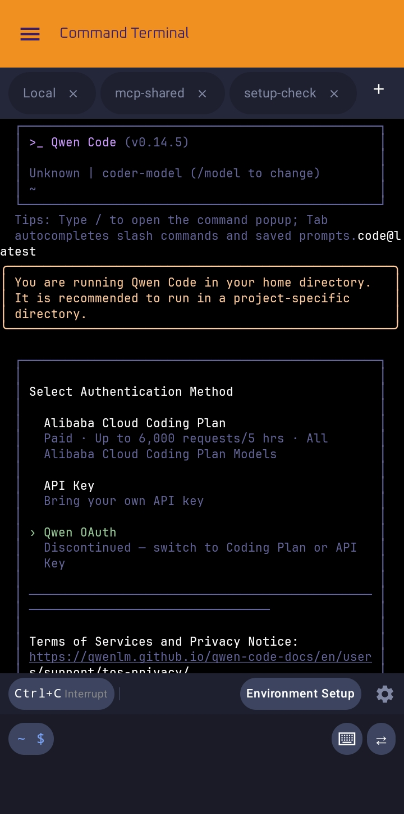
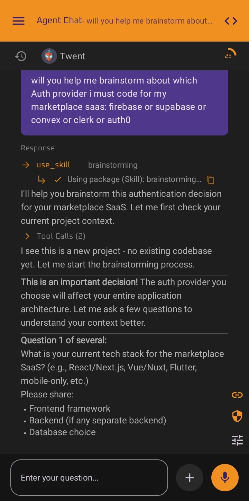
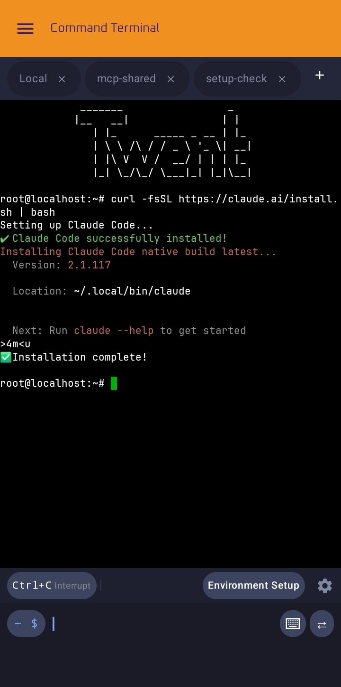
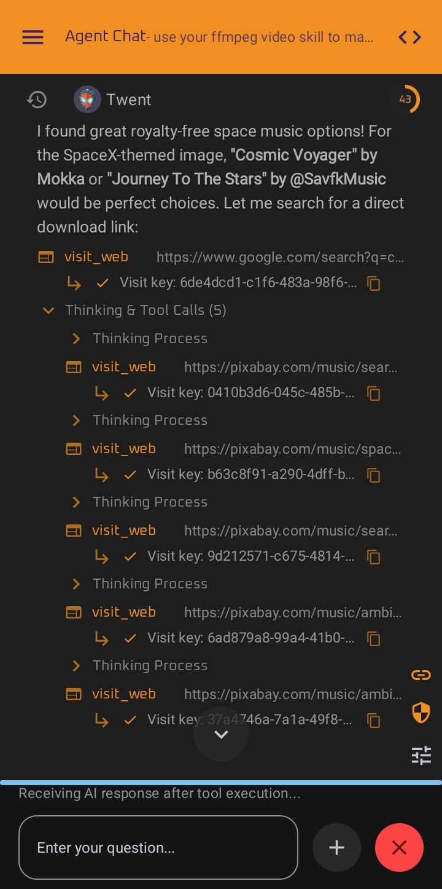
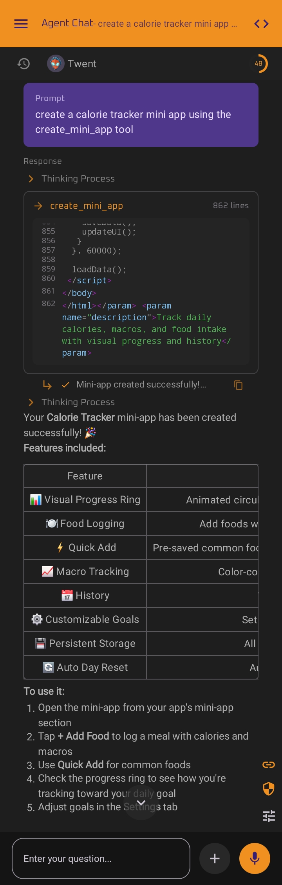
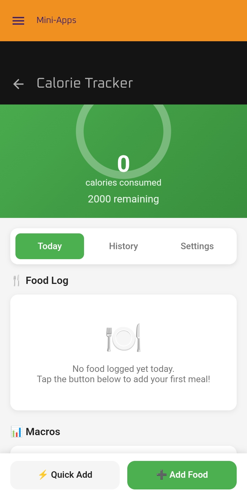
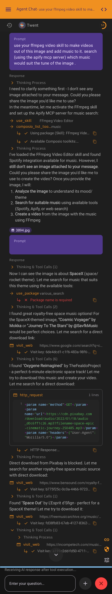
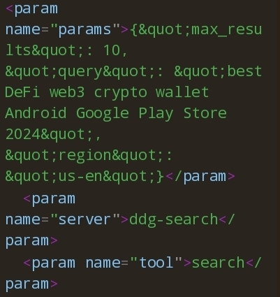

# Twent — AI Agent for Android

<p align="center">
  <strong>The AI agent that actually does things on your phone.</strong><br>
  Not just chat. Real action — taps, terminals, automations, and 1000+ integrations.
</p>

<p align="center">
  <a href="https://twent.xyz">🌐 Website</a> ·
  <a href="https://twent.xyz/#download">📥 Download APK</a> ·
  <a href="https://discord.gg/twent">💬 Discord</a> ·
  <a href="https://github.com/your-org/twent">🐙 GitHub</a>
</p>

---

## What is Twent?

Twent is a **personal agentic OS for Android** — the first AI assistant that actually works *on* your phone, not just *in* a chat window.

Every AI assistant on Android is a fancy chatbot. It can write poems and answer trivia. But it can't open Settings, tap a button, run a script, or actually do anything. **Twent breaks that barrier.**

With Twent, your AI sees your screen, navigates apps, executes shell commands, builds workflows, connects to 1000+ external services, and runs full Linux environments — all activated by voice or long-press.

---

## Features

### 🤖 AI Chat & Agents

- **Any AI Model** — OpenAI, Anthropic Claude, Google Gemini, Groq, DeepSeek, Ollama, and more via BYOK (Bring Your Own Key). Your keys, your data.
- **Agent Swarm** — Run Claude Code, OpenAI Codex, and Hermes-Agent simultaneously on your phone. Each agent specializes in a domain — code, research, automation.
- **Long-Context Memory** — Persistent conversation history with semantic search across all sessions.
- **Character Cards & Personas** — Customize agent personality with role cards.
- **Streaming Responses** — Real-time token streaming for instant feedback.

### 📱 Overlay Agent (UI Automation)

The killer feature. Twent's overlay agent **sees your screen** and acts like you:

- **Tap, swipe, scroll, type** — Control any app's UI via Android Accessibility Service
- **Extract information** — Read text from any screen, pull data from any app
- **Navigate apps** — Open apps, fill forms, submit inputs, handle dialogs
- **Shizuku Integration** — Privileged API access without root for advanced operations
- **Screen capture** — Capture screenshots and analyze them with vision-capable models

### 💻 Full Ubuntu 24.04 Terminal

Real Linux in your pocket. Not a toy emulator:

- **Ubuntu 24.04 LTS (jammy)** with full apt/dpkg package manager
- **Python 3.12** with pip, venv, pandas, numpy
- **Node.js 20 LTS** with npm and global packages
- **Go 1.22** compiler toolchain
- **Rust 1.77 stable** with Cargo
- **Git 2.43** with GitHub CLI (`gh`)
- **OpenSSH** — SSH into servers, or SSH back to your phone
- **Docker CLI** — Manage containers from your phone
- **tmux** — Multiple persistent sessions
- **Vim, nano, emacs** — Full editor suite
- **cron & systemd** — Scheduled jobs and service management
- No root required

### ⚡ Skills System

Skills are **behavior bundles** that give your AI instant expertise. Install a skill and your agent instantly knows how to:

- Analyze code diffs and review PRs
- Crunch CSVs and generate reports
- Write, edit, and translate content
- Manage GitHub issues and repositories
- Interact with Notion, Slack, Gmail, and 1000+ other apps

Skills are installable, shareable, and updatable. Install one from the marketplace or create your own.

### 🔌 Integrations

**MCP (Model Context Protocol)**
Connect to MCP servers for extended capabilities. Twent integrates with the official MCP Registry — browse and install servers directly from the app.

**Composio** (1,000+ integrations)
Pre-authenticated connections to external services: GitHub, Slack, Notion, Google Calendar, Jira, Linear, Airtable, and 1,000+ more. No OAuth setup needed — just connect once.

**Tasker Plugin**
Bidirectional Tasker integration. Trigger Twent workflows from Tasker, or trigger Tasker events from Twent. Full automation bridge.

### 🎨 Workflows

Visual workflow builder with a node-based editor:

- **Triggers**: Manual, scheduled (cron), time-based, event-based, webhook
- **Actions**: 50+ built-in actions (tap, swipe, type, open app, send notification, HTTP request, and more)
- **Conditions**: If/else branches, loops, variable manipulation
- **Templates**: Start from pre-built templates (automation, data extraction, scheduling, webhook routing)
- **Persistence**: Workflows survive app restarts and device reboots

### 🗣️ Voice Control

- **Wake Word** — "Hey Twent" activates the agent hands-free
- **Push-to-Talk** — Long-press to speak any command
- **Continuous Listening** — Agent stays active for multi-step tasks
- **Siri-Style Ball** — Animated floating orb indicator while listening

### 🛡️ Privacy by Design

| Feature | Implementation |
|---|---|
| **BYOK** | Bring Your Own API keys. Your keys never leave your device. |
| **AES-256 Encryption** | All local data encrypted via Android Keystore |
| **Zero Telemetry** | No analytics, no tracking, no phoning home |
| **Local AI Models** | MNN-powered offline models (Phi-3.5-mini, Qwen2.5-3B, Stable Diffusion) |
| **GDPR/CCPA** | Article 17 right to erasure fully supported |
| **No Account Required** | No cloud dependency, no vendor lock-in |
| **Minimal Permissions** | Only requests permissions needed for functionality |

### 📦 File Generation

Generate professional files directly from chat:

- **Spreadsheets** — CSV/XLSX with formatting, formulas, charts (openpyxl)
- **Presentations** — PPTX slides with python-pptx
- **Documents** — DOCX and PDF with python-docx/reportlab
- **Webpages** — HTML/CSS/JS with write_file
- Files saved to Downloads — accessible immediately

### 🧩 Mini Apps

Create interactive HTML/CSS/JS mini-apps that run inside Twent. Mini-apps have:

- localStorage persistence
- Direct access to the AI model for intelligent features
- Image analysis support (vision-capable models)
- Native notification integration

### 🏪 AI Marketplace

Create and sell AI skills, workflows, mini apps, and automation templates. Set your own pricing (free or paid). Built-in analytics, ratings, and automatic updates to buyers.

---

## Tech Stack

| Layer | Technology |
|---|---|
| **UI** | Jetpack Compose + Material 3 |
| **Architecture** | MVVM + Clean Architecture |
| **Async** | Kotlin Coroutines + Flow |
| **DI** | Hilt |
| **Database** | ObjectBox |
| **AI Transport** | StreamNative MQTT over Kotlin Multiplatform |
| **Terminal** | PRoot (Ubuntu on Android, no root) |
| **AI Models** | OpenAI API, Anthropic API, Google AI, Ollama, Local MNN |
| **GPU** | OpenCL + Vulkan |
| **Accessibility** | Android Accessibility Service |
| **Privileged Access** | Shizuku |
| **Automation** | Tasker Plugin |
| **Signing** | Release keystore via local.properties |

---

## Project Structure

```
Twent/
├── app/src/main/java/com/ai/assistance/operit/
│   ├── api/
│   │   ├── chat/          # AI API providers (OpenAI, Anthropic, etc.)
│   │   └── voice/         # Voice service & wake word
│   ├── core/
│   │   ├── agent/         # Agent orchestration (v2 actions, UIAgent)
│   │   ├── chat/          # Chat message management
│   │   ├── config/        # System prompts, tool overviews
│   │   └── tools/          # Tool registration & execution
│   │       ├── defaultTool/   # Built-in tools (file, shell, web, UI)
│   │       ├── javascript/    # JS package execution
│   │       ├── mcp/           # MCP server integration
│   │       └── system/        # Accessibility & shell execution
│   ├── data/
│   │   ├── model/         # Data classes
│   │   ├── mcp/           # MCP local server
│   │   └── preferences/   # User preferences, model configs
│   ├── integrations/
│   │   ├── tasker/        # Tasker plugin integration
│   │   └── intent/        # External intent handling
│   ├── services/
│   │   ├── automation/    # Accessibility automation service
│   │   └── floating/      # Floating chat service
│   ├── ui/
│   │   ├── features/
│   │   │   ├── agents/    # Agent swarm screens
│   │   │   ├── chat/      # AI chat screen
│   │   │   ├── onboarding/# First-run onboarding
│   │   │   ├── settings/  # Settings screens
│   │   │   ├── toolbox/   # Tool browser
│   │   │   └── workflow/  # Workflow editor
│   │   ├── floating/      # Floating overlay UI (ball, window, fullscreen)
│   │   └── theme/         # Material 3 theming
│   └── voice/
│       └── v2/            # Voice agent service
├── terminal/               # Terminal module
├── tools/
│   ├── shower/            # Shower (remote agent binder)
│   ├── desktop/           # Desktop companion
│   └── mcp_bridge/        # MCP bridge CLI
├── android-skills/         # Built-in Android development skills
├── mnn/                   # Local MNN AI models
└── llama/                 # Llama.cpp integration
```

---

## Screenshots

<p align="center">
  
  
  
  
</p>
<p align="center">
  
  
  
  
</p>

---

## Key Screens

The app features a fully redesigned UI with a modern Pinterest-inspired aesthetic:

- **Onboarding** — Animated video intro + feature slides with blur transitions
- **AI Chat** — Full-featured chat with markdown, code blocks, tool call visualization
- **Agent Swarm** — Multi-agent orchestration with per-agent status
- **Floating Overlay** — Chat ball, floating window, and fullscreen modes
- **Terminal** — Full Ubuntu 24.04 in a Compose terminal emulator
- **Workflow Builder** — Node-based visual editor for automations
- **Toolbox** — Browse and test available AI tools
- **Settings** — Model config, themes, privacy, backup, language
- **Marketplace** — Browse, install, and sell skills & workflows

---

## Supported Models & Providers

| Provider | Models |
|---|---|
| **OpenAI** | GPT-4o, GPT-4o-mini, GPT-4 Turbo, o1, o1-mini, o3-mini |
| **Anthropic** | Claude 3.5 Sonnet, Claude 3 Opus, Claude 3 Haiku, Claude 3.7 |
| **Google** | Gemini 1.5 Pro, Gemini 1.5 Flash, Gemini 2.0 Flash |
| **Groq** | Llama 3, Mixtral, Gemma |
| **DeepSeek** | DeepSeek Chat, DeepSeek Coder |
| **Ollama** | Any local Ollama model |
| **Local (MNN)** | Phi-3.5-mini, Qwen2.5-3B, Stable Diffusion |
| **OpenRouter** | Any OpenRouter-accessible model |
| **Kobold** | KoboldCPP models |

---

## Building from Source

### Prerequisites

- **Android Studio** Hedgehog or later
- **JDK 17+**
- **Android SDK** 34 (compileSdk)
- **NDK** (for native C++ components)
- **CMake** 3.22+

### Setup

1. Clone the repository:
   ```bash
   git clone https://github.com/your-org/twent.git
   cd twent
   ```

2. Create `local.properties` with your signing and API keys:
   ```properties
   # Release signing (optional for debug builds)
   RELEASE_STORE_FILE=keystore/release.jks
   RELEASE_STORE_PASSWORD=your_password
   RELEASE_KEY_ALIAS=your_alias
   RELEASE_KEY_PASSWORD=your_key_password

   # API Keys (optional — BYOK model)
   OPENAI_API_KEY=sk-...
   ANTHROPIC_API_KEY=sk-ant-...
   COMPOSIO_API_KEY=...

   # GitHub OAuth (optional)
   GITHUB_CLIENT_ID=...
   GITHUB_CLIENT_SECRET=...
   ```

3. Open in Android Studio and sync Gradle.

4. Build:
   ```bash
   # Debug APK
   ./gradlew assembleDebug

   # Release APK (requires signing config in local.properties)
   ./gradlew assembleRelease
   ```

5. The APK is at: `app/build/outputs/apk/debug/app-debug.apk`

### Bundled Shizuku APK

To bundle the Shizuku APK for offline installation:

1. Download from https://github.com/RikkaApps/Shizuku/releases
2. Rename to `shizuku.apk`
3. Copy to `app/src/main/assets/`
4. Update `app/src/main/assets/shizuku_version.txt` to match

---

## Permissions

Twent requests these permissions (minimal necessary for functionality):

| Permission | Why |
|---|---|
| `INTERNET` | API calls, web browsing |
| `FOREGROUND_SERVICE` | Background AI processing |
| `FOREGROUND_SERVICE_MICROPHONE` | Voice activation |
| `FOREGROUND_SERVICE_MEDIA_PROJECTION` | Screen capture for UI automation |
| `SYSTEM_ALERT_WINDOW` | Floating overlay UI |
| `ACCESSIBILITY_SERVICE` | UI automation (tap, swipe, read screen) |
| `BIND_NOTIFICATION_LISTENER_SERVICE` | Read notifications for automation |
| `RECEIVE_BOOT_COMPLETED` | Resume workflows after reboot |
| `SCHEDULE_EXACT_ALARM` | Scheduled workflow triggers |
| `RECORD_AUDIO` | Voice commands |
| `MANAGE_EXTERNAL_STORAGE` | Full filesystem access (optional) |
| `REQUEST_INSTALL_PACKAGES` | Install bundled APKs |

Camera and contacts are **never** requested.

---

## Comparison with Alternatives

| Feature | Twent | Google Gemini | ChatGPT | Claude App |
|---|---|---|---|---|
| UI Automation | ✅ | ❌ | ❌ | ❌ |
| Full Linux Terminal | ✅ | ❌ | ❌ | ❌ |
| Skills System | ✅ | ❌ | ❌ | ❌ |
| MCP Integration | ✅ | ❌ | ❌ | ❌ |
| 1000+ App Integrations | ✅ (Composio) | ❌ | ❌ | ❌ |
| Local AI Models | ✅ (MNN) | ❌ | ❌ | ❌ |
| Floating Overlay | ✅ | ❌ | ❌ | ❌ |
| Workflow Builder | ✅ | ❌ | ❌ | ❌ |
| BYOK Privacy | ✅ | ❌ | ❌ | ❌ |
| Agent Swarm | ✅ | ❌ | ❌ | ❌ |
| Tasker Integration | ✅ | ❌ | ❌ | ❌ |
| Mini Apps | ✅ | ❌ | ❌ | ❌ |

---

## Contributing

Contributions are welcome! Please read the contribution guidelines before submitting PRs.

- Report bugs via GitHub Issues
- Suggest features via GitHub Discussions
- Submit PRs with tests
- Join our Discord for real-time discussion

---

## License

ISC — see [LICENSE](LICENSE) for details.

---

## Links

- 🌐 **Website**: https://twent.xyz
- 📥 **Download**: https://twent.xyz/#download
- 💬 **Discord**: https://discord.gg/twent
- 📖 **Docs**: https://docs.twent.xyz
- 🐙 **GitHub**: https://github.com/your-org/twent
- 📧 **Contact**: contact@twent.xyz
