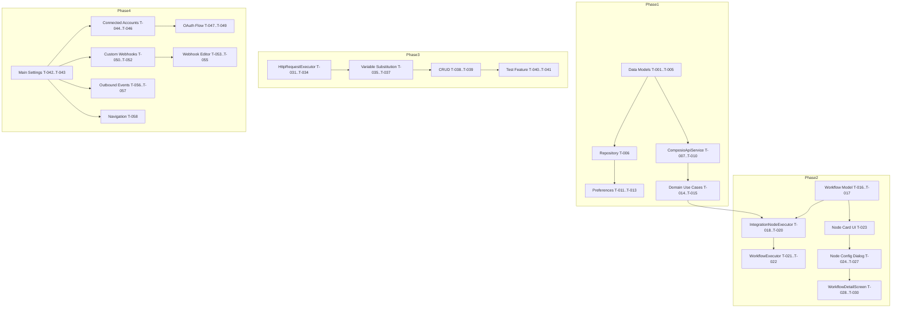

# Webhook & Integration System - Implementation Plan

**Date:** 2026-03-19  
**Based on Spec:** `docs/superpowers/specs/2026-03-19-webhook-integration-design.md`  
**Status:** Ready for Implementation

---

## Overview

This implementation plan breaks down the webhook and integration system into 4 phases with clear task dependencies, file structures, and priority ordering.

---

## Phase 1: Foundation

### Goals
- Create data layer models and repository
- Implement ComposioApiService for REST API communication
- Implement basic OAuth flow for connecting accounts

### Task Breakdown

#### 1.1 Data Models (Priority: P0 - Blocked by nothing)
Create data models in `app/src/main/java/com/ai/assistance/operit/data/integration/model/`

| Task | File | Description |
|------|------|-------------|
| T-001 | `ConnectedAccount.kt` | OAuth account model with id, toolkit, accountName, accountId, connectedAt, status |
| T-002 | `CustomWebhook.kt` | Custom webhook config with url, method, headers, body |
| T-003 | `ToolDefinition.kt` | Tool schema from Composio API |
| T-004 | `ToolAction.kt` | Available actions for each tool |
| T-005 | `IntegrationNodeConfig.kt` | Node configuration for workflow integration |

**Files to create:**
- `app/src/main/java/com/ai/assistance/operit/data/integration/model/ConnectedAccount.kt`
- `app/src/main/java/com/ai/assistance/operit/data/integration/model/CustomWebhook.kt`
- `app/src/main/java/com/ai/assistance/operit/data/integration/model/ToolDefinition.kt`
- `app/src/main/java/com/ai/assistance/operit/data/integration/model/ToolAction.kt`
- `app/src/main/java/com/ai/assistance/operit/data/integration/model/IntegrationNodeConfig.kt`

**Dependencies:** None

#### 1.2 Integration Repository (Priority: P0)
Create repository for CRUD operations in `app/src/main/java/com/ai/assistance/operit/data/integration/`

| Task | File | Description |
|------|------|-------------|
| T-006 | `IntegrationRepository.kt` | Data operations for ConnectedAccount and CustomWebhook |

**Files to create:**
- `app/src/main/java/com/ai/assistance/operit/data/integration/IntegrationRepository.kt`

**Dependencies:** T-001, T-002

#### 1.3 ComposioApiService (Priority: P1)
Implement REST API client for Composio in `app/src/main/java/com/ai/assistance/operit/data/integration/`

| Task | File | Description |
|------|------|-------------|
| T-007 | `ComposioApiService.kt` | REST API client with API key authentication |
| T-008 | - | Tool listing (GET /v1/toolkits) |
| T-009 | - | Tool execution (POST /v1/tools/{tool_name}/execute) |
| T-010 | - | OAuth connection flow methods |

**Files to create:**
- `app/src/main/java/com/ai/assistance/operit/data/integration/ComposioApiService.kt`

**Dependencies:** T-003, T-004

#### 1.4 Encrypted Storage (Priority: P1)
Implement secure token storage

| Task | File | Description |
|------|------|-------------|
| T-011 | `IntegrationPreferences.kt` | EncryptedSharedPreferences wrapper for OAuth tokens |
| T-012 | - | Store access tokens securely |
| T-013 | - | Retrieve and refresh tokens |

**Files to create:**
- `app/src/main/java/com/ai/assistance/operit/data/integration/preferences/IntegrationPreferences.kt`

**Dependencies:** T-006

#### 1.5 Domain Layer Use Cases (Priority: P2)
Create business logic layer in `app/src/main/java/com/ai/assistance/operit/domain/usecase/`

| Task | File | Description |
|------|------|-------------|
| T-014 | `ManageConnections.kt` | OAuth connection management logic |
| T-015 | `ExecuteIntegrationNode.kt` | Business logic for integration node execution |

**Files to create:**
- `app/src/main/java/com/ai/assistance/operit/domain/usecase/ManageConnections.kt`
- `app/src/main/java/com/ai/assistance/operit/domain/usecase/ExecuteIntegrationNode.kt`

**Dependencies:** T-006, T-007, T-011

---

## Phase 2: Workflow Integration

### Goals
- Add Integration node type to workflow builder
- Create node configuration UI
- Implement execution logic in WorkflowExecutor

### Task Breakdown

#### 2.1 Workflow Model Extension (Priority: P0)
Add IntegrationNode to workflow models in `app/src/main/java/com/ai/assistance/operit/data/model/`

| Task | File | Description |
|------|------|-------------|
| T-016 | `Workflow.kt` | Add IntegrationNode sealed class variant |
| T-017 | - | Add IntegrationNode type constant |

**Files to modify:**
- `app/src/main/java/com/ai/assistance/operit/data/model/Workflow.kt`

**Dependencies:** Phase 1 complete (T-005)

#### 2.2 IntegrationNodeExecutor (Priority: P0)
Create executor in `app/src/main/java/com/ai/assistance/operit/core/workflow/`

| Task | File | Description |
|------|------|-------------|
| T-018 | `IntegrationNodeExecutor.kt` | Orchestrates execution by calling ComposioApiService or HttpRequestExecutor |
| T-019 | - | Handle node configuration |
| T-020 | - | Process result and output |

**Files to create:**
- `app/src/main/java/com/ai/assistance/operit/core/workflow/IntegrationNodeExecutor.kt`

**Dependencies:** T-014, T-015, T-007

#### 2.3 WorkflowExecutor Integration (Priority: P1)
Modify existing WorkflowExecutor to handle IntegrationNode

| Task | File | Description |
|------|------|-------------|
| T-021 | `WorkflowExecutor.kt` | Add IntegrationNode handling in executeNode() |
| T-022 | - | Add node type dispatch for "integration" |

**Files to modify:**
- `app/src/main/java/com/ai/assistance/operit/core/workflow/WorkflowExecutor.kt`

**Dependencies:** T-018

#### 2.4 Workflow UI - Node Card (Priority: P1)
Add UI component for Integration node in workflow editor

| Task | File | Description |
|------|------|-------------|
| T-023 | `IntegrationNodeCard.kt` | Visual card for integration node in workflow canvas |

**Files to create:**
- `app/src/main/java/com/ai/assistance/operit/ui/features/workflow/components/IntegrationNodeCard.kt`

**Dependencies:** T-016

#### 2.5 Workflow UI - Node Configuration Dialog (Priority: P2)
Create dialog for configuring Integration node

| Task | File | Description |
|------|------|-------------|
| T-024 | `IntegrationNodeConfigDialog.kt` | Dialog for configuring integration node |
| T-025 | - | Integration type selector (Composio vs Custom Webhook) |
| T-026 | - | Tool/Action picker for Composio |
| T-027 | - | Parameter form builder |

**Files to create:**
- `app/src/main/java/com/ai/assistance/operit/ui/features/workflow/components/IntegrationNodeConfigDialog.kt`

**Dependencies:** T-023, T-003

#### 2.6 WorkflowDetailScreen Integration (Priority: P2)
Add Integration node to workflow editor

| Task | File | Description |
|------|------|-------------|
| T-028 | `WorkflowDetailScreen.kt` | Add "Integration" to node type options |
| T-029 | - | Handle add node for integration type |
| T-030 | - | Show IntegrationNodeConfigDialog |

**Files to modify:**
- `app/src/main/java/com/ai/assistance/operit/ui/features/workflow/screens/WorkflowDetailScreen.kt`

**Dependencies:** T-024, T-025, T-026, T-027

---

## Phase 3: Custom Webhooks

### Goals
- CustomWebhook CRUD operations
- HTTP request executor with variable substitution
- Support for various authentication methods

### Task Breakdown

#### 3.1 HTTP Request Executor (Priority: P0)
Implement custom HTTP execution in `app/src/main/java/com/ai/assistance/operit/data/integration/`

| Task | File | Description |
|------|------|-------------|
| T-031 | `HttpRequestExecutor.kt` | Execute HTTP requests with auth support |
| T-032 | - | Support GET, POST, PUT, DELETE, PATCH |
| T-033 | - | API Key, Bearer, Basic auth |
| T-034 | - | Custom headers support |

**Files to create:**
- `app/src/main/java/com/ai/assistance/operit/data/integration/HttpRequestExecutor.kt`

**Dependencies:** Phase 2 complete

#### 3.2 Variable Substitution (Priority: P0)
Implement variable substitution engine

| Task | File | Description |
|------|------|-------------|
| T-035 | `VariableSubstitutor.kt` | Handle {{variable}} substitution |
| T-036 | - | Substitute in URL, headers, body |
| T-037 | - | Fail on missing variable (no fallback) |

**Files to create:**
- `app/src/main/java/com/ai/assistance/operit/data/integration/VariableSubstitutor.kt`

**Dependencies:** T-031

#### 3.3 CustomWebhook CRUD in Repository (Priority: P1)
Extend IntegrationRepository with CustomWebhook operations

| Task | File | Description |
|------|------|-------------|
| T-038 | `IntegrationRepository.kt` | Add create, read, update, delete for CustomWebhook |
| T-039 | - | Add list and get by ID methods |

**Files to modify:**
- `app/src/main/java/com/ai/assistance/operit/data/integration/IntegrationRepository.kt`

**Dependencies:** T-006, T-002

#### 3.4 Test Webhook Feature (Priority: P2)
Add ability to test webhook from UI

| Task | File | Description |
|------|------|-------------|
| T-040 | - | Add test endpoint method in HttpRequestExecutor |
| T-041 | - | Create test result UI component |

**Dependencies:** T-031

---

## Phase 4: Settings UI

### Goals
- Connected Accounts management screen
- Custom Webhooks management screen
- Integrate with existing webhook settings

### Task Breakdown

#### 4.1 Main Settings Screen (Priority: P0)
Create unified Webhooks & Integrations settings entry point

| Task | File | Description |
|------|------|-------------|
| T-042 | `WebhooksIntegrationsScreen.kt` | Main settings screen with 3 tabs |
| T-043 | - | Tab navigation (Connected Accounts, Custom Webhooks, Outbound Events) |

**Files to create:**
- `app/src/main/java/com/ai/assistance/operit/ui/features/settings/screens/WebhooksIntegrationsScreen.kt`

**Dependencies:** Phase 3 complete

#### 4.2 Connected Accounts Tab (Priority: P1)
Implement connected accounts management UI

| Task | File | Description |
|------|------|-------------|
| T-044 | `ConnectedAccountsTab.kt` | List connected services |
| T-045 | - | Connect/Disconnect buttons |
| T-046 | - | Status indicators (Active, Expired, Error) |

**Files to create:**
- `app/src/main/java/com/ai/assistance/operit/ui/features/settings/screens/components/ConnectedAccountsTab.kt`

**Dependencies:** T-042, T-001

#### 4.3 OAuth Flow UI (Priority: P1)
Implement OAuth connection UI flow

| Task | File | Description |
|------|------|-------------|
| T-047 | `OAuthConnectionDialog.kt` | Show available integrations |
| T-048 | - | Initiate OAuth flow via Chrome Custom Tab |
| T-049 | - | Handle deep link callback: operit://oauth-callback/{toolkit} |

**Files to create:**
- `app/src/main/java/com/ai/assistance/operit/ui/features/settings/screens/components/OAuthConnectionDialog.kt`

**Dependencies:** T-044, T-007

#### 4.4 Custom Webhooks Tab (Priority: P1)
Implement custom webhooks management UI

| Task | File | Description |
|------|------|-------------|
| T-050 | `CustomWebhooksTab.kt` | List saved webhook configurations |
| T-051 | - | Add/Edit/Delete buttons |
| T-052 | - | Test button |

**Files to create:**
- `app/src/main/java/com/ai/assistance/operit/ui/features/settings/screens/components/CustomWebhooksTab.kt`

**Dependencies:** T-042, T-038

#### 4.5 Custom Webhook Editor (Priority: P2)
Create editor for custom webhook configuration

| Task | File | Description |
|------|------|-------------|
| T-053 | `CustomWebhookEditorDialog.kt` | Editor for webhook URL, method, headers, body |
| T-054 | - | Authentication configuration |
| T-055 | - | Variable preview |

**Files to create:**
- `app/src/main/java/com/ai/assistance/operit/ui/features/settings/screens/components/CustomWebhookEditorDialog.kt`

**Dependencies:** T-050, T-035

#### 4.6 Outbound Events Tab (Priority: P2)
Reuse existing webhook notification settings

| Task | File | Description |
|------|------|-------------|
| T-056 | `OutboundEventsTab.kt` | Show existing webhook settings |
| T-057 | - | MCP events, workflow events |

**Files to create:**
- `app/src/main/java/com/ai/assistance/operit/ui/features/settings/screens/components/OutboundEventsTab.kt`

**Dependencies:** T-042 (reuse existing WebhookPreferences)

#### 4.7 Settings Navigation (Priority: P1)
Add to main settings screen navigation

| Task | File | Description |
|------|------|-------------|
| T-058 | `SettingsScreen.kt` | Add "Webhooks & Integrations" menu item |

**Files to modify:**
- `app/src/main/java/com/ai/assistance/operit/ui/features/settings/screens/SettingsScreen.kt`

**Dependencies:** T-042

---

## File Structure Summary

### New Files to Create

```
app/src/main/java/com/ai/assistance/operit/data/integration/
├── ComposioApiService.kt
├── HttpRequestExecutor.kt
├── IntegrationRepository.kt
├── VariableSubstitutor.kt
├── model/
│   ├── ConnectedAccount.kt
│   ├── CustomWebhook.kt
│   ├── IntegrationNodeConfig.kt
│   ├── ToolAction.kt
│   └── ToolDefinition.kt
└── preferences/
    └── IntegrationPreferences.kt

app/src/main/java/com/ai/assistance/operit/domain/usecase/
├── ExecuteIntegrationNode.kt
└── ManageConnections.kt

app/src/main/java/com/ai/assistance/operit/core/workflow/
└── IntegrationNodeExecutor.kt

app/src/main/java/com/ai/assistance/operit/ui/features/workflow/components/
├── IntegrationNodeCard.kt
└── IntegrationNodeConfigDialog.kt

app/src/main/java/com/ai/assistance/operit/ui/features/settings/screens/
├── WebhooksIntegrationsScreen.kt
└── components/
    ├── ConnectedAccountsTab.kt
    ├── CustomWebhooksTab.kt
    ├── CustomWebhookEditorDialog.kt
    ├── OAuthConnectionDialog.kt
    └── OutboundEventsTab.kt
```

### Files to Modify

| File | Modification |
|------|-------------|
| `app/src/main/java/com/ai/assistance/operit/data/model/Workflow.kt` | Add IntegrationNode |
| `app/src/main/java/com/ai/assistance/operit/core/workflow/WorkflowExecutor.kt` | Handle IntegrationNode |
| `app/src/main/java/com/ai/assistance/operit/ui/features/workflow/screens/WorkflowDetailScreen.kt` | Add Integration node |
| `app/src/main/java/com/ai/assistance/operit/ui/features/settings/screens/SettingsScreen.kt` | Add navigation |

---

## Priority Ordering

### Phase 1 (Foundation)
1. T-001 to T-005: Data Models (P0)
2. T-006: IntegrationRepository (P0)
3. T-007 to T-010: ComposioApiService (P1)
4. T-011 to T-013: Encrypted Storage (P1)
5. T-014 to T-015: Domain Use Cases (P2)

### Phase 2 (Workflow Integration)
1. T-016 to T-017: Workflow Model (P0)
2. T-018 to T-020: IntegrationNodeExecutor (P0)
3. T-021 to T-022: WorkflowExecutor Integration (P1)
4. T-023: Node Card UI (P1)
5. T-024 to T-027: Node Config Dialog (P2)
6. T-028 to T-030: WorkflowDetailScreen (P2)

### Phase 3 (Custom Webhooks)
1. T-031 to T-034: HttpRequestExecutor (P0)
2. T-035 to T-037: Variable Substitution (P0)
3. T-038 to T-039: CRUD in Repository (P1)
4. T-040 to T-041: Test Feature (P2)

### Phase 4 (Settings UI)
1. T-042 to T-043: Main Settings Screen (P0)
2. T-044 to T-046: Connected Accounts Tab (P1)
3. T-047 to T-049: OAuth Flow UI (P1)
4. T-050 to T-052: Custom Webhooks Tab (P1)
5. T-053 to T-055: Webhook Editor (P2)
6. T-056 to T-057: Outbound Events Tab (P2)
7. T-058: Navigation (P1)

---

## Dependencies Diagram



---

## Notes

1. **Composio API Key**: Store in `local.properties` as `COMPOSIO_API_KEY`
2. **OAuth Callback**: Register deep link `operit://oauth-callback/{toolkit}` in AndroidManifest
3. **Error Handling**: Implement retry with exponential backoff (max 3) for network errors
4. **Security**: Use EncryptedSharedPreferences for all sensitive data (tokens, API keys)
5. **Testing**: Add unit tests for VariableSubstitutor and HttpRequestExecutor

---

## Next Steps

1. **Approve Implementation Plan** - Confirm task breakdown and dependencies
2. **Begin Phase 1** - Start with data models and repository
3. **Setup local.properties** - Add COMPOSIO_API_KEY placeholder
4. **Setup Deep Link** - Configure OAuth callback in AndroidManifest
