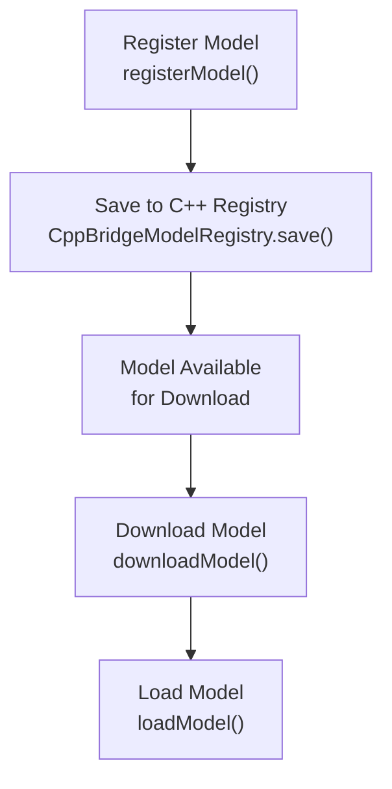

# DeepWiki Q&A with Code Context for Repository: RunanywhereAI/runanywhere-sdks
## Q1
do i need an api key to add and use runanywhere models in my mobile app
### Answer
No, you don't need an API key to add and use RunAnywhere models in your mobile app when using development mode. However, an API key is required for production/staging environments.

## Quick Answer

**Development Mode**: No API key needed - you can register, download, and use models locally runanywhere-sdks:168-200 runanywhere-sdks:140-166 

**Production/Staging Mode**: API key required for backend authentication runanywhere-sdks:238-244 runanywhere-sdks:332-338 

## Details

### Initialization Patterns

The SDK supports different initialization modes across platforms:

**iOS/Swift:**
```swift
// Development - no API key
try RunAnywhere.initialize()

// Production - API key required
try RunAnywhere.initialize(
    apiKey: "<YOUR_API_KEY>",
    baseURL: "https://api.runanywhere.ai",
    environment: .production
)
``` runanywhere-sdks:168-186 

**React Native:**
```typescript
// Development - no API key
await RunAnywhere.initialize({
  environment: SDKEnvironment.Development,
});

// Production - API key required
await RunAnywhere.initialize({
  apiKey: '<YOUR_API_KEY>',
  baseURL: 'https://api.runanywhere.ai',
  environment: SDKEnvironment.Production,
});
``` runanywhere-sdks:118-129 

### Model Usage Without API Keys

Once models are downloaded, all inference happens on-device without requiring API keys or network connectivity runanywhere-sdks:690-693 . The API key is only used for:
- Initial SDK authentication in production/staging
- Downloading models from remote URLs
- Optional analytics and telemetry

### Environment Modes

| Environment | API Key Required | Use Case |
|-------------|------------------|----------|
| Development | No | Local development, testing models |
| Staging | Yes | Testing with real services |
| Production | Yes | Production deployment | runanywhere-sdks:342-347 

## Notes

- You can register models manually using `registerModel()` or `registerMultiFileModel()` without an API key in development mode
- Models are stored locally on device (Documents/models/ on iOS/Android, OPFS on Web) and work offline once downloaded
- The SDK automatically handles model discovery and loading without requiring backend authentication for local inference
- API keys are only validated when initializing in production/staging environments or when making authenticated API calls to backend services

Wiki pages you might want to explore:
- [Model Lifecycle and Registry (RunanywhereAI/runanywhere-sdks)](/wiki/RunanywhereAI/runanywhere-sdks#2.2)
### Citations
**File:** sdk/runanywhere-swift/README.md (L168-200)
```markdown
### 1. Initialize the SDK

```swift
import RunAnywhere
import LlamaCPPRuntime

@main
struct MyApp: App {
    init() {
        Task { @MainActor in
            // Register the LlamaCPP module for LLM support
            LlamaCPP.register()

            // Initialize the SDK
            do {
                try RunAnywhere.initialize(
                    apiKey: "<YOUR_API_KEY>",
                    baseURL: "https://api.runanywhere.ai",
                    environment: .production
                )
            } catch {
                print("SDK initialization failed: \(error)")
            }
        }
    }

    var body: some Scene {
        WindowGroup {
            ContentView()
        }
    }
}
```
```
**File:** sdk/runanywhere-swift/README.md (L238-244)
```markdown
```swift
try RunAnywhere.initialize(
    apiKey: "<YOUR_API_KEY>",
    baseURL: "https://api.runanywhere.ai",
    environment: .production
)
```
```
**File:** sdk/runanywhere-react-native/README.md (L140-166)
```markdown
// Initialize SDK (development mode - no API key needed)
await RunAnywhere.initialize({
  environment: SDKEnvironment.Development,
});

// Register LlamaCpp module and add LLM models
LlamaCPP.register();
await LlamaCPP.addModel({
  id: 'smollm2-360m-q8_0',
  name: 'SmolLM2 360M Q8_0',
  url: 'https://huggingface.co/prithivMLmods/SmolLM2-360M-GGUF/resolve/main/SmolLM2-360M.Q8_0.gguf',
  memoryRequirement: 500_000_000,
});

// Register ONNX module and add STT/TTS models
ONNX.register();
await ONNX.addModel({
  id: 'sherpa-onnx-whisper-tiny.en',
  name: 'Sherpa Whisper Tiny (ONNX)',
  url: 'https://github.com/RunanywhereAI/sherpa-onnx/releases/download/runanywhere-models-v1/sherpa-onnx-whisper-tiny.en.tar.gz',
  modality: ModelCategory.SpeechRecognition,
  artifactType: ModelArtifactType.TarGzArchive,
  memoryRequirement: 75_000_000,
});

console.log('SDK initialized');
```
```
**File:** sdk/runanywhere-react-native/README.md (L332-338)
```markdown
// Production mode - requires API key
await RunAnywhere.initialize({
  apiKey: '<YOUR_API_KEY>',
  baseURL: 'https://api.runanywhere.ai',
  environment: SDKEnvironment.Production,
});
```
```
**File:** sdk/runanywhere-react-native/README.md (L342-347)
```markdown
| Environment | Description |
|-------------|-------------|
| `.Development` | Verbose logging, local backend, no auth required |
| `.Staging` | Testing with real services |
| `.Production` | Minimal logging, full authentication, telemetry |

```
**File:** sdk/runanywhere-swift/Sources/RunAnywhere/Public/RunAnywhere.swift (L168-186)
```swift
     * ```swift
     * // Development mode (default)
     * try RunAnywhere.initialize()
     *
     * // Production mode - requires API key and backend URL
     * try RunAnywhere.initialize(
     *     apiKey: "your_api_key",
     *     baseURL: "https://api.runanywhere.ai",
     *     environment: .production
     * )
     * ```
     *
     * - Parameters:
     *   - apiKey: API key (optional for development, required for production/staging)
     *   - baseURL: Backend API base URL (optional for development, required for production/staging)
     *   - environment: SDK environment (default: .development)
     *
     * - Throws: SDKError if validation fails
     */
```
**File:** sdk/runanywhere-react-native/packages/core/src/Public/RunAnywhere.ts (L118-129)
```typescript
  get version(): string {
    return SDKConstants.version;
  },

  // ============================================================================
  // SDK Initialization
  // ============================================================================

  async initialize(options: SDKInitOptions): Promise<void> {
    const environment = options.environment ?? SDKEnvironment.Production;

    // Fail fast: API key is required for production/staging environments
```
**File:** sdk/runanywhere-web/packages/core/README.md (L690-693)
```markdown
### Does this work offline?

Yes. Once models are downloaded and cached in OPFS, the SDK works entirely offline. No server, API key, or network connection is needed for inference.

```
## Q2
so i have to register a list of models, then only will they be available to download?
### Answer
Yes, you must register models first before they become available for download. Registration adds model metadata to the C++ registry, making them discoverable by the download system.

## Quick Answer

**Registration is required** - Models must be registered with the SDK before they can be downloaded runanywhere-sdks:45-92 . The registration process saves model metadata (ID, URL, framework, etc.) to the C++ model registry runanywhere-sdks:53-108 .

## Registration Flow



## Platform Examples

### Swift/iOS
```swift
// Register model first
RunAnywhere.registerModel(
    id: "smollm2-360m-q8_0",
    name: "SmolLM2 360M Q8_0", 
    url: "https://huggingface.co/.../model.gguf",
    framework: .llamaCpp
)

// Then download
try await RunAnywhere.downloadModel("smollm2-360m-q8_0")
``` runanywhere-sdks:159-177 

### Kotlin/Android
```kotlin
// Register model first
RunAnywhere.registerModel(
    id = "smollm2-360m-instruct-q8_0",
    name = "SmolLM2 360M Instruct Q8_0",
    url = "https://huggingface.co/.../model.gguf",
    framework = InferenceFramework.LLAMA_CPP
)

// Then download
RunAnywhere.downloadModel("smollm2-360m-instruct-q8_0")
    .collect { progress -> /* handle progress */ }
``` runanywhere-sdks:78-86 

### React Native
```typescript
// Register model first
await LlamaCPP.addModel({
  id: 'smollm2-360m-q8_0',
  name: 'SmolLM2 360M Q8_0',
  url: 'https://huggingface.co/.../model.gguf',
  memoryRequirement: 500_000_000,
});

// Then download
await RunAnywhere.downloadModel('smollm2-360m-q8_0');
``` runanywhere-sdks:145-152 

### Flutter
```dart
// Register model first
LlamaCpp.addModel(
  id: 'smollm2-360m-q8_0',
  name: 'SmolLM2 360M Q8_0',
  url: 'https://huggingface.co/.../model.gguf',
  memoryRequirement: 500000000,
);

// Then download
await for (final progress in RunAnywhere.downloadModel('smollm2-360m-q8_0')) {
  print('Progress: ${(progress.percentage * 100).toStringAsFixed(1)}%');
}
``` runanywhere-sdks:76-82 

## Why Registration is Required

1. **C++ Registry Storage**: Registration saves model metadata to the C++ model registry (`rac_model_registry`) so backends can find models during loading runanywhere-sdks:498-510 

2. **Framework Matching**: The `framework` field is critical for correct backend selection via `can_handle()` checks runanywhere-sdks:55-61 

3. **Download URL Resolution**: The download system queries the registry to get the model's download URL when `downloadModel()` is called runanywhere-sdks:126-134 

## Notes

- Models can be registered at app startup or on-demand
- Registration is persistent across app sessions
- Multi-file models (like VLMs) use `registerMultiFileModel()` but follow the same pattern runanywhere-sdks:108-147 
- The registry automatically detects previously downloaded models on app launch runanywhere-sdks:263-270 

Wiki pages you might want to explore:
- [Quick Start (RunanywhereAI/runanywhere-sdks)](/wiki/RunanywhereAI/runanywhere-sdks#1.2)
### Citations
**File:** sdk/runanywhere-kotlin/src/commonMain/kotlin/com/runanywhere/sdk/public/extensions/RunAnywhere+ModelManagement.kt (L45-92)
```kotlin
fun RunAnywhere.registerModel(
    id: String? = null,
    name: String,
    url: String,
    framework: InferenceFramework,
    modality: ModelCategory = ModelCategory.LANGUAGE,
    artifactType: ModelArtifactType? = null,
    memoryRequirement: Long? = null,
    supportsThinking: Boolean = false,
): ModelInfo {
    val logger = SDKLogger.models

    // Generate model ID from URL filename if not provided
    val modelId = id ?: generateModelIdFromUrl(url)
    logger.debug("Registering model: $modelId (name: $name)")

    // Detect format from URL extension
    val format = detectFormatFromUrl(url)
    logger.debug("Detected format: ${format.value} for model: $modelId")

    // Infer artifact type if not provided
    val effectiveArtifactType = artifactType ?: inferArtifactType(url)
    logger.debug("Artifact type: ${effectiveArtifactType.displayName} for model: $modelId")

    // Create ModelInfo
    val modelInfo =
        ModelInfo(
            id = modelId,
            name = name,
            category = modality,
            format = format,
            downloadURL = url,
            localPath = null,
            artifactType = effectiveArtifactType,
            downloadSize = memoryRequirement,
            framework = framework,
            contextLength = if (modality.requiresContextLength) 2048 else null,
            supportsThinking = supportsThinking,
            description = "User-added model",
            source = com.runanywhere.sdk.public.extensions.Models.ModelSource.LOCAL,
        )

    // Save to registry (fire-and-forget)
    registerModelInternal(modelInfo)

    logger.info("Registered model: $modelId (category: ${modality.value}, framework: ${framework.rawValue})")
    return modelInfo
}
```
**File:** sdk/runanywhere-kotlin/src/commonMain/kotlin/com/runanywhere/sdk/public/extensions/RunAnywhere+ModelManagement.kt (L108-147)
```kotlin
fun RunAnywhere.registerMultiFileModel(
    id: String,
    name: String,
    files: List<ModelFileDescriptor>,
    framework: InferenceFramework,
    modality: ModelCategory = ModelCategory.MULTIMODAL,
    memoryRequirement: Long? = null,
): ModelInfo {
    val logger = SDKLogger.models
    require(files.isNotEmpty()) { "Multi-file model must have at least one file descriptor" }

    logger.debug("Registering multi-file model: $id (name: $name, files: ${files.size})")

    // Cache the file descriptors (C++ registry doesn't preserve them)
    cacheMultiFileDescriptors(id, files)

    // Create ModelInfo with multiFile artifact type
    val modelInfo =
        ModelInfo(
            id = id,
            name = name,
            category = modality,
            format = ModelFormat.GGUF, // Assume GGUF for VLM models (matches iOS)
            downloadURL = files.firstOrNull()?.url, // Use first file URL as primary (for display)
            localPath = null,
            artifactType = ModelArtifactType.MultiFile(files),
            downloadSize = memoryRequirement,
            framework = framework,
            contextLength = if (modality.requiresContextLength) 2048 else null,
            supportsThinking = false,
            description = "Multi-file model (${files.size} files)",
            source = ModelSource.LOCAL,
        )

    // Save to registry (fire-and-forget)
    registerModelInternal(modelInfo)

    logger.info("Registered multi-file model: $id (${files.size} files, framework: ${framework.rawValue})")
    return modelInfo
}
```
**File:** sdk/runanywhere-kotlin/src/jvmAndroidMain/kotlin/com/runanywhere/sdk/public/extensions/RunAnywhere+ModelManagement.jvmAndroid.kt (L53-108)
```kotlin
internal actual fun registerModelInternal(modelInfo: ModelInfo) {
    try {
        // Convert public ModelInfo to bridge ModelInfo
        // CRITICAL: The framework field must be set correctly for C++ can_handle() to work
        val bridgeModelInfo =
            CppBridgeModelRegistry.ModelInfo(
                modelId = modelInfo.id,
                name = modelInfo.name,
                category =
                    when (modelInfo.category) {
                        ModelCategory.LANGUAGE -> CppBridgeModelRegistry.ModelCategory.LANGUAGE
                        ModelCategory.SPEECH_RECOGNITION -> CppBridgeModelRegistry.ModelCategory.SPEECH_RECOGNITION
                        ModelCategory.SPEECH_SYNTHESIS -> CppBridgeModelRegistry.ModelCategory.SPEECH_SYNTHESIS
                        ModelCategory.AUDIO -> CppBridgeModelRegistry.ModelCategory.AUDIO
                        ModelCategory.VISION -> CppBridgeModelRegistry.ModelCategory.VISION
                        ModelCategory.IMAGE_GENERATION -> CppBridgeModelRegistry.ModelCategory.IMAGE_GENERATION
                        ModelCategory.MULTIMODAL -> CppBridgeModelRegistry.ModelCategory.MULTIMODAL
                    },
                format =
                    when (modelInfo.format) {
                        ModelFormat.GGUF -> CppBridgeModelRegistry.ModelFormat.GGUF
                        ModelFormat.ONNX -> CppBridgeModelRegistry.ModelFormat.ONNX
                        ModelFormat.ORT -> CppBridgeModelRegistry.ModelFormat.ORT
                        else -> CppBridgeModelRegistry.ModelFormat.UNKNOWN
                    },
                // CRITICAL: Map InferenceFramework to C++ framework constant
                framework =
                    when (modelInfo.framework) {
                        InferenceFramework.LLAMA_CPP -> CppBridgeModelRegistry.Framework.LLAMACPP
                        InferenceFramework.ONNX -> CppBridgeModelRegistry.Framework.ONNX
                        InferenceFramework.FOUNDATION_MODELS -> CppBridgeModelRegistry.Framework.FOUNDATION_MODELS
                        InferenceFramework.SYSTEM_TTS -> CppBridgeModelRegistry.Framework.SYSTEM_TTS
                        InferenceFramework.FLUID_AUDIO -> CppBridgeModelRegistry.Framework.FLUID_AUDIO
                        InferenceFramework.BUILT_IN -> CppBridgeModelRegistry.Framework.BUILTIN
                        InferenceFramework.NONE -> CppBridgeModelRegistry.Framework.NONE
                        InferenceFramework.UNKNOWN -> CppBridgeModelRegistry.Framework.UNKNOWN
                    },
                downloadUrl = modelInfo.downloadURL,
                localPath = modelInfo.localPath,
                downloadSize = modelInfo.downloadSize ?: 0,
                contextLength = modelInfo.contextLength ?: 0,
                supportsThinking = modelInfo.supportsThinking,
                description = modelInfo.description,
                status = CppBridgeModelRegistry.ModelStatus.AVAILABLE,
            )

        // Save directly to C++ registry - this is where C++ backends look for models
        CppBridgeModelRegistry.save(bridgeModelInfo)

        // Also add to the in-memory cache for immediate availability from Kotlin
        addToModelCache(modelInfo)

        modelsLogger.info("Registered model: ${modelInfo.name} (${modelInfo.id})")
    } catch (e: Exception) {
        modelsLogger.error("Failed to register model: ${e.message}")
    }
```
**File:** sdk/runanywhere-kotlin/docs/Documentation.md (L78-86)
```markdown
// LLM Model - SmolLM2 360M (small, fast, good for demos)
RunAnywhere.registerModel(
    id = "smollm2-360m-instruct-q8_0",
    name = "SmolLM2 360M Instruct Q8_0",
    url = "https://huggingface.co/HuggingFaceTB/SmolLM2-360M-Instruct-GGUF/resolve/main/smollm2-360m-instruct-q8_0.gguf",
    framework = InferenceFramework.LLAMA_CPP,
    modality = ModelCategory.LANGUAGE,
    memoryRequirement = 400_000_000 // ~400MB
)
```
**File:** sdk/runanywhere-react-native/README.md (L145-152)
```markdown
// Register LlamaCpp module and add LLM models
LlamaCPP.register();
await LlamaCPP.addModel({
  id: 'smollm2-360m-q8_0',
  name: 'SmolLM2 360M Q8_0',
  url: 'https://huggingface.co/prithivMLmods/SmolLM2-360M-GGUF/resolve/main/SmolLM2-360M.Q8_0.gguf',
  memoryRequirement: 500_000_000,
});
```
**File:** sdk/runanywhere-flutter/packages/runanywhere_llamacpp/README.md (L76-82)
```markdown
```dart
LlamaCpp.addModel(
  id: 'smollm2-360m-q8_0',
  name: 'SmolLM2 360M Q8_0',
  url: 'https://huggingface.co/prithivMLmods/SmolLM2-360M-GGUF/resolve/main/SmolLM2-360M.Q8_0.gguf',
  memoryRequirement: 500000000,  // ~500MB
);
```
**File:** sdk/runanywhere-kotlin/src/jvmAndroidMain/kotlin/com/runanywhere/sdk/native/bridge/RunAnywhereBridge.kt (L498-510)
```kotlin
    @JvmStatic
    external fun racModelRegistrySave(
        modelId: String,
        name: String,
        category: Int,
        format: Int,
        framework: Int,
        downloadUrl: String?,
        localPath: String?,
        downloadSize: Long,
        contextLength: Int,
        supportsThinking: Boolean,
        description: String?,
```
**File:** sdk/runanywhere-react-native/packages/core/src/services/ModelRegistry.ts (L126-134)
```typescript
  /**
   * Register a model (native)
   */
  async registerModel(model: ModelInfo): Promise<void> {
    if (!isNativeModuleAvailable()) return;

    const native = requireNativeModule();
    await native.registerModel(JSON.stringify(model));
  }
```
**File:** sdk/runanywhere-kotlin/src/jvmAndroidMain/kotlin/com/runanywhere/sdk/foundation/bridge/extensions/CppBridgeModelRegistry.kt (L263-270)
```kotlin
    fun scanAndRestoreDownloadedModels() {
        log(LogLevel.DEBUG, "Scanning for previously downloaded models...")

        val baseDir = CppBridgeModelPaths.getBaseDirectory()
        val modelsDir = java.io.File(baseDir, "models")

        if (!modelsDir.exists()) {
            log(LogLevel.DEBUG, "Models directory does not exist: ${modelsDir.absolutePath}")
```
## Q3
ok. for the registration flow mentioned above, give a kotlin sdk snippet which includes each step in the flow.
### Answer
Here's a complete Kotlin SDK snippet demonstrating the full registration flow:

```kotlin
import com.runanywhere.sdk.public.RunAnywhere
import com.runanywhere.sdk.public.SDKEnvironment
import com.runanywhere.sdk.public.extensions.*
import com.runanywhere.sdk.public.extensions.Models.ModelCategory
import com.runanywhere.sdk.core.types.InferenceFramework
import kotlinx.coroutines.flow.collect

// 1. Initialize SDK (Development mode - no API key needed)
RunAnywhere.initialize(environment = SDKEnvironment.DEVELOPMENT)

// 2. Register Model - saves to C++ registry
val modelInfo = RunAnywhere.registerModel(
    id = "smollm2-360m-instruct-q8_0",
    name = "SmolLM2 360M Instruct Q8_0",
    url = "https://huggingface.co/HuggingFaceTB/SmolLM2-360M-Instruct-GGUF/resolve/main/smollm2-360m-instruct-q8_0.gguf",
    framework = InferenceFramework.LLAMA_CPP,
    modality = ModelCategory.LANGUAGE,
    memoryRequirement = 400_000_000 // ~400MB
)
// This calls registerModelInternal() -> CppBridgeModelRegistry.save() runanywhere-sdks:45-92 

// 3. Download Model - queries registry for URL, downloads with progress
RunAnywhere.downloadModel("smollm2-360m-instruct-q8_0")
    .catch { e -> println("Download failed: ${e.message}") }
    .collect { progress ->
        println("Download: ${(progress.progress * 100).toInt()}% (${progress.bytesDownloaded}/${progress.totalBytes} bytes)")
    }
// downloadModel() gets model info from registry then downloads runanywhere-sdks:307-346 

// 4. Load Model - loads into memory for inference
RunAnywhere.loadLLMModel("smollm2-360m-instruct-q8_0")
// loadLLMModel() gets local path from registry and loads via C++ runanywhere-sdks:996-1014 

// 5. Use Model - generate text
val response = RunAnywhere.chat("What is the capital of France?")
println("Response: $response")

// 6. Check model status
val isLoaded = RunAnywhere.isLLMModelLoaded()
val currentModel = RunAnywhere.currentLLMModelId
println("Model loaded: $isLoaded, Current model: $currentModel")

// 7. Cleanup (optional)
RunAnywhere.unloadLLMModel()
```

## Flow Breakdown

### Step 1: Model Registration
The `registerModel()` function creates a `ModelInfo` object and saves it to the C++ registry via `registerModelInternal()` runanywhere-sdks:53-108 . This makes the model discoverable by the download system.

### Step 2: C++ Registry Storage
Registration converts the public `ModelInfo` to a bridge `ModelInfo` and saves it using `CppBridgeModelRegistry.save()` runanywhere-sdks:498-510 . The framework field is critical for backend selection.

### Step 3: Model Download
`downloadModel()` queries the registry to get the download URL, then downloads with progress tracking runanywhere-sdks:321-335 .

### Step 4: Model Loading
`loadLLMModel()` retrieves the local path from the registry and loads the model into memory via the C++ bridge runanywhere-sdks:1001-1013 .

## Notes

- Registration is persistent across app sessions
- The registry automatically detects previously downloaded models on app launch runanywhere-sdks:263-270 
- All inference happens on-device once models are loaded
- Use `availableModels()` to list all registered models

Wiki pages you might want to explore:
- [Quick Start (RunanywhereAI/runanywhere-sdks)](/wiki/RunanywhereAI/runanywhere-sdks#1.2)
### Citations
**File:** sdk/runanywhere-kotlin/src/commonMain/kotlin/com/runanywhere/sdk/public/extensions/RunAnywhere+ModelManagement.kt (L45-92)
```kotlin
fun RunAnywhere.registerModel(
    id: String? = null,
    name: String,
    url: String,
    framework: InferenceFramework,
    modality: ModelCategory = ModelCategory.LANGUAGE,
    artifactType: ModelArtifactType? = null,
    memoryRequirement: Long? = null,
    supportsThinking: Boolean = false,
): ModelInfo {
    val logger = SDKLogger.models

    // Generate model ID from URL filename if not provided
    val modelId = id ?: generateModelIdFromUrl(url)
    logger.debug("Registering model: $modelId (name: $name)")

    // Detect format from URL extension
    val format = detectFormatFromUrl(url)
    logger.debug("Detected format: ${format.value} for model: $modelId")

    // Infer artifact type if not provided
    val effectiveArtifactType = artifactType ?: inferArtifactType(url)
    logger.debug("Artifact type: ${effectiveArtifactType.displayName} for model: $modelId")

    // Create ModelInfo
    val modelInfo =
        ModelInfo(
            id = modelId,
            name = name,
            category = modality,
            format = format,
            downloadURL = url,
            localPath = null,
            artifactType = effectiveArtifactType,
            downloadSize = memoryRequirement,
            framework = framework,
            contextLength = if (modality.requiresContextLength) 2048 else null,
            supportsThinking = supportsThinking,
            description = "User-added model",
            source = com.runanywhere.sdk.public.extensions.Models.ModelSource.LOCAL,
        )

    // Save to registry (fire-and-forget)
    registerModelInternal(modelInfo)

    logger.info("Registered model: $modelId (category: ${modality.value}, framework: ${framework.rawValue})")
    return modelInfo
}
```
**File:** sdk/runanywhere-kotlin/src/jvmAndroidMain/kotlin/com/runanywhere/sdk/public/extensions/RunAnywhere+ModelManagement.jvmAndroid.kt (L53-108)
```kotlin
internal actual fun registerModelInternal(modelInfo: ModelInfo) {
    try {
        // Convert public ModelInfo to bridge ModelInfo
        // CRITICAL: The framework field must be set correctly for C++ can_handle() to work
        val bridgeModelInfo =
            CppBridgeModelRegistry.ModelInfo(
                modelId = modelInfo.id,
                name = modelInfo.name,
                category =
                    when (modelInfo.category) {
                        ModelCategory.LANGUAGE -> CppBridgeModelRegistry.ModelCategory.LANGUAGE
                        ModelCategory.SPEECH_RECOGNITION -> CppBridgeModelRegistry.ModelCategory.SPEECH_RECOGNITION
                        ModelCategory.SPEECH_SYNTHESIS -> CppBridgeModelRegistry.ModelCategory.SPEECH_SYNTHESIS
                        ModelCategory.AUDIO -> CppBridgeModelRegistry.ModelCategory.AUDIO
                        ModelCategory.VISION -> CppBridgeModelRegistry.ModelCategory.VISION
                        ModelCategory.IMAGE_GENERATION -> CppBridgeModelRegistry.ModelCategory.IMAGE_GENERATION
                        ModelCategory.MULTIMODAL -> CppBridgeModelRegistry.ModelCategory.MULTIMODAL
                    },
                format =
                    when (modelInfo.format) {
                        ModelFormat.GGUF -> CppBridgeModelRegistry.ModelFormat.GGUF
                        ModelFormat.ONNX -> CppBridgeModelRegistry.ModelFormat.ONNX
                        ModelFormat.ORT -> CppBridgeModelRegistry.ModelFormat.ORT
                        else -> CppBridgeModelRegistry.ModelFormat.UNKNOWN
                    },
                // CRITICAL: Map InferenceFramework to C++ framework constant
                framework =
                    when (modelInfo.framework) {
                        InferenceFramework.LLAMA_CPP -> CppBridgeModelRegistry.Framework.LLAMACPP
                        InferenceFramework.ONNX -> CppBridgeModelRegistry.Framework.ONNX
                        InferenceFramework.FOUNDATION_MODELS -> CppBridgeModelRegistry.Framework.FOUNDATION_MODELS
                        InferenceFramework.SYSTEM_TTS -> CppBridgeModelRegistry.Framework.SYSTEM_TTS
                        InferenceFramework.FLUID_AUDIO -> CppBridgeModelRegistry.Framework.FLUID_AUDIO
                        InferenceFramework.BUILT_IN -> CppBridgeModelRegistry.Framework.BUILTIN
                        InferenceFramework.NONE -> CppBridgeModelRegistry.Framework.NONE
                        InferenceFramework.UNKNOWN -> CppBridgeModelRegistry.Framework.UNKNOWN
                    },
                downloadUrl = modelInfo.downloadURL,
                localPath = modelInfo.localPath,
                downloadSize = modelInfo.downloadSize ?: 0,
                contextLength = modelInfo.contextLength ?: 0,
                supportsThinking = modelInfo.supportsThinking,
                description = modelInfo.description,
                status = CppBridgeModelRegistry.ModelStatus.AVAILABLE,
            )

        // Save directly to C++ registry - this is where C++ backends look for models
        CppBridgeModelRegistry.save(bridgeModelInfo)

        // Also add to the in-memory cache for immediate availability from Kotlin
        addToModelCache(modelInfo)

        modelsLogger.info("Registered model: ${modelInfo.name} (${modelInfo.id})")
    } catch (e: Exception) {
        modelsLogger.error("Failed to register model: ${e.message}")
    }
```
**File:** sdk/runanywhere-kotlin/src/jvmAndroidMain/kotlin/com/runanywhere/sdk/public/extensions/RunAnywhere+ModelManagement.jvmAndroid.kt (L307-346)
```kotlin
actual fun RunAnywhere.downloadModel(modelId: String): Flow<DownloadProgress> =
    callbackFlow {
        val downloadLogger = SDKLogger.download

        // 0. Check network connectivity first (for better user experience)
        val (isNetworkAvailable, networkDescription) = CppBridgeDownload.checkNetworkStatus()
        if (!isNetworkAvailable) {
            downloadLogger.error("No internet connection: $networkDescription")
            throw SDKError.networkUnavailable(
                IllegalStateException("No internet connection. Please check your network settings and try again."),
            )
        }
        downloadLogger.debug("Network status: $networkDescription")

        // 1. Get model info from registered models or bridge models
        // First check registered models, then fall back to bridge models (from remote API)
        val modelInfo =
            getRegisteredModels().find { it.id == modelId }
                ?: getAllBridgeModels().find { it.modelId == modelId }?.toPublicModelInfo()
                ?: throw SDKError.model("Model '$modelId' not found in registry")

        val downloadUrl =
            modelInfo.downloadURL
                ?: throw SDKError.model("Model '$modelId' has no download URL")

        downloadLogger.info("Starting download for model: $modelId")
        downloadLogger.info("  URL: $downloadUrl")
        downloadLogger.info("  Category: ${modelInfo.category}")
        downloadLogger.info("  Framework: ${modelInfo.framework}")

        // 2. Emit initial progress
        trySend(
            DownloadProgress(
                modelId = modelId,
                progress = 0f,
                bytesDownloaded = 0,
                totalBytes = modelInfo.downloadSize,
                state = DownloadState.PENDING,
            ),
        )
```
**File:** sdk/runanywhere-kotlin/src/jvmAndroidMain/kotlin/com/runanywhere/sdk/public/extensions/RunAnywhere+ModelManagement.jvmAndroid.kt (L996-1014)
```kotlin
actual suspend fun RunAnywhere.loadLLMModel(modelId: String) {
    if (!isInitialized) {
        throw SDKError.notInitialized("SDK not initialized")
    }

    val model =
        CppBridgeModelRegistry.get(modelId)
            ?: throw SDKError.model("Model '$modelId' not found in registry")

    val localPath =
        model.localPath
            ?: throw SDKError.model("Model '$modelId' is not downloaded")

    // Pass modelPath, modelId, and modelName separately for correct telemetry
    val result = CppBridgeLLM.loadModel(localPath, modelId, model.name)
    if (result != 0) {
        throw SDKError.llm("Failed to load LLM model '$modelId' (error code: $result)")
    }
}
```